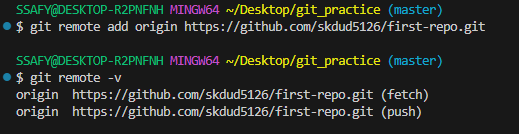

# 2024-07-12(금) 수업 정리

##  `Remote Repository : 원격 저장소`

- 코드와 버전 관리 이력을 *온라인 상의 특정 위치에 저장*하여 여러 개발자가 협업하고 코드를 공유할 수 있는 저장공간
<br>

#### - 대표 원격 저장소 3가지 

|Git Hub|Git Lab|Bitbucket|
|:---:|:---:|:---:|
||||

---

## `로컬&원격 저장소 연결하고 목록 확인하기`

- 시작에 앞서 원격 저장소에 새로운 repository 생성

```
$ git remote add origin remote_repo_url : 로컬 저장소에 원격 저장소('remote_repo_url') 추가

$ git remote –v : 등록된 원격저장소 목록 확인
```
- origin : 추가하는 원격 저장소의 별칭 / 별칭을 사용해 로컬 저장소 한 개에 여러 원격 저장소 추가 가능

<br>



- `origin`이라는 별칭을 가진 원격 저장소 목록 확인

<br>

---

## `$ git push`
<br>

- 원격 저장소에 코드 변경분을 **업로드**하기 위해 사용하는 명령어


```
$ git push origin master 

: "origin이라는 이름의 원격저장소에 master 목록 업로드 해줘”
```
* 원격 저장소에는 commit이 올라가는 것 : commit 이력이 없다면 push 할 수 없다!!

## ` $ git pull & $ git clone`

<br>

``` 
$ git pull origin master : 원격 저장소에서 파일 내려 받기 / 원격 저장소의 변경 사항만 받아옴(업데이트)

$ git clone remote_repo_url : 원격 저장소 전체를 복제(다운로드)
```

- git clone 사용 시 git 사용한다고 해서 `git init을 할 필요 없이, 자동으로 git 초기화가 되어있는 프로젝트 복제 `

<br>

---

## ` $ git ignore `

- Git에서 특정 파일이나 디렉토리를 추적하지 않도록 설정하는 데 사용되는 텍스트 파일.
- 프로젝트에 따라 공유하지 않아야 하는 것들도 존재하기 때문.
- 깃에 올릴 파일들을 무시하겠다는 파일들을 모아놓은 파일

- [gitignore 생성 사이트](https://www.toptal.com/developers/gitignore) : 검색창에 운영체제, 개발환경(IDE), 프로그래밍 언어를 검색하면 .gitignore 파일을 자동으로 생성


| $ git ignore 명령어 순서(중요) 예시|
|:-----------------------------|
|1. **.gitinore 파일 생성(파일명 앞에 '.'입력, 확장자 없음)** <br> 2. **a.txt와 b.txt 파일 생성** <br> 3. **gitignore a.txt 작성**<br> 4. **git init** <br> 5. **git status**|

## `README.md 파일이란?`

<br>

- 프로젝트에 대한 설명, 사용 방법, 문서화된 정보 등을 포함한 역할.
- Markdown 형식으로 작성되며, 프로젝트의 사용자, 개발자, 혹은 기여자들에게 프로젝트에 대한 전반적인 이해와 활용 방법을 제공하는데 사용.


- 해당 레파짓토리 들어가면 README 파일을 바로 보여줌!

---

## ` $ git remote `

- 현재 로컬 저장소에서 접근할 수 있는 원격 저장소들을 제어하는 명령어

```
$ git remote -v : 현재 로컬 저장소에 등록된 원격 저장소 목록보기

$ git remote rm 원격_저장소_이름 : 현재 로컬 저장소에 등록된 원격 저장소 삭제.
```
<br>

---

## ` $ git revert ` : 과거의 커밋 되돌리기

- "재설정"
- 단일 commit을 실행 취소 하는 것.
- 프로젝트 기록에서 commit을 없었던 일로 처리 후 그 결과를 새로운 commit으로 추가함.
- 없었던 일로 처리 될 commit(기록에서 commit이 사라지지는 않음.) -> 없었던 일로 처리 되었을 때의 결과 commit.
- 변경사항을 안전하게 실행 취소 할 수 있도록 도와주는 순방향 실행 취소 작업.
- commit 기록에서 commit을 삭제하거나 분리하는 대신, 지정된 변경 사항을 반전시키는 새 commit 생성.
- Git에서 기록이 손실되는 것을 방지하며 기록의 무결성과 혀법의 신뢰성 높임.

<br>

---


