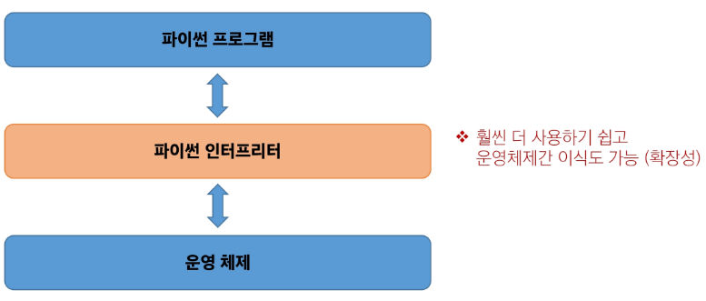
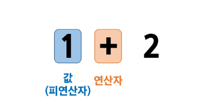
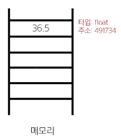
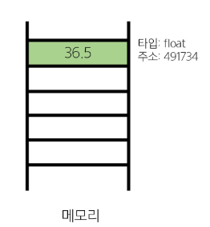
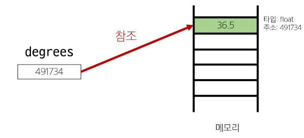

## 2024-07-15(월) 파이썬 

### Python (01) Basic Syntax

- 파이썬소개
- 표현식과 값
- 타입
- 변수와 메모리
- Data Types
- Numeric Types
    - int
    - float
- Sequence Types

<br>

---
#### `Python에 대해`

1. 파이썬을 배우는 이유
    1. 쉽고 간결한 문법
        - 읽시 쉽고 쓰기 쉬운 문법을 가지고 있어 쉽게 배우고 활용할 수 있음.

    2. 파이썬 커뮤니티의 지원
        - 세계적인 규모의 풍부한 온라인 포럼 및 커뮤니티 생태계
    
    3. 광범위한 응용 분야
        - 웹 개발, 데이터 분석, 인공지능, 자동화 스크립트 등 다양한 분야에서 사용

2. 알고리즘에 구현에 유리한 Python
    1. 직관적인 문법
        - 복잡한 논리 구조의 알고리즘을 이해하고 구현하기에 쉬움.

    2. 강력한 표준 라이브러리
        - 다양한 알괼즘 구현에 필요한 도구를 제공.

    3. 빠른 프로토타이핑
        - 알고리즘을 빠르게 테스트하고 수정할 수 있음.

---

#### `파이썬 실행`
    
- 컴퓨터는 기계어로 소통하기 때문에 사람이 기계어를 직접 작성하기 어려움.
- 인터프리터가 사용자의 명령어를 운영체제가 이해하는 언어로 바꿈.



    1. shell 이라는 프로그램으로 한 번에 한 명령어 씩 입력해서 실행
    2. 확장자가 .py인 파일에 작성된 파이썬 프로그램을 실행

---
<br>

#### `표현식과 값`

- 표현식(Expression) : 값으로 평가될 수 있는 코드 조각
- 값(Value) : 표현식이 **평가**된 결과 => 표현식을 순차적으로 평가하여 프로그램의 동작을 결정

---
<br>

#### `타입(Type)`

- 변수나 값이 가질 수 있는 데이터의 종류를 의미 => 어떤 종류의 데이터인지, 어떻게 해석되고 처리되어야 하는지를 정의.



- 타입은 2가지로 구분("**값**"과 "**값에 적용할 수 있는 연산**")

---
#### `Python 데이터타입 종류`

|Data Type|종류|
|:---:|:---:|
|Numeric Type|int(정수), float(실수), complex(복소수)|
|Sequence Types|list, tuple, range|
|Text Sequence Type|str(문자열)|
|None-sequence Types|set, dict|
|기타|Boolean, None, Functions|


---
<br>

#### `Python 산술 연산자`
<br>

|기호|연산자|
|:---:|:---:|
|-|음수부호|
|+|덧셈|
|-|뺄셈|
|*|곱셈|
|/|나눗셈|
|//|정수 나눗셈(몫)|
|%|나머지|
|**|지수(거듭제곱)|

<br>

- **연산자 우선순위**

<br>

|우선순위|연산자|연산|
|:---:|:---:|:---:|
|높음|**|지수|
|    |-|음수 부호|
|    |*, /, //, %|곱셈, 나눗셈, 정수 나눗셈, 나머지|
|낮음|+, -|덧셈, 나눗셈|

---
<br>

#### `변수와 메모리 "값이 저장되는 법"`

- 변수(Variable) : 값을 저장(참조)하기 위한 이름
- 변수 할당 : 표현식을 통해 변수에 값을 저장

<br>

```python
degrees = 36.5
# 할당문 "변수 degrees에 값 36.5를 할당했다."

degrees = 'abc'
# 재할당 "변수 degrees에 값 'abc'를 재할당했다."
```

#### 할당문

```python
variable = expression
```

1. 할당 연산자(=) 오른쪽에 있는 표현식을 평가해서 값(메모리 주소)을 생성

2. 값의 메모리 주소를 '=' 왼쪽에 있는 변수에 저장
    - 존재하지 않는 변수라면
        - 새 변수를 생성
    - 기존에 존재했던 변수라면
        - 기존 변수를 재사용해서 변수에 들어 있는 메모리 주소를 변경


#### 변수, 값 그리고 메모리

||||
|:---:|:---:|:---:|
|거리에 집 주소가 있듯이 메모리의 모든 위치에는 그 위치를 고유하게 식별하는 메모리 주소가 존재|객체(Object) : 타입을 갖는 메모리 주소 내 값 /"값이 들어있는 상자"|변수는 그 변수가 참조하는 객체의 메모리 주소를 가짐 / 변수 degrees는 값 36.5를 참조|

---
<br>

#### `변수명 규칙`

- 영문 알파벳, 언더스코어(_), 숫자로 구성
- 숫자로 시작할 수 없음.
- 대소문자를 구분
- 파이썬의 내부 예약어로 사용할 수 없음(Ex. 'False', 'None', 'True', 'if' , ...)

---
<br>

#### `Data Types`

- 값의 종류와 그 값에 적용 가능한 연산과 동작을 결정하는 속성

##### 데이터 타입이 필요한 이유

- 값들을 구분하고, 어떻게 다뤄야 하는지를 알 수 있음.
- 요리 재료마다 특정한 도구가 필요하듯이 각 데이터 타입 값들도 각자에게 적합한 도구를 가짐.
- 타입을 명시적으로 지정하면 코드를 읽는 사람이 변수의 의도를 더 쉽게 이해할 수 있고, 잘못되 ㄴ데이터 타입으로 인한 오류를 미리 예방

---
<br>

#### `Numeric Types`

##### int(정수 자료형)

- 정수를 표현하는 자료형
<br>

```python
a = 10
b = 0
c = -5
```

- 진수 표현
<br>

    1. 2진수(binary) : 0b

    2. 8진수(octal) : 0o

    3. 16진수(hexadecimal) : 0x


```python
print(0b10) # 2

print(0o30) # 24

print(0x10) # 16
```

##### float(실수 자료형)

- 실수를 표현하는 자료형

- 프로그래밍 언어에서 float는 실수에 대한 **근사값**

```python
d = 3.14

e = -2.7
```

##### 유한 정밀도

- 컴퓨터 메모리 용량이 한정돼 있고 한 숫자에 대해 저장하는 용량이 제한 됨

- 0.6666666666과 1.666666666667은 제한된 양의 메모리에 저장할 수 있는 2/3과 5/3에 가장 가까운 값

```python
# 0.6666666666
print(2 / 3)

# 1.6666666667
print(5 / 3)
```

##### 실수 연산 시 주의사항

- 컴퓨터는 2진수를 사용, 사람은 10진법을 사용

- 이 때 10진수 0.1은 2진수로 표현하면 0.0001100110011001100110.. 같이 무한대로 반복됨.

- 무한대 숫자를 그대로 저장할 수 없어서 사람이 사용하는 10진법의 근삿값만 표시

- 0.1의 경우 3602879701896307 / 2 *55 이며 0.1에 가깝지만 정확히 동일하지 않음.

- 이 과정에서 예상치 못한 결과가 나타남.

- 이런 증상을 **Floating point rounding error**(부동소수점 에러)라고 함.

##### 부동소수점 에러

- 컴퓨터가 실수를 표현하는 방식으로 인해 발생하는 작은 오차

- 원인
    - 실수를 2진수로 변환하는 과정에서 발생하는 근사치 표현


##### 부동소수점 에러 해결책

- 대표적으로 **decimal** 모듈을 사용해 부동소수점 연산의 정확성을 보장하는 방법

- 이외에도 다양한 해결 방법이 존재

<br>

```python
from decimal import Decimal

a = Decimal('3.2') - Decimal('3.1')
b = Decimal('1.2') - Decimal('1.1')

print(a)  # 0.1
print(b)  # 0.1
print(a == b) # True
```

##### 지수 표현 방식 

- e 또는 E를 사용한 지수 표현

```python
# 314 * 0.01
number = 314e-2

# 3.14
print(number)
```

---

#### `Sequence Types` : (str, list, tuple, range)

- 여러 개의 값들을 **순서대로 나열**하여 저장하는 자료형

##### Sequence Types 특징

1. **순서(Sequence)**

- 값들이 순서대로 저장 (정렬 X)

2. **인덱싱(Indexing)**

- 각 값에 고유한 인덱스(번호)를 가지고 있으며, 인덱스를 사용하여 특정 위치의 값을 선택하거나 수정할 수 있음

3. **슬라이싱(Slicing)**

- 인덱스 범위를 조절해 부분적인 값을 추출할 수 있음

4. **길이(Length)**

- len() 함수를 사용하여 저장된 값의 개수(길이)를 구할 수 있음

5. **반복(Iteration)**

- 반복문을 사용하여 저장된 값들을 반복적으로 처리할 수 있음

---
<br>

#### `Str` : 문자열

- 문자들의 순서가 있는 **변경 불가능**한 시퀀스 자료형

<br>

```python
my_str = 'hello'

# TypeError : 'str' object does not support item assignment
my_str[1] = 'z'
```


##### 문자열 표현

- 문자열은 단일 문자나 여러 문자의 조합으로 이루어짐

- 작은따옴표(') 또는 큰따옴표(")로 감싸서 표현

```python
# Hello, World!
print('Hello, World!')

# str
print(type('Hello, World!'))
```

##### 중첩 따옴표

- 따옴표 안에 따옴표를 표현할 경우

    - 작은 따옴표가 들어 있는 경우는 큰따옴표로 문자열 생성

    - 큰따옴표가 들어 있는 경우는 작은따옴표로 문자열 생성
<br>

```python
# 문자열 안에 "큰따옴표"를 사용하려면 작은 따옴표로 묶는다.
print('문자열 안에 "큰따옴표"를 사용하려면 작은 따옴표로 묶는다.')

# 문자열 안에 '작은따옴표'를 사용하려면 큰따옴표로 묶는다.
print('문자열 안에 '작은따옴표'를 사용하려면 큰 따옴표로 묶는다.')
```

---

#### `Escape Sequence`

- 역슬래시(backslash, \)뒤에 특정 문자가 와서 특수한 기능을 하는 문자 조합

- 파이썬의 일반적인 문법 규칙을 잠시 탈출한다는 의미

|예약문자|내용(의미)|
|:---:|:---:|
|\n|줄 바꿈|
|\t|탭|
|\\\\ |백슬래시|
|\'|작은 따옴표|
|\"|큰 따옴표|

```python
# 철수야 '안녕'
print('철수야 \'안녕\'')

'''
이 다음은 엔터
입니다.
'''
print('이 다음은 엔터\n입니다.')
```

---

#### `f-string` 

- 문자열에 f또는 F접두어를 붙이고 표현식을 {expression}로 작성하는 문법

- 문자열에 파이썬 표현식의 값을 삽입할 수 있음

```python
bugs = 'roaches'
counts = 13
area = 'living room'

# Debugging roaches 13 living room
print(f'Debugging {bugs} {counts} {area}')
```

---

#### `문자열의 시퀀스 특징`

```python
my_str = 'hello'

# 인덱싱
print(my_str[1]) # e

# 슬라이싱
print(my_str[2:4]) # ll

# 길이
print(len(my_str)) # 5
```

##### 인덱스(Index)

- 시퀀스 내의 값들에 대한 고유한 번호로, 각 값의 위치를 식별하는 데 사용되는 숫자

||h|e|l|l|o|
|:--:|:--:|:--:|:--:|:--:|:--:|
|index|0|1|2|3|4|
|index|-5|-4|-3|-2|-1|

##### 슬라이싱(Slicing)

- 시퀀스의 일부분을 선택하여 추출하는 작업(시작 인덱스와 끝 인덱스를 지정하여 해당 범위의 값을 포함하는 새로운 시퀀스를 생성)

||h|e|**l**|**l**|o|
|:--:|:--:|:--:|:--:|:--:|:--:|
|index|0|1|**2**|**3**|4|
|index|-5|-4|-3|-2|-1|

```python
my_str[2:4] #ll

my_str[:3] # hel

my_str[3:] #lo

my_str[0:5:2] #hlo

my_str[::-1] #olleh
```


