# 2024-07-22(월) 파이썬 함수 구조1

### Python 05 Data Structure 1

- Data Structure

    - 메서드

- 시퀀스 데이터 구조

    - 문자열

    - 리스트

- 참고

    - 복사

    - 복사 유형

    - 문자 유형 판별 메서드

---

#### `데이터 구조(Data Structure)`

- 여러 데이터를 효과적으로 사용, 관리하기 위한 구조(str, list, dict 등)

#####  데이터 구조 활용

- 문자열, 리스트, 딕셔너리 등 각 데이터의 구조의 **메서드**를 호출하여 다양한 기능을 활용하기

---
#### `메서드(method)` : 클래스(청사진)의 함수

- 객체(청사진으로부터 실제 물리적으로 존재)에 속한 함수 : 객체의 상태를 조작하거나 동작을 수행
- 메서드는 어딘가(클래스)에 속해 있는 **함수**이며, 각 데이터 타입별로 다양한 기능을 가진 메서드가 존재

##### 메서드 특징

- 메서드는 클래스(class) 내부에 정의되는 함수
- 클래스는 파이썬에서 '타입을 표현하는 방법'이며 이미 은연중에 사용해 왔음
- 예를 들어 help 함수를 통해 str 호출해보면 class 였다는 것을 확인 가능

##### 메서드 호출 방법

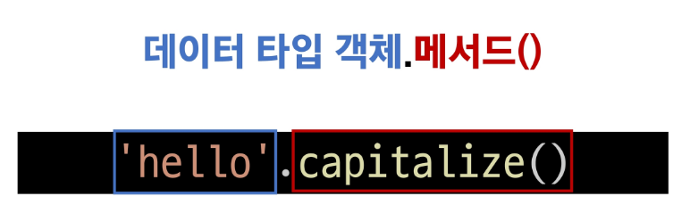


---

#### 시퀀스 데이터 구조


##### `문자열`

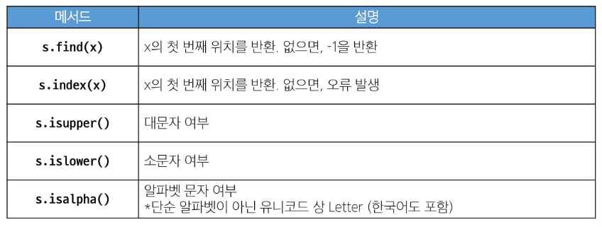

- 'is'가 붙은 메서드 : 맞냐 vs 아니냐로 판단하기에 True / False로 반환

##### 문자열 조회/탐색 및 검증 메서드

#### `.find()`


```python
text = 'banana'

print(text.find('a'))  # 1

print(text.find('c'))  # -1  : 찾는 문자열이 text에 존재하지 않음

```
#### `.index()`


```python
text = 'banana'

print(text.index('a')) # 1

print(text.index('z'))  # ValueError
```

#### `.isupper() / .islower()`


```python
string1 = 'HELLO'
string2 = 'Hello'

print(string1.isupper())  # True
print(string2.isupper())  # False
print(string1.islower())  # False
print(string2.islower())  # False
```
#### `.isalpha()`


```python
string1 = 'Hello'
string2 = '123heis9837whd'

print(string1.isalpha())  # True
print(string2.isalpha())  # False
```

--- 

##### 문자열 조작 메서드(새 문자열 반환)

- 원본을 조작한 새로운 문자열을 반환

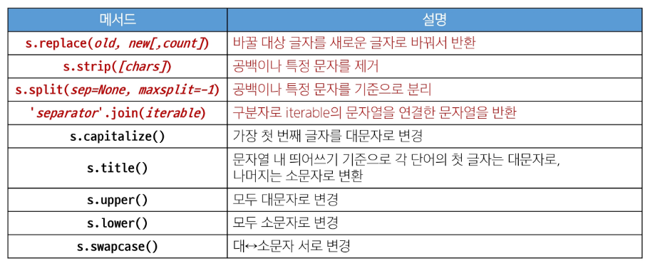


##### `.replace`

- [,count] : 선택인자

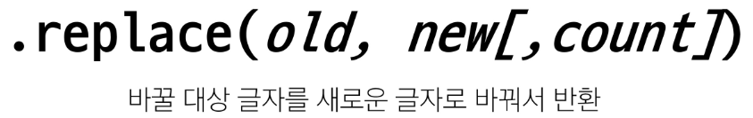

```python
text = 'Hello, World!'
new_text = text.replace('world', 'Python' )
print(new_text)  # 'Hello, Python!

# 선택인자 사용방법
text1 = 'Hello, World! World! World!'
new_text1 = text1.replace('World', 'Python', 1)
print(new_text1)  # 'Hello, Python! World! World!'
```
#### `.strip`


- .strip() : 양 쪽에 있는 공백 제거
- .rstrip() : 오른쪽에 있는 공백 제거
- .lstrip() : 왼쪽에 있는 공백 제거


```python
text = '   Hello, world!   '
new_text = text.strip()
print(new_text)  # 'Hello, world!' 
```
#### `.split`

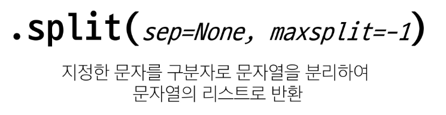

```python
text = 'Hello, world!'
words = text.split(',')
words_1 = text.split()  # 공백을 기준으로 문자를 분리
print(words)  # ['Hello', ' world!']  : world! 공백 있다는 점 유의!

print(words_1)  # ['Hello', 'world!']  
```
#### `.join`

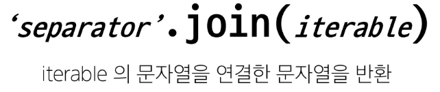

```python
words = ['Hello', 'World!']
text = '-'.join(words)
print(text)   # 'Hello-world!'
```

#### `기타`

```python
text = 'heLLo, woRld!'
new_text1 = text.capitalize()
new_text2 = text.title()  # 문자열앞 공백있으면 대문자로 반환
new_text3 = text.upper()
new_text4 = text.lower()
new_text5 = text.swapcase()


print(new_text1)  # Hello, world!  - 문자열의 앞글자만 대문자 나머지 소문자로 반환
print(new_text2)  # Hello, World!
print(new_text3)  # HELLO, WORLD!
print(new_text4)  # hello, world!
print(new_text5)  # HEllO, WOrLD!
```

#### **메서드는 이어서 사용 가능**

```python
text = 'heLLo, woRld!'

new_text = text.swapcase().replace('l', 'z')

print(new_text)  # HEzzO, WOrLD!
```

---

#### 리스트 (예시코드도 무조건 외움!)

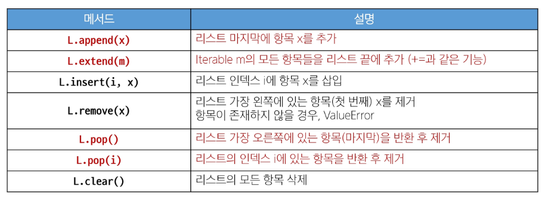

#### `.append()`

```python
my_list = [1, 2, 3]
my_list.append(4)

print(my_list)  # [1, 2, 3, 4]
print(my_list.append(4))  # None : append의 반환이 없다 원본을 이미 바꿨기 때문에 반환 X
```

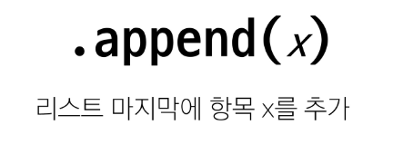

#### `.extend`


```python
my_list = [1, 2, 3]
my_list.extend([4, 5, 6])

print(my_list)   # [1, 2, 3, 4, 5, 6]
my_list.extend(5)
print(my_list)  # Error  : iterable이 아니기 때문에 에러발생
my_list.extend([5])
print(my_list)  # [1, 2, 3, 4, 5, 6, 5]

```

#### `.insert(i, x)`


```python
my_list = [1, 2, 3]
my_list.insert(1, 5)
print(my_list)  # [1, 5, 2, 3]
```

#### `.remove(x)`


```python
my_list = [1, 2, 3]
my_list.remove(2)

print(my_list)  # [1, 3]
```

#### `.pop(i)` 중요! '반환값 존재' 

- 반환값은 리스트 형태로 반환


```python
my_list = [1, 2, 3, 4, 5]

item1 = my_list.pop()
item2 = my_list.pop(0)

print(item1)  # 5
print(item2)  # 1
print(my_list)  # [2, 3, 4]
```

#### `.clear()`


```python
my_list = [1, 2, 3]
my_list.clear()

print(my_list)  # []
```

---

#### 리스트 탐색 및 정렬 메서드

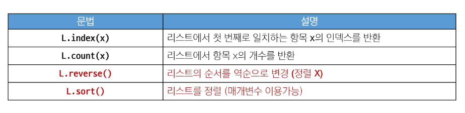

#### `.index(x)`


```python
my_list = [1, 2, 3]
index = my_list.index(2)
print(index)   # 1
```

#### `.count`


```python
my_list = [1, 2, 2, 3, 3, 3]
count = my_list.count(3)

print(count)  # 3
```

#### `.reverse()`

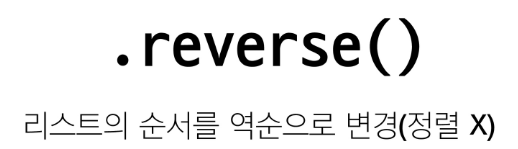

```python
my_list = [1, 3, 2, 8, 1, 9]
my_list.reverse()

print(my_list.reverse())  # None 원본을 뒤집었기 때문에 값 반환X
print(my_list)  # [0, 1, 8, 2, 3, 1]
```

#### `.sort()`


```python
# 오름차순(기본 값)  : .sort(reverse=False)
my_list = [3, 2, 100, 1]
my_list.sort()
print(my_list)  # [1, 2, 3, 100]

# 내림차순
my_list.sort(reverse = True)
print(my_list)  # [100, 3, 2, 1]
```

- [다양한 리스트 메서드](https://docs.python.org/3.9/tutorial/datastructures.html)

---

#### 참고

#### `복사`

##### 데이터 타입과 복사

- 파이썬에서는 데이터에 분류에 따라 복사가 달라짐

- "변경 가능한 데이터 타입"과 "변경 불가능한 데이터 타입"을 다르게 다룸.

#### 변경 가능한 데이터 타입의 복사

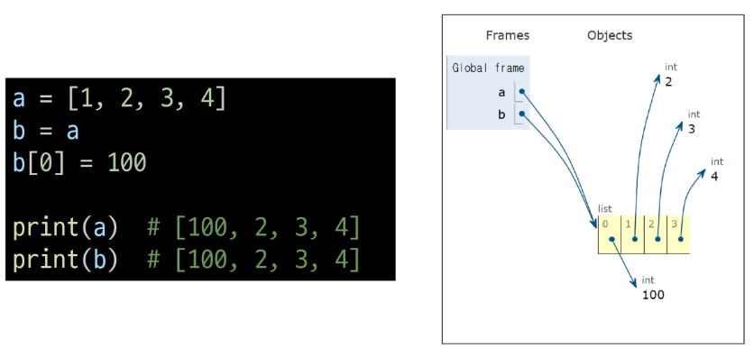


#### 변경 불가능한 데이터 타입의 복사

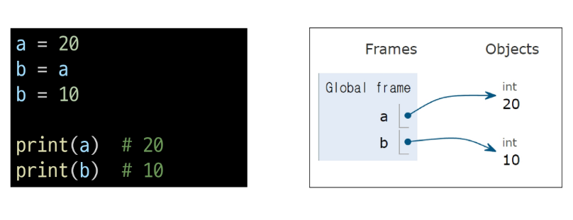

---

#### 복사 유형

1. 할당
2. 얕은 복사
3. 깊은 복사

#### `얕은 복사`

```python
a = [1, 2, 3]
b = a[:]
c = a.copy()  # 얕은 복사 

b[0] = 100
c[0] = 999
print(a)  # [1, 2, 3]
print(b)  # [100, 2, 3]
print(c)  # [999, 2, 3]
```

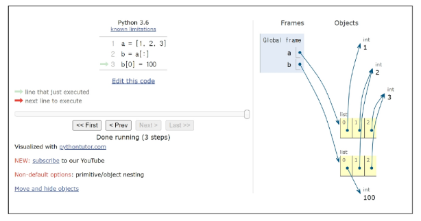

#### 얕은 복사의 한계

-  2차원리스트와 같이 변경 가능한 객체 안에 변경 가능한 객체가 있는 경우


```python
a = [1, 2, [3, 4, 5]]
b = a[:]

b[0] = 999
b[2][0] = 100
print(a)  # [1, 2, [100, 4, 5]]
print(b)  # [999, 2, [100, 4, 5]]

```

#### `깊은 복사`

- 내부에 중첩된 모든 객체까지 새로운 객체 주소를 참조하도록 함

```python
import copy

a = [1, 2, [3, 4, 5]]
b = copy.deepcopy(a)

b[2][1] = 100
print(a)  # [1, 2, [3, 4, 5]]
print(b)  # [1, 2, [100, 4, 5]]
```

---

#### 문자 유형 판별 메서드

##### 문자열에 포함된 문자들의 유형을 판별하는 메서드

- **isdecimal()**

    - 문자열이 모두 숫자 문자(0~9)로만 이루어져 있어야 True

- **isdigit()**

    - isdecimal()과 비슷하지만, 유니코드 숫자도 인식('①'도 숫자로 인식)

- **isnumeric()**

    - isdigit()과 유사하지만, 몇 가지 추가적인 유니코드 문자들을 인식(분수, 지수, 루트 기호도 숫자로 인식)

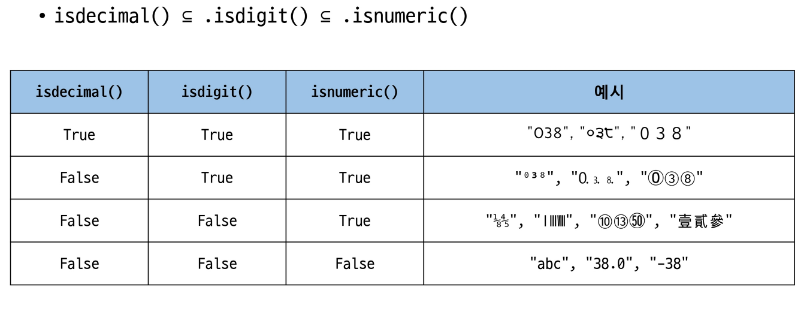