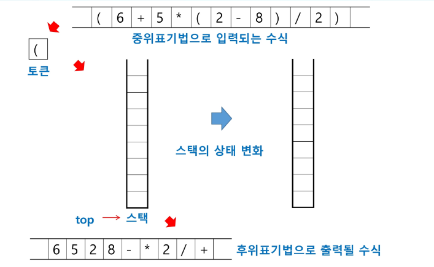
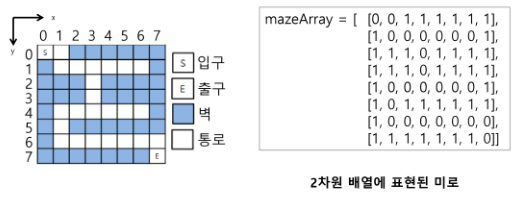
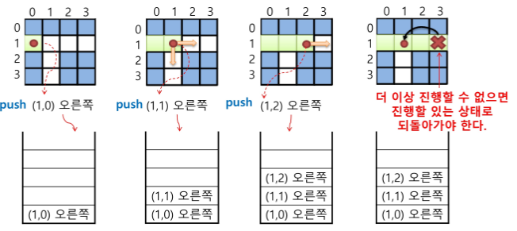
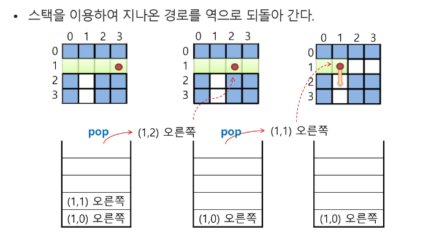
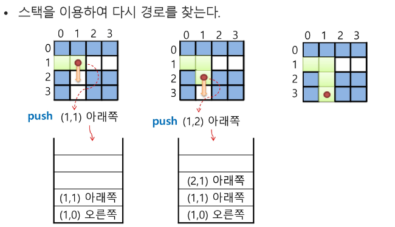

# 2024-08-08(목) Stack2 - 01

- 계산기 1
- 계산기 2
- 백트래킹
---

### `계산기1`

- 문자열로 된 계산식이 주어질 때, 스택을 이용하여 이 계산식의 값을 계산할 수 있다.

- 문자열 수식 계산의 일반적 방법
    - step1. 중위 표기법의 수식을 후위 표기법으로 변경한다. ( 스택 이용)

        - 중위표기법(infix notation)
            - 연산자를 피연산자의 가운데 표기하는 방법
               예) A + B

        - 후위표기법(postfix notation)
            - 연산자를 피연산자 뒤에 표기하는 방법\
                예) A B +

    - step2. 후위 표기법의 수식을 스택을 이용하여 계산한다.

#### step1. 중위표기식의 후위표기식 변환 방법1

- 수식의 각 연산자에 대해서 우선순위에 따라 괄호를 사용하여 다시 표현한다.
- 각 연산자를 그에 대응하는 오른쪽괄호의 뒤로 이동시킨다.
- 괄호를 제거한다.

① 입력 받은 중위 표기식에서 토큰을 읽는다.

② 토큰이 피연산자이면 토큰을 출력한다.

③ 토큰이 연산자(괄호포함)일 때, 이 토큰이 스택의 top에 저장되어 있는 연산자보다 우선순위가 높으면 스택에 push하고, 그렇지 않다면 스택 top의 연산자의 우선순위가 큰의 우선순위보다 작을 때까지 스택에서 pop 한 후 토큰의 연산자를 push한다. 만약 top에 연산자가 없으면 push한다.

④ 토큰이 오른쪽 괄호 ')'이면 스택 top에 왼쪽 괄호 '('가 올 때까지 스택에 pop 연산을 수행하고 pop 한 연산자를 출력한다. 왼쪽 괄호를 만나면 pop하고 출력하지는 않는다.

⑤ 중위 표기식에 더 읽을 것이 없다면 중지하고, 더 읽을 것이 있다면 1부터 다시 반복한다.

⑥ 스택에 남아 있는 연산자를 모두 pop하여 출력한다.

    - 스택 밖의 왼쪽 괄호는 우선 순위가 가장 높으며, 스택 안의 왼쪽 괄호는 우선순위가 가장 낮다.

---

### `계산기2`

#### step2. 후위 표기법의 수식을 스택을 이용하여 계산

① 피연산자를 만나면 스택에 push한다.

② 연산자를 만나면  필요한  만큼의 피연산자를 스택에서 pop하여 연산하고, 연산결과를 다시 스택에 push한다. **(피연산자 pop 순서 신경쓰기! 특히 마이너스나 나눗셈일때 중요함!)**

③ 수식이 끝나면, 마지막으로 스택을 pop하여 출력한다.

---

### `백트래킹`

- 백트래킹(Backtracking) 기법은 해를 찾는 도중에 '막히면' (즉, 해가 아니면) 되돌아가서 다시 해를 찾아 가는 기법이다.

- 백트래킹 기법은 최적화(optimization) 문제와 결정(decision) 문제를 해결할 수 있다.

- 결정 문제 : 문제의 조건을 만족하는 해가 존재하는지의 여부를 'yes' 또는 'no'가 답하는 문제
    - 미로찾기
    - n-Queen 문제
    - Map coloring
    - 부분 집합의 합(Subset Sum) 문제 등

#### 백트래킹 vs 깊이 우선탐색

- 어떤 노드에서 출발하는 경로가 해결책으로 이어질 것 같지 않으면 더 이상 그 경로를 따라가지 않음으로써 시도의 횟수를 줄임.(Prunning 가지치기)

- 깊이우선탐색이 모든 경로를 추적하는데 비해 `백트래킹은 불필요한 경로를 조기에 차단`.

- 깊이우선탐색을 가하기에는 경우의 수가 너무나 많음. 즉, N! 가지의 경우의 수를 가진 문제에 대해 깊이우선탐색을 가하면 당연히 처리 불가능한 문제.

- 백트래킹 알고리즘을 적용하면 일반적으로 경우의 수가 줄어들지만 이 역시 최악의 경우에는 여전히 지수함수 시간(Exponential Time)을 요하므로 처리 불가능

#### `백트래킹 기법`

- 어떤 노드의 유망성을 점검한 후에 유망(promising)하지 않다고 결정되면 그 노드의 부모로 되돌아가(backtracking) 다음 자식 노드 감

- 어떤 노드를 방문하였을 때 그 노드를 포함한 경로가 해답이 될 수 없으면 그 노드는 유망하지 않다고 하며, 반대로 해답의 가능성이 있으면 유망하다고 한다.

- 가지치기(pruning) : 유망하지 않는 노드가 포함되는 경로는 더 이상 고려하지 않는다.

① 상태 공간 트리의 깊이 우선 검색을 실시한다.

② 각 노드가 유망한지를 점검한다.

③ 만일 그 노드가 유망하지 않으면, 그 노드의 부모 노드로 돌아가서 검색을 계속한다.

---

#### `미로찾기`

- 아래 그림과 같이 입구와 출구가 주어진 미로에서 입구부터 출구까지의 경로를 찾는 문제이다.

- 이동할 수 있는 방향은 4방향으로 제한한다.

