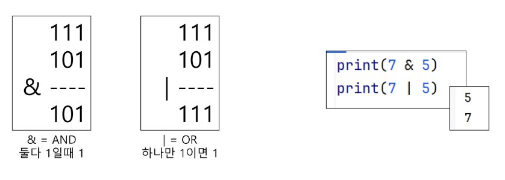
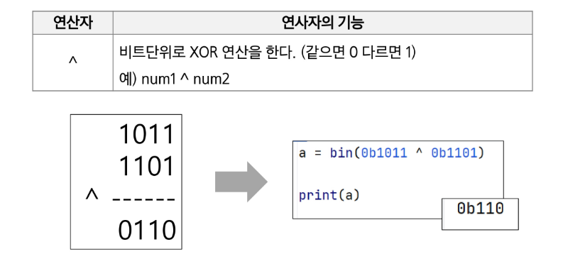
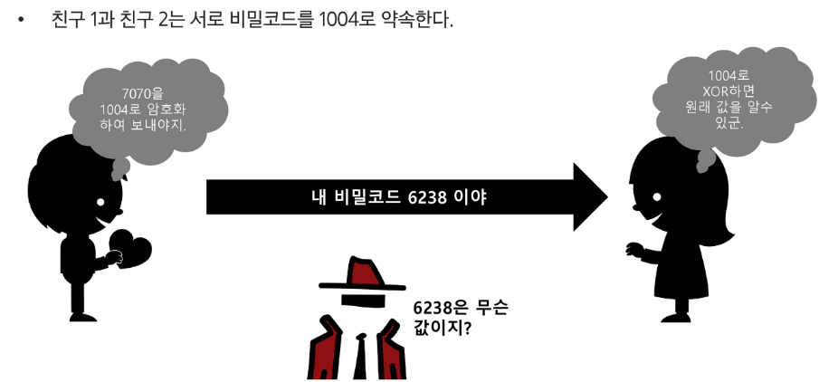
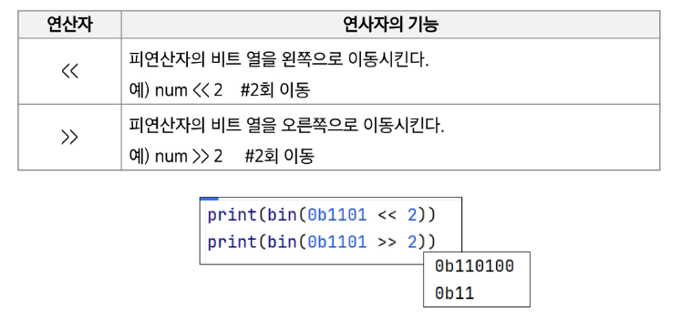
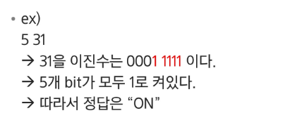
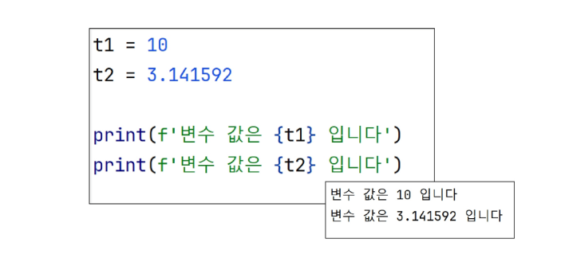
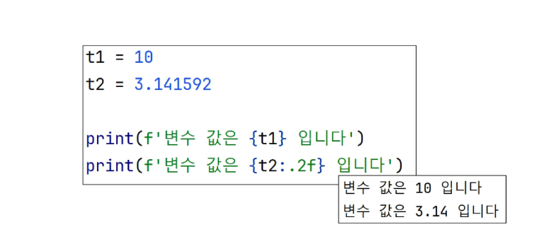

# 2024-08-30(금) Start_02

- 비트 연산
- 실수

---

### `비트 연산`

- 비트와 바이트
    - 1 bit : 0과 1을 표현하는 정보의 단위
    - 1 Byte : 8 bit를 묶어 1 Byte라고 한다.
- 예시
    - 1001011011011100 은 총 몇 비트이면서, 몇 바이트인가?  <16bit, 2byte>

- 비트 연산
    - 컴퓨터의 CPU는 0과 1로 다루어 동작되며, 내부적으로 비트 연산을 사용하여 덧셈, 뺄셈, 곱셈 등을 계산한다.

- 비트연산 챕터의 목적
    - 사람이 사용하는 사칙연산 (+, *, /, -)이 아닌 컴퓨터가 사용하는 연산인 **"비트연산"** 을 이해해본다.
    - 더 나아가, **프로그래밍에서 비트연산을 활용한 코딩 방법을 익혀본다.**

- AND와 OR 비트연산자 이해하기

    - a **AND** b : a, b 둘 다 1일때만 결과가 1이다. 그 외에는 0
    - a **OR** b : a, b 둘 중 하나만 1이면 결과가 1이다. 그 외에는 0

    


- 파이썬 구현
    - 7 & 5 -> 이진수로 표현하면 0b111 & 0b101

    

#### 파이썬에서는 2진수, 16진수, 10진수 변환하여 출력하기

- 2진수는 숫자 0과 소문자 b -> **0b**를 접두사로 붙여 표현한다.
- 16진수는 숫자 0과 소문자 x -> **0x**를 접두사로 붙여 표현한다.


- [도전] 먼저 수기로 연산을 해본다. 이후, 직접 파이썬으로 구현하여 테스트 해본다.
    - 0b11011110 & 0b11011
    - 0x4A3 | 25

#### XOR와 NOT 연산자

- ^ : XOR(엑스오어) 연산자, OR 처럼 동작되는데 둘 다 1인 경우는 0이다.

    

- 신기한 XOR
    - 어떤 값이던 특정 수로 2회 XOR를 하면 원래 수로 돌아온다.
    - 7070 ^ 1004 = **6258**
    - **6258** ^ 1004 = 7070

- 암호화에 사용되는 XOR
    - 친구 1과 친구 2는 서로 비밀코드 1004로 약속한다.

    

- [도전] 암호화 프로그램 제작하기
    - 수를 입력 받고, 암호화를 해주거나 (인코딩), 암호를 해제해주는 (디코딩) 프로그램으로 제작한다.
    - KEY 값은 1004로 한다.
    - 예시 1. E 1000 # 수 1000을 인코딩하여 출력한다.
    - 예시 2. D 4 # 수 4를 디코딩하여 출력한다.

#### `비트 연산자`

- Left Shift << : 특정 수 만큼 비트를 왼쪽으로 밀어낸다.
- Right Shift >> : 특정 수 만큼 비트를 오른쪽으로 밀어낸다.(우측 비트들이 제거된다.)

    


- [도전] Left Shift(<<)를 이용한 프로그래밍

    - **반복문**을 이용하여 아래와 같이 출력한다.

        - Loop1 : 0b1 출력(2진수와 10진수로 출력)

        - Loop2 : 0b10 출력(2진수와 10진수로 출력)

        - Loop3 : 0b100 출력(2진수와 10진수로 출력)

        - Loop4 : 0b1000 출력(2진수와 10진수로 출력)

        - Loop5 : 0b10000 출력(2진수와 10진수로 출력)

#### `비트연산 응용1`

- 1 << n    

    - 2^n의 값을 갖는다. (부분집합의 갯수 알 수 있음)

    - 임베디드 분야에서 계산을 빠르게 하기 위해 사용된다.

#### `비트연산 응용2`

- i & (1<<n)

    - i의 n번째 비트가 1인지 아닌지를 확인할 수 있다.

    - ex. 1101 & (1<<2)

        - 1101에서 **2번 bit**가 1인지 확인 가능하다.(결괏값 = 0100)

        - 결괏값이 0보다 크면 n번째 비트는 1임이 확정된다.

- 음수 표현 방법

    - 컴퓨터는 음수를 "2의 보수"로 관리한다. 맨 앞자리 bit(MSB)는 음수 or 양수를 구분하는 비트이다.

    - 컴퓨터가 2의 보수를 사용하여 음수를 관리하는 이유

        - 뺄셈의 연산 속도를 올릴 수 있으며, +0과 -0을 따로 취급하지 않기 위해 사용한다.

- 2의 보수 예시

    - 10001의 2의 보수

        - 수를 모두 뒤집고 +1을 한다.

        - 01110 + 1 = 01111

    - 1111000의 2의 보수

        - 수를 뒤집으면 0000111 이고 +1을 한다.

        - 0000111 + 1 = 00010000

- 신기한 2의 보수

    - 2의 보수를 취한 수를, 한번 더 2의 보수를 취하면 **원래의 값으로 돌아온다.**

    - 10001의 2의 보수

        - 수를 모두 뒤집고 +1을 한다.

        - 01110 + 1 = 01111

    - 01111의 2의 보수

        - 10000 + 1 = 10001

- -5를 2의 보수로 표현하는 방법(가정 : 수를 8bit로 저장하는 경우)

    - 수 5를 2진수로 나타내면 0000 0101이다.(7bit)

    - -5는 음수이기에 MSB는 1이다.

    - 나머지 7bit에 대해, 수를 뒤집고 1을 더하면 된다.(2의 보수)

    - 수 5를 뒤집으면 111 1010이며, 1을 더하면 111 1011이 된다.

    - 따라서 1111 1011이 된다.

#### `NOT 연산자`

- `(~) NOT 연산자` : 모든 비트를 **반전**시킨다.

- 만약 8bit 일때 ~(0001 1111)이라면 값은 1110 0000이 된다.

- NOT 연산자를 파이썬에서 수행하기

    - 파이썬에서는 ~4를 수행하면 -5가 출력된다.

- 파이썬이 ~4를 -5로 출력하는 과정

    - 4는 0b0100이다.(MSB : 양수이므로 0)

    - NOT 연산자로 인해 뒤집으면 1011이 된다.

    - MSB는 1이 되었고 (음수), 나머지 bit는 011이다.

    - 나머지 bit에 대해 2의 보수를 취하면 100 + 1 = 101 이므로 5가 된다.

    - 따라서 -5가 된다.

    

- [도전] 비트연산 문제 풀어보기(SWEA 10726. 이진수 표현)

    - 정수 N, M이 주어질 때, M의 이진수 표현의 마지막 N 비트가 모두 1로 켜져 있는지 아닌지를 판별하여 출력, 모두 켜있다면 ON 출력, 아니면 OFF 출력

    


    ```python
    def solution():
    tar = M

    # 1비트씩 우측으로 옮기면서 같은 지 체크
    for i in range(N):
        if tar & 0x1 == 0:
            return False
        tar = tar >> 1
    return True

    T = int(input())

    for tc in range(1, T + 1):
        N, M = map(int, input().split())
        result = solution()
    if result:
        print(f'#{tc} ON')
    else:
        print(f'#{tc} OFF')

    ```
---

### `실수`

- 파이썬에서 실수 출력 방법
    - 파이썬은 f-string 문법을 지향한다.

    

- 소수점 출력 방법

    - {t2.2f} : t2 값을 **소수점 둘째자리**에서 반올림하여 표현

    

- 파이썬에서의 실수 표현 범위를 알아보자
    - 파이썬에서는 다른 언어와 달리 내부적으로 더 큰 규모의 자료구조를 사용해서 훨씬 넓은 범위의 실수를 표현할 수 있다.
    - 최대로 표현할 수 있는 값은 약 1.8 X 10^308이고, 이 이상은 inf로 표현(참고로 1억은 1 X 10^8임)
    - 최소로 표현할 수 있는 값은 약 5.0 X 10^-324이며, 이 이하는 0으로 표현

- 컴퓨터는 실수를 내부적으로 근사적으로 관리한다.
    - 실수는 정확한 값이 아니라 근사 값으로 저장되는데 이때 생기는 작은 오차가 계산 과정에서 다른 결과를 초래한다.

- [도전] 실수 값 출력해보기
    - 0.1이 정확히 어떤 값으로 저장되었는지, f-string을 이용하여 출력해보자.
    - 소수점 20자리 이상으로도 출력해보자.

- 소수점이 있는 10진수를 2진수로 변환 예시

- 소수점을 포함한 2진 실수를 10진수로 변환하는 예시

- 실수의 표현

    - 컴퓨터는 실수를 표현하기 위해 부동 소수점(floating-point) 표기법을 사용한다. 이 표기법은 IEEE 754이라는 컴퓨터에 부동소수점울 표기하는 국제표준이다.
    - 부동 소수점 표기 방법은 소수점의 위치를 고정시켜 표현하는 방식이다. 소수점의 위치를 가장 유효한 숫자 다음으로 고정시키고 밑수의 지수승으로 표현

- 실수(IEEE 754)
    - 실수를 저장하기 위한 형식(IEEE 754, 32bit - Single Precision 표기법 기준)
        - 32bit 구조

        - 부호 1비트 : 0이면 양수, 1이면 음수
        - 지수부(exponent) : 부동소수점의 크기 + bias 값
        - 가수부(mantissa) : 실질적 수

- 12.375를 부동소수점으로 표기
    - 12.375를 2진수로 변환 : 12는 1100, 0.375는 0.011이므로 1100.011
    - 1100.011 = 1.100011 X 2^3
    - 즉, 가수는 100011이고, 지수는 3(맨 앞1은 생략)
- 지수 + bias : IEEE 754는 bias를 더한 결과
- 123.75를 IEEE754로 표기하는 방법
    - 부호 비트 : 0(양수)
    - 지수 : 10000010
    - 가수 : 10001100000000000000000

- 컴퓨터는 실수를 근사적으로 표현한다.
    - 이진법으로 표현할 수 없는 형태의 실수는 정확한 값이 아니라 근사 값으로 저장되는데 이때 생기는 작은 오차가 계산 과정에서 다른 결과를 가져온다.

- 실수 자료형의 유효 자릿수를 알아두자.
    - 32 비트 실수형 유효자릿수(십진수) -> 약 6자리 (C++)
    - 64 비트 실수형 유효자릿수(십진수) -> 약 15자리 (C++, Java)
    - 파이썬에서는 내부적으로 더 많은 비트를 사용해서 훨씬 넓은 범위의 실수를 표현할 수 있다.

## 연습문제1

- 0과 1로 이루어진 1차 배열에서 7개씩 수를 묶어, 10진수로 출력하기

```python
# 2진수를 10진수로 변환
def binary_to_decimal(binary_str):
    decimal_number = 0
    power = 0

    # 뒤에서부터 각 자리의 숫자를 10진수로 변환
    for digit in reversed(binary_str):
        if digit == '1':
            decimal_number += 2 ** power
        power += 1

    return decimal_number


word = input().strip()

for i in range(0, len(word), 7):
    print(binary_to_decimal(word[i:i+7]), end=' ')


```


## 연습문제2

- 16진수 문자로 이루어진 1차 배열이 주어질 때 앞에서부터 7bit씩 묶어 십진수로 변환하여 출력해 보자.

```python
'''
16진수 문자로 이루어진 1차 배열이 주어질 때 앞에서부터 7bit씩 묶어 십진수로 변환하여 출력해 보자

입력
0F97A3


2진수: 000011111001011110100011
answer: 7, 101, 116, 3
'''


def hex_to_binary(hex_string):
    # 16진수를 2진수로 변환하기 위한 매핑 테이블
    hex_to_bin_map = {
        '0': '0000', '1': '0001', '2': '0010', '3': '0011',
        '4': '0100', '5': '0101', '6': '0110', '7': '0111',
        '8': '1000', '9': '1001', 'A': '1010', 'B': '1011',
        'C': '1100', 'D': '1101', 'E': '1110', 'F': '1111'
    }

    # 각 16진수 문자를 대응하는 2진수로 변환하여 연결
    binary_string = ''.join(hex_to_bin_map[char] for char in hex_string.upper())
    return binary_string


# 테스트
hex_string = input().strip()
binary_string = hex_to_binary(hex_string)
print(f"2진수: {binary_string}")


# 2진수를 10진수로 변환
def binary_to_decimal(binary_str):
    decimal_number = 0
    power = 0

    # 뒤에서부터 각 자리의 숫자를 10진수로 변환
    for digit in reversed(binary_str):
        if digit == '1':
            decimal_number += 2 ** power
        power += 1

    return decimal_number


for i in range(0, len(binary_string), 7):
    print(binary_to_decimal(binary_string[i:i+7]), end=' ')

```

## 연습문제3

- 16진수 문자로 이루어진 1차 배열이 주어질 때, 왼쪽부터 순차적으로 암호비트패턴을 찾아 차례대로 출력하시오. 암호는 연속되어있다.


```python
'''
16진수 문자로 이루어진 1차 배열이 주어질 때, 왼쪽부터 순차적으로 암호비트패턴을 찾아 차례대로 출력하시오. 암호는 연속되어있다.

입력
0DEC
0269FAC9A0


2진수: 0000110111101100
answer: 7, 101, 116, 3
'''


def hex_to_binary(hex_string):
    # 16진수를 2진수로 변환하기 위한 매핑 테이블
    hex_to_bin_map = {
        '0': '0000', '1': '0001', '2': '0010', '3': '0011',
        '4': '0100', '5': '0101', '6': '0110', '7': '0111',
        '8': '1000', '9': '1001', 'A': '1010', 'B': '1011',
        'C': '1100', 'D': '1101', 'E': '1110', 'F': '1111'
    }

    # 각 16진수 문자를 대응하는 2진수로 변환하여 연결
    binary_string = ''.join(hex_to_bin_map[char] for char in hex_string.upper())
    return binary_string


# 테스트
hex_string = input().strip()
binary_string = hex_to_binary(hex_string)
print(f"2진수: {binary_string}")

code = {
    '001101': 0,
    '010011': 1,
    '111011': 2,
    '110001': 3,
    '100011': 4,
    '110111': 5,
    '001011': 6,
    '111101': 7,
    '011001': 8,
    '101111': 9
}


idx = 0
while idx <= len(binary_string) - 6:
    target = binary_string[idx:idx + 6]
    if code.get(target) != None:
        print(code.get(target), end=' ')
        idx += 6
    else:
        idx += 1


```