# 2024-09-02(월) APS(Algorithm Problem Sloving) 응용


- 반복(Iteration)과 재귀(Recursion)
- 순열
- 완전 탐색

- SWEA(최소합, 베이비진(그리디 Ver), 전자카트) 문제풀어보기

---

<학습목표>

- 재귀적 알고리즘의 특성을 이해하고 이를 구현하기 위한 **재귀 호출**에 대해 학습한다.

- **완전 탐색**의 개념을 이해하고 완전 탐색을 통한 문제 해결 방법에 대해 학습한다.

---

### `반복과 재귀`

#### 반복(Iteration)과 재귀(Recursion)

- 반복과 재귀는 유사한 작업을 수행할 수 있다.

- 반복은 수행하는 작업이 완료될 때 까지 계속 반복

    - 루프(for, while 구조)
    - **반복문은 코드를 n번 반복시킬 수 있다.**

- 재귀는 주어진 문제의 해를 구하기 위해 동일하면서 더 작은 문제의 해를 이용하는 방법

    - 하나의 큰 문제를 해결할 수 있는(해갈하기 쉬운) 더 작은 문제로 쪼개고 결과들을 결합한다.
    - **재귀호출은 n 중 반복문을 만들어낼 수 있다.**


- 반복문으로는 n번 반복을 구현할 수 있고, 재귀호출로 n 중 for문을 구현할 수 있다.

    - N 입력 후 1 1 1 ... ~ 3 3 3 ... 출력하는 문제는 for문으로 구현이 어렵다.

    - 아래처럼 재귀호출로 구현할 수 있다.


    

#### `재귀를 연습하기 전, 알아야할 함수의 특징 1`

- KFC 함수 호출할 때, int 타입 객체를 전달하면 **값만 복사**가 된다.

- 아래 예시에서, main함수의 x와, KFC 함수의 x는 서로 다른 객체이다. ( 마치 한국 사는 KIM과, 미국 사는 KIM이 이름만 같고, 서로 다른 사람인 것 처럼)


#### `재귀를 연습하기 전, 알아야할 함수의 특징 2`

- 함수가 끝나면, Main으로 되돌아 오는 것이 아니라, **해당 함수를 호출했던 곳으로 돌아온다.**

- 아래 코드의 실행 결과는? ( 8 14 9 3)

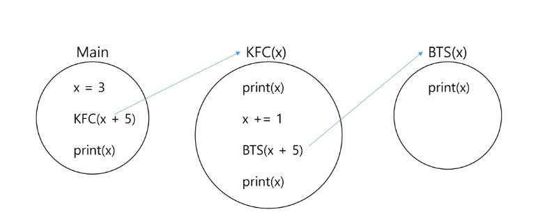

#### [도전]무한재귀호출

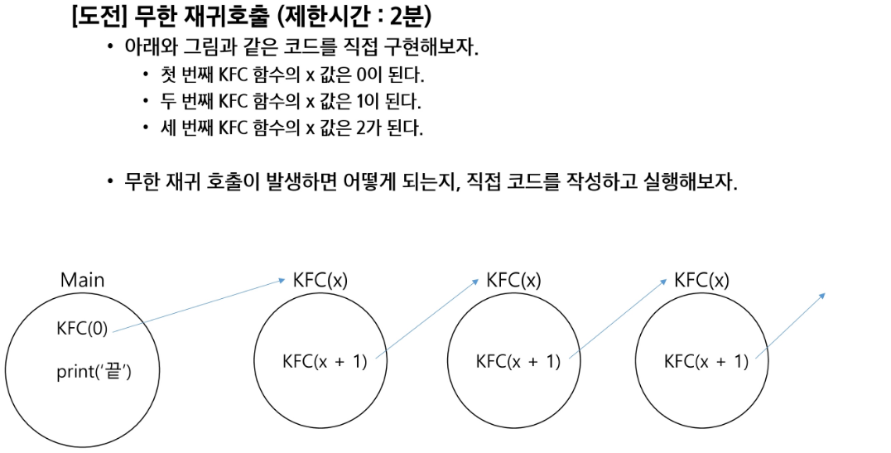

```python
def KFC(x):
    KFC(x+1)

KFC(0)  # ​​RecursionError: maximum recursion depth exceeded
```


#### 재귀호출 공부의 시작은, 무한 재귀호출을 막는 것 부터 시작한다.

- 출력결과는 `0 1 1 0` 이다.

- 아래 if문을 **"기저조건(base case)"**이라고 한다.

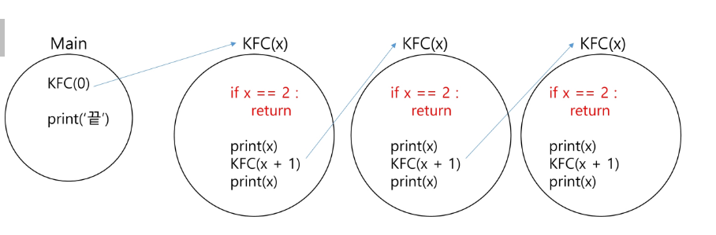


#### [도전] 0 1 2 3 4 5 5 4 3 2 1 0 을 재귀호출을 이용하여 구현한다.

```python
def func(x):

    # 1. 기저조건(종료조건)
    if x == 6:
        return

    # 2. 다음 재귀 호출 전
    print(x, end = ' ')

    # 3. 재귀 호출 (현재 값에 무슨 수식을 적용해서 넘겨줄까?)
    func(x + 1)  # 다음 재귀 호출에서는 현재보다 x 값이 1이 커야한다.

    # 4. 호출하고 돌아왔을 때
    print(x, end = ' ')

start = 0
func(start)

```

- 재귀호출 코드가 1개

    - KFC 함수 내부에 KFC(x + 1) 재귀 호출 코드가 하나인 경우 예시 그림
    - 출력결과는 **10**이다.

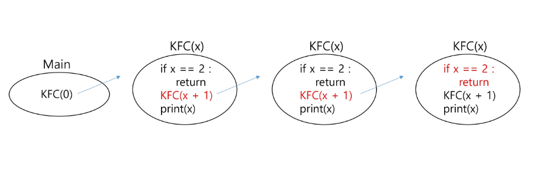

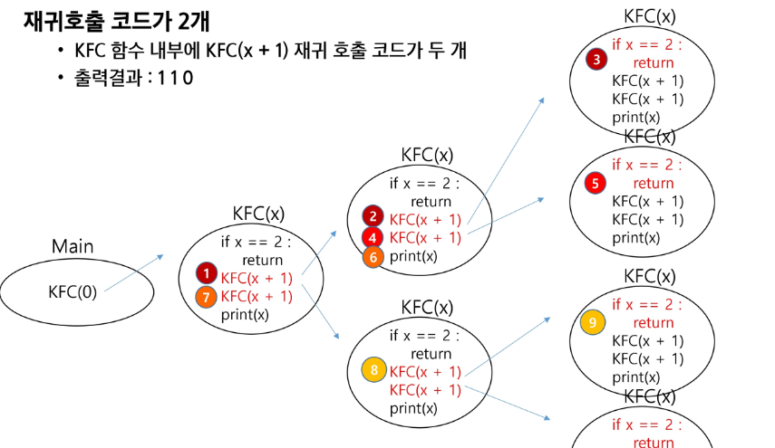


#### 재귀호출 코드가 2개, 간략화 하여 그리기 1

- KFC 함수 내부에 KFC(x + 1) 재귀 호출 코드가 두개

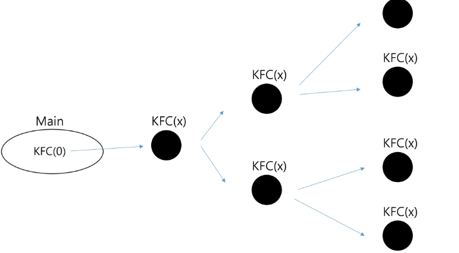

#### 재귀호출 코드가 2개, 간략화 하여 그리기 2

- 아래 그림만 보고, 우측 코드를 구현할 수 있어야 한다.

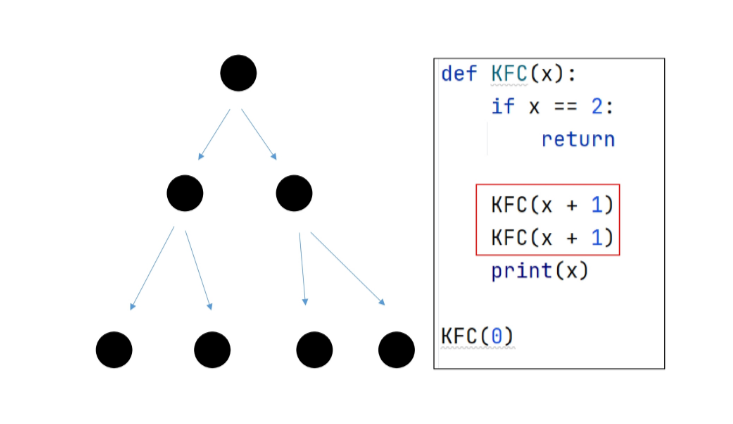

- 깊이를 Level이라고 부를 수 있다.

    - Level은 3, Branch (나뭇가지)는 4인 형태인 코드를 오른쪽과 같이 For문으로도 표현 가능하다.

    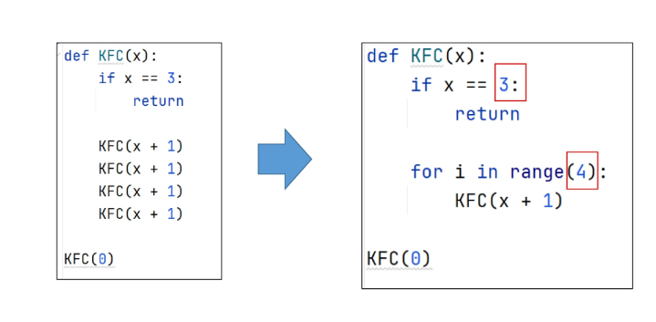

#### [정리] 재귀호출을 이용한 코딩 기법을 익히기 위해서는, 반드시 아래 코드의 원리를 이해해야한다.

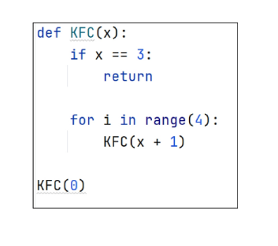


---

### `순열`

#### 순열이란?

- 서로 다른 N개에서 R개를 중복없이, 순서를 고려하여 나열하는 것.


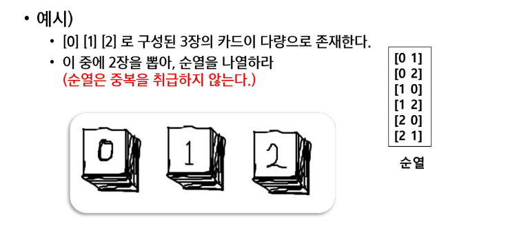

#### 중복순열이란?

- 서로 다른 N개에서, R개를 **중복을 허용**하고, 순서를 고려하여 나열하는 것.

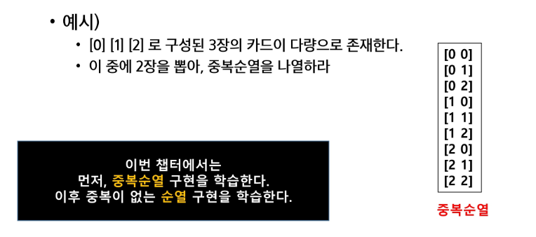

#### `중복순열 구현 원리`

1. **재귀호출을 할 때 마다. 이동 경로를 흔적으로 남긴다.**

2. 가장 마지막 레벨에 도착했을 때, 이동 경로를 출력한다.


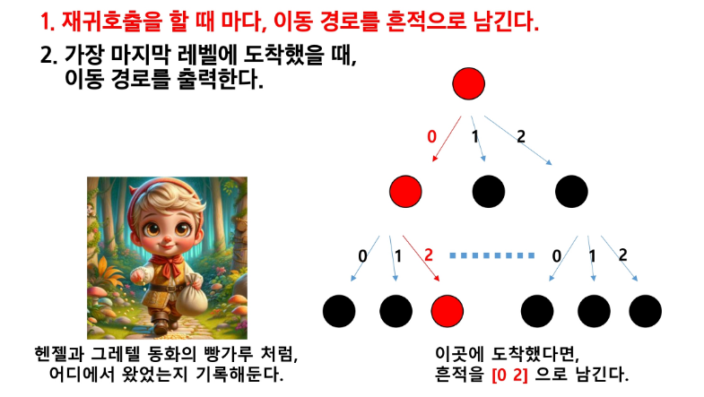


#### `순열 구현 원리`

1. 재귀호출을 할 때 마다, 이동 경로를 흔적으로 남긴다.

2. 가장 마지막 레벨에 도착했을 때, 이동 경로(흔적)를 출력한다.

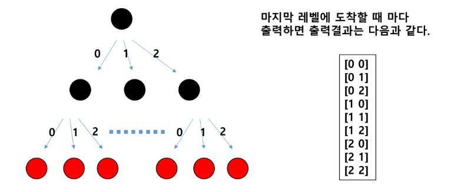

---

- 먼저 path라는 전역 리스트를 준비한다.
그리고 Level 2, Branch 3으로 동작되는 재귀 코드를 구현한다.


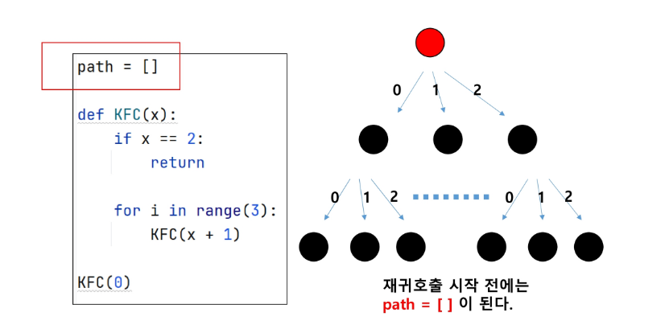

- **재귀호출을 하기 직전에** 이동할 곳의 위치를 path 리스트에 기록한다.

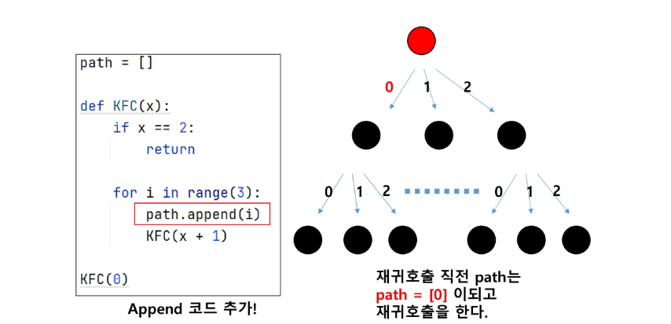

- 재귀호출 되었다. 그리고 코드가 계속 진행되어, path.append(i)를 수행한다.

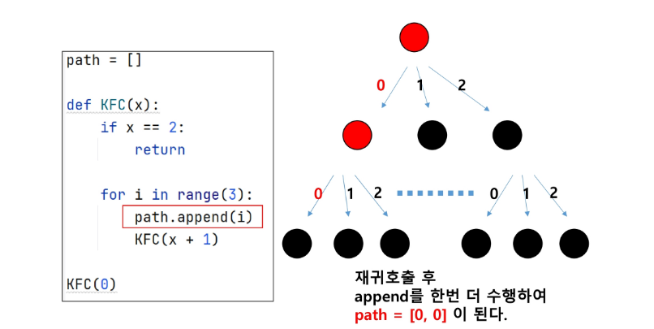

- 두 번 재귀호출 되었고, 이제 바닥에 도착했으니 이제 출력하는 코드를 수행한다.

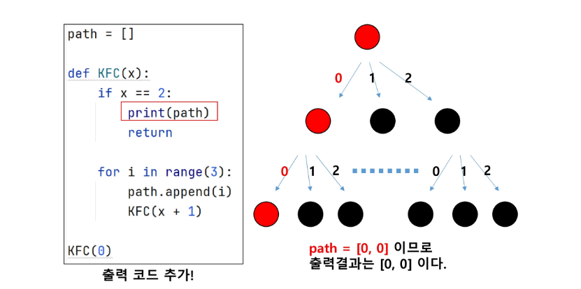

- 함수가 리턴 되고, 함수가 즉시 종료된다. 이후 path에 적은 마지막 기록이 삭제 되어야한다.

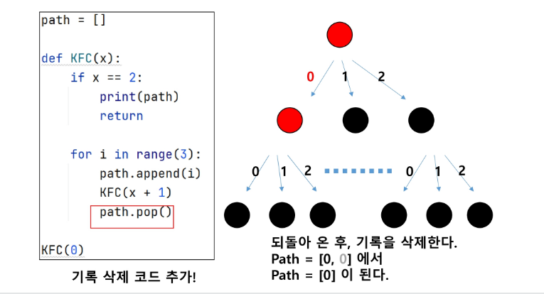

- 이어서 for문이 진행되고, 변수 i값은 **1**이 된다. path 배열 마지막에 **1**이 삽입된다.

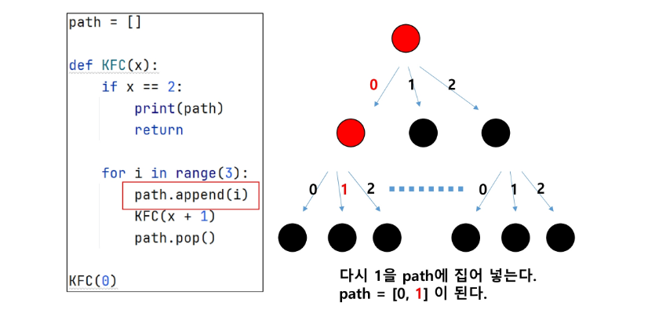

- 재귀호출이 된 후, path 리스트를 출력한다.

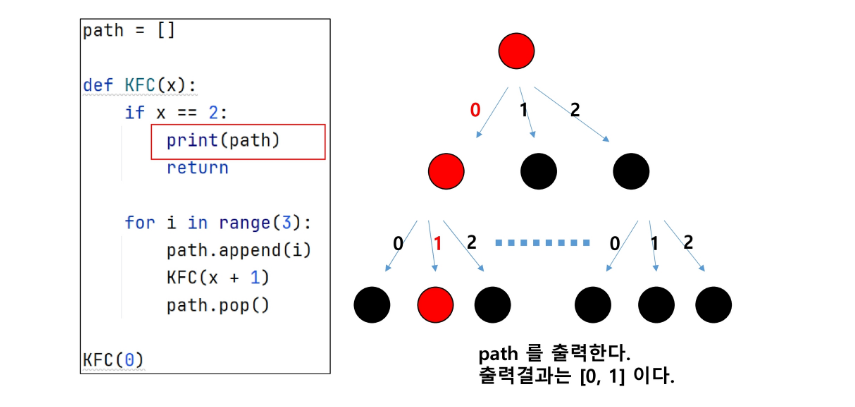

- 중복 순열 소스코드 완성
 => [0,0] ~ [2,2]까지 출력하는 소스코드

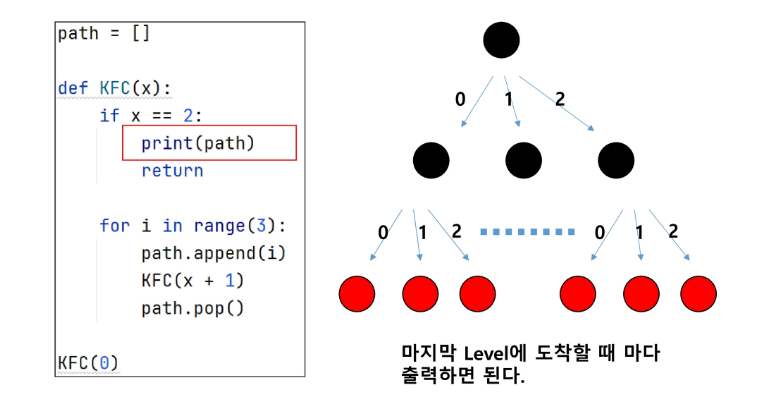


#### [도전] 중복순열 [1,1,1] ~ [6,6,6]까지 출력하는 코드를 재귀호출로 구현하자. 

```python
path = [] # 경로를 기록할 리스트

# 0부터 시작, 3개를 뽑은 경우 종료
def recur(level):
    if level == 3:
        print(*path)
        return

    # 2. 후보군을 반복하면서
    for i in range(1, 7):
        # i가 이미 뽑혔다면, continue 해라
        if i in path:
            continue

        # 2.1 재귀 호출 전 - 경로 기록
        path.append(i)

        # 2.2 다음 재귀 호출 (파라미터 전달)
        recur(level + 1)

        # 2.3 돌아왔을 때 - 사용했던 경로 삭제
        path.pop()


recur(0)  # 호출 : 시작점을 같이 전달해주는 경우가 많다.

```

#### 중복을 취급하지 않는 "순열" 구현 방법

1. 중복순열 코드를 작성한다.

2. **중복을 제거하는 코드**를 추가하면 순열 코드가 된다.

#### 중복을 제거하는 원리 

- **전역 리스트**를 사용하면 이미 선택했던 숫자인지 아닌지 구분할 수 있다.

- 이를 used 배열 또는 visited 배열이라고 한다. (DFS, BFS에 사용되는 것과 같다.)


```python
path = [] # 경로를 기록할 리스트
used = [0] * 7   # 1 ~ 6 숫자의 사용 여부를 기록할 리스트

# 0부터 시작, 3개를 뽑은 경우 종료
def recur(level):
    if level == 3:
        print(*path)
        return

    # 2. 후보군을 반복하면서
    for i in range(1, 7):
        # i가 이미 뽑혔다면, continue 해라
        # 아래 코드의 단점 : "in" = O(len(path))
        # 시간 초과 위험도가 높다!
        # if i in path:
        #     continue
        
        # i가 이미 뽑혔다면, continue 해라
        if used[i] == 1:
            continue

        # 2.1 재귀 호출 전 - 경로 기록 + 사용 기록
        used[i] = 1
        path.append(i)

        # 2.2 다음 재귀 호출 (파라미터 전달)
        recur(level + 1)

        # 2.3 돌아왔을 때 - 사용했던 경로 삭제 + 사용 여부 초기화
        path.pop()
        used[i] = 0

recur(0)  # 호출 : 시작점을 같이 전달해주는 경우가 많다.

```


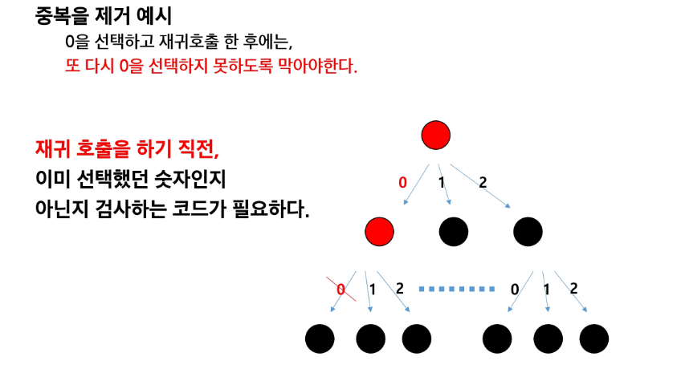

#### 이미 사용한 숫자인지 아닌지 구분하는 List 준비하기

- 전역으로 used 라는 리스트를 준비한다.

```python

used = [False, False, False]
# 아래와 같이 리스트 내포 문법을 사용해도 된다.
# used = [False for _ in range(3)]
```

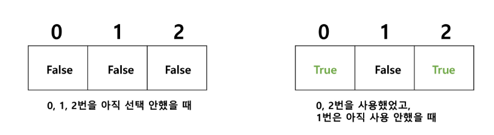


---

### `완전탐색`

- 완전탐색(= Brute-Force, 부르트 포스 알고리즘 이라고 한다.)
    - 모든 가능한 경우를 모두 시도를 해보아, 정답을 찾아내는 알고리즘

- 완전탐색 예시
    - 자전거 열쇠 비밀번호 맞추기
        - 만약 1111 ~ 9999 네 자리 숫자를 맞춰야 한다면?
            -> 솔루션 : 4중 for문으로 모두 시도해본다.

        - 만약 1 ~ 9까지 이뤄진, N자리의 숫자를 맞춰야 한다면?
            -> 솔루션 : 순열 코드(재귀호출)로 구현하여, 모두 시도해본다.


#### 완전탐색 문제 1. 주사위 눈금의 합

- 3개의 주사위를 던져 나올 수 있는 중복 순열에 대해, 합이 10 이하가 나오는 경우는 총 몇가지 인가?

    - 서로 영향이 없는 "독립적인 문제"
    - 다른 숫자와 영향 주지 않음(규칙 X, 미리 계산 X)


```python
path = []  

# 주사위 몇 개 던졌는지, 주사위의 합이 몇인지?
def recur(level, total):
    # 가지치기 : 이미 10을 넘는 경우의 수는 계산할 필요가 없다!
    if total > 10:
        return

    # 기저조건 : 3개를 던졌을 때 종료
    if level == 3:
        # 10이하인가?
        if total <= 10:
            print(path)

        return

    # 후보군 탐색
    for i in range(1, 7):
        # i의 의미 : 주사위 숫자
        path.append(i)
        recur(level+1, total + i) # 주사위 결과를 더하여 전달
        path.pop()

recur(0, 0)

```
