# 2024-10-17(목) Django11_DRF_02

- DRF with N:1 Relation

  - 사전 준비
  - GET method
  - POST method
  - DELETE & PUT method

- 역참조 데이터 구성

  - 단일 게시글 + 댓글 목록
  - 단일 게시글 + 댓글 개수
  - 읽기 전용 필드

- API 문서화

  - 문서화 활용

- 참고

  - 올바르게 404 응답하기
  - 복잡한 ORM 활용

## DRF with N:1 Relation

### 사전 준비

- Comment 모델 정의

  - Comment 클래스 정의 및 데이터베이스 초기화

    

  - Migration 및 fixtures 데이터 로드

    

- URL 및 HTTP request method 구성

  |URL|GET|POST|PUT|DELETE|
  |:--:|:--:|:--:|:--:|:--:|
  |comments/|댓글 목록 조회||||
  |comments/1/|단일 댓글 조회||단일 댓글 수정|단일 댓글 삭제|
  |articles/1/comments/||댓글 생성|||
   

### GET method

- GET - List

  - 댓글 목록 조회를 위한 CommentSerializer 정의

    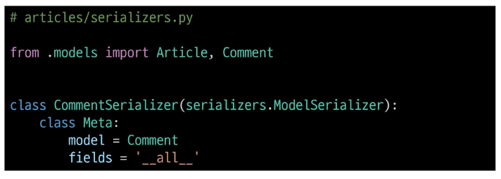

  - url 작성

    

  - view 함수 작성

    

  - GET [http://127.0.0.1:8000/api/v1/comments/](http://127.0.0.1:8000/api/v1/comments/) 응답 확인

    

- GET - Detail

  - 단일 댓글 조회를 위한 url 및 view 함수 작성

    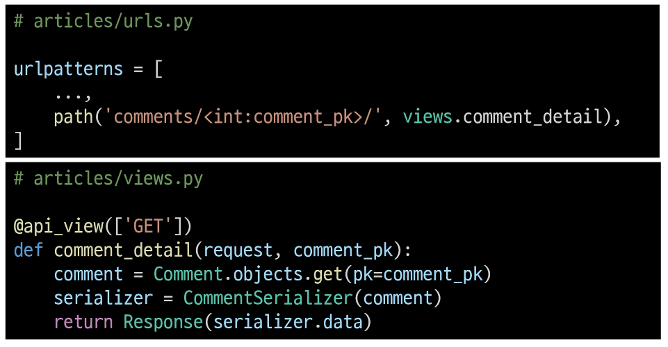

  - GET [http://127.0.0.1:8000/api/v1/comments/1/](http://127.0.0.1:8000/api/v1/comments/1/) 응답 확인

    

### POST method

- POST

  - 단일 댓글 생성을 위한 url 및 view 함수 작성

    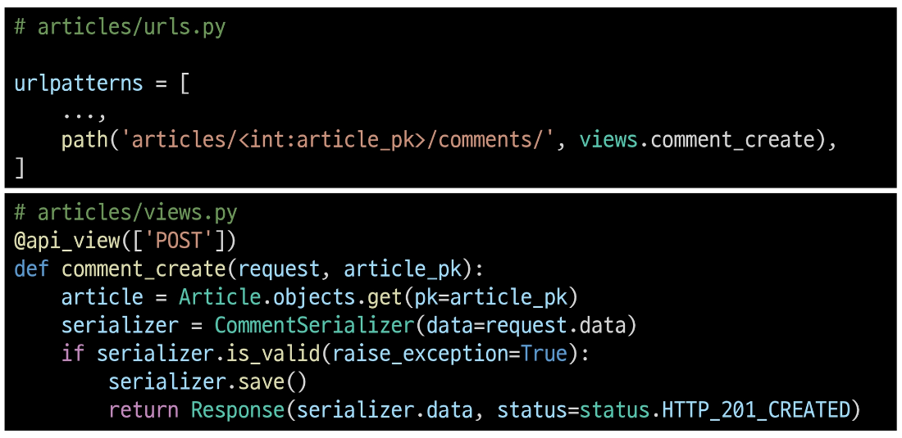

  - serializer 인스턴스의 save() 메서드는 특정 Serializer 인스턴스를 저장하는 과정에서 추가 데이터를 받을 수 있음

    

  - POST [http://127.0.0.1:8000/api/v1/articles/1/comments/](http://127.0.0.1:8000/api/v1/articles/1/comments/) 응답 확인

  - 상태코드 400 응답 확인

    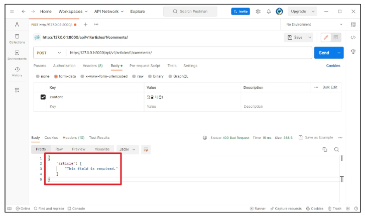

  - CommentSerializer에서 외래 키에 해당하는 article field 또한 사용자로부터 입력 받도록 설정되어 있기 때문에 서버 측에서는 누락되었다고 판단한 것

  - 유효성 검사 목록에서 제외 필요

  - article field를 **읽기 전용 필드**로 설정하기

  - POST [http://127.0.0.1:8000/api/v1/articles/1/comments/](http://127.0.0.1:8000/api/v1/articles/1/comments/) 재요청

    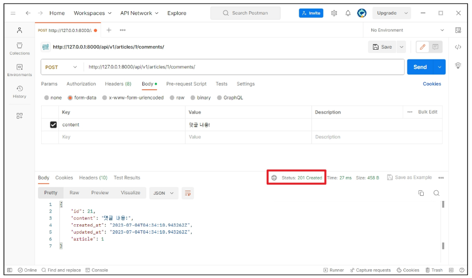

- 읽기 전용 필드(read_only_fields)

  - 데이터를 전송 받은 시점에 "**유효성 검사에서 제외**시키고, **데이터 조회 시에는 출력**"하는 필드

    

### DELETE & PUT method

- DELETE & PUT

  - 단일 댓글 삭제 및 수정을 위한 view 함수 작성

    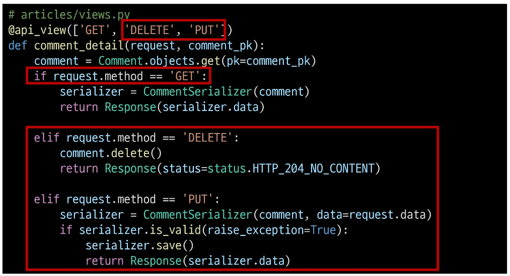

  - DELETE [http://127.0.0.1:8000/api/v1/comments/21/](http://127.0.0.1:8000/api/v1/comments/21/) 응답 확인

    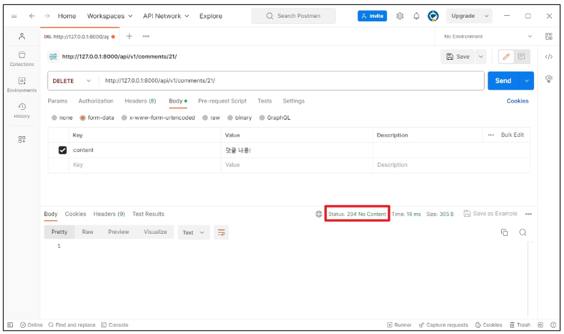

  - PUT [http://127.0.0.1:8000/api/v1/comments/1/](http://127.0.0.1:8000/api/v1/comments/1/) 응답 확인

    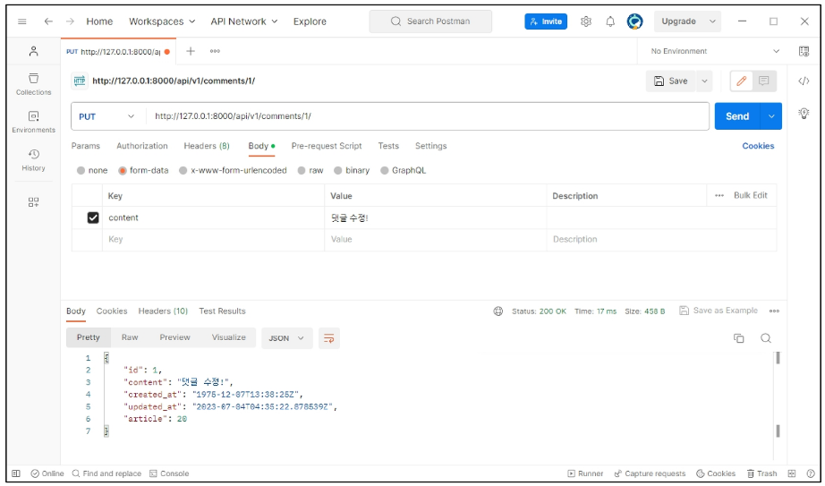

### 응답 데이터 재구성

- 댓글 조회 시 게시글 출력 내역 변경

  - 댓글 조회 시 게시글 번호만 제공해주는 것이 아닌 **'게시글의 제목'까지 제공**하기

    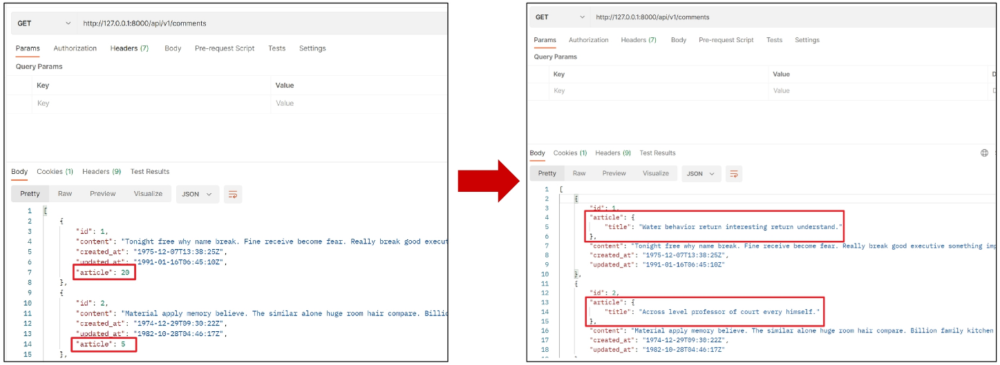

  - 필요한 데이터를 만들기 위한 Serializer는 내부에서 추가 선언이 가능

    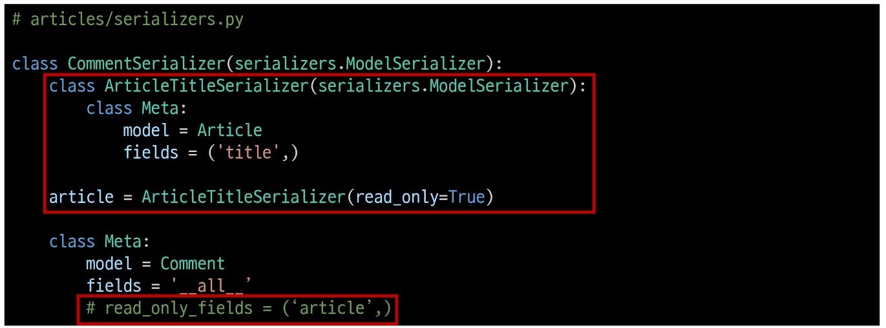

  - GET [http://127.0.0.1:8000/api/v1/comments/1/](http://127.0.0.1:8000/api/v1/comments/1/) 응답 확인

    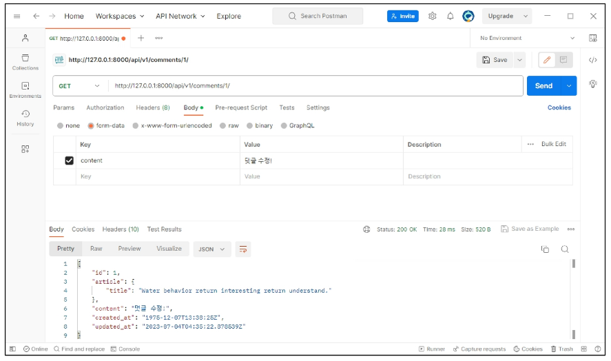

## 역참조 데이터 구성

- Article → Comment 간 역참조 관계를 활용한 JSON 데이터 재구성

      - 아래 2가지 사항에 대한 데이터 재구성하기

        1. 단일 게시글 조회 시 해당 게시글에 작성된 댓글 목록도 함께 붙여서 응답

        2. 단일 게시글 조회 시 해당 게시글에 작성된 댓글 개수도 함께 붙여서 응답

### 단일 게시글 + 댓글 목록

- Nested relationships (역참조 매니저 활용)

  - 모델 관계 상으로 참조하는 대상은 참조되는 대상의 표현에 포함되거나 중첩될 수 있음

  - 이러한 중첩된 관계는 serializers를 필드로 사용하여 표현 가능

    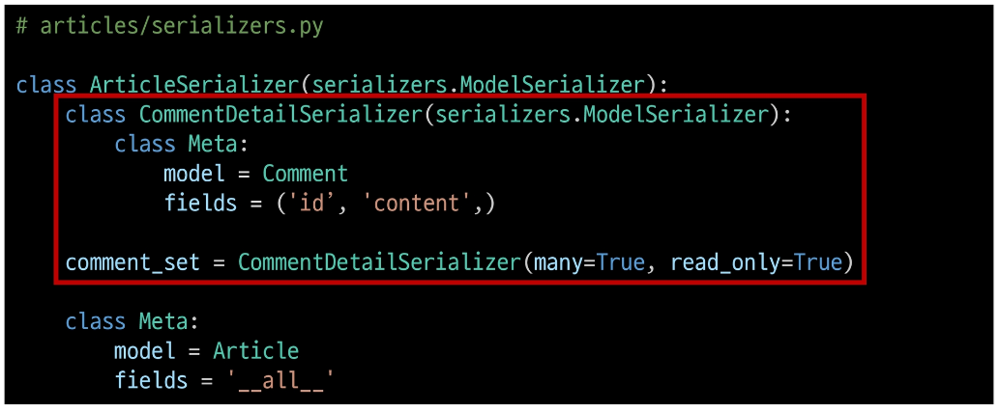

- GET [http://127.0.0.1:8000/api/v1/articles/2/](http://127.0.0.1:8000/api/v1/articles/2/) 응답 확인

  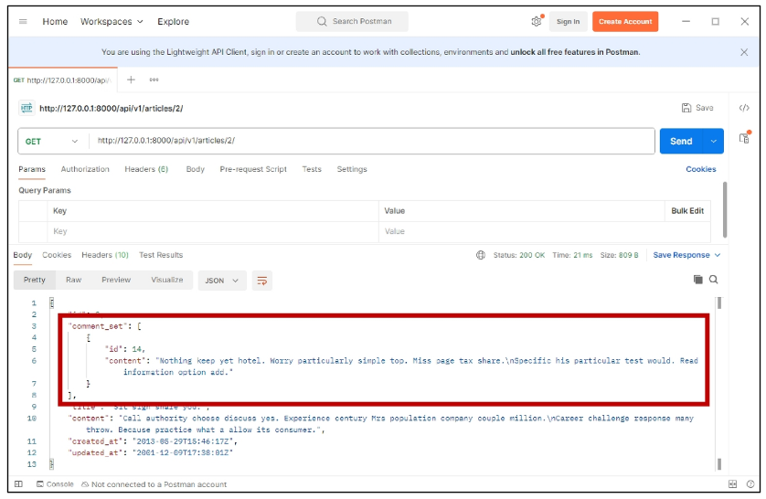

### 단일 게시글 + 댓글 개수

- 댓글 개수에 해당하는 새로운 필드 생성

  

- GET [http://127.0.0.1:8000/api/v1/articles/3/](http://127.0.0.1:8000/api/v1/articles/3/) 응답 확인

  

- 'source' arguments

  - 필드를 채우는 데 사용할 속성의 이름

  - 점 표기법(dotted notation)을 사용하여 속성을 탐색할 수 있음

    

### 읽기 전용 필드

- 읽기 전용 필드를 사용하는 이유

      - 사용자에게 입력으로는 받지 않지만 제공은 해야 하는 경우

      - 새로운 필드 값을 만들어 제공해야 하는 경우

      - 특징 및 주의 사항

        - 유효성 검사에서 제외됨

        - 단, 유효성 검사에서 제외된다고 해서 반드시 "생성" 로직에서만 사용이 국한되는 것은 아님

- read_only_fields 속성과 read_only 인자의 사용처

      - read_only_fields

        - 기존 외래 키 필드 값을 그대로 응답 데이터에 제공하기 위해 지정하는 경우

      - read_only

        - 기존 외래 키 필드 값의 결과를 다른 값으로 덮어쓰는 경우

        - 새로운 응답 데이터 값을 제공하는 경우

## API 문서화

- OpenAPI Specification(OAS)

  - RESTful API를 설명하고 시각화하는 표준화된 방법

  - API에 대한 세부사항을 기술할 수 있는 공식 표준

  - OAS 기반 API에 대한 문서를 생성하는 데 도움을 주는 오픈소스 프레임워크

### 문서화 활용

- drf-spectacular 라이브러리

  - DRF 위한 OpenAPI 3.0 구조 생성을 도와주는 라이브러리

  - 설치 및 등록

    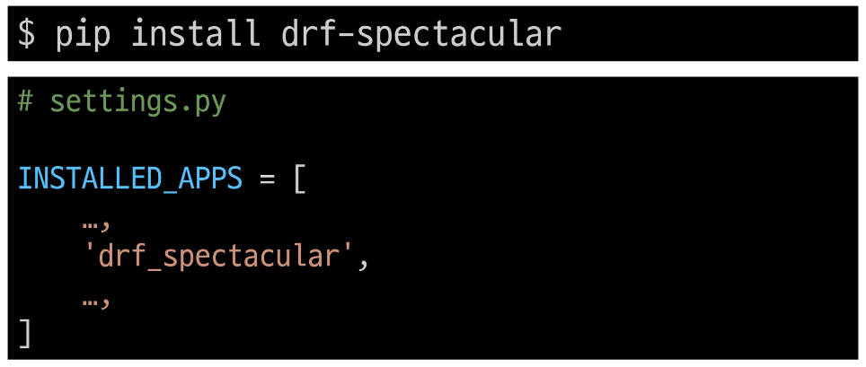

  - 관련 설정 코드 입력 (OpenAPI 구조 자동 생성 코드)

    

  - swagger, redoc 페이지 제공을 위한 url 작성

    

  - [http://127.0.0.1:8000/api/schema/swagger-ui/](http://127.0.0.1:8000/api/schema/swagger-ui/) 페이지 확인

    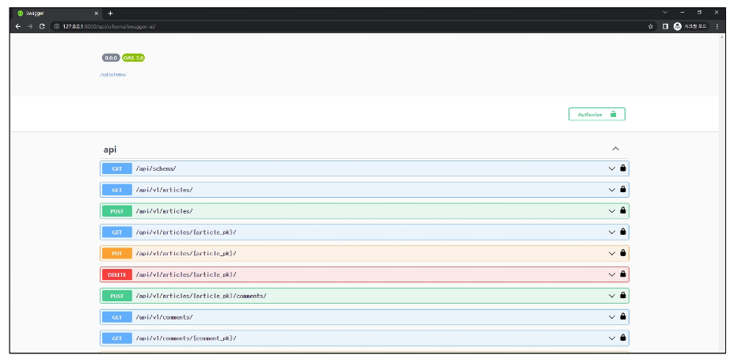

  - [http://127.0.0.1:8000/api/schema/redoc/](http://127.0.0.1:8000/api/schema/redoc/) 페이지 확인

    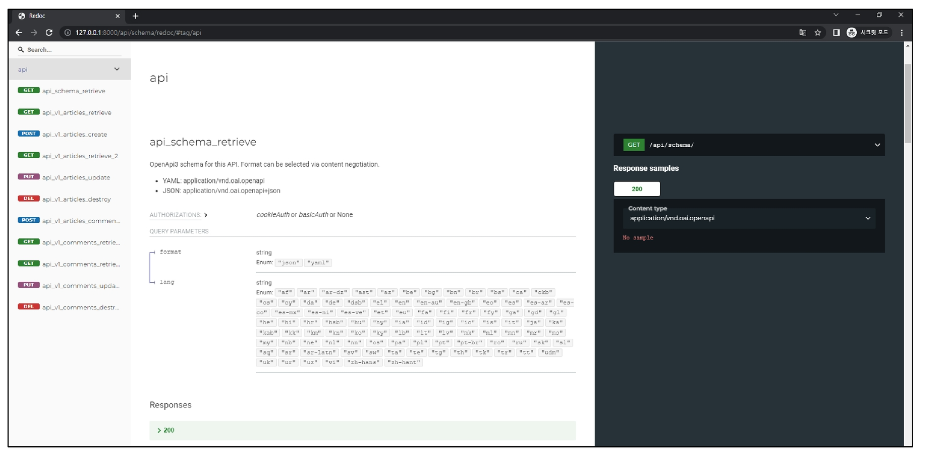

- "설계 우선" 접근법

  - OAS의 핵심 이점

  - API를 먼저 설계하고 명세를 작성한 후, 이를 기반으로 코드를 구현하는 방식

  - API의 일관성을 유지하고, API 사용자는 더 쉽게 API를 이해하고 사용할 수 있음

  - 또한, OAS를 사용하면 API가 어떻게 작동하는지를 시각적으로 보여주는 문서를 생성할 수 있으며, 이는 API를 이해하고 테스트하는 데 매우 유용

  - 이런 목적으로 사용되는 도구가 Swagger-UI 또는 ReDoc

## 참고

### 올바르게 404 응답하기

- Django shortcuts functions

  - render()
  
  - redirect()

  - **get_object_or_404()**

  - **get_list_or_404()**

- get_object_or_404()

  - 모델 manager objects에서 get()을 호출하지만, 해당 객체가 없을 땐 기존 DoesNotExist 예외 대신 **Http404를 raise** 함

- get_object_or_404 적용

  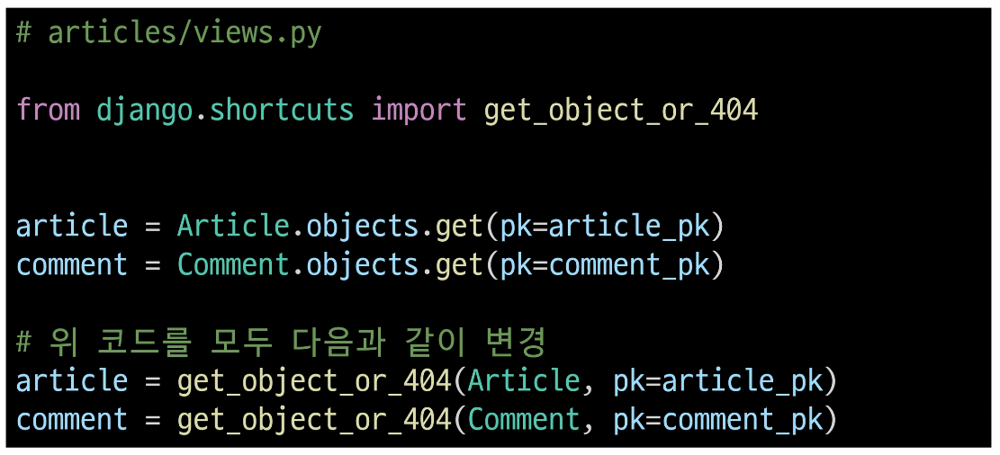

- get_list_or_404()

  - 모델 manager objects에서 filter()의 결과를 반환하고, 해당 객체 목록이 없을 땐 **Http404를 raise** 함

- get_list_or_404 적용

  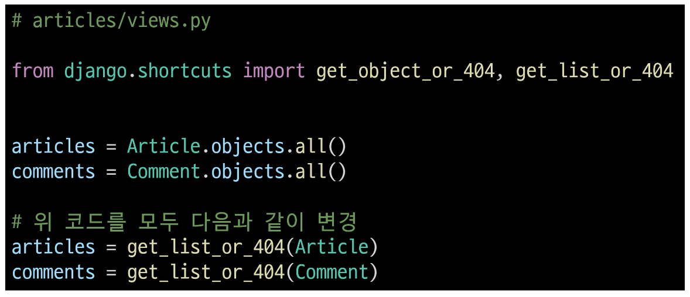

- 적용 전/후 비교

  - 존재하지 않는 게시글 조회 시 이전에는 상태 코드 500을 응답했지만 현재는 404를 응답

    

- 왜 사용해야 할까?

      - 클라이언트에게 "서버에 오류가 발생하여 요청을 수행할 수 없다(500)"라는
        원인이 정확하지 않은 에러를 제공하기 보다는,
        적절한 예외 처리를 통해 클라이언트에게 보다 정확한 에러 현황을
        전달하는 것도 매우 중요한 개발 요소 중 하나이기 때문

### 복잡한 ORM 활용

- 복잡한 ORM 활용 시 권장 방식

  - 복잡한 query나 로직은 View 함수에서 진행

    - 여러 모델을 조인하거나 복잡한 집계가 필요한 경우 View 함수에서 처리

    - 필요한 경우 View 함수에서 select_related()나 prefetch_related()를 사용하여 query를 최적화

  - Serializer는 기본적인 데이터 변환을 담당

    - Serializer만으로는 복잡한 query를 처리하기 어려움