# 2024년 10월 10일(목) DataBase01_SQL02


- Managing Tables

  - Create a table

  - Modifying table fields

  - Delete a table


- Modifying Data

  - Insert data

  - Update data

  - Delete data


- Multi table queries

  - Join

  - Joining tables


---

### `Managing Tables`


  |유형|역할|SQL 키워드|
  |:--:|:--:|:--:|
  |DDL<br>(Data Definition Language)|데이터의 기본 구조 및<br>형식 변경|**CREATE**<br>**DROP**<br>**ALTER**|
  |DQL<br>(Data Query Language)|데이터 검색|**SELECT**|
  |DML<br>(Data Manipulation Language)|데이터 조작<br>(추가, 수정, 삭제)|**INSERT**<br>**UPDATE**<br>**DELETE**|
  |DCL<br>(Data Control Language)|데이터 및 작업에 대한<br>사용자 권한 제어|**COMMIT**<br>**ROLLBACK**<br>**GRANT**<br>**REVOKE**|
  <br>


### `Create a table`


#### CREATE TABLE

- **CREATE TABLE** statement

  - 테이블 생성


#### CREATE TABLE syntax

  ```sql
  CREATE TABLE table_name(
    column_1 data_type constraints,
    column_2 data_type constraints,
    ... ,
  )
  ```

  - 각 필드에 적용할 데이터 타입 작성

  - 테이블 및 필드에 대한 제약조건(constraints) 작성


#### CREATE TABLE 활용

  - examples 테이블 생성 및 확인

    ```sql
    CREATE TABLE examples(
      ExamId INTEGER PRIMARY KEY AUTOINCREMENT,
      LastName VARCHAR(50) NOT NULL,
      FirstName VARCHAR(50) NOT NULL
    );
    ```

    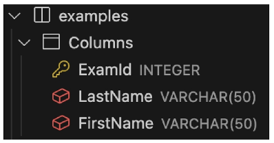


#### `PRAGMA`

  - 테이블 schema(구조) 확인

    ```sql
    PRAGMA table_info('examples');
    ```

    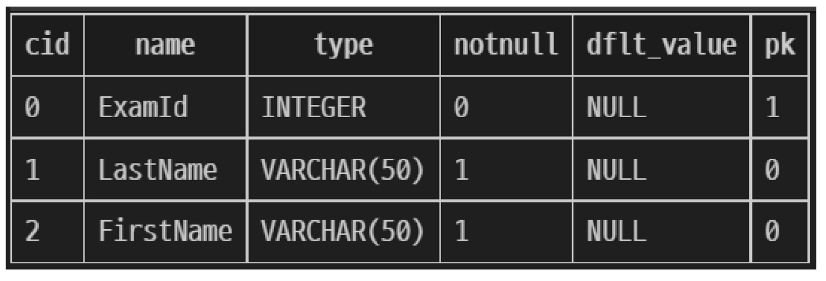

    - "cid"

      - Column ID를 의미하며 각 컬럼의 고유한 식별자를 나타내는 정수 값

      - 직접 사용하지 않으며 PRAGMA 명령과 같은 메타데이터 조회에서 출력 값으로 활용됨


#### 데이터 타입

  


#### 제약 조건

  


#### AUTOINCREMENT 키워드

  


#### SQLite 데이터 타입

  |NULL|INTEGER|REAL|TEXT|BLOB|
  |:--:|:--:|:--:|:--:|:--:|
  |아무런 값도 포함하지 않음을 나타냄|정수|부동 소수점|문자열|이미지, 동영상, 문서 등의 바이너리 데이터|
  <br>


#### `Contraints(제약 조건)`

  - 테이블의 필드에 적용되는 규칙 또는 제한 사항

  - 데이터의 무결성을 유지하고 데이터베이스의 일관성을 보장


#### 대표 제약 조건 3가지

  - `PRIMARY KEY`

    - 해당 필드를 기본 키로 지정

    - **INTEGER 타입에만 적용되며 INT, BIGINT 등과 같은 다른 정수 유형은 적용되지 않음**


  - `NOT NULL`

    - 해당 필드에 NULL 값을 허용하지 않도록 지정


  - `FOREIGN KEY`

    - 다른 테이블과의 외래 키 관계를 정의


#### **AUTOINCREMENT** keyword

  - 자동으로 고유한 정수 값을 생성하고 할당하는 필드 속성


#### AUTOINCREMENT 특징

  - 필드의 자동 증가를 나타내는 특수한 키워드

  - 주로 primary key필드에 적용

  - **INTEGER PRIMARY KEY AUTOINCREMENT**가 작성된 필드는 항상 새로운 레코드에 대해 이전 최대 값보다 큰 값을 할당

  - 삭제된 값은 무시되며 재사용할 수 없게 됨


---


### `Modifying table fields`


#### `ALTER TABLE`

- **ALTER TABLE** statement

  - 테이블 및 필드 조작


#### ALTER TABLE 역할

  |명령어|역할|
  |:---:|:--:|
  |ALTER TABLE **ADD COLUMN**|필드 추가|
  |ALTER TABLE **RENAME COLUMN**|필드 이름 변경|
  |ALTER TABLE **DROP COLUMN**|필드 삭제|
  |ALTER TABLE **RENAME TO**|테이블 이름 변경|
  <br>


`1. ALTER TABLE ADD COLUMN syntax`

  ```sql
  ALTER TABLE
    table_name
  ADD COLUMN
    column_definition;
  ```

  - ADD COLUMN 키워드 이후 추가하고자 하는 새 필드 이름과 데이터 타입 및 제약 조건 작성

  - 단, 추가하고자 하는 필드에 **NOT NULL** 제약조건이 있을 경우 NULL이 아닌 **기본 값 설정 필요**


#### ALTER TABLE ADD COLUMN 활용 1

  - examples 테이블에 다음 조건에 맞는 Country 필드 추가

    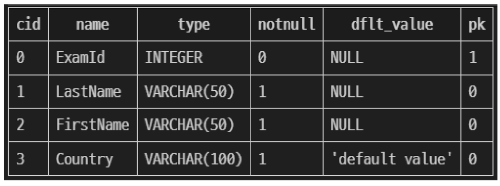

    - 테이블 생성 시 정의한 필드는 기본 값이 없어도 NOT NULL 제약조건으로 생성되며 내부적으로 Default value는 NULL로 설정됨

    ```sql
    ALTER TABLE
      examples
    ADD COLUMN
      Country VARCHAR(100) NOT NULL DEFAULT 'default value';
    ```

#### ALTER TABLE ADD COLUMN 활용 2

  - examples 테이블에 다음 조건에 맞는 Age, Address 필드 추가

    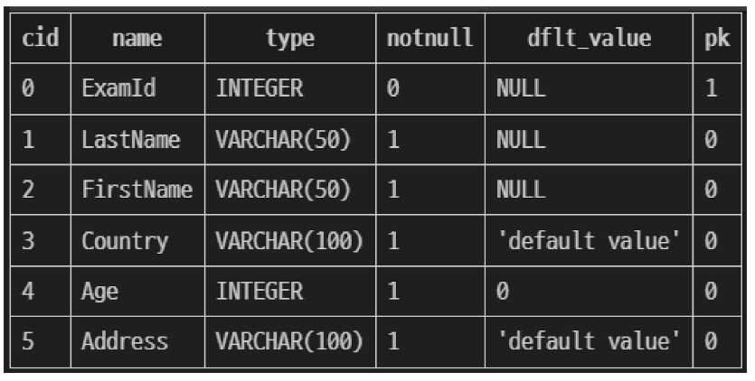

    - SQLite는 단일 문을 사용하여 한번에 여러 필드를 추가할 수 없음

    ```sql
    ALTER TABLE examples
    ADD COLUMN Age INTEGER NOT NULL DEFAULT 0;

    ALTER TABLE examples
    ADD COLUMN Address VARCHAR(100) NOT NULL DEFAULT 'default value';
    ```


`2. ALTER TABLE RENAME COLUMN syntax`

  ```sql
  ALTER TABLE
    table_name
  RENAME COLUMN
    current_name TO new_name
  ```

  - RENAME COLUMN 키워드 뒤에 이름을 바꾸려는 필드의 이름을 지정하고 TO 키워드 뒤에 새 이름을 지정


#### ALTER TABLE RENAME COLUMN 활용 1

  - examples 테이블 Address 필드의 이름을 PostCode로 변경

    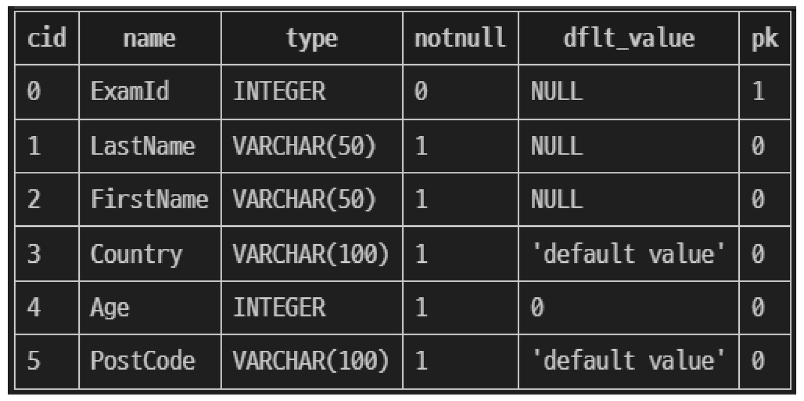

    ```sql
    ALTER TABLE examples
    RENAME COLUMN Address To Postcode;
    ```


`3. ALTER TABLE DROP COLUMN syntax`

  ```sql
  ALTER TABLE
    table_name
  DROP COLUMN
    column_name
  ```

  - DROP COLUMN 키워드 뒤에 삭제할 필드 이름 지정


#### ALTER TABLE DROP COLUMN 활용

  - examples 테이블의 PostCode 필드를 삭제

    ```sql
    ALTER TABLE examples
    DROP COLUMN PostCode;
    ```


`4. ALTER TABLE RENAME TO syntax`

  ```sql
  ALTER TABLE
    table_name
  RENAME_TO
    new_table_name
  ```

  - RENAME TO 키워드 뒤에 새로운 테이블 이름 지정


#### ALTER TABLE RENAME TO 활용

  - examples 테이블 이름을 new_examples로 변경

    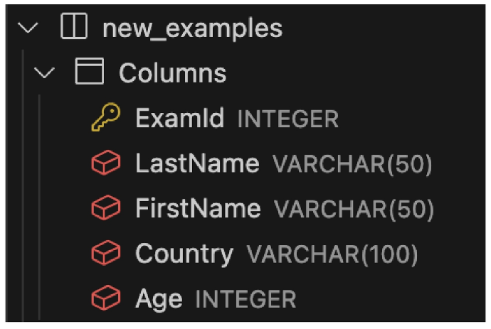

    ```sql
    ALTER TABLE examples
    RENAME TO new_examples;
    ```

---

### `Delete a table`

#### `DROP TABLE`

- **DROP TABLE** statement

  - 테이블 삭제


#### DROP TABLE syntax

  ```sql
  DROP TABLE table_name;
  ```

  - DROP TABLE statement 이후 삭제할 테이블 이름 작성


#### DROP TABLE 활용

  - new_examples 테이블 삭제

    ```sql
    DROP TABLE new_examples;
    ```
---


### `참고`

#### 타입 선호도(Type Affinity)

  - 칼럼에 데이터 타입이 명시적으로 지정되지 않았거나 지원하지 않을 때 SQLite가 자동으로 데이터 타입을 추론하는 것

    

    [https://www.sqlite.org/datatype3.html](https://www.sqlite.org/datatype3.html)


#### SQLite 타입 선호도의 목적

      1. 유연한 데이터 타입 지원

        - 데이터 타입을 명시적으로 지정하지 않고도 데이터를 저장하고 조회할 수 있음
        
        - 컬럼에 저장되는 값의 특성을 기반으로 데이터 타입을 유추

      2. 간편한 데이터 처리

        - INTEGER Type Affinity를 가진 열에 문자열 데이터를 저장해도 SQLite는 자동으로 숫자를 변환하여 처리

      3. SQL 호환성

        - 다른 데이터베이스 시스템과 호환성을 유지


#### 반드시 NOT NULL 제약을 사용해야 할까?

      - "NO"

      - 하지만 데이터베이스를 사용하는 프로그램에 따라 NULL을 저장할 필요가 없는 경우가 많으므로 대부분 NOT NULL을 정의

      - "값이 없다." 라는 표현을 테이블에 기록하는 것은 "0"이나 "빈 문자열" 등을 사용하는 것으로 대체하는 것을 권장


---

### `Modifying Data`


  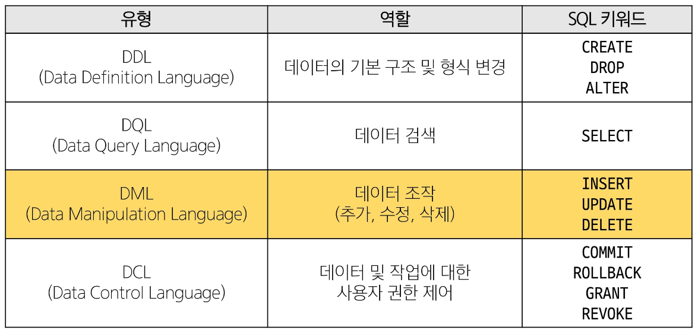

---

### `Insert data`

#### `INSERT`

#### 사전 준비

  - 실습 테이블 생성

    ```SQL
    CREATE TABLE articles(
      id INTEGER PRIMARY KEY AUTOINCREMENT,
      title VARCHAR(100) NOT NULL,
      content VARCHAR(200) NOT NULL,
      createdAt DATE NOT NULL
    );
    ```


- **INSERT** statement

  - 테이블 레코드 삽입


#### INSERT syntax

  ```sql
  INSERT INTO table_name (c1, c2, ...)
  VALUES (v1, v2, ...;)
  ```

  - **INSERT INTO** 절 다음에 테이블 이름과 괄호 안에 필드 목록 작성

  - **VALUES** 키워드 다음 괄호 안에 해당 필드에 삽입할 값 목록 작성

- INSERT 활용 1

  - articles 테이블에 다음과 같은 데이터 입력

    

    ```sql
    INSERT INTO
      articles (title, content, createdAt)
    VALUES
      ('hello', 'world', '2000-01-01');
    ```


- INSERT 활용 2

  - articles 테이블에 다음과 같은 데이터 추가 입력

    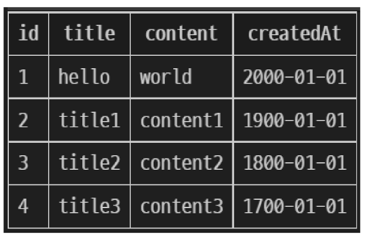

    ```sql
    INSERT INTO
      articles (title, content, createdAt)
    VALUES
      ('title1', 'content1', '1900-01-01'),
      ('title2', 'content2', '1800-01-01'),
      ('title3', 'content3', '1700-01-01');
    ```


- INSERT 활용 3

  - DATE 함수를 사용해 articles 테이블에 다음과 같은 데이터 추가 입력

    

    ```sql
    INSERT INTO
      articles (title, content, createdAt)
    VALUES
      ('mytitle', 'mycontent', DATE());
    ```


### Update data

#### UPDATE

- **UPDATE** statement

  - 테이블 레코드 수정


- UPDATE syntax

  ```sql
  UPDATE table_name
  SET column_name = expression,
  [WHERE
    condition];
  ```

  - SET 절 다음에 수정 할 필드와 새 값을 지정

  - WHERE 절에서 수정할 레코드를 지정하는 조건 작성

  - WHERE 절을 작성하지 않으면 모든 레코드를 수정


- UPDATE 활용 1

  - articles 테이블 1번 레코드의 title 필드 값을 'update Title'로 변경

    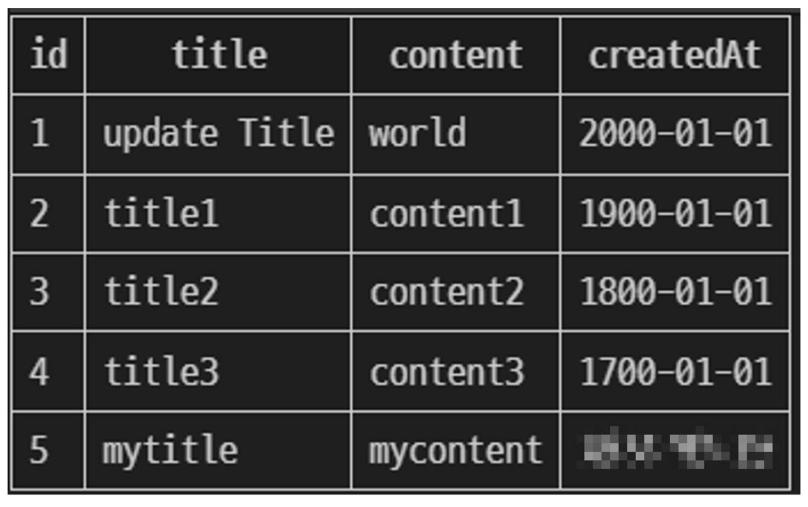

    ```sql
    UPDATE
      articles
    SET
      title = 'update Title'
    WHERE
      id = 1;
    ```


- UPDATE 활용 2

  - articles 테이블 2번 레코드의 title, content 필드 값을 각각 'update Title', 'update Content'로 변경

    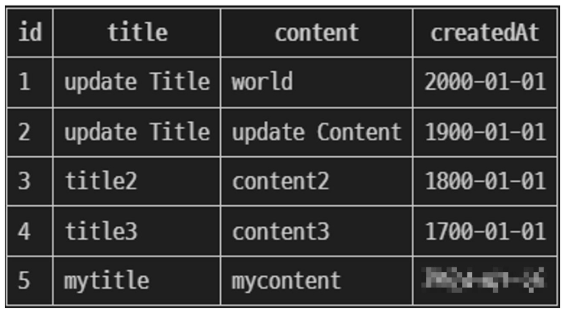

    ```sql
    UPDATE
      articles
    SET
      title = 'update Title'
      content = 'update Content'
    WHERE
      id = 2;
    ```


### Delete data

#### DELETE

- **DELETE** statement

  - 테이블 레코드 삭제


- DELETE syntax

  ```sql
  DELETE FROM table_name
  [WHERE
    condition];
  ```

  - DELETE FROM 절 다음에 테이블 이름 작성

  - WHERE 절에서 삭제할 레코드를 지정하는 조건 작성

  - WHERE 절을 작성하지 않으면 모든 레코드를 삭제


- DELETE 활용 1

  - articles 테이블의 1번 레코드 삭제

    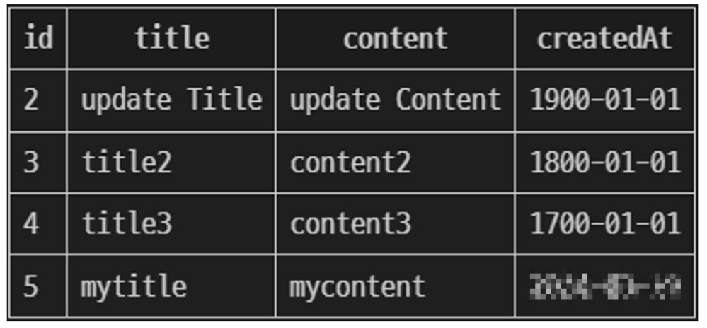

    ```sql
    DELETE FROM
      articles
    WHERE
      id = 1;
    ```


- DELETE 활용 2

  - articles 테이블에서 작성일이 오래된 순으로 레코드 2개 삭제

    

    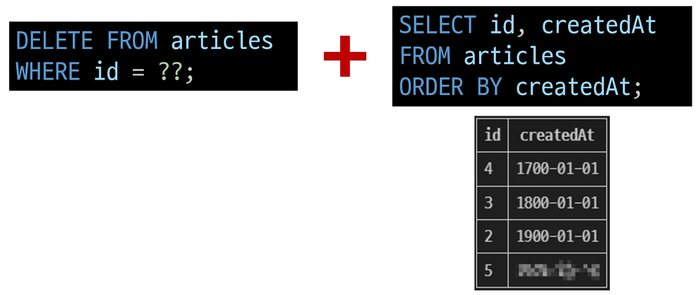

    ```sql
    DELETE FROM
      articles
    WHERE id IN (
      SELECT id FROM articles
      ORDER BY createdAt
      LIMIT 2
    );
    ```


## 참고

- SQLite의 날짜와 시간

      - SQLite에는 날짜 및/또는 시간을 지정하기 위한 별도 데이터 타입이 없음

      - 대신 날짜 및 시간에 대한 함수를 사용해 표기 형식에 따라 TEXT, REAL, INTEGER 값으로 저장


      

## Multi table queries


### Join

- 관계

  - **여러** 테이블 간의 (논리적) 연결


- 관계의 필요성

  - 커뮤니티 게시판에 필요한 데이터 생각해보기

    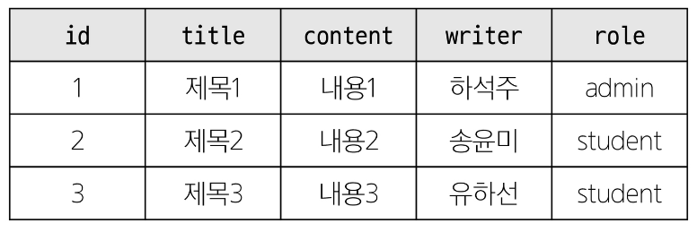

  - '하석주'가 작성한 모든 게시글을 조회하기

  - 어떤 문제점이 있을까?

    - 동명이인이 있다면 혹은 특정 데이터가 수정된다면?

      ```sql
      SELECT * FROM 테이블 WHERE writer = '하석주';
      ```

  - 테이블을 나누어서 분류하자

    

    - 각 게시글은 누가 작성했는지 알 수 있을까?

    - 작성자들의 역할은 무엇일까?

  - articles와 users 테이블에 각각 userId, roleID 외래 키 필드 작성

    

    - 관리자인 사람만 보고싶다면? → roleId가 1인 데이터 조회

    - 하석주라는 사람이 권미숙으로 개명한다면? → users에서 한번만 변경하면 자동으로 모두 변경


- JOIN이 필요한 순간

      - 테이블을 분리하면 데이터 관리는 용이해질 수 있으나 출력시에는 문제가 있음

      - 테이블 한 개 만을 출력할 수 밖에 없어 다른 테이블과 결합하여 출력하는 것이 필요해짐

      - 이때 사용하는 것이 'JOIN'


### Joining tables

#### JOIN

- **JOIN** clause

  - 둘 이상의 테이블에서 데이터를 검색하는 방법


- JOIN 종류

      1. INNER JOIN

      2. LEFT JOIN


- 사전 준비

  - users 및 articles 테이블 생성

    ```sql
    CREATE TABLE users (
      id INTEGER PRIMARY KEY AUTOINCREMENT,
      name VARCHAR(50) NOT NULL
    );
    ```

    ```SQL
    CREATE TABLE articles (
      id INTEGER PRIMARY KEY AUTOINCREMENT,
      title VARCHAR(50) NOT NULL,
      content VARCHAR(100) NOT NULL,
      userId INTEGER NOT NULL,
      FOREIGN KEY (userId)
        REFERENCES users(id)
    );
    ```

  - 각 테이블에 실습 데이터 입력

    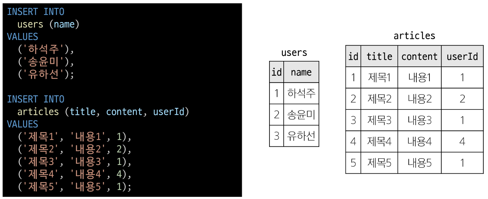


#### INNER JOIN

- **INNER JOIN** clause

  - 두 테이블에서 값이 일치하는 레코드에 대해서만 결과를 반환

    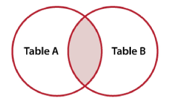


- INNER JOIN syntax

  ```sql
  SELECT
    select_list
  FROM
    table_a
  INNER JOIN table_b
    ON table_b.fk = table_a.pk;
  ```

  - FROM 절 이후 메인 테이블 지정(table_a)

  - INNER JOIN 절 이후 메인 테이블과 조인할 테이블을 지정(table_b)

  - ON 키워드 이후 조인 조건을 작성

  - 조인 조건은 table_a와 table_b 간의 레코드를 일치시키는 규칙을 지정


- INNER JOIN 예시

  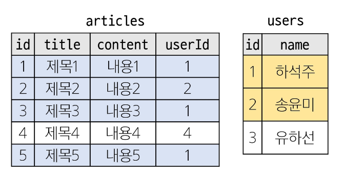

    - 작성자가 있는 (존재하는 회원) 모든 게시글을 작성자 정보와 함께 조회

  

    ```SQL
    SELECT * FROM articles
    INNER JOIN users
      ON users.id = articles.userId;
    ```


- INNER JOIN 활용 1

  - 1번 회원(하석주)가 작성한 모든 게시글의 제목과 작성자명을 조회

    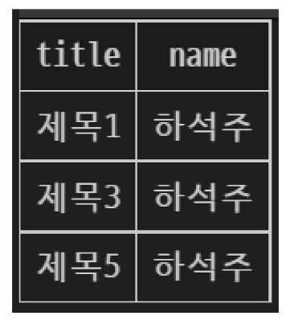

    ```SQL
    SELECT articles.title, users.name
    FROM articles
    INNER JOIN users
      ON users.id = articles.userId
    WHERE usres.id = 1;
    ```
  

#### LEFT JOIN

- **LEFT JOIN** clause

  - 오른쪽 테이블의 일치하는 레코드와 함께 왼쪽 테이블의 모든 레코드 반환

    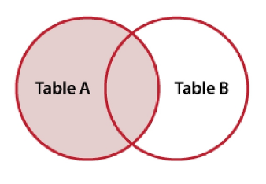


- LEFT JOIN syntax

  ```sql
  SELECT
    select_list
  FROM
    table_a
  LEFT JOIN table_b
    ON table_b.fk = table_a.pk;
  ```

  - FROM 절 이후 왼쪽 테이블 지정 (table_a)

  - LEFT JOIN 절 이후 오른쪽 테이블 지정 (table_b)

  - ON 키워드 이후 조인 조건을 작성

    - 왼쪽 테이블의 각 레코드를 오른쪽 테이블의 모든 레코드와 일치시킴


- LEFT JOIN 예시

  

    - 모든 게시글을 작성자 정보와 함께 조회

  

  ```SQL
  SELECT * FROM articles
  LEFT JOIN users
    ON users.id = articles.userId;
  ```

- LEFT JOIN 특징

  - 왼쪽 테이블의 모든 레코드를 표기

  - 오른쪽 테이블과 매칭되는 레코드가 없으면 NULL을 표시


- LEFT JOIN 활용 1

  - 게시글을 작성한 이력이 없는 회원 정보 조회

    

    ```SQL
    SELECT articles.name
    FROM users
    LEFT JOIN articles
      ON articles.userId = users.id
    WHERE artciels.userId IS NULL;
    ```
    