# 2024-11-11(월) Vue06-Vue Router

- Routing

- Vue Router
  
  - Basic Routing

  - Named Routes

  - Dynamic Route Matching

  - Nested Routes

  - Programmatic Navigation

- Navigation Guard

  - Globally Guard

  - Per-rout Guard

  - In-component Guard

- 참고
  
  - Lazy Loading Routes

---

### `Routing`

#### Routing

- 네트워크에서 경로를 선택하는 프로세스

  ⇨ 웹 애플리케이션에서 다른 페이지 간의 전환과 경로를 관리하는 기술

#### SSR에서의 Routing

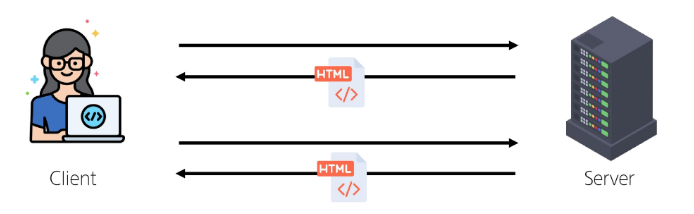

- SSR에서 rounting은 서버 측에서 수행

- 서버가 사용자가 방문한 URL 경로를 기반으로 응답을 전송

- 링크를 클릭하면 브라우저는 서버로부터 HTML 응답을 수신하고 새 HTML로 전체 페이지를 다시 로드

#### CSR에서의 Routing

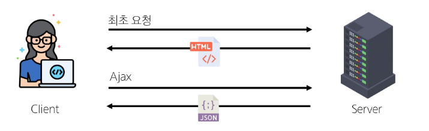

- CSR에서 routing은 **클라이언트 측**에서 수행

- 클라이언트 측 JavaScript가 새 데이터를 동적으로 가져와 전체 페이지를 다시 로드 하지 않음.

#### SPA에서 Rounting이 없다면

- 유저가 URL을 통한 페이지의 변화를 감지할 수 없음

- 페이지가 무엇을 렌더링 중인지에 대한 상태를 알 수 없음
  - URL이 1개이기 때문에 새로 고침 시 처음 페이지로 되돌아감
  - 링크를 공휴할 시 첫 페이지만 공유 가능

- 브라우저의 뒤로 가기 기능을 사용할 수 없음

  ⇨ 페이지는 1개이지만, 주소에 따라 여러 컴포넌트를 새로 렌더링하여 마치 여러 페이지를 사용하는 것처럼 보이도록 해야 함.

---

### `Vue Router`

#### Vue Router

- Vue 공식 라우터[(The official Router for Vue.js)](https://router.vuejs.org/)

#### 사전 준비

- Vite로 프로젝트 생성 시 Router 추가

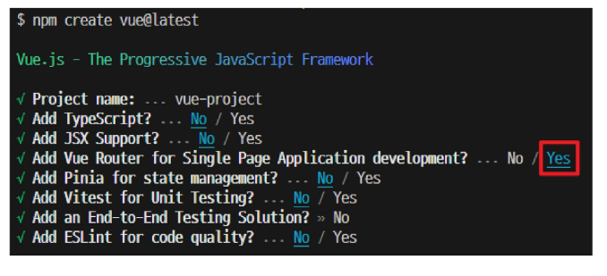

- 서버 실행 후 Router로 인한 프로젝트 변화 확인

  ⇨ **Home**, **About** 링크에 따라 변경되는 URL과 새로 렌더링 되는 화면

#### Vue 프로젝트 구조 변화

1. App.vue 코드 변화

2. router 폴더 신규 생성

3. views 폴더 신규 생성

#### RouterLink

- 페이지를 다시 로드 하지 않고 URL을 변경하여 URL 생성 및 관련 로직을 처리

- HTML의 **\<a>** 태그를 렌더링

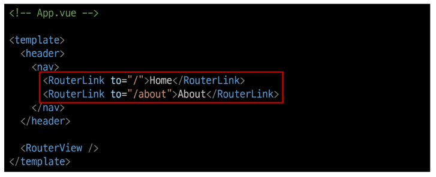

#### RouterView

- **RouterLink** URL에 해당하는 컴포넌트를 표시

- 원하는 곳에 배치하여 컴포넌트를 레이아웃에 표시할 수 있음

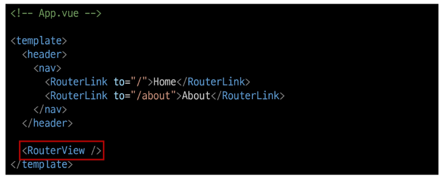

#### RouterLink 와 RouterView

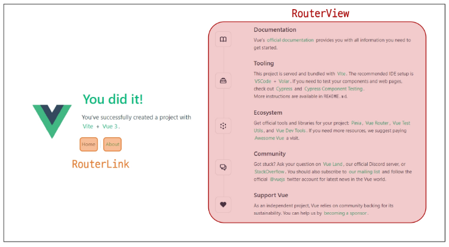

#### router/index.js

- 라우팅에 관련된 정보 및 설정이 작성되는 곳

- **router**에 URL과 컴포넌트를 매핑

#### views

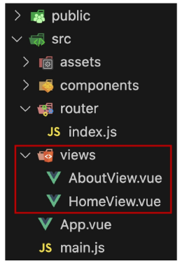

- **RouterView** 위치에 렌더링 할 컴포넌트를 배치

- 기존 **components** 폴더와 기능적으로 다른 것은 없으며 단순 분류의 의미로 구성됨

  ◈ **일반 컴포넌트와 구분하기 위해 컴포넌트 이름을 View로 끝나도록 작성하는 것을 권장**

----

### `Basic Routing`

#### 라우팅 기본

1. **index.js**에 라우터 관련 설정 작성(주소, 이름, 컴포넌트)

  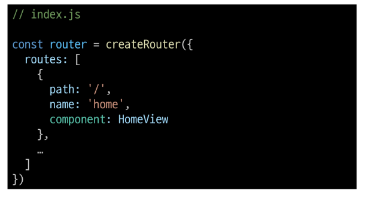

2. **RouterLink**의 'to' 속성으로 index.js에서 정의한 주소 값(path)을 사용

  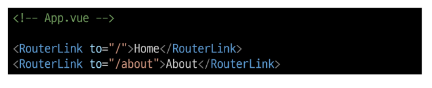

3. **RouterLink** 클릭 시 경로와 일치하는 컴포넌트가 **RouterView**에서 렌더링 됨.

  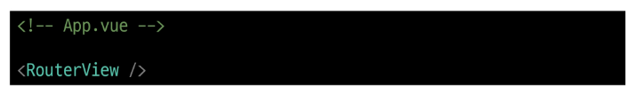

---

### `Named Routes`

#### [Named Routes](https://router.vuejs.org/guide/essentials/named-routes.html)

- 경로에 이름을 지정하는 라우팅

#### Named Routes 예시

- **name** 속성 값에 경로에 대한 이름을 지정

- 경로에 연결하려면 **RouterLink**에 **v-bind**를 사용해 **'to'** props 객체로 전달

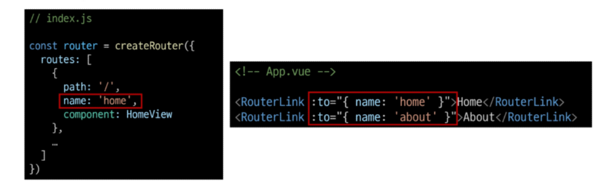

#### Named Routes 장점

- 하드 코딩 된 URL을 사용하지 않아도 됨

- URL 입력 시 오타 방지

---

### `Dynamic Route Matching`

#### [Dynamic Route Matching](https://router.vuejs.org/guide/essentials/dynamic-matching.html)

- URL의 일부를 변수로 사용하여 경로를 동적으로 매칭

#### 매개변수를 사용한 동적 경로 매칭

- 주어진 패턴 경로를 동일한 컴포넌트에 매핑 해야 하는 경우 활용

- 예를 들어 모든 사용자의 ID를 활용하여 프로필 페이지 URL을 설계한다면?

  - user/1
  - user/2
  - user/3

  ⇨ 일정한 패턴의 URL 작성을 반복해야 함

#### 매개변수를 사용한 동적 경로 매칭 활용

- **views** 폴더 내  **UserView** 컴포넌트 작성

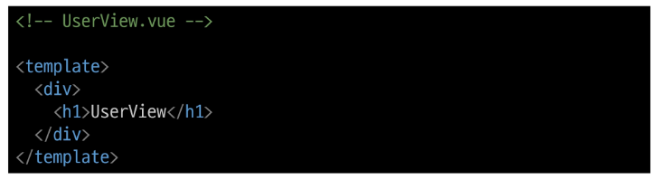

- 매개변수는 콜론("**:**")으로 표기

  ⇨ **UserView** 컴포넌트 라우트 등록

  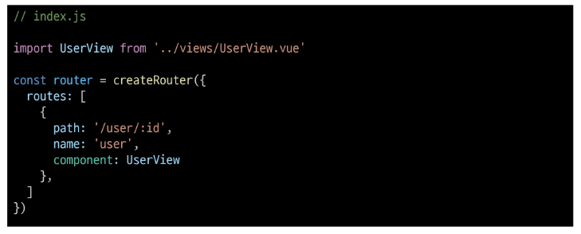

- 매개변수는 객체의 **params** 속성의 객체 타입으로 전달

- 단, 객체의 **key** 이름과 **index.js**에서 지정한 매개변수 이름이 같아야 함.

  ⇨ **UserView 컴포넌트로 이동하기 위한 **RouterLink** 작성

  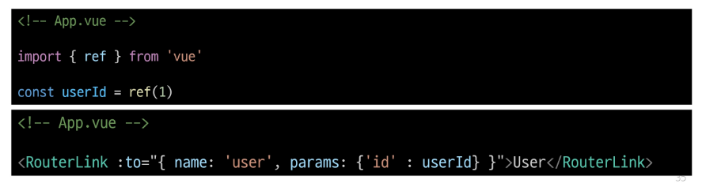

- 경로가 일치하면 라우트의 매개변수는 컴포넌트에서 **$route.params**로 참조 가능

  ⇨ 현재 사용자의 id를 출력하기

  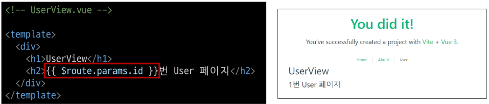

- **userRoute()** 함수를 사용해 스크립트 내에서 반응형 변수에 할당 후 템플릿에 출력하는 것을 권장

- 템플릿에서 **$route**를 사용하는 것과 동일

  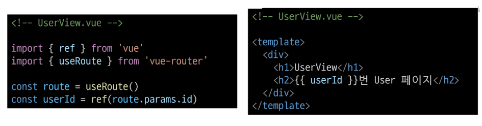

---

### `Nested Routes`

#### [Nested Routes](https://router.vuejs.org/guide/essentials/nested-routes.html#Nested-Routes)

- 중첩된 라우팅

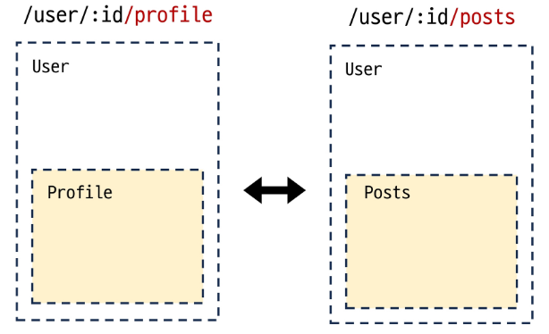

- 애플리케이션의 UI는 여러 레벨 깊이로 중첩된 컴포넌트로 구성되기도 함.

- 이 경우 URL을 중첩된 컴포넌트의 구조에 따라 변경되도록 이 관계를 표현할 수 있음

#### 중첩된 라우팅 활용

- **[1/8]** 

  - 컴포넌트 생성

  ⇨ **components** 폴더에 **UserProfile**, **UserPosts** 컴포넌트 작성

  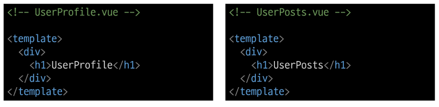

- **[2/8]** 
    - 라우터 등록

  ⇨ **index.js**에 두 컴포넌트를 **import**

  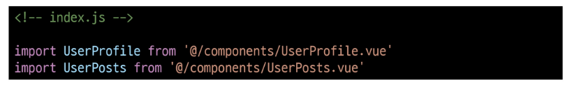

※ **children 옵션**

    children 옵션은 배열 형태로 필요한 만큼 중첩 관계를 표현할 수 있음.

- **[3/8]** 
  - **"children"** 옵션을 사용해 중첩된 라우터에 컴포넌트를 등록

  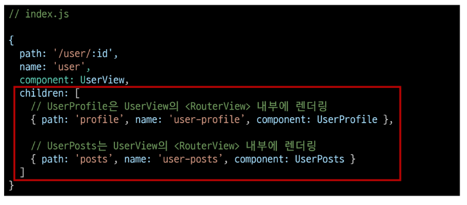

- **[4/8]** 
  - 두 컴포넌트에 대한 **RouterLink** 및 **RouterView** 작성

  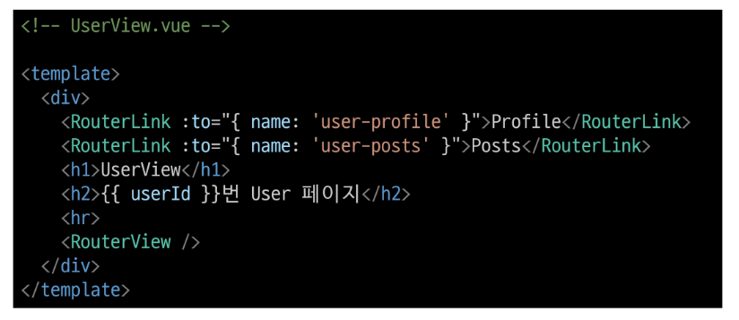

- **[5/8]** 
  - **Profile**과 **Posts**링크를 클릭해서 렌더링 결과 확인

  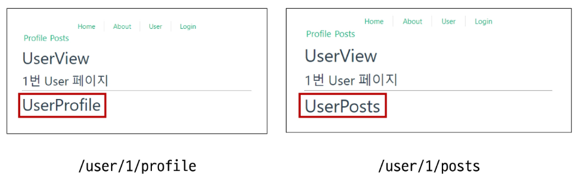

- **[6/8]** 
  - 중첩된 Name Routes를 다룰 때는 일반적으로 "하위 경로에만 이름을 지정"

  - 이렇게 하면 **/user/:id**로 이동했을 때 항상 중첩된 경로가 표시됨.

    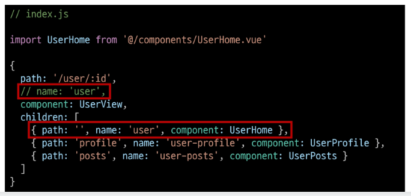

- **[7/8]**
  - **UserHome** 컴포넌트 생성

    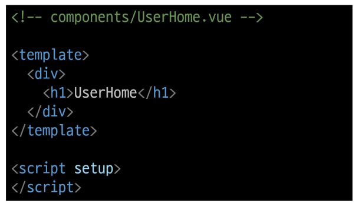

- **[8/8]**
  - 이제 **/user/:id** 접속 시 중첩된 경로가 표시

  - 단, 이전처럼 상위 경로의 이름을 유지하는 구조로 작성해도 무관

    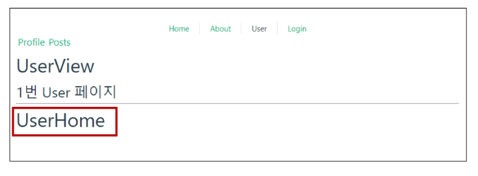

#### ※주의※ 중첩된 라우팅

- 컴포넌트 간 부모-자식 관계 관점이 아닌 URL에서의 중첩된 관계를 표현하는 관점으로 바라보기

---

### `Programmatic Navigation`

#### [Programmatic Navigation](https://router.vuejs.org/guide/essentials/navigation.html#Programmatic-Navigation)

- **RouterLink** 대신 JavaScript를 사용해 페이지를 이동하는 것

#### 프로그래밍 방식 네비게이션

- 프로그래밍으로  URL 이동하기

- **router**의 인스턴스 메서드를 사용해 **RouterLink**로 **\<a>** 태그를 만드는 것처럼 프로그래밍으로 네비게이션 관련 작업을 수행할 수 있음

#### router의 메서드

1. 다른 위치로 이동하기

  - **router.push()**

2. 현재 위치 바꾸기

  - **router.replace()**

#### `router.push()`

  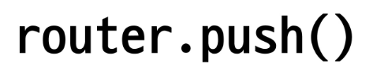

- 다른 위치로 이동하기(Navigate to a different location)

- 다른 URL로 이동하는 메서드

-  새 항목을 history stack에 push하므로 사용자가 브라우저 뒤로 가기 버튼을 클릭하면 이전 URL로 이동할 수 있음

- **RouterLink**를 클릭했을 때 내부적으로 호출되는 메서드이므로

