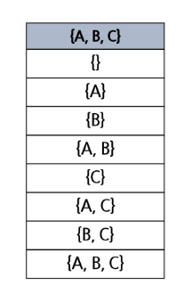
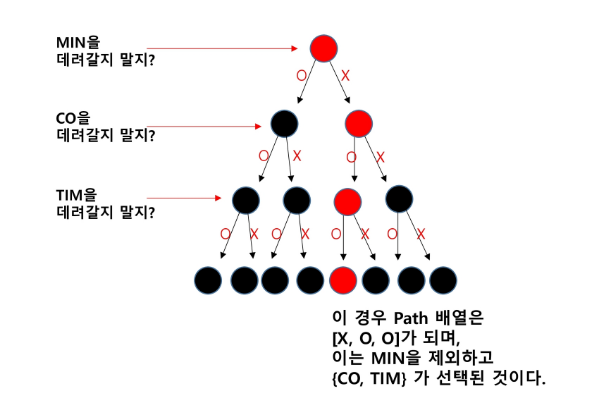
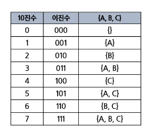
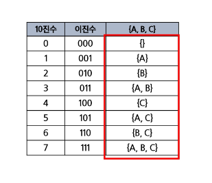
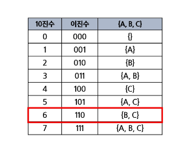
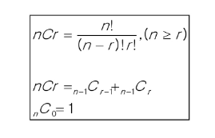

# 2024-09-03(화) APS 응용_2

- 부분집합
- 조합
- 탐욕(Greedy) 알고리즘

---
### `부분 집합`

### 부분 집합

- **집합에 포함된 원소들을 선택**하는 것이다.

- 부분 집합 예시
    - 오른쪽 표는 집합 {A, B, C}로 만들 수 있는 부분집합의 예시이다.
    - 부분집합에는 **아무것도 선택하지 않은 경우**도 집합에 포함된다.(=공집합)

        
    

- 집합에서 부분 집합을 찾아내는 구현 방법

    1. 완전탐색
        - 재귀호출을 이용한 완전탐색으로, 부분 집합을 구할 수 있다.
        - 실전 보다는 완전 탐색 **학습용으로 추천**하는 방법

    2. Binary Counting
        - 2진수 & 비트연산을 이용하여, 부분 집합을 구할 수 있다.
        - **부분 집합이 필요할 때 사용하는 추천 방법**

### 부분 집합 구현(완전 탐색)

- 완전탐색으로 부분집합 구하기

    - 민철이에게는 세 명의 친구가 있다. {MIN, CO, TIM} 함께 영화관에 갈 수 있는 멤버를 구성하고자 한다. 모든 경우를 출력해보자.

    - O, X로 집합에 포함 시킬지 말지 결정하는 완전 탐색을 이용하여 구현한다.

    

    - 구현 방법
        - Branch : 2개
        - Level : 3개
        - 친구이름을 출력하는 코드를 추가하자.

    ```python
    arr = ['O', 'X']
    path = []

    def run(lev):  # lev 번째 요소
        if lev == 3:  # 원소 3개를 고려함
            print(path)
            return

        for i in range(2):  # 후보군 (데려갈지말지)
            path.append(arr[i])  # 경로 추가
            run(level + 1)
            path.pop()  # 경로 삭제
    
    run(0)
    ```

    - 완성된 소스코드
        - 이름을 출력 코드 추가하여 부분집합 코드를 완성

    ```python
    arr = ['O', 'X']
    path = []
    name = ['MIN', 'CO','TIM']

    def print_name():
        print('{', end = '')
        for i in range(3):  # 3 : 원소의 개수
            if path[i] == 'O' :  # 저장된 경로가 'O'이면 출력
                print(name[i], end = ' ')
        print('}')

    def run(lev):
        if lev == 3:
            print_name()
            return

        for i in range(2):
            path.append(arr[i])
            run(lev + 1)
            path.pop()

    run(0)
    ```


### `부분 집합 구현(바이너리 카운팅)`

- 바이너리 카운팅(Binary Counting)

    - 원소 수에 해당하는 N개의 비트열을 이용한다.

    - 0(C) 0(B) **1(A)** 이면 {A} 임을 나타냄

    - **1(C)** **1(B)** 0(A) 이면 {B, C} 임을 나타냄

    

- 집합의 총 개수

    - 만들 수 있는 집합의 총 개수는 2ⁿ이며 n=3 이기에, 총 8개 집합이다.

    - 2ⁿ은 1 << n 공식을 이용하여 빠르게 구할 수 있음

    ```python
    print(pow(2,3))  # 8
    print(1 << 3)   # 8
    ```

    

- 0b110 이 주어지면, BC 출력하는 함수

    - 6 (0b110)에서 비트연산을 이용하여 마지막 한 자리가 1인지 0인지 검사한다.

    ```python
    arr = ['A', 'B', 'C']
    n = len(arr)

    def get_sub(tar):
        for i in range(n):
            if tar & 0x1:
                print(arr[i], end = '')
                tar >>= 1
    get_sub(6)   # 6
    ```
    - 검사한 한 자리를 제거한다. (tar >>= 1)

    

- 완성된 부분집합 코드
    - get_sub(0) ~ get_sub(7)까지 호출하여 모든 부분집합을 출력


- [도전] 친구와 카페 방문

    - 민철이는 친구 {A, B, C, D, E}가 있다. 이 중 최소 2명 이상의 친구를 선정하여 함께 카페에 가려고 한다. 총 몇 가지 경우가 가능할까?(제한시간 5분)

---

### `조합`

- 서로 다른 n개의 원소 중 r개를 *순서 없이* 골라낸 것을 `조합(combination)`이라고 부른다.

- `순열과 조합 차이`

    

    - **순열** : {A, B, C, D, E} 5명 중 1등, 2등, 3등 뽑기
        - A B C와 C B A는 다른 경우다.
    - **조합** : 5명 중 3명 뽑기
        - A B C와 C B A는 같은 경우다.

- [도전] {A, B, C, D, E} 5명 중 3명 뽑을 수 있는 모든 경우를 메모장에 적어보자.(제한시간 : 2분)

    - 힌트 : ABC ~ CDE

    - 메모장에 모든 경우를 적으면서, 규칙을 찾아 내보자.

- For 문으로 조합 구현하기

    - 5명 중 3명 뽑는 조합은 3중 for문으로 구현이 가능하다.

    ```python
    arr = ['A', 'B', 'C', 'D', 'E']

    for i in range(5):
        start1 = a + 1
        for b in range(start1, 5):
            start2 = b + 1
            for c in range(start2, 5):
                print(arr[a], arr[b], arr[c])
    ```

    - 만약 5명 중 3명을 뽑는 코드는 몇 중 for문이 필요할까?
        - 3중 for로 구현이 가능하다.

    - 만약 5명 중 n명을 뽑는 코드는 몇 중 for문이 필요할까?
        - n중 for로 구현이 가능하다. 즉, **재귀호출 구현이 필요**
        - Branch : 최대 3개
        - Level : n


    - Level = n, Branch = 5, 코드에 start 파라미터를 추가하여 조합 소스코드를 완성한다.

        1. 처음 run함수의 start 값은 0이다. 따라서 0 ~ 5 까지 반복하면서 재귀호출을 한다.

        2. 만약 i가 3이 선택되는 경우는 재귀 호출할 때 start는 4가 된다. 다음 for문은 4부터 수행한다.

- [도전] 주사위 던지기
    - 주사위 눈금 N개를 던져서 나올 수 있는 모든 조합을 출력하시오.(구현) N=3일 때 출력 결과

--- 

### `탐욕(Greedy) 알고리즘`

#### 문제를 해결하는 방법

- `Greedy(욕심장이기법, 알고리즘)` 이란?

    - 결정이 필요할 때, **현재** 기준으로 **가장 좋아 보이는 선택지로** 결정하여 답을 도출하는 알고리즘

- 대표적인 문제해결기법

    1. 완전탐색(Brute-Force)
        - 답이 될 수 있는 모든 경우를 시도해보는 알고리즘

    2. `Greedy`
        - 결정이 필요할 때 **가장 좋아보이는 선택지**로 결정하는 알고리즘

    3. DP(차후 학습 예정)
        - 현재에서 가장 좋아 보이는 것을 선택하는 것이 아니라, 과거의 데이터를 이용하여, 현재의 데이터를 만들어 내는 문제해결기법

    4. 분할정복(차후 학습 예정)
        - 큰 문제를 작은 문제로 나누어 해결하는 문제해결기법

### 그리디(동전교환 문제)

- 문제 : 동전교환

    - 아래 그림과 같이 총 네 종류의 동전이 있다. 손님의 돈을 최소한의 동전 수를 사용하여 교환해 주려고 한다. 만약 1730원을 거슬러주기 위해 사용할 수 있는 최소 동전 수는 몇 개인가?

- 1,730원을 거슬러 줄 수 있는 최소 동전의 수

    - 큰 동전부터 최대한 거슬러 주면 된다. 이 처럼, 좋아 보이는 값을 먼저 선택하는 것을 `그리디(Greedy), 욕심장이 알고리즘`이라고 한다.

    - 500원 = 3개 = 누적 1,500원

    - 100원 = 2개 = 누적 1,700원

    - 10원 = 3개 = 누적 1,730원

- 그리디로 성립하는 조건인, 10, 50, 100, 500원 동전일 때 1730원을 거슬러 주는 소스코드

```python
coin_list = [500, 100, 50, 10]
tar = 1730

cnt = 0
for coin in coin_list:
    possible_cnt = tar // coin # 사용 가능한 동전의 수(만약 500원이라면 3개 가능)

    cnt += possible_cnt  # 3개를 추가한다.
    tar -= coin * possible_cnt  # 3개로 만들 수 있는 금액인 1500원을 뺀다.

print(cnt)   #  8
```


- 아래 경우에도 가장 큰 동전부터 최대한 거슬러주면 된다.
    - 만약 동전이 5, 20, 100 단위로 존재한다. 530원을 거슬러 주기 위해서 사용해야하는 최소 동전의 수는?
    
- 문제를 해결하는데 그리디 알고리즘이 아닌, 완전탐색을 이용하는 방법

    - 0원이 될 때까지 모든 경우를 다 해본다.

    - 최소 Level이 되는 경우를 찾으면 정답이 된다.

- **그리디 알고리즘으로 동전교환 문제를 접근하면 아래 케이스에서 예외가 발생할 수 있다.(동전 10, 50, 70원)** - 나누어 떨어져야 조건 만족

    - 만약 100원을 거슬러 주어야 하는 경우, 총 몇 개의 동전이 필요한가?

        - 그리디로 접근 -> 액수가 큰 동전을 먼저 선택하면 4개이다.

        - 정답 -> 만약 50원 동전만 사용하면 정답은 2개

- 그리디가 성립하는 경우 vs 성립하지 않는 경우

    - 10, 50, 100, 500 처럼, 모든 동전이 배수 관계인 경우는 그리디가 성립한다.

    - 10, 50, 70 처럼 모든 동전이 배수 관계가 아닌 경우는 그리디가 성립하지 않는다.

        - **그리디 알고리즘은 쉬워 보이나, 예외 없이 모든 경우가 맞는 규칙인지 아닌지 증명이 어렵다.**

### 그리디(화장실 문제)

- 기숙사에는 하나의 화장실만 존재한다. A ~ D 학생은 각자의 평균 화장실 사용 시간이 다음과 같다.

    - A : 15분
    - B : 30분
    - C : 50분
    - D : 10분

- 만약 A가 먼저 화장실을 이용한다면, 나머지 인원 B, C, D는 대기를 해야한다. B, C, D 각자의 대기시간들의 총 합은 15분 X 3 = 45분이다.

- 이후, B가 화장실을 이용하는 경우 나머지 인원 C, D는 대기를 해야한다. 각자의 대기시간의 누적 합은 45분 + (30분 X 2) = 105분이다.

- 이후, C가 화장실을 이용하는 경우 나머지 D는 대기를 해야한다. 각자의 대기시간의 누적 합은 105분 + (50분 X 1) = 155분이다.

- 마지막으로 D가 화장실을 이용한다. 이 때는 아무도 기다리지 않기에, 총 대기시간의 누적 합은 155분이다.

- [도전] 이 문제는 그리디로 풀 경우, 어떤 기준으로 접근해야, 대기시간의 누접합이 최소가 될지 고민해보고 직접 구현해보자.(제한시간 : 5분)

### 그리디(0-1 Knapsack)

- 도둑은 보물들이 있는 창고에 침입하였다. 도둑은 최대 30kg까지 짐을 담아갈 수 있다. 물건의 개수(N) 그리고 물건 별 무게(W)와 가격(P)이 주어질 때, 어떤 물건을 담아야, 도둑이 최대 이득을 볼 수 있을지 구하시오.

- [도전] 이 문제를 그리디로 접근한다면, 어떤 기준으로 선택을 하는 것이 좋을까?(제한시간 : 2분)
    - 물건은 하나씩만 존재한다.
    - 최대 30kg까지 짐을 담고자 할 때, 어떤 물건을 담아야 최대로 수익을 낼 수 있는지 찾는 문제

- 이 문제는 kg 당 가치가 가장 높은 것을 먼저 담으면 안된다.

    - 0-1 Knapsack을 그리디로 접근하면 안되는 예외 케이스가 존재한다.

    - 0-1 Knapsack 문제는 그리디로 해결할 수 없다. 완전탐색 or DP로 접근해야한다.


### 그리디(Fractional Knapsack)

- Fractional Knapsack 문제
    - 0-1 Knapsack과 달리, 물건을 원하는 만큼 자를 수 있는 Knapsack 문제


- Fractional Knapsack 문제 해결 방법
    - 그리디가 성립한다.
    - Kg 당 가격이 가장 높은 물건을 최대한 담으면 된다.
    - 최대 수익
        - 가장 Kg당 금액이 높은 물건 1, 전체 사용(50만원)
        - +두번째로 Kg당 금액이 높은 물건3, 전체 사용(140만원)
        - +세번째로 Kg당 금액이 높은 물건2, 나머지 모두 사용(5Kg만 사용, 30만원)
        - = 50 + 140 + 30 = 220만원

- Fractional Knapsack 소스코드


### 그리디(회의실 배정)

- 회의실이 하나인 회사가 있다. 여러 팀들이 원하는 회의실 예약 시간이 주어질 때, 가능한 많은 회의가 열리기 위해서는 회의들을 어떻게 배정해야 할까?

    - 희망 회의 개수, 시작시간, 종료 시간을 입력 받는다.

- [도전] 무엇을 기준으로 회의를 선택해야 최대한 많은 횟수의 회의가 될지 고민해보자.(제한시간 : 2분)
    - 이 문제는 그리디로 가능한 문제이다.

- 문제 해결 방법
    - 회의 종료 시간이 가장 빠른 회의를 먼저 선택하면 된다.


### 활동 선택(Activity-selection problem) 문제

- 다른 예시
    - 총 10개의 회의 요청이 존재한다.

    - 먼저, 종료시간 기준으로 10개의 회의들을 오름차순 정렬한다.
    - 종료시간이 가장 빠른 회의를 찾자 마자, 확정시킨다.
    - 이제는 4시 이후로 부터 회의가 가능하다.
    - 4시 이후에 가능한 회의 중, 가장 빨리 끝나는 회의를 찾아 확정한다.
    - 이제부터는 7시 이후로 회의가 가능하다.
    - 7시 이후에 가능한 회의 중, 가장 빨리 끝나는 회의를 찾아 확정한다.
    - 11시 이후에 가능한 회의 중, 가장 빨리 끝나는 회의를 찾아 확정한다.

- 회의실 문제 전략
    1. 끝나는 시간을 기준으로 오름차순 정렬한다.
    2. 빠르게 끝나는 회의를 선택하여 확정한다.
    3. 이후로 가능한 회의 중, 빠르게 끝나는 회의를 선택하여 확정한다.

---

## 연습 문제
### 연습문제3. 부분집합의 합
- 부분집합 합 문제 구현하기
    - 아래의 10개의 정수 집합에 대한 모든 부분 집합 중 원소의 합이 0이 되는 부분 집합을 모두 출력하시오.
        - {-1, 3, -9, 6, 7, -6, 1, 5, 4, -2}