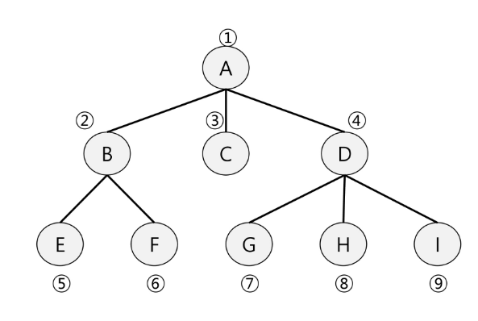

# 2024-08-14(수) Queue 02

- BFS
- BFS 예제

---

#### `BFS(Breadth First Search)`

- 깊이 우선 탐색(Depth First Search, DFS)
- 너비 우선 탐색(Breadth First Search, BFS)

- `너비우선탐색`은 탐색 시작점의 인접한 정점들을 먼저 모두 차례로 방문한 후에 방문했던 정점을 시작점으로 하여 다시 인접한 정점들을 차례로 방문하는 방식

- 인접한 정점들에 대해 탐색을 한 후, 차례로 다시 너비 우선탐색을 진행해야 하므로, 선입선출 형태의 자료구조인 `큐(Queue)`를 활용함.




```python

'''
7 8
4 2 1 2 1 3 5 2 4 6 5 6 6 7 3 7
'''

def bfs(s, V):  # 시작정점 s, 마지막 정점 V
    visited = [0] * (V+1)   # visited 생성
    q = []          # 큐 생성
    q.append(s)     # 시작점 인큐
    visited[s] = 1  # 시작점 방문표시
    while q:        # 큐에 정점이 남아있으면 front != rear
        t = q.pop(0)    # 디큐
        print(t)        # 방문한 정점에서 할일
        for w in adj_l[t]:  # 인접한 정점 중 인큐되지 않은 정점 w가 있으면
            if visited[w]==0:
                q.append(w)     # w인큐, 인큐되었음을 표시
                visited[w] = visited[t] + 1

V, E = map(int, input().split()) # 1번부터 V번 정점, E개의 간선
arr = list(map(int, input().split()))

# 인접리스트 -------------------------
adj_l = [[] for _ in range(V+1)]
for i in range(E):
    v1, v2 = arr[i*2], arr[i*2+1]
    adj_l[v1].append(v2)
    adj_l[v2].append(v1)    # 방향이 없는 경우
# 여기까지 인접리스트 -----------------

bfs(1, 7)

```
