# 2024-08-28(수) Tree_2

- 이진탐색 트리
- 힙

---

### 이진탐색 트리

#### BST(Binary Search Tree) 자료 구조

- Data들을 빠르게 검색할 수 있또록 체계적으로 저장을 해 두고, 최대 O (log n)의 빠른 속도로 값을 검색하 룻 있는 자료구조

- 빠르게 검색될 수 있도록, 특정 규칙을 갖는 이진트리 형태로 값을 저장해둔다.


#### 리스트 vs BST

- **BST는 리스트 보다 더 빠른 삽입 / 삭제 / 탐색이 가능하다.**

- 리스트 성능
  - 삽입 : O(n), 단 맨 끝 삽입은 O(1)
  - 삭제 : O(n), 단 맨 끝 삭제는 O(1)
  - 탐색 : O(n)

- BST 성능
  - 삽입 : 평균 O(log N)
  - 삭제 : 평균 O(log N)
  - 탐색 : 평균 O(log N)

```
- 파이썬 공식 Library에는 Binary Search Tree 자료구조가 내장되어 있지 않아 직접 구현해서 사용해야 한다.
```

#### BST 동작 원리 - 삽입

① `Insert(3) 수행 시 내부 동작`
  - 처음 등장하는 값은, root에 저장된다.
  
  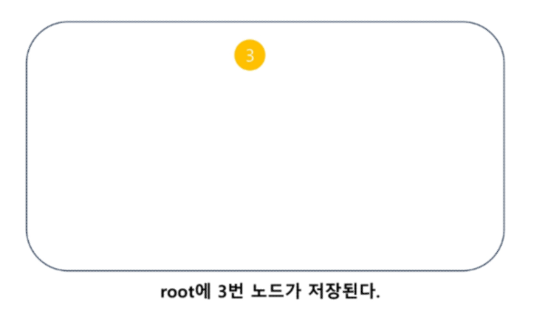

  - 비교할 노드 값 보다, traget 더 큰 경우 우측 자식 노드로 배정되고, 그렇지 않으면 왼쪽 자식 노드로 배정된다.

② `Insert(5)을 진행해보자.`

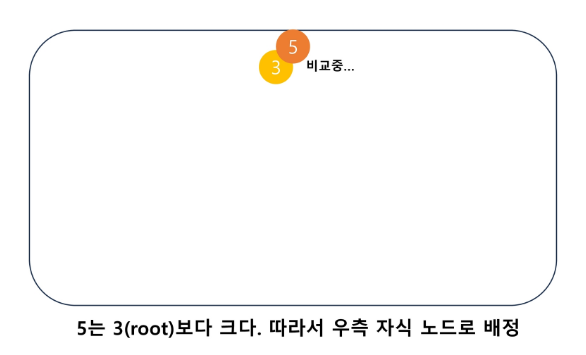

③ `Insert(5) 수행 완료`

  - 값 5는 root 노드의 값 3보다 크기 때문에, 우측 자식 노드로 배정되었다.
  
  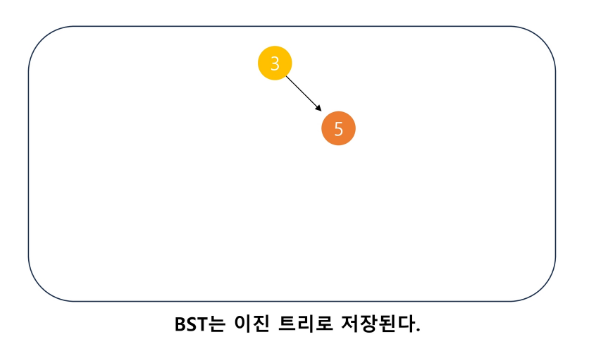


④ `Insert(1) 수행 중...`

  - 값 1은 root 노드의 값과 비교하여, 왼쪽 또는 오른쪽 자식 노드로 배정되어야 한다.

    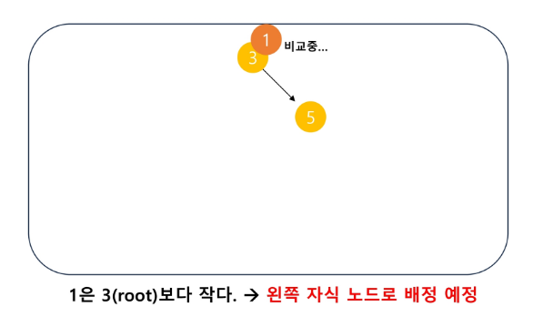

⑤ `Insert(1) 수행 완료`

  - 값 1은, root의 왼쪽 자식 노드로 배정되었다.
 
   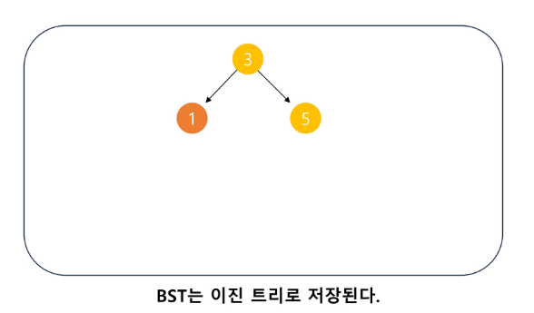

⑥ `Insert(2)`
  
  - root부터 시작하여, 자기 자리를 찾아 배치된다.

   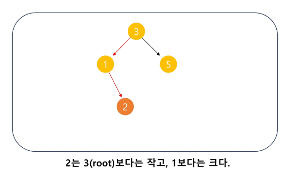

⑦ `Insert(7)`

   - root부터 시작하여, 자기 자리를 찾아 배치된다.

   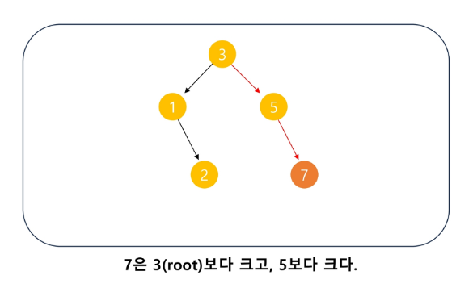

⑧ `Insert(4)`

  - root부터 시작하여, 자기 자리를 찾아 배치된다.

    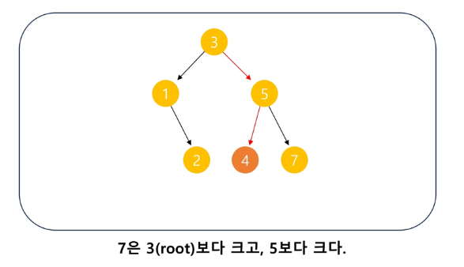

⑨ `Insert(-5)`

  - root부터 시작하여, 자기 자리를 찾아 배치된다.

    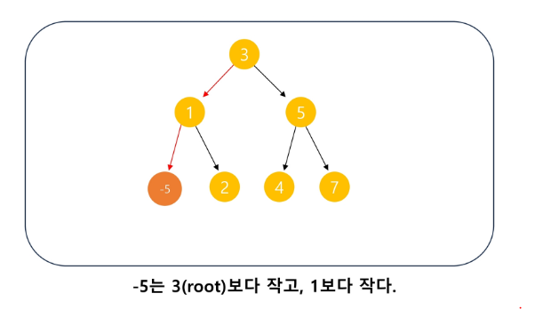


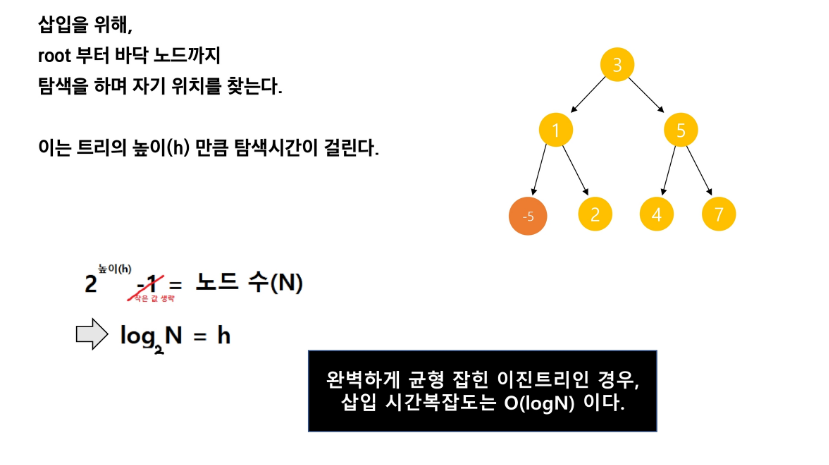

#### BST 탐색 방법

- 탐색연산
  
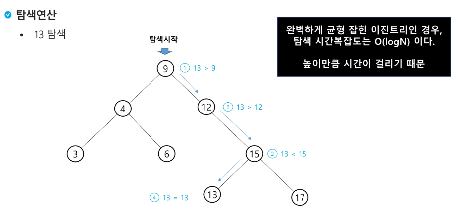

#### BST 동작 원리 - 순회

- BST에서 DFS 중위순회를 하게 되면 Key 값이 작은 순서대로 탐색이 가능하다.

  - 중위순회의 쉬운 이해 : 편지 전달
    - 각 노드는 세 가지 미션을 순서대로 수행 해야 한다.
      - 미션 1 : 왼쪽 노드로 편지를 즉시 전달한다.
      - 미션 2 : 왼쪽 노드로 부터 편지를 돌려 받는다면, 편지를 읽는다. **(탐색한다.)**
      - 미션 3 : 편지를 읽은 후에는, 오른쪽 노드로 편지를 전달한다.
    - dummy 노드는 편지르 받자마자, 즉시 되돌려준다. 세 가지 미션을 모두 수행한 노드는, 상위 노드에게 편지를 되돌려준다.
  

#### 이진 탐색 트리 - 성능

- 탐색(searching), 삽입(insertion), 삭제(deletion) 시간은 트리의 높이만큼 시간이 걸린다.
  - O(h), h : BST의 깊이(height)

- 평균의 경우
  - 이진 트리가 균형적으로 생성되어 있는 경우
  - O(log n)

- 최악의 경우
  - 한쪽으로 치우친 경사 이진트리의 경우
  - O(n)
  - 순차탐색과 시간복잡도가 같다.

#### 이진 탐색 트리 - 연산 연습

##### 삭제 연산

  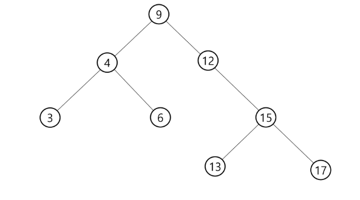

  - 삭제연산에 대해 알고리즘을 생각해 봅시다.
  - 다음 틀에 대하여 13, 12, 9를 차례로 삭제해 보자. (자식의 개수에 따라 다르게 동작)

    1) 리프노드(자식 0) => 그냥 삭제 가능
    2) 자식이 하나 => 자식을 부모로 연결 후 삭제
    3) 자식이 둘 => 삭제하고자 하는 노드의 왼쪽 서브트리의 **가장 큰 값**이나 오른쪽 서브트리의 **가장 작은 값** 

    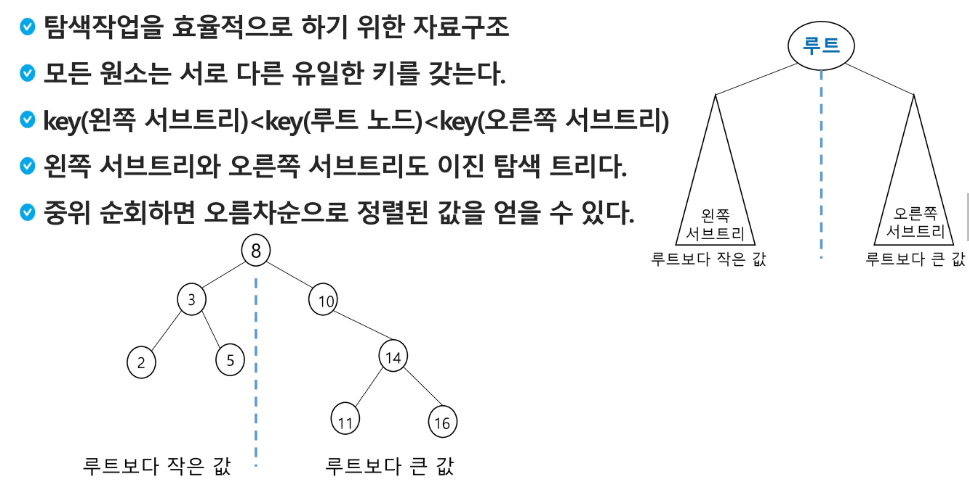

---

### 힙(Heap)

```

- 완전 이진 트리에 있는 노드 중에서 키 값이 가장 큰 노드나 키 값이 가장 작은 노드를 찾기 위해서 만든 자료 구조

- 최대 힙(max heap)
    - 키 값이 가장 큰 노드를 찾기 위한 완전 이진 트리
    - {부모노드의 키값 > 자식 노드의 키 값}
    - 루트 노드 : 키 값이 가장 큰 노드

- 최소 힙(min heap)
    - 키 값이 가장 작은 노드를 찾기 위한 완전 이진 트리
    - {부모노드의 키 값 < 자식노드의 키 값}
    - 루트 노드 : 키 값이 가장 작은 노드

```

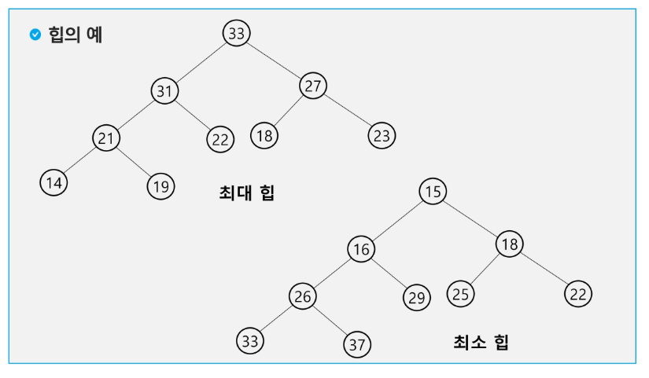

- 힙의 특징

  1. 완전 이진 트리

  2. 부모 노드 > 자식 노드

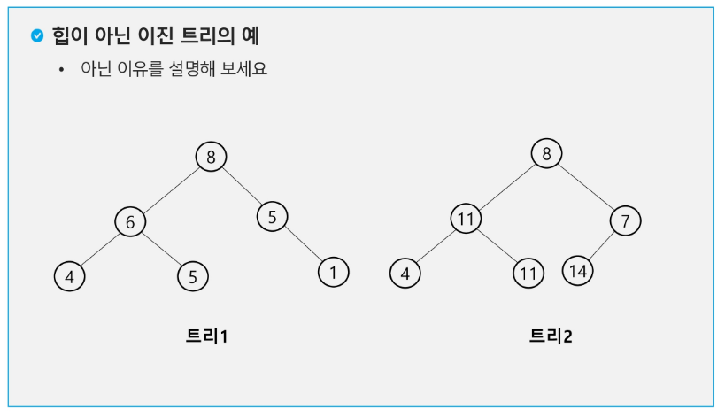


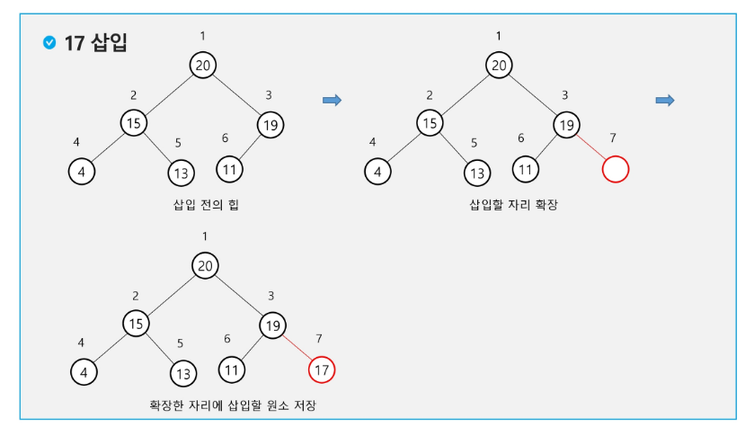

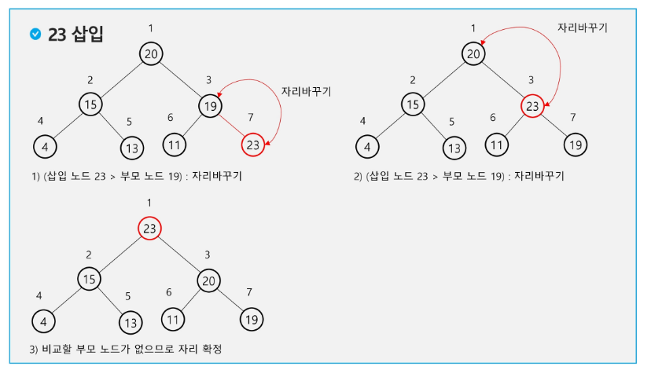

- 힙에서는 루트 노드의 원소만을 삭제할 수 있다.

- 루트 노드의 원소를 삭제하여 반환한다.

- 힙의 종류에 따라 최대값 또는 최소값을 구할 수 있다.

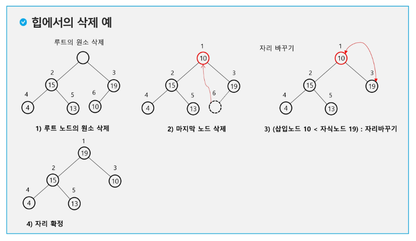

#### 힙을 이용한 우선순위 큐(우선순위가 높은 데이터부터 확인 가능)

- 완전 이진 트리로 구현된 자료구조로서, 키 값이 가장 큰 노드나 가장 작은 노드를 찾기에 적합한 자료구조

- 아래의 예는 최소 힙(Min heap)으로서, 가장 작은 키값을 가진 노드가 항상 루트에 위치한다.

    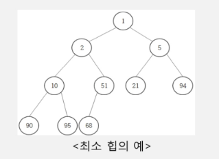

- 힙의 키를 우선순위로 활용하여 **우선순위 큐**를 구현할 수 있다.

- [관련링크](https://pages.cs.wisc.edu/~vernon/cs367/notes/11.PRIORITY-Q.html)
