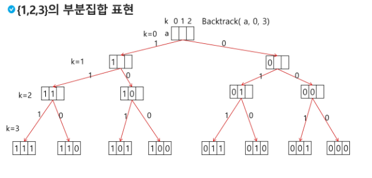

# 2024-08-09(금) Stack2 - 02

- 백트래킹
    - 부분집합
    - 

---

#### `부분집합`

- 어떤 집합의 공집합과 자기자신을 포함한 모든 부분집합을 powerset이라고 하며 구하고자 하는 어떤 집합의 원소 개수가 n일 경우 부분집합의 개수는 2ⁿ개이다.

- 백트래킹 기법으로  powerset을 만들어 보자.
    - 앞에서 설명한 일반적인 백트래킹 접근 방법을 이용한다.
    - n개의 원소가 들어있는 집합의 2ⁿ개의 부분집합을 만들 때는, true 또는 false값을 가지는 항목들로 구성된 n개의 배열을 만드는 방법을 이용.
    - 여기서 배열의 i번째 항목은 i번째의 원소가 부분집합의 값인지 아닌지를 나타내는 값이다.

- 각 원소가 부분집합에 포함되었는지를 loop 이용하여확인하고 부분집합을 생성하는 방법

```python
bit = [0, 0, 0, 0]
for i in range(2): 
    bit[0] = i   # 0번째 원소
    for j in range(2):
        bit[1] = j   # 1번째 원소
        for k in range(2):
            bit[2] = k   # 2번째 원소
            for q in range(2):
                bit[3] = q    # 3번째 원소
                print(bit)  # 생성된 부분집합 출력
```





---

#### `순열`

- 예) 집합{1, 2, 3}에서 모든 순열을 생성하는 함수
    - 동일한 숫자가 포함되지 않았을 때, 각 자리 수 별로 loop을 이용해 아래와 같이 구현할 수 있다.

```python
for i1 in range(1, 4):
    for i2 in range(1, 4):
        if i2 != i1:
            for i3 in range(1, 4):
                if i3 != i1 and i3 != i2:
                    print(i1, i2, i3)
```