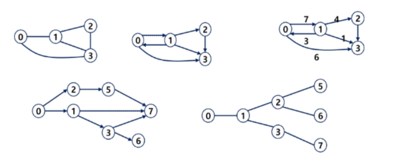
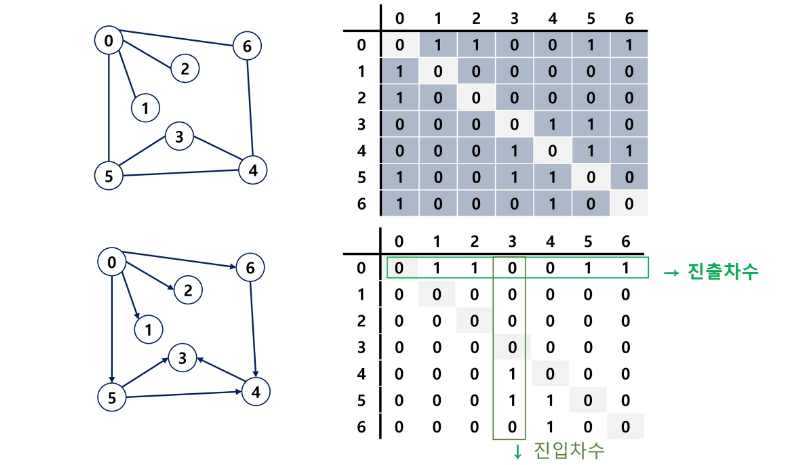
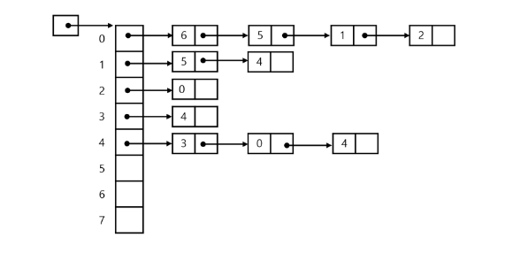
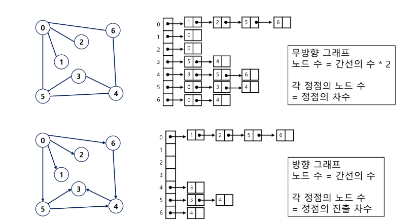
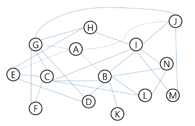
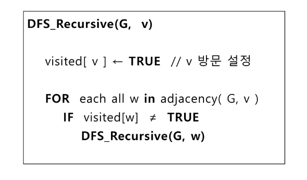

# 2024-09-10(화) APS_응용_Graph

- 그래프 기본
- DFS
- BFS
- Union-Find(Disjoint set)

---

<학습목표>

- 실세계 문제를 그래프로 추상화해서 해결하는 방법을 학습한다.

- 그래프 탐색 기법인 BFS와 DFS에 대해 학습한다.

- 그래프 알고리즘에 활용되는 상호배타 집합(Disjoint-Sets)의 자료구조에 대해 학습한다.

---

### `그래프 기본`

#### 그래프

- 그래프는 아이템(사물 또는 추상적 개념)들과 이들 사이의 연결 관계를 표현한다.

- 그래프는 정점(Vertex)들의 집합과 이들을 연결하는 간선(Edge)들의 집합으로 구성된 자료 구조

    - |V| : 정점의 개수, |E| : 그래프에 포함된 간선의 개수
    
    - |V| 개의 정점을 가지는 그래프는 최대 |V|(|V| - 1)/2 간선이 가능

        예) 5개의 정점이 있는 그래프의 최대 간선 수는 10(=5*4/2)개이다.

- 선형 자료구조나 트리 자료구조로 표현하기 어려운 N:N 관계를 가지는 원소들을 표현하기에 용이하다.

#### 그래프 유형

- 무향 그래프(Undirected Graph)

- 유향 그래프(Directed Graph)

- 가중치 그래프(Weighted Graph)

- 사이클 없는 방향 그래프(DAG, Directed Acyclic Graph)

    

- 완전 그래프 : 정점들에 대해 가능한 모든 간선들을 가진 그래프

    

- 부분 그래프 : 원래 그래프에서 일부의 정점이나 간선을 제외한 그래프

#### 인접 정점

- `인접(Adjacency)`

    - 두 개의 정점에 간선이 존재(연결됨)하면 서로 인접해 있다고 한다.

    - 완전 그래프에 속한 임의의 두 정점들은 모두 인접해 있다.

    

#### 그래프 경로

- `경로`란 간선들을 순서대로 나열한 것

    - 간선들 : (0,2), (2,4), (4,6)

    - 정점들 : 0 - 2 - 4 -6

- 경로 중 한 정점을 최대한 한번만 지나는 경로를 **단순경로**라 한다.

    - 0 - 2 - 4 - 6, 0 - 1 - 6

- 시작한 정점에서 끝나는 경로를 **사이클(Cycle)**이라고 한다.

    - 1 - 3 - 5 - 1

    

#### 그래프 표현

- 간선의 정보를 저장하는 방식, 메모리나 성능을 고려해서 결절

- `인접 행렬(Adjacent matrix)`

    - |V| x |V| 크기의 2차원 배열을 이용해서 간선 정보를 저장

    - 배열의 배열(포인터 배열) => "연결이 안되어있다"라는 정보도 함께 저장

    - 장점 : 연결 여부를 한 번에 탐색할 수 있다.
    - 단점 : 메모리 낭비가 심하다.

- `인접 리스트(Adjacent List)`

    - 각 정점마다 해당 정점으로 나가는 간선(연결된 정보)의 정보를 저장

    - 장점 : 메모리 활용이 효율적.
    - 단점 : 연결 정보 확인이 어려움.

- 간선의 배열

    - 간선(시작 정점, 끝 정점)을 배열에 연속적으로 저장

#### 인접행렬

- 두 정점을 연결하는 간선의 유무를 행렬로 표현

    - |V| x |V| 정방 행렬

    - 행 번호와 열 번호는 그래프의 정점에 대응

    - 두 정점이 인접되어 있으면 1, 그렇지 않으면 0으로 표현

    - 무향 그래프
        - i번째 행의 합 = i번째 열의 합 = Vi의 차수

    - 유향 그래프

        - 행 i의 합 = Vi의 진출 차수

        - 열 i의 합 = Vi의 진입 차수

    
    

#### 인접 리스트

- 각 정점에 대한 인접 정점들을 순차적으로 표현

- 하나의 정점에 대한 인접 정점들을 각각 노드로 하는 연결 리스트로 저장

    

    

---

### `DFS`

#### [문제제시] : 친구관계

- 다음과 같이 친구 관계를 그래프로 표현하였다.

- A로부터 시작해서 한 명의 친구에게만 소식을 전달, 전달 할 수 있다면 최대 몇 명의 친구가 소식을 전달 받을 수 있을까? (단, 소식을 전달 받은 친구한테는 소식을 재 전달 할 수 없다.)

- A로부터 시작해서 친구들에게 동시에 소식을 전달할 수 있다고 할 때, 가장 늦게 전달 받는 사람은 누구일까? (단, 친구에게 소식을 전달하는 속도는 동일하다.)

    

#### 그래프 순회(탐색)

- 그래프 순회는 비선형구조인 그래프로 표현된 모든 자료(정점)를 빠짐없이 탐색하는 것을 의미한다.

- 두 가지 방법

    - 깊이 우선 탐색(Depth First Search, DFS)

    - 너비 우선 탐색(Breadth First Search, BFS)

#### DFS(깊이우선탐색)

- 시작 정점의 한 방향으로 갈 수 있는 경로가 있는 곳까지 깊이 탐색해 가다가 더 이상 갈 곳이 없게 되면, 가장 마지막에 만났던 갈림길 간선이 있는 정점으로 *되돌아와서* 다른 방향의 정점으로 탐색을 계속 반복하여 결국 모든 정점을 방문하는 순회방법

- 가장 마지막에 만났던 갈림길의 정점으로 되돌아가서 다시 깊이 우선 탐색으로 반복해야 하므로 후입선출 구조의 `스택` 사용

##### DFS 알고리즘 - 재귀

