# 2024-09-10(화) APS\_응용\_Graph

- 그래프 기본
- DFS
- BFS
- Union-Find(Disjoint set)

---

<학습목표>

- 실세계 문제를 그래프로 추상화해서 해결하는 방법을 학습한다.

- 그래프 탐색 기법인 BFS와 DFS에 대해 학습한다.

- 그래프 알고리즘에 활용되는 상호배타 집합(Disjoint-Sets)의 자료구조에 대해 학습한다.

---

### `그래프 기본`

#### 그래프

- 그래프는 아이템(사물 또는 추상적 개념)들과 이들 사이의 연결 관계를 표현한다.

- 그래프는 정점(Vertex)들의 집합과 이들을 연결하는 간선(Edge)들의 집합으로 구성된 자료 구조

  - |V| : 정점의 개수, |E| : 그래프에 포함된 간선의 개수

  - |V| 개의 정점을 가지는 그래프는 최대 |V|(|V| - 1)/2 간선이 가능

    예) 5개의 정점이 있는 그래프의 최대 간선 수는 10(=5\*4/2)개이다.

- 선형 자료구조나 트리 자료구조로 표현하기 어려운 N:N 관계를 가지는 원소들을 표현하기에 용이하다.

#### 그래프 유형

- 무향 그래프(Undirected Graph)

- 유향 그래프(Directed Graph)

- 가중치 그래프(Weighted Graph)

- 사이클 없는 방향 그래프(DAG, Directed Acyclic Graph)

  

- 완전 그래프 : 정점들에 대해 가능한 모든 간선들을 가진 그래프

  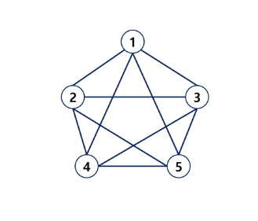

- 부분 그래프 : 원래 그래프에서 일부의 정점이나 간선을 제외한 그래프

#### 인접 정점

- `인접(Adjacency)`

  - 두 개의 정점에 간선이 존재(연결됨)하면 서로 인접해 있다고 한다.

  - 완전 그래프에 속한 임의의 두 정점들은 모두 인접해 있다.

  
   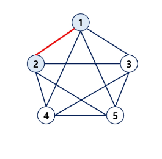

#### 그래프 경로

- `경로`란 간선들을 순서대로 나열한 것

  - 간선들 : (0,2), (2,4), (4,6)

  - 정점들 : 0 - 2 - 4 -6

- 경로 중 한 정점을 최대한 한번만 지나는 경로를 **단순경로**라 한다.

  - 0 - 2 - 4 - 6, 0 - 1 - 6

- 시작한 정점에서 끝나는 경로를 **사이클(Cycle)**이라고 한다.

  - 1 - 3 - 5 - 1

  

#### 그래프 표현

- 간선의 정보를 저장하는 방식, 메모리나 성능을 고려해서 결절

- `인접 행렬(Adjacent matrix)`

  - |V| x |V| 크기의 2차원 배열을 이용해서 간선 정보를 저장

  - 배열의 배열(포인터 배열) => "연결이 안되어있다"라는 정보도 함께 저장

  - 장점 : 연결 여부를 한 번에 탐색할 수 있다.
  - 단점 : 메모리 낭비가 심하다.

- `인접 리스트(Adjacent List)`

  - 각 정점마다 해당 정점으로 나가는 간선(연결된 정보)의 정보를 저장

  - 장점 : 메모리 활용이 효율적.
  - 단점 : 연결 정보 확인이 어려움.

- 간선의 배열

  - 간선(시작 정점, 끝 정점)을 배열에 연속적으로 저장

#### 인접행렬

- 두 정점을 연결하는 간선의 유무를 행렬로 표현

  - |V| x |V| 정방 행렬

  - 행 번호와 열 번호는 그래프의 정점에 대응

  - 두 정점이 인접되어 있으면 1, 그렇지 않으면 0으로 표현

  - 무향 그래프

    - i번째 행의 합 = i번째 열의 합 = Vi의 차수

  - 유향 그래프

    - 행 i의 합 = Vi의 진출 차수

    - 열 i의 합 = Vi의 진입 차수

  

#### 인접 리스트

- 각 정점에 대한 인접 정점들을 순차적으로 표현

- 하나의 정점에 대한 인접 정점들을 각각 노드로 하는 연결 리스트로 저장

  

  

---

### `DFS`

#### [문제제시] : 친구관계

- 다음과 같이 친구 관계를 그래프로 표현하였다.

- A로부터 시작해서 한 명의 친구에게만 소식을 전달, 전달 할 수 있다면 최대 몇 명의 친구가 소식을 전달 받을 수 있을까? (단, 소식을 전달 받은 친구한테는 소식을 재 전달 할 수 없다.)

- A로부터 시작해서 친구들에게 동시에 소식을 전달할 수 있다고 할 때, 가장 늦게 전달 받는 사람은 누구일까? (단, 친구에게 소식을 전달하는 속도는 동일하다.)

  

#### 그래프 순회(탐색)

- 그래프 순회는 비선형구조인 그래프로 표현된 모든 자료(정점)를 빠짐없이 탐색하는 것을 의미한다.

- 두 가지 방법

  - 깊이 우선 탐색(Depth First Search, DFS)

  - 너비 우선 탐색(Breadth First Search, BFS)

#### DFS(깊이우선탐색)

- 시작 정점의 한 방향으로 갈 수 있는 경로가 있는 곳까지 깊이 탐색해 가다가 더 이상 갈 곳이 없게 되면, 가장 마지막에 만났던 갈림길 간선이 있는 정점으로 _되돌아와서_ 다른 방향의 정점으로 탐색을 계속 반복하여 결국 모든 정점을 방문하는 순회방법

- 가장 마지막에 만났던 갈림길의 정점으로 되돌아가서 다시 깊이 우선 탐색으로 반복해야 하므로 후입선출 구조의 `스택` 사용

##### DFS 알고리즘 - 재귀


##### [연습문제1] - DFS

- 다음은 연결되어 있는 두 개의 정점 사이의 간선을 순서대로 나열 해 놓은 것이다. 모든 정점을 깊이 우선 탐색하여 화면에 깊이 우선 탐색 경로를 출력하시오. 시작 정점을 1로 시작하시오.

  - 1, 2, 1, 3, 2, 4, 2, 5, 6, 5, 6, 6, 7, 3, 7

  - 출력 결과의 예는 다음과 같다.

  - 1 - 2 - 4 - 6 - 5 - 7 - 3
  - 1 - 3 - 7 - 6 - 5 - 2 - 4

  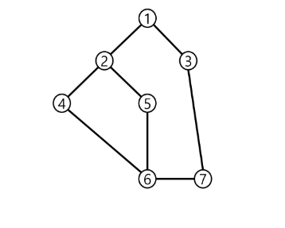

```python
'''
7 8
1 2
1 3
2 4
2 5
4 6
5 6
6 7
3 7
'''
# 시작점 : 1번부터 시작
# 끝점 : 1번에서 갈 수 있는 모든 정점을 방문하면 종료(visited 처리 덕분에, 기저조건 없이도 자연스럽게 종료됨)
def dfs(node):
    print(node, end=' ') # 현재 노드를 출력

    # 현재 정점에서 연결되어있는 노드들을 탐색
    # graph[node][::-1] : 숫자가 큰 노드부터 탐색(후보군을 뒤집어 주면 된다.)
    for next_node in graph[node]:
        if visited[next_node]:  # 이미 방문했다면 통과
            continue

        visited[next_node] = 1  # 방문 처리
        dfs(next_node)          # 다음 정점으로 이동


N, M = map(int, input().split())

# 비어있는 리스트를 N+1번 반복하면서 생성
# 1. 비어있는 리스트 : 아직 갈 수 있는 곳이 없다.
# 2. N + 1번 : 0번 인덱스를 버린다. (문제에서 노드번호가 1번부터 시작)
#  # --> 인접리스트를 만들기 위해 아래와 같이 정의
graph = [[] for _ in range(N+1)]

# graph = [[0] * (N+1) for _ in range(N+1)]  #인접행렬 예시

visited = [0]*(N+1)

# 연결 정보를 저장

for _ in range(M):
    s, e = map(int,input().split())

    # 양방향 그래프이므로, 시작 <-> 끝점을 바꾸면서 저장

    graph[s].append(e)
    graph[e].append(s)  # 문제가 방향 그래프라면, 바꾼 정보를 저장하면 버그난다!

visited[1] = 1  # 방문 처리
dfs(1)

```

---

### `BFS`

#### BFS(Breadth First Search)

- 너비 우선 탐색은 탐색 시작점의 인접한 정점들을 먼저 모두 차례로 방문한 후에, 방문했던 정점을 시작점으로 하여 다시 인접한 정점들을 차례로 방문하는 방식

- 인접한 정점들에 대해 탐색을 한 후, 차례로 다시 너비 우선 탐색을 진행해야 하므로, 선입선출 형태의 자료구조인 `큐`를 활용함

- BFS는 예제 그래프를 붙여진 번호 순서로 탐색함

  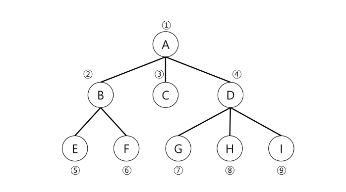

### 연습문제2 - BFS

- 다음은 연결되어 있는 두 개의 정점 사이의 간선을 순서대로 나열 해 놓은 것이다. 모든 정점을 너비 우선 탐색하여 화면에 너비 우선 탐색 경로를 출력하시오. 시작 정점을 1로 시작하시오.

  - 1, 2, 1, 3, 2, 4, 2, 5, 4, 6, 5, 6, 6, 7, 3, 7

  - 출력 결과의 예는 다음과 같다.

  - 1-2-3-4-5-7-6

  

```python

def bfs(node):
    q = [node]  # 선입선출 구조인 Queue 처럼 활용할 것이다.

    # q에 저장되는 데이터 : 다음에 처리할 데이터(후보군)
    while q:  # 갈 수 있는 곳이 없을 때까지
        now = q.pop(0)  # 가장 앞에 있는 데이터를 뽑는다.
        print(now, end = ' ')  # 현재 노드 출력


        # 현재 정점에서 인접한 정점들을 확인
        for next_node in graph[now]:
            if visited[next_node]:  # 이미 방문한 정점이면 통과
                continue

            visited[next_node] = 1  # 방문처리
            q.append(next_node)    # 후보군에 추가(순서가 되면 처리해주세요.)


# 그래프를 만드는 코드는 DFS와 BFS가 똑같다
# 핵심 : 무슨 노드를 먼저 탐색할 것인가!
#   - 갈 수 있으면 끝까지 가자 : DFS
#   - 특정 정점을 기준으로 퍼져나가면서 확인하자 : BFS

N, M = map(int, input().split())

# 비어있는 리스트를 N+1번 반복하면서 생성
# 1. 비어있는 리스트 : 아직 갈 수 있는 곳이 없다.
# 2. N + 1번 : 0번 인덱스를 버린다. (문제에서 노드번호가 1번부터 시작)
#  # --> 인접리스트를 만들기 위해 아래와 같이 정의
graph = [[] for _ in range(N+1)]

# graph = [[0] * (N+1) for _ in range(N+1)]  #인접행렬 예시

visited = [0]*(N+1)

# 연결 정보를 저장

for _ in range(M):
    s, e = map(int,input().split())

    # 양방향 그래프이므로, 시작 <-> 끝점을 바꾸면서 저장

    graph[s].append(e)
    graph[e].append(s)  # 문제가 방향 그래프라면, 바꾼 정보를 저장하면 버그난다!

visited[1] = 1  # 방문 처리
bfs(1)

```

---

### `Union-Find(Disjoint set)`

#### 서로소 집합(Disjoint-sets)

- 서로소 또는 상호배타 집합들은 **서로 중복 포함된 원소가 없는 집합들**이다. 다시 말해 교집합이 없다.

- 집합에 속한 하나의 특정 멤버를 통해 각 집합들을 구분한다. 이를 `대표자(representative)`라 한다.

- 상호배타 집합을 표현하는 방법

  - 연결 리스트

  - 트리

- 상호배타 집합 연산

  - Make-Set(x) : 초기설정

  - Find-Set(x) : 대표자가 누구니?

  - Union(x, y) : 같은 그룹으로 묶어라

- 상호배타 집합 예

  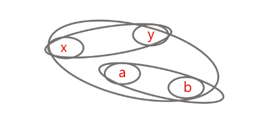

  - Make-Set(x)

  - Make-Set(y)

  - Make-Set(a)

  - Make-Set(b)

  - Union(x, y)

  - Union(a, b)

  - Find-Set(y) return x (representative)

  - Find-Set(b) return a (representative)

  - Union(x, a)

### 상호배타 집합 표현 - 연결리스트

- 같은 집합의 원소들은 하나의 연결리스트로 관리한다.

- 연결리스트의 맨 앞의 원소를 집합의 대표 원소로 삼는다.

- 각 원소는 집합의 대표원소를 가리키는 링크를 갖는다.

  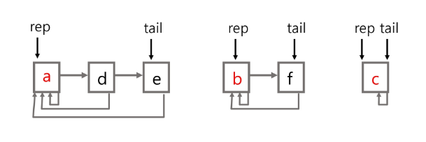

- 연결리스트 연산 예

  - Find-Set(e) return a

  - Find-Set(f) return b

  - Union(a, b)

  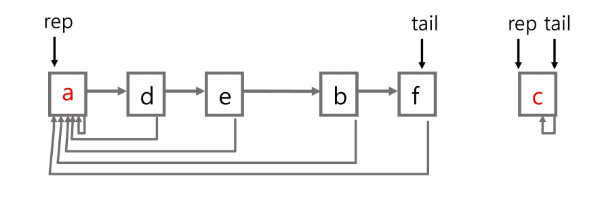

### 상호배타 집합 표현 - 트리

- 하나의 집합(a disjoint set)을 하나의 트리로 표현한다.

- 자식 노드가 부모 노드를 가리키며 루트 노드가 대표자가 된다.

  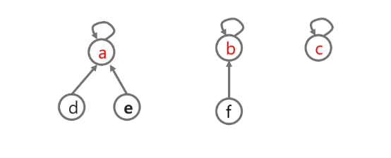

- 연산 예

  - Make-Set(a) ~ Make-Set(f)

    

  - Union(c, d), Union(e, f)

    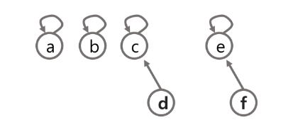

  - Union(d, f) : 대표자가 바라봄

    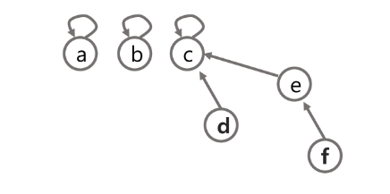

  - Find-Set(d) return c

  - Find-Set(e) return c

- 상호배타 집합을 표현한 트리의 배열을 이용한 저장된 모습

  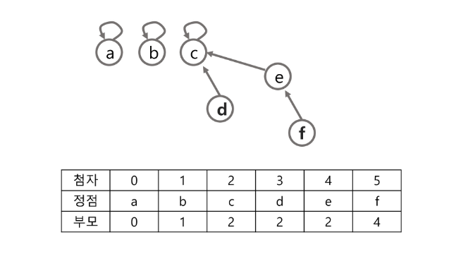

### 상호배타 집합에 대한 연산

- `Make-Set(x)` : 유일한 멤버 x를 포함하는 새로운 집합을 생성하는 연산(자기자신을 대표자로 선정)

  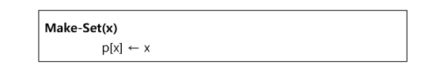

- Find_Set(x) : x를 포함하는 집합을 찾는 연산

  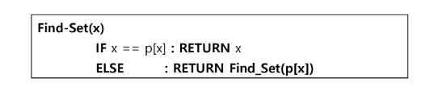

- Union(x, y) : x와 y를 포함하는 두 집합을 통합하는 연산

  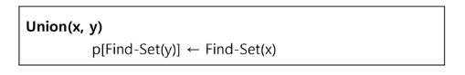

- [참고]

  - Find_Set(x) : x를 포함하는 집합을 찾는 연산(반복)

  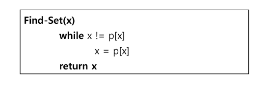

```python
def make_set(n):
    p = [i for i in range(n)]  # 각 원소의

def find(x):
    if parents[x] == x: # x 자기자신이 x를 바라본다 == 해당 집합의 대표자를 찾았다
        return x

    # x의 부모가 가리키고 있는 정점부터 다시 대표자를 탐색
    return find(panrents[x])


def union(x, y):
    # x와 y의 대표자를 찾자.
    root_x = find(x)
    root_y = find(y)

    if root_x == root_y:  # 이미 같은 집합이면 끝
        return

    # 다른 집합이라면 더 작은 루트노드에 합친다.
    if root_x < root_y:
        parents[y] = root_x  # y가 바라보는 부모는 x의 대표자
    else:
        parents[x] = root_y

# 예제 사용법
n = 7  # 원소의 개수
parents = make_set(n) # 집합생성. parents에 부모 정보들을 저장

union(1, 3)
union(2, 3)
union(5, 6)


print(parents) # 대표자의 수 == 집합의 수

print('find_set(6)=', find(6))

target_x = 2
target_y = 3

# 원소 1과 원소 2가 같은 집합에 속해 있는지 확인

if find(target_x) == find(target_y):
    print(f'원소 {target_x}과 원소 {target_y}는 같은 집합에 속해 있습니다.')

else:
    print(f'원소 {target_x}과 원소 {target_y}는 다른 집합에 속해 있습니다.')


```

- 문제점

  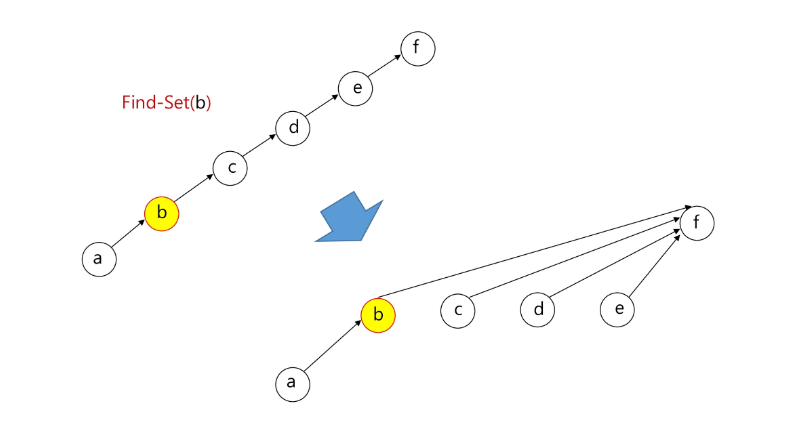

- 연산의 효율을 높이는 방법

  - Rank를 이용한 Union

    - 각 노드는 자신을 루트로 하는 subtree의 높이를 랭크Rank라는 이름으로 저장한다.

    - 두 집합을 합칠 때 rank가 낮은 집합을 rank가 높은 집합에 붙인다.

  - Path compression

    - Find-Set을 행하는 과정에서 만나는 모든 노드들이 직접 root를 가리키도록 포인터를 바꾸어 준다.

- 랭크를 이용한 Union의 예

- 랭크를 이용한 Union에서 랭크가 증가하는 예

- Path Compression의 예

- Make_Set() 연산

  - Make_Set(x) : 유일한 멤버 x를 포함하는 새로운 집합을 생성하는 연산

- Find_Set 연산

  - Find_Set(x) : x를 포함하는 집합을 찾는 오퍼레이션

  - Find_Set 연산은 특정 노드에서 루트까지의 경로를 찾아 가면서 노드의 부모 정보를 갱신한다.

- Union 연산
  - Union(x, y) : x와 y를 포함하는 두 집합을 통합하는 오퍼레이션
