# 2024-10-10(목) DB01_SQL

- Database


- Relational Database

  - RDMBS


- Single Table Queries

  - Querying data
  - Sorting data
  - Filtering data
  - Grouping data


- Managing Tables

  - Create a table
  - Modifying table fields
  - Delete a table


- Modifying Data

  - Insert data
  - Update data
  - Delete data


- Multi table queries

  - Join
  - Joining tables


## Database

- 데이터베이스

  - 체계적인 데이터 모음


- 데이터

  - 저장이나 처리에 효율적인 형태로 변환된 정보


- 증가하는 데이터 사용량

      - 배달의 민족 국낸 주문 건수 6억 8천만 건(2020)

      - 구독자 2억 3840만명이 1000억 시간 넷플릭스 시청(2023 1~6월)

      - 전세계 모든 데이터의 약 90%는 2015년 이후 생산된 것(IBM)


- 데이터 센터의 성장

      - 네이버 - 제2데이터센터에 6500억 투자(2020)

      - 카카오 - 제1데이터센터와 제2데이터센터에 1.5조 투자(2022)

      - 전 세계 데이터 센터 시장 2022년부터 2026년까지 연평균 20% 이상 성장 예정


#### 데이터를 저장하고 잘 관리하여 활용할 수 있는 기술이 중요해짐

  - 우리가 알고 있는 데이터 저장 방식은 어떤 것이 있을까?


- 기존의 데이터 저장 방식

      1. 파일(File) 이용

      2. 스프레드 시트(Spreadsheet) 이용


1. 파일을 이용한 데이터 관리

  - 어디에서나 쉽게 사용 가능

  - 데이터를 구조적으로 관리하기 어려움

    


2. 스프레드 시트를 이용한 데이터 관리

  - 테이블의 열과 행을 사용해데이터를 구조적으로 관리 가능

    


- 스프레드 시트의 한계

  - 크기

    - 일반적으로 약 100만 행까지만 저장가능

  - 보안

    - 단순히 파일이나 링크 소유 여부에 따른 단순한 접근 권한 기능 제공

  - 정확성

    - 만약 공식적으로 "강원"의 지명이 "강언"으로 바뀌었다고 가정한다면?

    - 이 변경으로 인해 테이블 모든 위치에서 해당 값을 업데이트 해야 함

    - 찾기 및 바꾸기 기능을 사용해 바꿀 수 있지만 만약 데이터가 여러 시트에 분산되어 있다면 변경에 누락이 생기거나 추가 문제가 발생할 수 있음

      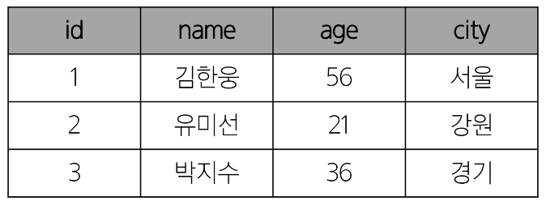


- 데이터베이스 역할

  - 데이터를 저장하고 조작(CRUD)


## Relational Database

- 데이터베이스 역할

  - 데이터를 **저장(구조적 저장)** 하고 조작(CRUD)


- 관계형 데이터베이스

  - 데이터 간에 **관계**가 있는 데이터 항목들의 모음


- 관계형 데이터베이스

  - 테이블, 행, 열의 정보를 구조화하는 방식

  - **서로 관련된 데이터 포인터를 저장**하고 이에 대한 **액세스**를 제공

    

    


- 관계

  - 여러 테이블 간의 (논리적) 연결


- 관계로 할 수 있는 것

  - 이 관계로 인해 두 테이블을 사용하여 데이터를 다양한 형식으로 조회할 수 있음

    - 특정 날짜에 구매한 모든 고객 조회

    - 지난 달에 배송일이 지연된 고객 조회 등

      


- 관계형 데이터베이스 예시1

  - 다음과 같이 고객 데이터가 테이블에 저장되어 있다고 가정

  - 고객 데이터 간 비교를 위해서는 어떤 값을 활용해야 할까?

    - 이름? 주소? 만약 동명이인이나 같은 주소지가 있다면?

      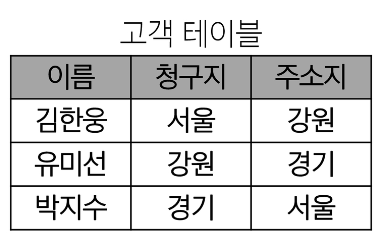

    - 각 데이터에 고유한 식별 값을 부여하기 **(기본 키, Primary Key)**

      


- 관계형 데이터베이스 예시2

  - 다음과 같이 각 고객이 주문한 주문데이터가 테이블에 저장되어 있다고 가정

  - 누가 어떤 주문을 했는지 어떻게 식별할 수 있을까?

    - 고객 이름? 마찬가지로 동명이인이 있다면?

      

    - 주문 정보에 고객의 고유한 식별 값을 저장하기 **(외래 키, Foreign Key)**

      


- 관계형 데이터베이스 관련 키워드

  1. Table (aka Relation)

    - 데이터를 기록하는 곳

      

  2. Field (aka Column, Attribute)

    - 각 필드에는 고유한 데이터 형식(타입)이 지정됨

      

  3. Record (aka Row, Tuple)

    - 각 레코드에는 구체적인 데이터 값이 저장됨

      

  4. Database (aka Schema)

    - 테이블의 집합

      

  5. Primary Key (기본 키, PK)

    - 각 레코드의 고유한 값

    - 관계형 데이터베이스에서 **레코드의 식별자**로 활용

      

  6. Foreign Key (외래 키, FK)

    - 테이블의 필드 중 다른 테이블의 레코드를 식별할 수 있는 키

    - 다른 테이블의 기본 키를 참조

    - 각 레코드에서 서로 다른 테이블 간의 **관계를 만드는 데** 사용

      


### RDMBS

- DBMS(Database Management System)

  - 데이터베이스를 관리하는 소프트웨어 프로그램


- DBMS

      - 데이터 저장 및 관리를 용이하게 하는 시스템

      - 데이터베이스와 사용자 간의 인터페이스 역할

      - 사용자가 데이터 구성, 업데이터, 모니터링, 백업, 복구 등을 할 수 있도록 도움


- RDBMS(Relational Database Management System)

  - 관계형 데이터베이스를 관리하는 소프트웨어 프로그램


- RDBMS 서비스 종류

      - SQLite

      - MySQL

      - PostgreSQL

      - Oracle Database

      - ...


- SQLite

  - 경량의 오픈 소스 데이터베이스 관리 시스템
  
  - 컴퓨터나 모바일 기기에 내장되어 간단하고 효율적인 데이터 저장 및 관리를 제공


- 데이터베이스 정리

      - Table은 데이터가 기록되는 곳

      - Table에는 행에서 고유하게 식별 가능한 기본 키라는 속성이 있으며, 외래 키를 사용하여 각 행에서 서로 다른 테이블 간의 관계를 만들 수 있음

      - 데이터는 기본 키 또는 외래 키를 통해 결합(join)될 수 있는 여러 테이블에 걸쳐 구조화 됨


## SQL

- SQL(Structure Query Language)

  - 테이블의 형태로 **구조화**된 관계형 데이터베이스에게 요청을 **질의(요청)**

  - 데이터베이스에 정보를 저장하고 처리하기 위한 프로그래밍 언어


- SQL

  - 관계형 데이터베이스와의 대화를 위해 사용하는 프로그래밍 언어

    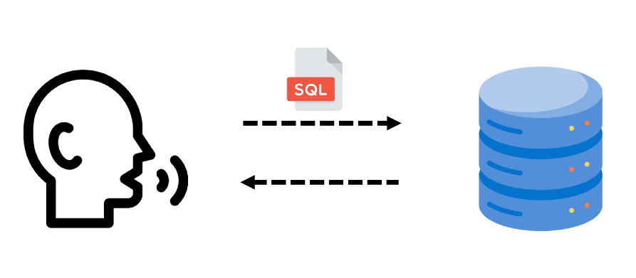


- SQL Syntax

  ```sql
  SELECT column_name FROM table_name;
  ```

  1. SQL 키워드는 대소문자를 구분하지 않음
  
      - 하지만 대문자로 작성하는 것을 권장 (명시적 구분)

  2. 각 SQL Statements의 끝에는 세미콜론(';')이 필요

      - 세미콜론은 각 SQL Statements을 구분하는 방법 (명령어의 마침표)


### SQL Statements

- SQL Statements

  - SQL을 구성하는 가장 기본적인 코드 블록


- SQL Statements 예시

  ```sql
  SELECT column_name FROM table_name;
  ```

  - 해당 예시 코드는 SELECT Statement라 부름

  - 이 Statement는 SELECT, FROM 2개의 keyword로 구성 됨


- 수행 목적에 따른 SQL Statements 4가지 유형

      1. DDL - 데이터 정의

      2. DQL - 데이터 검색
      
      3. DML - 데이터 조작

      4. DCL - 데이터 제어

  |유형|역할|SQL 키워드|
  |:--:|:--:|:--:|
  |DDL<br>(Data Definition Language)|데이터의 기본 구조 및<br>형식 변경|**CREATE**<br>**DROP**<br>**ALTER**|
  |DQL<br>(Data Query Language)|데이터 검색|**SELECT**|
  |DML<br>(Data Manipulation Language)|데이터 조작<br>(추가, 수정, 삭제)|**INSERT**<br>**UPDATE**<br>**DELETE**|
  |DCL<br>(Data Control Language)|데이터 및 작업에 대한<br>사용자 권한 제어|**COMMIT**<br>**ROLLBACK**<br>**GRANT**<br>**REVOKE**|
  <br>


- SQL 학습

      - 단순히 SQL 문법을 암기하고 상황에 따라 실행만 하는 것이 아닌 SQL을 통해 관계형 데이터베이스를 잘 이해하고 다루는 방법을 학습


## 참고

- Query

      - "데이터베이스로부터 정보를 요청" 하는 것

      - 일반적으로 SQL로 작성하는 코드를 쿼리문(SQL문)이라 함


- SQL 표준

      - SQL은 미국 국립 표준 협회(ANSI)와 국제 표준화 기구(ISO)에 의해 표준이 채택됨

      - 모든 RDBMS에서 SQL 표준을 지원

      - 다만 각 RDBMS마다 독자적인 기능에 따라 표준을 벗어나는 문법이 존재하니 주의


## Single Table Queries

- SQL Statements 유형

  |유형|역할|SQL 키워드|
  |:--:|:--:|:--:|
  |DDL<br>(Data Definition Language)|데이터의 기본 구조 및<br>형식 변경|**CREATE**<br>**DROP**<br>**ALTER**|
  |DQL<br>(Data Query Language)|데이터 검색|**SELECT**|
  |DML<br>(Data Manipulation Language)|데이터 조작<br>(추가, 수정, 삭제)|**INSERT**<br>**UPDATE**<br>**DELETE**|
  |DCL<br>(Data Control Language)|데이터 및 작업에 대한<br>사용자 권한 제어|**COMMIT**<br>**ROLLBACK**<br>**GRANT**<br>**REVOKE**|
  <br>


### Querying data

#### SELECT

- **SELECT** statement

  - 테이블에서 데이터를 조회


- SELECT syntax

  ```sql
  SELECT
    select_list
  FROM
    table_name;
  ```

  - SELECT 키워드 이후 데이터를 선택하려는 필드를 하나 이상 지정

  - FROM 키워드 이후 데이터를 선택하려는 테이블의 이름을 지정


- SELECT 활용 1

  - 테이블 employees에서 LastName 필드의 모든 데이터를 조회

    

    ```sql
    SELECT
      LastName
    FROM
      employees;
    ```


- SELECT 활용 2

  - 테이블 employees에서 LastName, FirstName 필드의 모든 데이터를 조회

    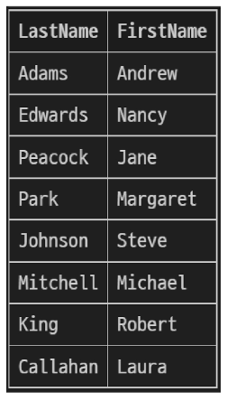

    ```sql
    SELECT
      LastName, FirstName
    FROM
      employees;
    ```


- SELECT 활용 3

  - 테이블 employees에서 모든 필드 데이터를 조회

    

    ```sql
    SELECT
      *
    FROM
      employees;
    ```


- SELECT 활용 4

  - 테이블 employees에서 FirstName 필드의 모든 데이터를 조회(단, 조회 시 FirstName이 아닌 '이름'으로 출력 될 수 있도록 변경)

    

    ```sql
    SELECT
      FirstName AS '이름'
    FROM
      employees;
    ```


- SELECT 활용 5

  - 테이블 tracks에서 Name, Milliseconds 필드의 모든 데이터 조회(단, Milliseconds 필드는 60000으로 나눠 분 단위 값으로 출력)

    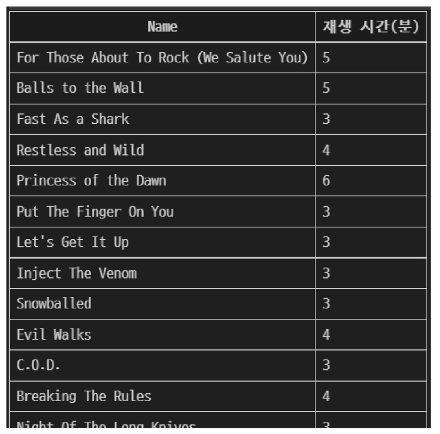

    ```sql
    SELECT
      Name,
      Milliseconds / 60000 AS '재생 시간(분)'
    FROM
      tracks;
    ```


- SELECT 정리

      - 테이블의 데이터를 조회 및 반환

      - '*'(asterisk)를 사용하여 모든 필드 선택


### Sorting data

#### ORDER BY

- **ORDER BY** statement

  - 조회 결과의 레코드를 정렬


- ORDER BY syntax

  ```sql
  SELECT
    select_list
  FROM
    table_name
  ORDER BY
    column1 [ASC|DESC],
    column2 [ASC|DESC],
    ...;
  ```

  - FROM clause 뒤에 위치

  - 하나 이상의 컬럼을 기준으로 결과를 오름차순(ASC, 기본 값), 내림차순(DESC)으로 정렬


- ORDER BY 활용 1

  - 테이블 employees에서 FirstName 필드의 모든 데이터를 오름차순으로 조회

    

    ```sql
    SELECT
      FirstName
    FROM
      employees
    ORDER BY
      FirstName;
    ```


- ORDER BY 활용 2

  - 테이블 employees에서 FirstName 필드의 모든 데이터를 내림차순으로 조회

    

    ```sql
    SELECT
      FirstName
    FROM
      employees
    ORDER BY
      FirstName DESC;
    ```


- ORDER BY 활용 3

  - 테이블 customers에서 Country 필드를 기준으로 내림차순 정렬한 다음 City 필드 기준으로 오름차순 정렬하여 조회

    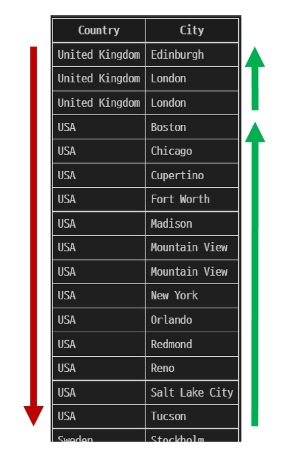

    ```sql
    SELECT
      Country, City
    FROM
      customers
    ORDER BY
      Country DESC, City;
    ```


- ORDER BY 활용 4

  - 테이블 tracks에서 Milliseconds 필드를 기준으로 내림차순 정렬한 다음 Name, Millliseconds 필드의 모든 데이터를 조회(단, Milliseconds 필드는 60,000으로 나눠 분 단위 값으로 출력)

    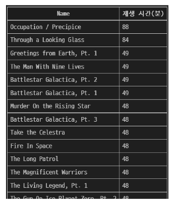

    ```sql
    SELECT
      Name,
      Milliseconds / 60000 AS '재생 시간(분)'
    FROM
      tracks
    ORDER BY
      Milliseconds DESC;
    ```


- 정렬에서의 NULL

  - NULL 값이 존재할 경우 오름차순 정렬 시 결과에 NULL이 먼저 출력

    ```SQL
    SELECT
      ReportsTo
    FROM
      employees
    ORDER BY
      ReportsTo;
    ```

    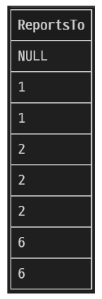


- SELECT statement 실행 순서

  - FROM ⇨ SELECT ⇨ ORDER BY

  1. 테이블에서(FROM)

  2. 조회하여(SELECT)

  3. 정렬(ORDER BY)


### Filtering data

  |Clause|Operator|
  |:---|:---|
  |- **DISTINCT**<br>- **WHERE**<br>- **LIMIT**|- **BETWEEN**<br>- **IN**<br>- **LIK**E<br>- Comparison<br>- Logical|
  <br>


#### DISTINCT

- **DISTINCT** statement

  - 조회 결과에서 중복된 레코드를 제거


- DISTINCT syntax

  ```sql
  SELECT DISTINCT
    select_list
  FROM
    table_name;
  ```

  - SELECT 키워드 바로 뒤에 작성해야 함

  - SELECT DISTINCT 키워드 다음에 고유한 값을 선택하려는 하나 이상의 필드를 지정


- DISTINCT 활용 1

  - 테이블 customers에서 Country 필드의 모든 데이터를 오름차순 조회

    

    ```sql
    SELECT
      Country
    FROM
      customers
    ORDER BY
      Country;
    ```


- DISTINCT 활용 2

  - 테이블 customers에서 Country 필드의 모든 데이터를 중복없이 오름차순 조회

    

    ```sql
    SELECT DISTINCT
      Country
    FROM
      customers
    ORDER BY
      Country;
    ```


#### WHERE

- **WHERE** statement

  - 조회 시 특정 검색 조건을 지정


- WHERE syntax

  ```sql
  SELECT
    select_list
  FROM
    table_name
  WHERE
    search_condition;
  ```

  - FROM clause 뒤에 위치

  - search_condition은 비교연산자 및 논리연산자(AND, OR, NOT 등)를 사용하는 구문이 사용됨


- WHERE 활용 1

  - 테이블 customers에서 City 필드 값이 'Prague'인 데이터의 LastName, FirstName, City 조회

    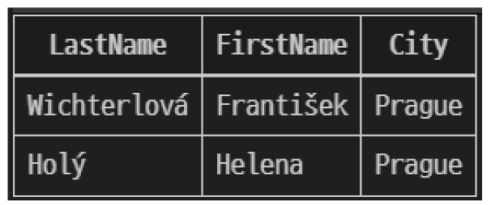

    ```sql
    SELECT
      LastName, FirstName, City
    FROM
      customers
    WHERE
      City = 'Prague;
    ```


- WHERE 활용 2

  - 테이블 customers에서 City 필드 값이 'Prague'가 아닌 데이터의 LastName, FirstName, City 조회

    

    ```sql
    SELECT
      LastName, FistName, City
    FROM
      customers
    WHERE
      City != 'Prague';
    ```


- WHERE 활용 3

  - 테이블 customers에서 Company 필드 값이 NULL이고 Country 필드 값이 'USA'인 데이터의 LastName, FirstName, Company, Country 조회

    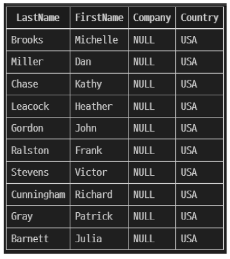

    ```sql
    SELECT
      LastName, FirstName, Company, Country
    FROM
      customers
    WHERE
      Company IS NULL
      AND Country = 'USA';
    ```


- WHERE 활용 4

  - 테이블 customers에서 Company 필드 값이 NULL이거나 Country 필드 값이 'USA'인 데이터의 LastName, FirstName, Company, Country 조회

    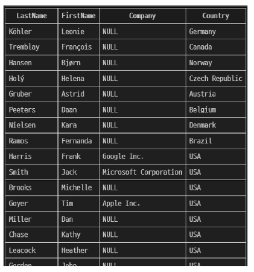

    ```sql
    SELECT
      LastName, FirstName, Company, Country
    FROM
      customers
    WHERE
      Company IS NULL
      OR Country = 'USA';
    ```


- WHERE 활용 5

  - 테이블 tracks에서 Bytes 필드 값이 10,000 이상 500,000 이하인 데이터의 Name, Bytes 조회

    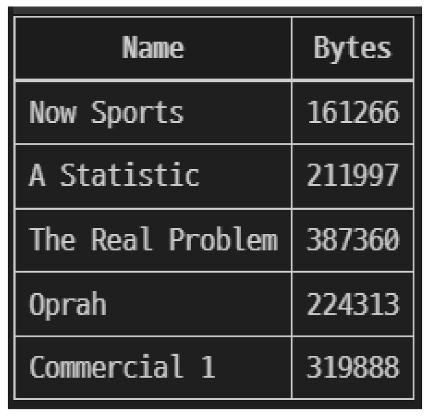

    ```sql
    SELECT
      Name, Bytes
    FROM
      tracks
    WHERE
      Bytes BETWEEN 10000 AND 500000;

    -- WHERE
    --  Bytes >= 10000
    --  AND Bytes <= 500000;
    ```


- WHERE 활용 6

  - 테이블 tracks에서 Bytes 필드 값이 10,000 이상 500,0000 이하인 데이터의 Name, Bytes를 Bytes 기준으로 오름차순 조회

    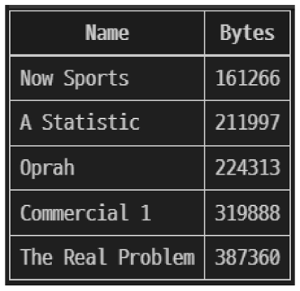

    ```sql
    SELECT
      Name, Bytes
    FROM
      tracks
    WHERE
      Bytes BETWEEN 10000 AND 5000000
    ORDER BY Bytes;
    ```


- WHERE 활용 7

  - 테이블 customers에서 Country 필드 값이 'Canada' 또는 'Germany' 또는 'France'인 데이터의 LastName, FirstName, Country 조회

    

    ```sql
    SELECT
      LastName, FirstName, Country
    FROM
      customers
    WHERE
      Country IN ('Canada', 'Germany', 'France');

    -- WHERE
    --  Country = 'Canada'
    --  OR Country = 'Germany'
    --  OR Country = 'France';
    ```


- WHERE 활용 8

  - 테이블 customers에서 Coutry 필드 값이 'Canada' 또는 'Germany' 또는 'France'가 아닌 데이터의 LastName, FirstName, Country 조회

    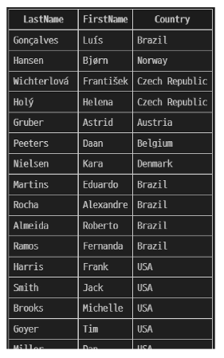

    ```sql
    SELECT
      LastName, FirstName, Country
    FROM
      customers
    WHERE
      Country NOT IN ('Canada', 'Germany', 'France');
    ```


- WHERE 활용 9

  - 테이블 customers에서 LastName 필드 값이 'Son'으로 끝나는 데이터의 LastName, FirstName 조회

    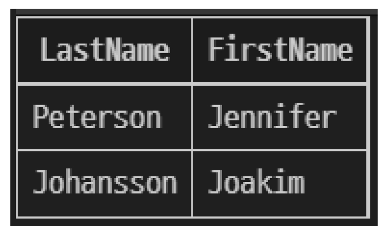

    ```sql
    SELECT
      LastName, FirstName
    FROM
      customers
    WHERE
      LastName LIKE '%son';
    ```


- WHERE 활용 10

  - 테이블 customers에서 FirstName 필드 값이 4자리면서 'a'로 끝나는 데이터의 LastName, FirstName 조회

    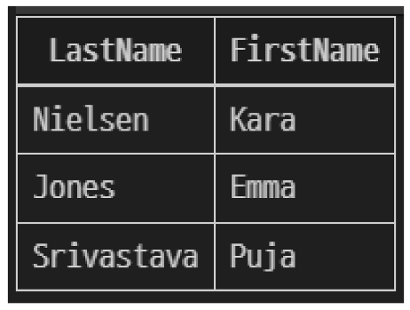

    ```sql
    SELECT
      LastName, FirstName
    FROM
      customers
    WHERE
      FirstName LIKE '___a';
    ```

#### Operators

- Comparison Operators(비교 연산자)

  - =, >=, <=, !=, IS, LIKE, IN, BETWEEN ... AND


- Logical Operators(논리 연산자)

  - AND(&&), OR(||), NOT(!)


- **IN** Operator

  - 값이 특정 목록 안에 있는지 확인


- **LIKE** Operator

  - 값이 특정 패턴에 일치하는지 확인(Wildcards와 함께 사용)


- Wildcard Characters

  |'%'|'_'|
  |:--:|:--:|
  |**0개 이상의 문자열**과 일치 하는지 확인|**단일 문자**와 일치하는지 확인|
  <br>


#### LIMIT

- **LIMIT** clause

  - 조회하는 레코드 수를 제한


- LIMIT syntax

  ```sql
  SELECT
    select_list
  FROM
    table_name
  LIMIT [offset,] row_count;
  ```

  - 하나 또는 두 개의 인자를 사용 (0 또는 양의 정수)

  - row_count는 조회하는 최대 레코드 수를 지정


### Grouping data


# offline~
## Managing Tables
### Create a table
### Modifying table fields
### Delete a table


## Modifying Data
### Insert data
### Update data
### Delete data


## Multi table queries
### Join
### Joining tables