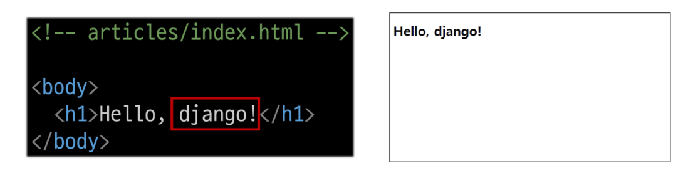
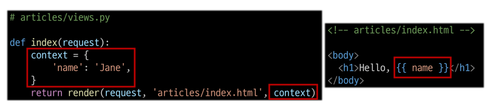
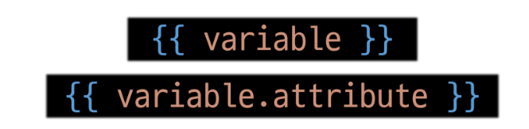
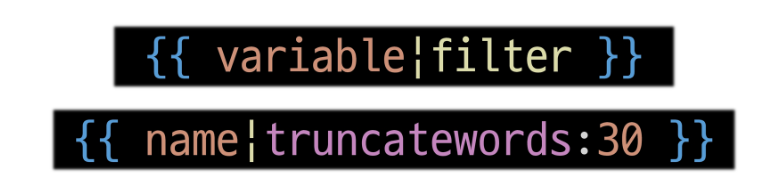
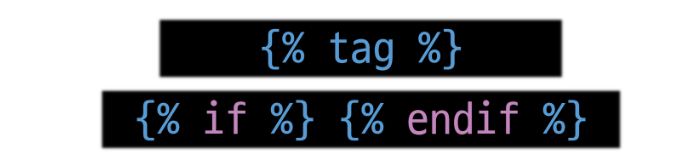
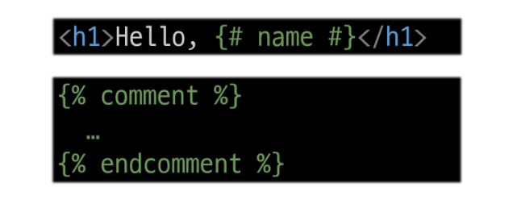

# 2024-09-19(목) Django 02 Template & URLs

- Template System
  - Django Template system
  - Django Template Language

- 템플릿 상속
  - 상속 관련 DTL 태그

- HTML form
  - 요청과 응답
  - form 활용

- Django URLs
  - Variable Routing
  - App과 URL

- URL 이름 지정
  - Naming URL patterns
  - DTL URL tag

- URL 이름 공간
  - app_name 속성

- 참고
  - 추가 템플릿 경로
  - DTL 주의사항
  - Trailing Slashes

---

### `Template System`

#### Django Template system

- 데이터 **표현**을 제어하면서, **표현**과 관련된 부분을 담당

#### HTML의 콘텐츠를 변수 값에 따라 변경하기

---

### `Django Template Language`

- DTL : Template에서 조건, 반복, 변수 드으이 프로그래밍적 기능을 제공하는 시스템

#### DTL Syntax

    1. Variable

    2. Filters

    3. Tags

    4. Comments

|Variable|Filters|Tags|Comments|
|:------:|:-----:|:---:|:-----:|
|  - render 함수의 세 번째 인자로 딕셔너리 데이터를 사용    - 딕셔너리 key에 해당하는 문자열이 templaate에서 사용 가능    - dot('.')를 사용하여 변수 속성에 접근할 수 있음.     |    - 표시할 변수를 수정할 때 사용(변수 + '\|' + 필터)    - chanined(연결)이 가능하며 일부 필터는 인자를 받기도 함.    - 약 60개의 built-in template filters를 제공    |   - 반복 또는 논리를 수행하여 제어 흐름을 만듦.    - 일부 태그는 시작과 종료 태그가 필요.    - 약 24개의 built-in template tags를 제공     |   - DTL에서의 주석    |

---

### `템플릿 상속`

#### 기본 템플릿 구조의 한계

- 만약 모든 템플릿에 bootstrap을 적용하려면?

  - 모든 템플릿에 bootstrap CDN을 작성해야 할까?

#### 템플릿 상속(Template inheritance)

- **페이지의 공통요소를 포함**하고, **하위 템플릿이 재정의 할 수 있는 공간**을 정의하는 기본 'skeleton' 템플릿을 작성하여 상속 구조를 구축.

