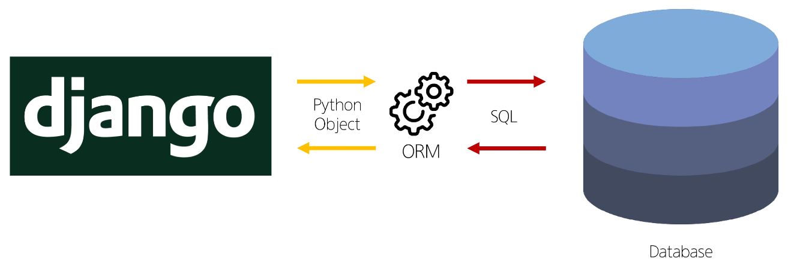
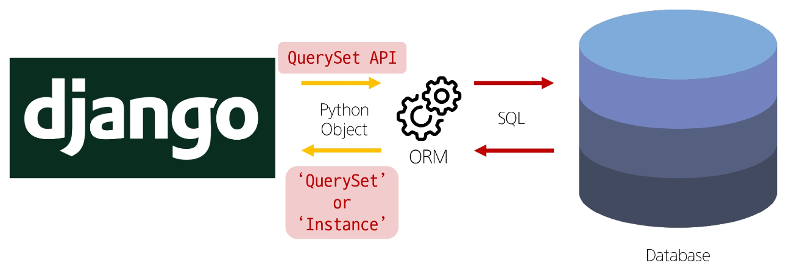
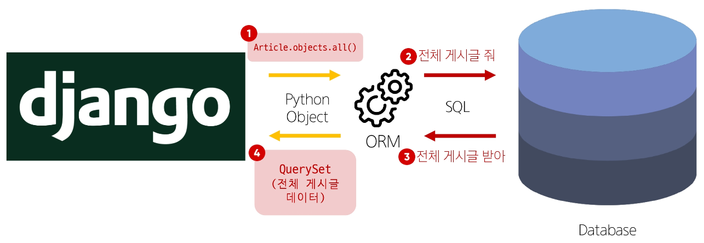
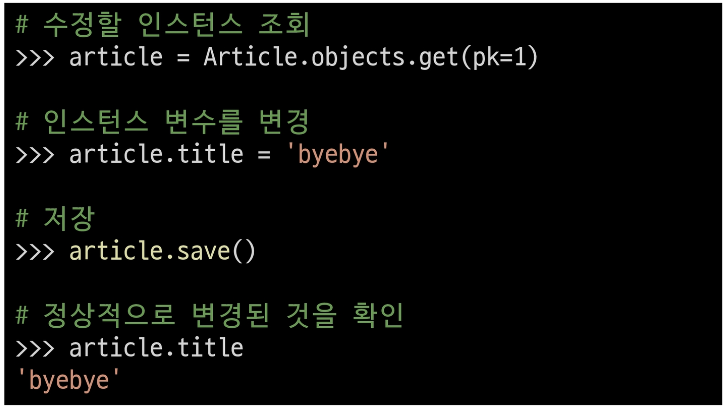
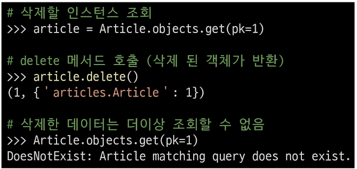
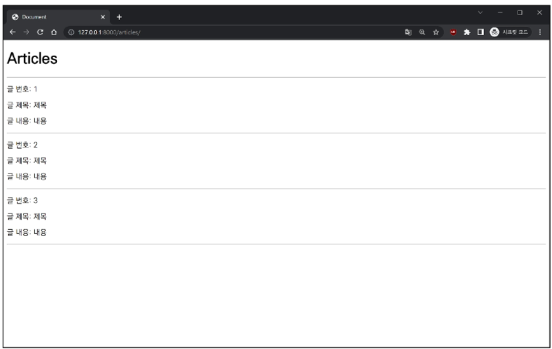

# 2024-09-23(월) Django04_ORM

- ORM

- QuerySet API

- QuerySet API 실습

  - Create
  - Read
  - Update
  - Delete

- ORM with view

  - 전체 게시글 조회

- 참고

  - Field lookups

  - ORM, QuerySet API를 사용하는 이유

---

### `ORM`

#### ORM(Object-Relational-Mapping)

- 객체 지향 프로그래밍 언어를 사용하여 호환되지 않는 유형의 시스템 간에 데이터를 변환하는 기술


#### ORM의 역할

  - Django와 DB간에 사용하는 언어가 다르기 때문에 소통 불가

    

  - Django에 내장된 ORM이 중간에서 이를 해석

    

---


### `QuerySet API`

#### QuerySet API

- ORM에서 데이터를 검색, 필터링, 정렬 및 그룹화 하는 데 사용하는 도구

  - API를 사용하여 SQL이 아닌 Python 코드로 데이터를 처리

    


#### QuerySet API 구문

  


#### QuerySet API 구문 동작 예시

  


#### `Query`

    - 데이터베이스에 특정한 데이터를 보여 달라는 요청
      
    - "쿼리문을 작성한다."

      >> "원하는 데이터를 얻기 위해 데이터베이스에 요청을 보낼 코드를 작성한다."

    - 파이썬으로 작성한 코드가 ORM에 의해 SQL로 변환되어 데이터베이스에 전달되며, 데이터베이스의 응답 데이터를 ORM이 QuerySet이라는 자료 형태로 변환하여 우리에게 전달


#### `QuerySet`

    - 데이터 베이스에게서 전달 받은 객체 목록(데이터 모음)

      - 순회가 가능한 데이터로써 1개 이상의 데이터를 불러와 사용할 수 있음

    - Django ORM을 통해 만들어진 자료형

    - 단, 데이터베이스가 단일한 객체를 반환할 때는 QuerySet이 아닌 모델(Class)의 "인스턴스"로 변환됨


#### QuerySet API는

- python의 모델 클래스와 인스턴스를 활용해 DB에 데이터를 저장(Create), 조회(Read), 수정(Update), 삭제(Delete)하는 것


#### `CRUD`

  - 소프트웨어가 가지는 기본적인 데이터 처리 가능
    
  
    |Create|Read|Update|Delete|
    |:----:|:--:|:----:|:----:|
    |저장|조회|갱신|삭제|
    <br>

---

### `QuerySet API 실습`

### `Create`

#### QuerySet API 실습 사전 준비

  - 외부 라이브러리 설치 및 설정

    


#### Django shell 실행

  


#### Django shell

  - Django 환경 안에서 실행되는 python shell

  - 입력하는 QuerySet API 구문이 Django 프로젝트에 영향을 미침


#### 데이터 객체를 만드는(생성하는) 3가지 방법

  - 첫번째 방법

    

    

    

  
  - 두번째 방법

    - save 메서드를 호출해야 비로소 DB에 데이터가 저장됨

    - 테이블에 한 행(레코드)이 쓰여진 것

      


  - 세번째 방법

    - QuerySet API 중 create() 메서드 활용

      


#### `save()` : [참고문헌](https://docs.djangoproject.com/en/4.2/ref/models/instances/#saving-objects)

- 객체를 데이터베이스에 저장하는 인스턴스 메서드

---

### `Read`

#### 대표적인 조회 메서드

  ```markdown
  - Return new QuerySets

    - all()

    - filter()

  - Do not return QuerySets

    - get()
  ```


#### `all()`

  - 전체 데이터 조회

    


#### `filter()`

  - 주어진 매개변수와 일치하는 객체를 포함하는 QuerySet 반환

    


#### `get()`

  - 주어진 매개변수와 일치하는 객체를 반환

    


#### get() 특징

  ```markdown

  - 객체를 찾을 수 없으면 DoesNotExis 예외를 발생시키고, 둘 이상의 객체를 찾으면 MultipleObjectsReturned 예외를 발생시킴

  - 위와 같은 특징을 가지고 있기 때문에 primary key와 같이 고유성(uniqueness)을 보장하는 조회에서 사용해야 함
  
  ```

---

### `Update`

#### 데이터 수정

  - 인스턴스 변수를 변경 후 save 메서드 호출

    

### `Delete`

#### 데이터 삭제

  - 삭제하려는 데이터 조회 후 delete 메서드 호출

    

---

### `ORM with view`

- Django shell에서 연습했던 QuerySet API를 직접 view 함수에서 사용하기


### 전체 게시글 조회

#### 2가지 Read(조회)

  ```markdown
  1. 전체 게시글 조회

  2. 단일 게시글 조회
  ```

- 전체 게시글 조회

  

  

---

### `참고`

### Field lookups

- Field lookups

  ```markdown
  - Query에서 조건을 구성하는 방법

  - QuerySet 메서드 filter(), exclude() 및 get()에 대한 키워드 인자로 지정됨
  ```


### ORM, QuerySet API를 사용하는 이유

#### ORM, QuerySet API를 사용하는 이유

  ```markdown
  1. 데이터베이스 추상화

    - 개발자는 특정 데이터베이스 시스템에 종속되지 않고 일관된 방식으로 데이터를 다룰 수 있음

  2. 생산성 향상

    - 복잡한 SQL 쿼리를 직접 작성하는 대신 Python 코드로 데이터베이스 작업을 수행할 수 있음

  3. 객체 지향적 접근

    - 데이터베이스 테이블을 Python 객체로 다룰 수 있어 객체 지향 프로그래밍의 이점을 활용할 수 있음
  ```


- QuerySet API 관련 문서

  - [https://docs.djangoproject.com/en/4.2/ref/models/querysets/](https://docs.djangoproject.com/en/4.2/ref/models/querysets/)

  - [https://docs.djangoproject.com/en/4.2/topics/db/queries](https://docs.djangoproject.com/en/4.2/topics/db/queries)