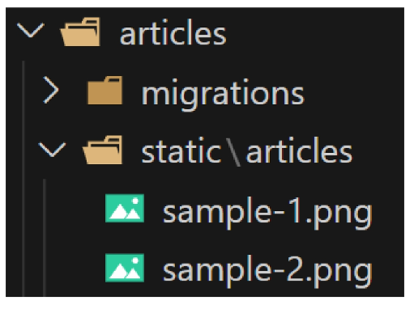
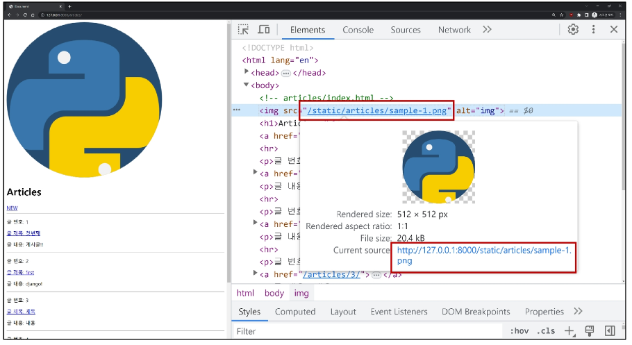
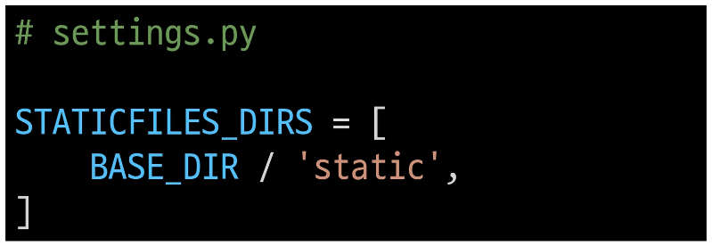
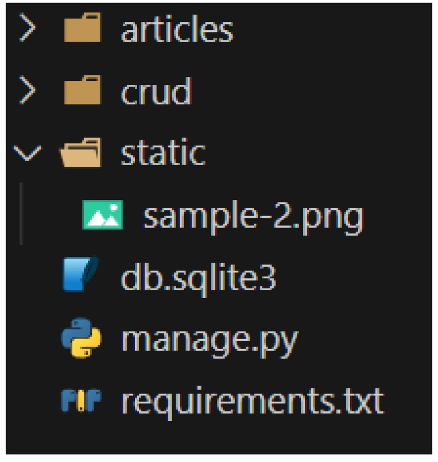
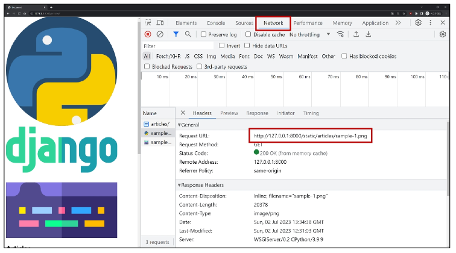
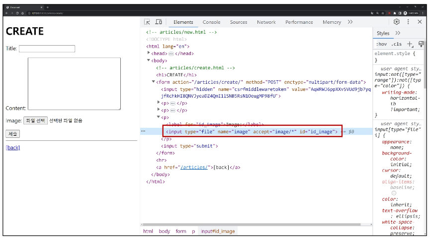
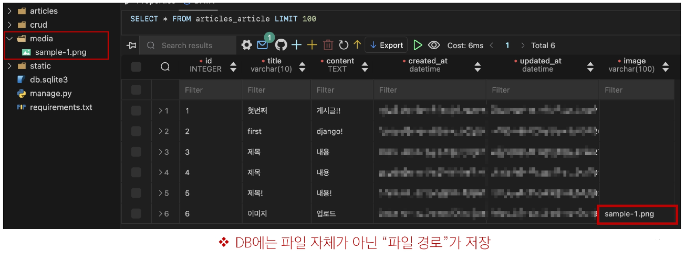
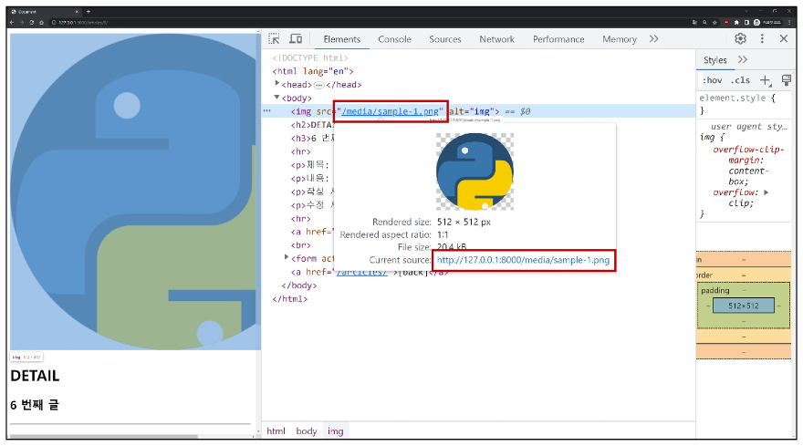
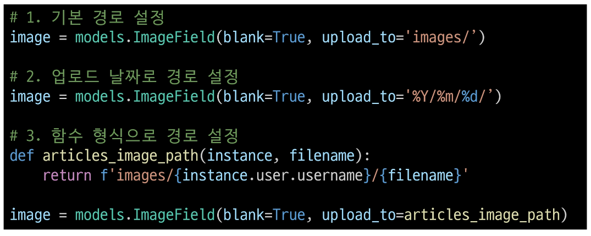
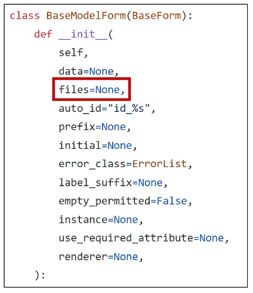

# 2024-09-26(목) Django07_Static

- Static files

  - Static files 제공하기

  - Static files 기본 경로

  - Static files 추가 경로

- Media files

  - 이미지 업로드

  - 업로드 이미지 제공

  - 업로드 이미지 수정

- 참고

  - 미디어 파일 추가 경로

  - BaseModelForm

---

### `Static files`

### Static files 제공하기

#### `Static Files(정적 파일)`

  - 서버 측에서 변경되지 않고 고정적으로 제공되는 파일

  - 이미지, JS, CSS 파일 등

#### 웹 서버와 정적 파일

  - 웹 서버의 기본동작은 **특정 위치(URL)에 있는 자원**을 요청(HTTP request) 받아서 응답(HTTP response)을 처리하고 제공하는 것

  - 이는 "자원에 접근 가능한 주소가 있다."라는 의미

  - 웹 서버는 요청 받은 URL로 서버에 존재하는 정적 자원을 제공함

  - **정적 파일을 제공하기 위한 경로(URL)** 가 있어야 함

    

#### Static files 경로

      1. 기본 경로

      2. 추가 경로

### Static files 기본 경로

- Static files 기본 경로

  - app폴더/static/

- 기본 경로 static file 제공하기

  - articles/static/articles/ 경로에 이미지 파일 배치

    

  - static files 경로는 DTL의 static tag를 사용해야 함
  
  - built-in tag가 아니기 때문에 load tag를 사용해 import 후 사용 가능

    

  - STATIC_URL 확인 ([http://127.0.0.1:8000/static/articles/sample-1.png](http://127.0.0.1:8000/static/articles/sample-1.png))

    

- STATIC_URL

  - 기본 경로 및 추가 경로에 위치한 정적 파일을 참조하기 위한 URL

  - 실제 파일이나 디렉토리 경로가 아니며, URL로만 존재

    

 

### Static files 추가 경로

- Static files 추가 경로

  - STATICFILES_DIRS에 문자열 값으로 추가 경로 설정

- STATICFILES_DIRS

  - 정적 파일의 기본 경로 외에 추가적인 경로 목록을 정의하는 리스트

- 추가 경로 static file 제공하기

  - 임의의 추가 경로 설정

    

  - 추가 경로에 이미지 파일 배치

    

  - static tag를 사용ㅇ해 이미지 파일에 대한 경로 제공

    

  - 이미지를 제공 받기 위해 요청하는 Request URL 확인

    

- 정적 파일을 제공하려면 요청에 응답하기 위한 URL이 필요

## Media files

- Medial Files

  - 사용자가 웹에서 업로드하는 정적 파일(user-uploaded)

### 이미지 업로드

- ImageField()

  - 이미지 업로드에 사용하는 모델 필드

  - 이미지 객체가 직접 DB에 저장되는 것이 아닌 **'이미지 파일의 경로'** 문자열이 저장됨

- 미디어 파일을 제공하기 전 준비사항

      1. settings.py에 MEDIA_ROOT, MEDIA_URL 설정

      2. 작성한 MEDIA_ROOT와 MEDIA_URL에 대한 URL 지정

- MEDIA_ROOT

  - 미디어 파일들이 위치하는 디렉토리의 절대 경로

    

- MEDIA_URL

  - MEDIA_ROOT에서 제공되는 미디어 파일에 대한 주소를 생성

  - STATIC_URL과 동일한 역할

    

- MEDIA_ROOT와 MEDIA_URL에 대한 URL 지정

  - 업로드 된 파일의 URL == settings.MEDIA_URL

  - MEDIA_URL을 통해 참조하는 파일의 실제 위치 == settings.MEDIA_ROOT

    

- 이미지 업로드

  - blank=True 속성을 작성해 빈 문자열이 저장될 수 있도록 제약 조건 설정

  - 게시글 작성 시 이미지 업로드 없이도 작성할 수 있도록 하기 위함

    

  - migration 진행

    

  - form 요소의 enctype 속성 추가

    

  - ModelForm의 2번째 인자로 요청 받은 파일 데이터 작성

    - ModelForm의 상위 클래스 BaseModelForm의 생성자 함수의 2번째 위치 인자로 파일을 받도록 설정되어 있음

      

  - 이미지 업로드 input 확인

    

  - 이미지 업로드 결과 확인

    

### 업로드 이미지 제공

- 업로드 이미지 제공하기

  - 'url' 속성을 통해 업로드 파일의 경로 값을 얻을 수 있음

  - articles.image.url

    - 업로드 파일의 경로

  - article.image

    - 업로드 파일의 파일 이름

    

  - 업로드 이미지 출력 확인 및 MEDIA_URL 확인

    

  - 이미지를 업로드하지 않은 게시물은 detail 템플릿을 렌더링 할 수 없음

  - 이미지 데이터가 있는 경우만 이미지를 출력할 수 있도록 처리하기

    

### 업로드 이미지 수정

- 업로드 이미지 수정

  - 수정 페이지 form 요소에 enctype 속성 추가

    

  - update view 함수에서 업로드 파일에 대한 추가 코드 작성

    

## 참고

### 미디어 파일 추가 경로

- 'upload_to' argument

  - ImageField()의 upload_to 속성을 사용해 다양한 추가 경로 설정

    

### BaseModelForm

- request.FILES가 두번째 위치 인자인 이유

  - ModelForm의 상위 클래스 BaseModelForm의 생성자 함수 키워드 인자 참고

    