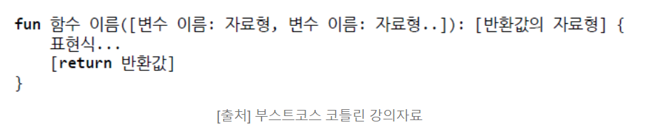

# Kotlin 기본기 - 변수, 자료형, 함수, 스트링 템플릿

- 변수

- 자료형

- 함수

- 스트링 템플릿

---

### 변수

- 데이터를 자료형에 따라서 선언을 해야 한다.

1️⃣ **불변형(immutable)** 은 일단 선언을 하고, 값을 초기화하면 더 이상 값을 바꿀 수 없는 변수

  - `val`을 사용하며 val은 value의 약자

2️⃣ **가변형(mutable)** 은 나중에 초기값을 바꿀 수 있습니다.

  - `var`을 사용하며 var은 variable의 약자

```Kotlin

var num1 = 10  // var : 가변

num1 = 5   // var는 가변 가능하기에 재할당 가능

```

```Kotlin

val num2 = 15 // val : 불가변

```

---

### 자료형

- 우리가 다루고자 하는 데이터의 어떤 형식을 가지고 있는가를 나타냅니다.

`Int`

- 정수이며, `1, 2, 3`과 같이 숫자로 나열된 것

```Kotlin

// 1은 정수를 나타내므로 Int 생략 가능
// var num = 1
var num : Int = 1 
```

`Float`

- 실수형이며, `1.2`와 같이 소숫점 이하의 숫자를 가지는 숫자.

- 이외에는 `double` 등이 있습니다.

```Kotlin

var mFloat : Float = 1.5f

var mDouble : Double = 1.2345678
```

`Characters`

- 글자 하나를 나타냄

```Kotlin

var mChar : Char = 'b'  // 글자 하나만 할당 가능 2개이상 오류 발생

```

`String`

- 글자 긴 문자열 나타냄

```Kotlin

var mString : String = "Hello World!"

// Char과 다르게 차이점 작은 따옴표와 큰따옴표 차이!!!

```

`Booleans`

- 참(True) / 거짓(False)를 나타냄

```Kotlin

var mFalse : Boolean = False

var mTrue : Boolean = True

```

`Arrays`

- 배열 사용

- 여러 가지 값을 순서에 맞게 저장

```Kotlin

var mArray : Array<String> = arrayOf("Kotlin", "is", "Fun")

println(mArray[0]) // Kotlin

println(mArray.get(1)) // is

println(mArray.size)  // 3
```

---

### 변수의 선언


```Kotlin

① val ②username ③: ④String ⑤= ⑥"NaYoung"

```

- 변수의 선언 형식은 위와 같습니다.

① `val` : val, var을 사용해서 선언

② `변수이름` : 이곳에 필요한 변수이름을 넣어준다. 맨앞은 무조건 소문자 사용

③ `콜론` : 콜론을 사용하고, 한 칸을 띄워준다.

④ `자료형식` : 위에 적힌 자료형식을 정해준다.(Int, String, Float, Double 등)

⑤ `대입연산자` : **=** 을 써준다.

⑥ `초기값` : 초기값을 반드시 넣어준다. val의 경우 초기값 설정 이후에 값을 변경 불가하다.

---

### 함수(function)

- "하나의 **특별한 목적의 작업**을 수행하기 위해 설계된 **코드의 집합**"

#### 기본 형식

  


`ver1. return하는 값이 없는 경우`

- **Unit** : 반환값이 없다는 뜻 (생략 가능)

```Kotlin
fun printStudentInfo(name : String, age : Int) : Unit {
  println("Student Name : " + name)
  println("Student Age : " + age)
}

// Unit 생략 가능
```


`ver2. return하는 값이 있는 경우`

```Kotlin
fun addNum(n1 : Int, n2 : Int) : Int {
        return n1 + n2
}
```


---

### 스트링 템플릿


  