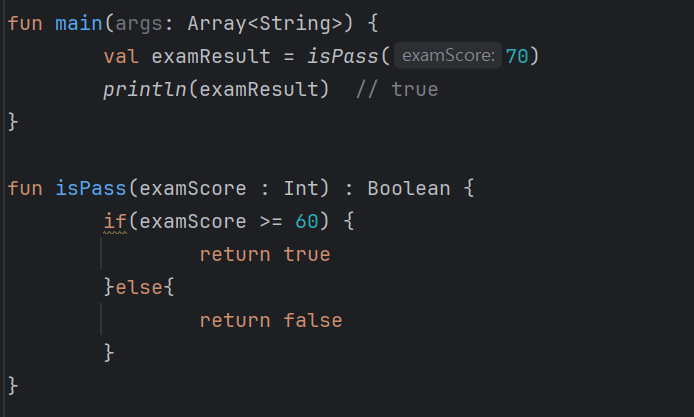
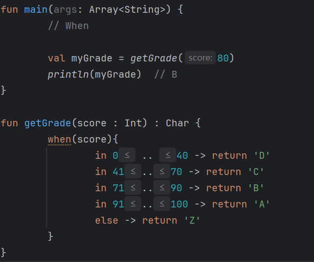

# Kotlin - 제어문

---

### 제어문

- 프로그램의 **흐름**을 **제어**하기 위해 사용하는 실행문

### 제어문 종류

🔅 반복문 - for, While

🔅 조건문 - If, When


#### 컬렉션이란?

- 컬렉션(Collection)은 자료구조를 다루는 데 사용되는 객체들의 집합.

- 크기 리스트(List), 집합, 맵으로 분류되며 각각의 컬렉션은 다음과 같은 특징을 가지고 있다.

|    |List(리스트)|Set(집합)|Map(맵)|
|:--:|:---------:|:-------:|:----:|
|특징|- 데이터를 순서대로 저장하며, 중복된 데이터를 허용한다. 인덱스를 이용하여 특정 위치의 데이터에 접근할 수 있다.| - 데이터를 순서 없이 저장하며, 중복된 데이터 허용하지 않는다. 데이터의 유무를 검색하는데 빠른 속도를 가지고 있다.|- 키-값 쌍으로 데이터를 저장하며, 중복된 키를 허용하지 않는다. 키를 이용하여 값을 검색할 수 있다.|

### for문 예시 코드

```Kotlin
for (변수명 in 범위){
    //반복할 코드
}
```

#### ① for문 기본 예제

```Kotlin
for (i in 1 .. 5){
    println(i)
}

// 1
// 2
// 3
// 4
// 5
```

#### ② for문 기본 예제

```Kotlin
for (i in 1 until 5){
    println(i)
}

// 1
// 2
// 3
// 4
```

#### ③ for문 기본 예제

- `downTo`는 변수의 값을 감소시키면서 반복을 수행한다.

```Kotlin
for (i in 5 downTo 1){
    println(i)
}

// 5
// 4
// 3
// 2
// 1
```

#### ④ for문 기본 예제

- `step`을 사용하면 반복문에서 사용되는 변수의 증가하는 크기를 지정할 수 있다.

- 즉, 증가시키는 간격을 지정한다.

```Kotlin
for (i in 1 .. 10 step 2){
    println(i)
}

// 1
// 3
// 5
// 7
// 9
```

---

### While

- while문은 **조건식이 '참'인 경우, 반복을 수행**한다.

```Kotlin
While(조건식) {
    // 반복할 코드
}
```

#### ① While 예시 코드 : `while`

```Kotlin
var num = 1

while (num < 5){
    println("current num : $num")
    num++
}

// current num : 1
// current num : 2
// current num : 3
// current num : 4
```
#### ② While 예시 코드 : `do-while`

- `do-while`문은 while과 달리, 먼저 **한 번 코드를 실행 후, 조건이 참인지 판단 후, 참이면 반복을 수행**

- 즉, **조건을 만족하지 못하더라도 한번은 무조건 실행**

- do-while문도 while문과 마찬가지로 조건을 만족하면 수없이 반복하기 때문에 무한 반복이 되지 않게 조심해야 한다.


```Kotlin
var num = 6

do {
    println("current num $num")
    num++
}while (num < 5)
}

// current num 6
```

---

### `if문`

- 조건식이 참일 때 실행되는 블록과 거짓일 때 실행되는 블록을 각각 지정.

- else 블록은 선택 사항 => else 블록이 없다면 조건식이 거짓일 때 아무런 일도 일어나지 않음.

- if문은 중첩해서 사용할 수 있으며, 여러 개의 **else if**블록을 추가하여 다양한 조건에 대응

```Kotlin

if (조건식) {
  // 조건식이 참일 때 실행될 코드 블록
}else {
  // 조건식이 거짓일 때 실행될 코드 블록
}

```

```Kotlin
// else if 사용

fun main() {
  val x = 5
  if (x > 10) {
    println("x는 10보다 큽니다.")
  }else if (x >5) {
    println("x는 6이상 10 이하입니다.")
  }else {
    println("x는 5 이하입니다.")
  }
}

```




### `When문`

- 코틀린에서 when은 Java의 switch문과 유사한 조건 분기 구문.

- when 구문은 값을 비교하거나 특정 조건에 따라 분기할 수 있음. 



---