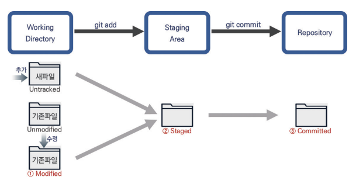

# 2024-07-11(목) 수업 정리

##  `Markdown`

- 글자에 서식을 적용하는 개발자용 언어
- 서식과 본문 내용 작성을 동시에 할 수 있는 편리함을 가짐.

---
## ` 제목 지정`

# 제목1 `# 제목1`
## 제목2 `## 제목2`
### 제목3 `### 제목3`
#### 제목4 `#### 제목4`
##### 제목5 `##### 제목5`
###### 제목6 `###### 제목6`

---
<br>

## `리스트 작성`

- 순서가 있는 리스트 

### 오늘의 준비물 목록은?

1. 필기구
    1. 연필
    2. 지우개
    3. 볼펜
2. 명찰

- 순서가 없는 리스트

### 여행용 짐 목록은?

- 옷
    - 바람막이
    - 츄리닝
    - 여분 옷
- 전자기기
    - 충전기
    - 보조밧데리
- 우산

---
<br>

## ```코드블록 ( ` 빽팁 사용) & 인라인 코드```

```python //언어 지정
for i in range(3):
    print(i)
```
파이썬의 ```for문```을 이용한 예제입니다. 

---
<br>

## ` 링크 & 이미지 삽입`

[네이버](https://www.naver.com)
<br>
[구글](https://www.google.com)


---
## ` 텍스트 관련 문법`

**굵게**   ```표시형식 : **굵게**```

보통 ```표시형식 : 보통```
 
~~취소선~~ ```표시형식 : ~~~취소선~~~```

*기울임* ```표시형식 : *기울임*```

---

<br>

## `수평선`

- 단락을 구분할 때 사용하는 문법
- '-' (hypen) 3개 이상 사용


<br>

##  `CLI(Command_Line_Interface) & GUI(Graphic_User_Interface)`

- **CLI** :명령어를 입력하여 컴퓨터에 명령을 내리는 방식
- **GUI** : 사용자가 컴퓨터와 정보를 교환할 때, 그래픽을 통해 작업할 수 있는 환경

<br>


---

## ` 디렉터리` 
- 디스크에 기록되어 있는 파일 관리 등록부
- 계층 구조를 형성
<br>
<br>

|기 호|설 명|
|:---:|:-----------:|
| . |현재 디렉토리|
| ..|부모 디렉토리|

## ` CLI 기초 문법`
<br>
<br>

|명령어|기능 설명|예시|
|:---:|:-----------:|:---:|
|touch|파일 생성|touch a.txt|
|mkdir|새 디렉토리 생성|mkdir "디렉토리명"|
|ls|현재 작업 중인 디렉토리 내부의 폴더/파일 목록 출력|ls -a<br> 숨긴 파일 폴더 모두 보임|
|cd|현재 작업 중인 디렉토리 변경/위치 이동|cd .. <br> : 상위 디렉토리로 이동<br>cd "디렉토리명"<br>: 해당 디렉토리로 이동|
|start|폴더/파일 열기|start a.txt|
|rm|파일삭제 (**"-r"** 옵션 추가)|rm -r "파일명"|
|pwd|절대 경로 Root|pwd

<br>

## `절대경로 vs 상대경로`

<br>

|절대경로|- 디렉토리부터 목적 지점까지 거치는 모든 경로를 전부 작성한 것.|
|:---|:---|
|상대경로| - 현재 작업하고 있는 디렉토리를 기준으로 계산된 상대적 위치 작성한것.|

<br>


## `Git(분산 버전 관리 시스템)`
<br>

- 수정/추가한 코드들에 대해 버전 관리를 해주는 프로그램
- 버전 관리 : 변화를 기록하고 추적

<br>
<br>

---

## `Git의 3가지 영역`

|Working Directory<br>(작업 디렉토리)|Staging Area|Repository<br>(저장소)|
|:---:|:---:|:---:|
|실제 작업중인 파일들이 위치 하는 곳|Working Directory에서 변경된 파일 중,<br> 다음 버전에 포함시킬 파일들을 선택적으로<br> 추가하거나 제외할 수 있는 **중간 준비 영역**|버전 이력과 파일들이 영구적으로 저장되는 영역 <br> 모든 버전과 변경 이력 기록|


<br>

---
## `Git 기본 문법`

|명령어|기능 설명|
|:---:|:---:|
|commit|변경된 파일들을 저장하는 행위|
|git init|로컬 저장소 설정(초기화) <br> git 버전관리를 시작할 디렉토리에서 진행|
|git add "파일명"|변경사항이 있는 파일을 Staging area 추가 <br> "U" => "A" <br>폴더에 작성된 모든 파일을 버전에 넣을 준비가 되었다고 선언하는 모습<br>**EX) git add .** : 해당 디렉토리에 있는 모든 파일 업로드|
|git rm --cached "파일명"|파일을 stage에서 내리기|
|git commit|staging area에 있는 파일들을 저장소에 기록<br>(해당 시점의 버전을 생성하고 변경 이력을 남기는 것) <br> Ex. **git commit -m "메세지 내용"**|
|git log|commit의 히스토리 확인<br> git log --oneline : 한줄로 간단하기 커밋 확인|
|git status|파일 상태 확인|
|git config --global -l|깃의 현재 설정 내용 확인|

---
<br>

## `Working Directory에서 관리되는 파일들의 상태 3가지`

<br>

|파일 상태|설명|
|:------:|:---:|
|Modified|- 관리 중인 파일에 수정(변경) 사항이 감지되었지만 커밋이 되지 않은 상태|
|Staged|- 감지된 파일의 수정 사항이 Staging area로 이동한 상태|
|Committed<br>(Unmodified)|- 파일의 수정 사항에 대한 이력 저장이 완료된 상태|



---

## `commit 사용할 때 주의점`

<br>

- 코드 변경 사항을 저장소에 영구적으로 기록하는 행위
- 파일이나 폴더의 변경 사항을 로컬 저장소에 기록
- ***commit을 생성하기 위해서 commit 작성자 필요***
- commit에는 고유한 ID(해시 값),변경 내용, 작성자 정보, 그리고 변경 사항에 대한 설명 포함

```
git config --global user.email "메일주소"
git config --global user.name "닉네임"
```

---
## `git init 주의사항`
<br>

- git 로컬 저장소 내에 **또다른 git 로컬 저장소를 만들지 말것**
    - 즉, 이미 git 로컬 저장소인 디렉토리 내부 하단에서 git init 명령어 다시 입력하지 말것
- git 저장소 안에 git 저장소가 있을 경우 가장 바깥 쪽의 git 저장소가 안쪽의 git 저장소의 변경사항 추적할 수 없기 때문 <br>
=> 해결방법 : .git 폴더 지우기


---
## `commit 수정하기`
<br>

- 바로 직전 생성한 커밋 메세지 수정 & 커밋해야할 빠트린 파일 추가하기

<br>

```
git commit --amend //입력 후 "I" 눌러 편집 -> 메세지 수정 -> Esc(편집모드 종료) -> :wq 로 저장
```

