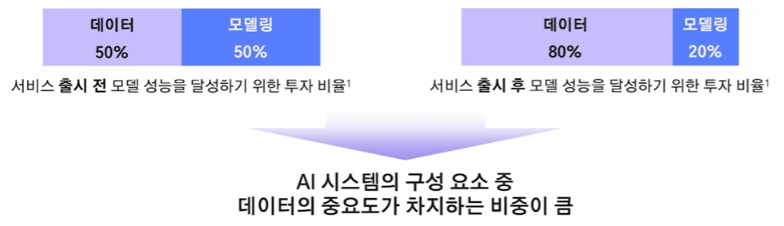
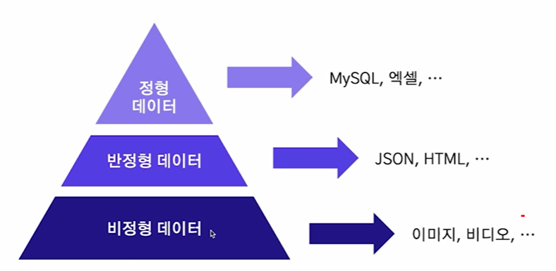
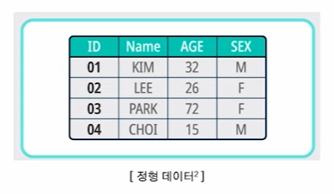

# 2024-12-02(월) AI코스 - Centric AI

### Index

1. 데이터와 AI 모델

    - 형식에 따른 데이터의 종류

    - 모델 훈련에 따른 데이터의 종류

    - 데이터가 AI 모델에 미치는 영향

2. Model-Centric AI, Data-Centric AI

    - Model-Centric AI
  
    - Data-Centric AI

---

### `01. 데이터와 AI 모델`

#### AI = Code + Data

- AI 시스템은 코드(모델 및 알고리즘)와 데이터로 구성

  

#### 형식에 따른 데이터

  

1) `정형 데이터`

    - **정의** : 고정된 형식과 구조를 갖는 데이터

    - **예시** : 엑셀, MySQL, 관계형 DB등

    🔅 활용 예시

    - 거래 금액, 시근 등으로 사기 거래 탐지

    - 환자의 나이, 혈압, 혈당, 콜레스테롤 수치 등으로 환자 진단 질병 예측

      

    2) `반정형 데이터`

      - **정의** : 고정된 형태는 없으나 특정한 구조를 갖춘 데이터

      - **예시** : JSON, XML, HTML 등

      🔅 활용 예시

      - 로그 데이터 이상 탐지 ( 서버 로그에서 이상 트래픽 탐지)

      - JSON 데이터의 텍스트 기반 정보를 추출하여 요약 작업 수행

      