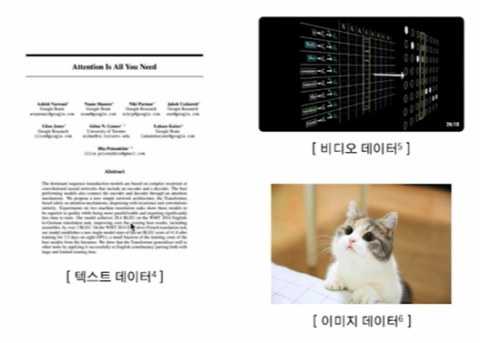
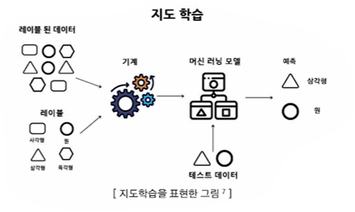
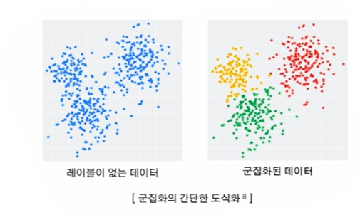
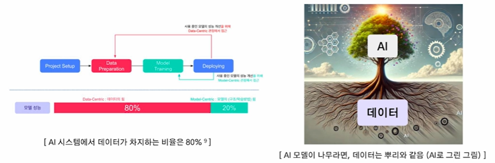
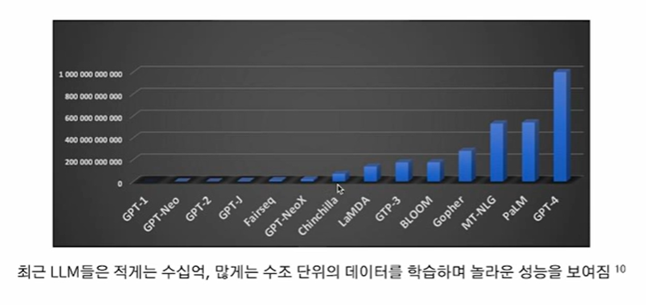

# 2024-12-02(월) AI코스 - Centric AI

### Index

1. 데이터와 AI 모델

    - 형식에 따른 데이터의 종류

    - 모델 훈련에 따른 데이터의 종류

    - 데이터가 AI 모델에 미치는 영향

2. Model-Centric AI, Data-Centric AI

    - Model-Centric AI
  
    - Data-Centric AI

---

### `01. 데이터와 AI 모델`

#### AI = Code + Data

- AI 시스템은 코드(모델 및 알고리즘)와 데이터로 구성

  

#### 형식에 따른 데이터

  

1) `정형 데이터`

    - **정의** : 고정된 형식과 구조를 갖는 데이터

    - **예시** : 엑셀, MySQL, 관계형 DB등

    🔅 활용 예시

    - 거래 금액, 시근 등으로 사기 거래 탐지

    - 환자의 나이, 혈압, 혈당, 콜레스테롤 수치 등으로 환자 진단 질병 예측

      

    2) `반정형 데이터`

      - **정의** : 고정된 형태는 없으나 특정한 구조를 갖춘 데이터

      - **예시** : JSON, XML, HTML 등

      🔅 활용 예시

      - 로그 데이터 이상 탐지 ( 서버 로그에서 이상 트래픽 탐지)

      - JSON 데이터의 텍스트 기반 정보를 추출하여 요약 작업 수행

      

    3) `비정형 데이터`

        - **정의** : 특정한 구조가 없는 데이터

        - **예시** : 텍스트, 이미지, 비디오 등

      🔅 활용 예시

      - 자율주행 차량의 차선 및 보행자 인식

      - 의료 분야에서 CT, MRI 데이터 분석

      

#### 모델 훈련에 따른 데이터의 종류

1) `지도학습 (Supervised Learning)`

- 입력 데이터와 이에 대응하는 **정답 레이블이 제공되는 데이터셋**을 사용하여 모델 학습

- 새로운 데이터가 주어졌을 때 정답을 예측할 수 있도록 함

🔅 대표 알고리즘

- **분류(Classfication)** : 데이터가 특정 범주에 속하는지 예측

- **회귀(Regression)** : 데이터의 연속적인 값을 예측

  

2) `비지도학습(Unsupervised Learning)`

- **정답 레이블이 없는 데이터셋**을 사용하여 데이터의 패턴이나 구조 학습

- 주로 데이터의 분포, 군집, 특징을 탐색

🔅 대표 알고리즘

- **군집화(Clustering)** : 데이터를 유사한 그룹으로 나눔

- **차원 축소(Demensionality Reduction)** : 데이터의 차원을 줄이면서 특성 유지

  

#### 데이터는 AI 모델의 연료

- 데이터가 AI 시스템에서 큰 비중을 차지하는 만큼, 데이터의 품질은 AI 성능에 직접적으로 연결됨

  

#### 데이터의 크기 - 중요성

  