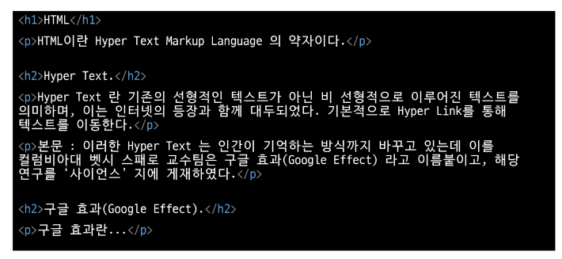
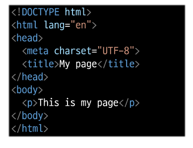
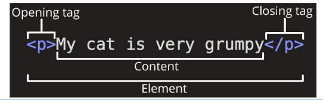
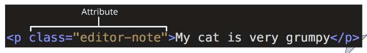
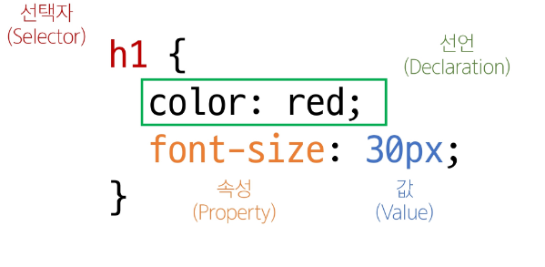

# 2024-08-19(월) HTML&CSS 01

- 웹
- 웹 구조화
  - HTML
  - Structure of HTML
  - Text Structure
- 웹 스타일링
  - CSS
  - CSS 선택자
  - 명시도
  
- CSS Box Model
  - 박스 타입

- 참고
  - 명시도 관련
  - HTML 스타일 가이드
  - CSS 스타일 가이드
  - MDN

---

#### `웹(Web)`

##### 개요

- `World Wide Web` : 인터넷으로 연결된 컴퓨터들이 정보를 공유하는 거대한 정보 공간

- `Web` : Web site, Web application 등을 통해 사용자들이 정보를 검색하고 상호 작용하는 기술

- `Web site` : 인터넷에서 여러 개의 **Web page** 가 모인 것으로, 사용자들에게 정보나 서비스를 제공하는 공간

- `Web page` : HTML, CSS 등의 웹 기술을 이용하여 만들어진, "Web site"를 구성하는 하나의 요소


#### 웹 구조화

- `HTML(HyperText Markup Language)` : 웹 페이지의 의미와 **구조**를 정의하는 언어

- `Hypertext` : 웹 페이지를 다른 페이지로 연결하는 링크. 참조를 통해 사용자가 한 문서에서 다른 문서로 즉시 접근할 수 있는 텍스트

    - Hypertext 특징 : 비선형성/ 상호연결성 / 사용자 주도적 탐색

- `Markup Language` : 태그 등을 이용하여 문서나 데이터의 구조를 명시하는 언어 
    ex) HTML, Markdown



---

#### `Structure of HTML`

```js
- <!DOCTYPE html>
   - 해당 문서가 html로 문서라는 것을 나타냄

- <html></html>
    -  전체 페이지의 콘텐츠를 포함

- <title></title>
    - 브라우저 탭 및 즐겨찾기 시 표시되는 제목으로 사용
```



```js
- <head></head>
    - HTML 문서에 관련된 설명, 설정 등 컴퓨터가 식별하는 메타데이터를 작성
    - 사용자에게 보이지 않음

- <body></body>
    - HTML 문서의 내용을 나타냄
    - 페이지에 표시되는 모든 콘텐츠를 작성
    - 한 문서에 하나의 body 요소만 존재
```

---

#### HTML Element(요소)

- 하나의 요소는 **여는 태그**와 **닫는 태그** 그리고 그 안의 **내용**으로 구성됨
- 닫는 태그는 태그 이름 앞에 스래시가 포함됨
  - 닫는 태그가 없는 태그도 존재



#### HTML Attribute(속성)

- 사용자가 원하는 기준에 맞도록 요소를 설정하거나 다양한 방식으로 요소의 동작을 조절하기 위한 값
- 목적
  - 나타내고 싶지 않지만 추가적인 기능, 내용을 담고 싶을 때 사용
  - CSS에서 스타일 적용을 위해 해당 요소를 선택하기 위한 값으로 활용됨



##### HTML Attributes(속성) 작성 규칙

1. 속성은 요소 이름과 속성 사이에 공백이 있어야 함.
2. 하나 이상의 속성들이 있는 경우엔 속성 사이에 공백으로 구분함.
3. 속성 값은 열고 닫는 따옴표로 감싸야 함.

---

#### `Text Structure`

- `HTML Text Structure` : HTML의 주요 목적 중 하나는 **텍스트 구조와 의미**를 제공하는 것.


- 예를 들어 h1요소는 단순히 텍스트를 크게만 만드는 것이 아닌 현재 **문서의 최상위 제목**이라는 의미를 부여하는 것

#### 대표적인 HTML Text structure

- Heading & Paragraphs
    - h1 ~ 6, p
- Lists
  - ol, ul li

- Emphasis & Importance
    - em, strong

---

#### `웹 스타일링`

##### CSS(Cascading Style Sheet)

- 웹 페이지의 **디자인**과 **레이아웃**을 구성하는 언어

