# 2024-08-20(화)  Web 02 CSS Layout

- CSS Box Model
    - 지난 시간 - 박스타입
    - 박스 구성 요소
    - shorthand 속성
    - box-sizing 속성
    - 기타 display 속성

- CSS position
    - Position 속성
    - z-index

- CSS Flexbox(중요!)
    - Flexbox 구성 요소
    - Flexbox 속성
    - Flex-wrap 응용

- 참고
    - 마진 상쇄
    - 박스 타입 별 수평 정렬
    - 실제 Position 활용 예시
    - Flexbox Shorthand 속성
    - Flexbox 속성 정리

----

### CSS Box Model

#### 개요

`CSS Box Model` : 웹 페이지의 모든 HTML 요소를 감싸는 사각형 상자 모델

#### 박스타입

1. Block box
2. Inline box

-  박스 타입에 따라 페이지에서의 **배치 흐름** 및 다른 박스와 관련하여 박스가 동작하는 방식이 달라짐.

#### 박스 표시(Display) 타입

1. Outer display type : 박스가 문서 흐름에서 어떻게 동작할지를 결정
    - Block & Inline

```css
/* Block */

.index{
    display: block;
}

```

2. Inner display type

```css
/* inline */

.index{
    display: inline;
}

```

#### Outer display type - `block 특징`

- 항상 새로운 행으로 나뉨.
- **width**와  **height** 속성 사용 가능
- **padding, margin, border**로 인해 다른 요소를 상자로부터 밀어냄
- width 속성을 지정하지 않으면 박스는 inline 방향으로 사용 가능한 공간을 모두 차지함
    - 상위 컨테이너 너비 100%로 채우는 것
- 대표적인 block 타입 태그
  - h1~6, p, div

#### Outer display type - `inline 특징`

- 새로운 행으로 넘어가지 않음
- **width**와 **height** 속성을 사용할 수 없음
- 수직 방향
  - padding, margin, border가 적용되지만 다른 요소를 밀어낼 수는 없음
- 수평 방향
  - padding, margins, borders가 적용되어 다른 요소를 밀어낼 수 있음
- 대표적인 inline 타입 태그
  - a, img, span, strong, em

#### Normal flow

- 일반적인 흐름 또는 레이아웃을 변경하지 않은 경우 웹 페이지 요소가 배치되는 방식

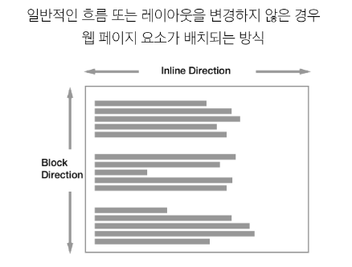


#### `Inner display type` : Flexbox

- 박스 *내부의 요소*들이 어떻게 배치될지를 결정

```css
/* Flexbox*/

.container {
    display : flex;
}
```

---

#### 박스 구성 요소

- `CSS Box Model` : 웹 페이지의 모드 HTML 요소를 감싸는 사각형 상자 모델
    - **내용(content), 안쪽 여백(padding), 테두리(border), 외부 간격(margin)으로 구성되어 요소의 크기와 배치를 결정**

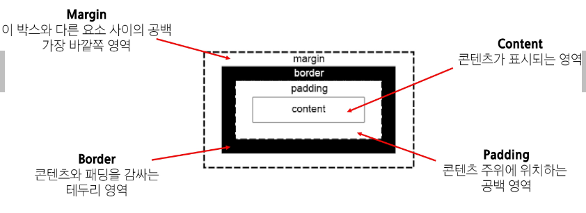


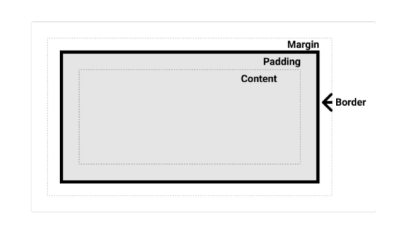

- `Content box`
    - 실제 콘텐츠가 표시되는 영역 크기
    - *width 및 height* 속성을 사용하여 크기 조정

- `Padding box`
    - 콘텐츠 주위에 공백
    - *padding* 관련 속성을 사용하여 크기 조정

- `Border Box`
    - 콘텐츠와 패딩을 래핑
    - *border* 관련 속성을 사용하여 크기 조정

- `Margin Box`
    - 콘텐츠, 패딩 및 테두리를 래핑
    - 박스와 다른 요소 사이의 공백
    - *margin* 관련 속성을 사용하여 크기 조정

<br>

#### `Box 구성의 방향 별 속성 값`

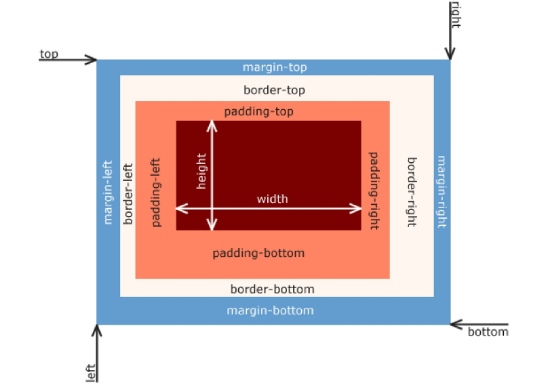


```CSS
<body>
    <div class="box1">box1</div>
    <div class="box2">box2</div>
</body>
```
```CSS
.box1{
    width : 200px;
    padding-left : 25px;
    padding-bottom : 25px;
    margin-left: 25px;
    margin-top : 50px;
    border-width: 3px;
    border-style: solid;
    border-color: black;
}

.box2{
    width: 200px;
    padding : 25px 50px;
    margin : 25px auto;
    border: 1px dashed black;
}
```

---

### shorthand 속성

- shorthand 속성 - `'border'`
    - border-width, border-style, border-color를 한번에 설정하기 위한 속성

```CSS
/* 작성 순서는 영향을 주지 않음 */

border :  2px solid black;
```

- shorthand 속성 - `'margin & padding'`
    - 4방향의 속성을 각각 지정하지 않고 한 번에 지정할 수 있는 속성

```CSS
/* 4개 - 상우하좌 */
margin: 10px 20px 30px 40px;
padding: 10px 20px 30px 40px;

/* 3개 -상/좌우/하 */
margin: 10px 20px 30px;
padding: 10px 20px 30px;

/* 2개 - 상하/좌우 */
margin: 10px 20px;
padding: 10px 20px;

/* 1개 - 공통 */
margin: 10px;
padding: 10px;
```

---

#### box-sizing 속성

- 표준 상자 모델에서 width와 height 속성 값을 설정하면 이 값은 content box의 크기를 조정하게 됨.

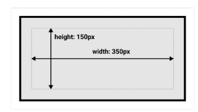

  - 실제 박스 크기는 350px이 아닌 테두리, 패딩 값을 모두 더한 값을 가짐
    - [참고](https://developer.mozilla.org/en-US/docs/Learn/CSS/Building_blocks/The_box_model#outer_display_type)
  
- CSS는 border box가 아닌 content box의 크기를 width 값으로 지정
- 대체 상자 모델에서 모든 width와 height는 실제 상자의 너비 실제 박스 크기를 정하기 위해 테두리와 패딩을 조정할 필요 없음

```CSS
/* 대체 상자 모델로 변경 */
*{
    box-sizing: content-box;
}

*{
    box-sizing: border-box;
}
```

---

### 기타 display속성

1. inline-block
2. none

#### `inline-block`

- *inline*과 *block*요소 사이의 중간 지점을 제공하는 display 값
- *width* 및 *height* 속성 사용 가능
- *padding*, *margin* 및 *border*로 인해 다른 요소가 상자에서 밀려남
- **새로운 행으로 넘어가지 않음**

    - 요소가 줄 바꿈 되는 것을 원하지 않으면서 너비와 높이를 적용하고 싶은 경우에 사용

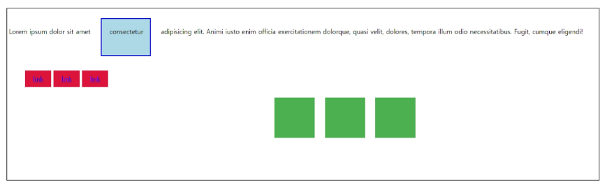

<04_inline_box.html 실습 결과>

#### `none`

- 요소를 화면에 표시하지 않고, 공간조차 부여되지 않음

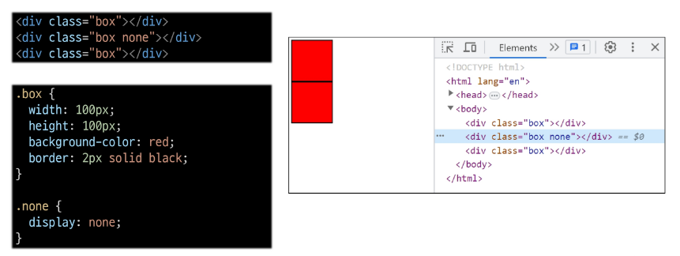

---

#### `CSS Position` 

- CSS Layout: 각 요소의 **위치**와 **크기를 조정**하여 웹 페이지의 디자인을 결정하는 것
    - *Display*, *Position*, *Flexbox* 등

- CSS Position: 요소를 **Normal Flow에서 제거**하여 다른 위치로 배치하는 것
    - 다른 요소 위에 올리기, 화면의 특정 위치에 고정시키기 등

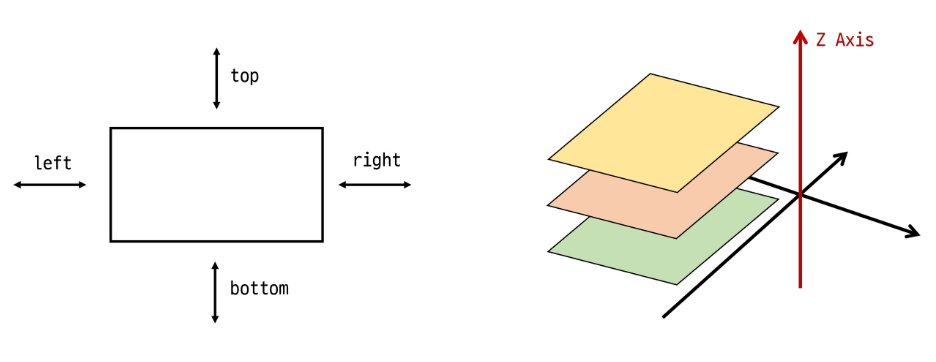


---

### Position 유형

1. static
2. relative
3. absolute
4. fixed
5. sticky

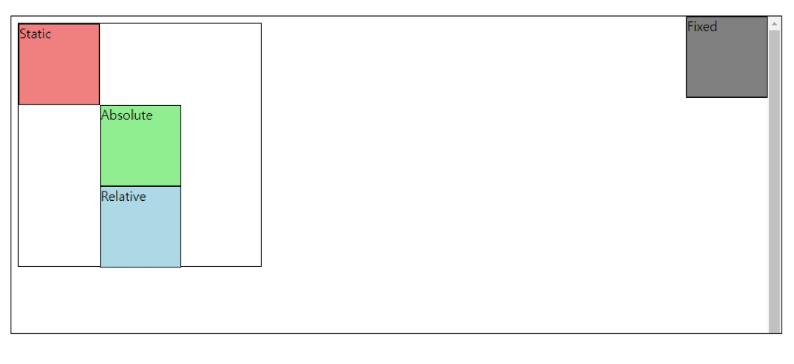


#### position 유형별 특징

- `static` 
    - 요소를 Normal Flow에 따라 배치
    - *top, right, bottom, left 속성이 적용되지 않음*
    - 기본 값

- `relative`
    - 요소를 *Normal Flow에 따라 배치*
    - 자신의 원래 위치(static)_(과거)을 기준으로 이동
    - top, right, bottom, left 속성으로 위치를 조정
    - 다른 요소의 레이아웃에 영향을 주지 않음(요소가 차지하는 공간은 **static**일 때와 같음)

- `absolute`
    - 요소를 *Normal Flow*에서 제거
    - *가장 가까운 **relative** 부모 요소를 기준으로 이동*
        - 만족하는 부모 요소가 없다면 *body 태그를 기준*으로 함
    - top, right, bottom, left 속성으로 위치를 조정
    - 문서에서 요소가 차지하는 공간이 없어짐

- `fixed`
    - 요소를 Normal Flow에서 제거(absolute와 같음)
    - **현재 화면영역(viewport)** 을 기준으로 이동
    - *스크롤해도 항상 같은 위치에 유지됨*
    - top, right, bottom, left 속성으로 위치를 조정
    - 문서에서 요소가 차지하는 공간이 없어짐

- `sticky`
    - *relative*와 *fixed*의 특성을 결합한 속성
    - 스크롤 위치가 임계점에 도달하기 전에는 relative처럼 동작
    - 스크롤이 특정 임계점에 도달하면 fixed처럼 동작하여 화면에 고정됨
    - 만약 다음 sticky요소가 나오면 다음 sticky 요소가 이전 sticky 요소의 자리를 대체 
        - 이전 sticky 요소가 고정되어 있던 위치와 다음 sticky요소가 고정되어야 할 위치가 겹치게 되기 때문

---

### `z-index`

- 요소의 쌓임 순서(stack order)를 정의하는 속성
- 정수 값을 사용해 Z축 순서를 지정
- 값이 클수록 요소가 위에 쌓이게 됨
- static이 아닌 요소에만 적용됨

#### z-index 특징

- 기본값은 auto
- 부모 요소의 z-index 값에 영향을 받음
- *같은 부모 내에서만 z-index 값을 비교*
- 부모의 z-index가 낮으면 자식의 z-index가 아무리 높아도 부모보다 위로 올라갈 수 없음
- z-index값이 같으면 HTML 문서 순서대로 쌓임

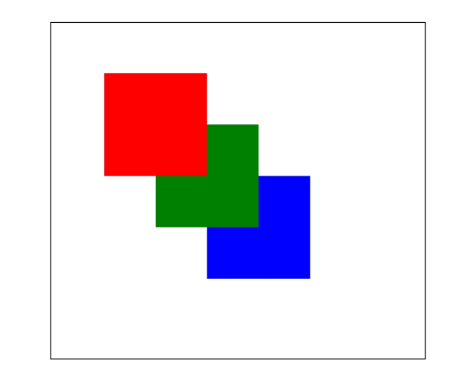

#### Position의 목적

- 전체 페이지에 대한 레이아웃을 구성하는 것보다는 **페이지 특정 항목의 위치를 조정**하는 것

---

### `CSS Flexbox`

#### Inner display type :flex

- 박스 내부의 요소들이 어떻게 배치될지를 결정
- CSS Flexbox : 요소를 행과 열 형태로 배치하는 **1차원** 레이아웃 방식
    - 공간 배열 & 정렬

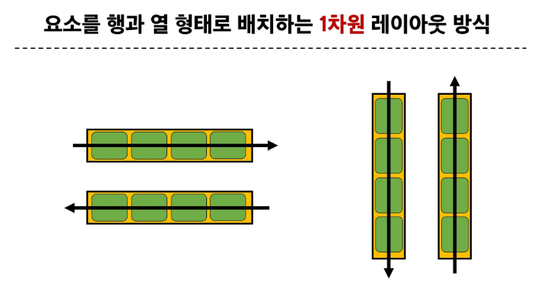

---

### Flexbox 구성 요소

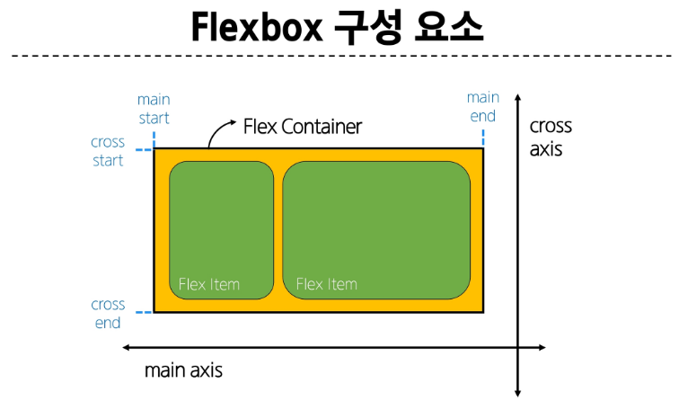

<br>  

- `main axis(주 축)`
    - flex item들이 배치되는 기본 축
    - main start에서 시작하여 main end 방향으로 배치(기본 값)

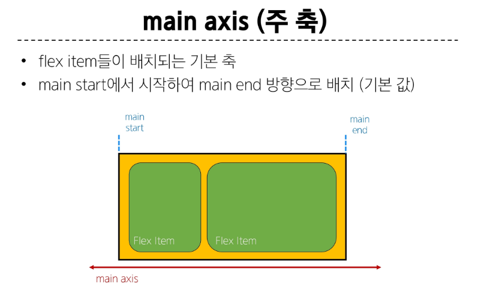

<br>

- `cross axis(교차 축)` : 외울 필요없음 main 기준
    - main axis에 수직인 축
    - cross start에서 시작하여 cross end 방향으로 배치(기본 값)
  
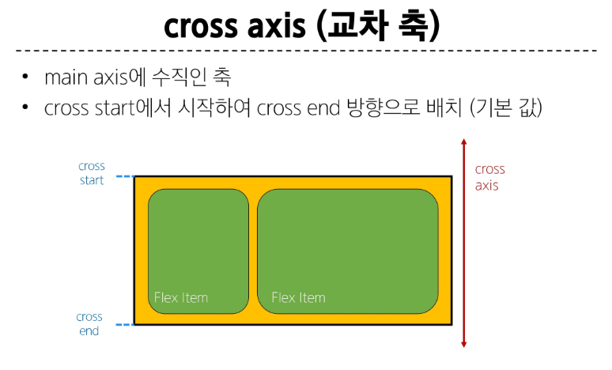

<br>

- `Flex Container`
    - *display: flex;* 혹은 *display: inline-flex;* 가 설정된 부모 요소
    - 이 컨테이너의 1차 자식 요소들이 Flex Item이 됨
    - flexbox 속성 값들을 사용하여 자식 요소 Flex Item들을 배치하는 주체
    
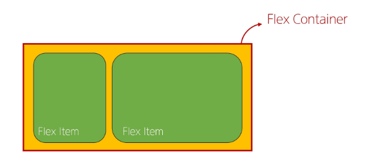

<br>

- `Flex Item`
    - Flex Container 내부에 레이아웃 되는 항목

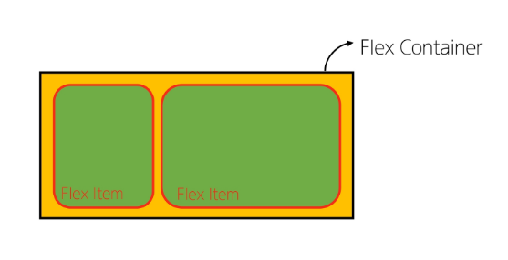

---

### Flexbox 속성

#### Flexbox 속성 목록

- Flex Container 관련 속성
    - **display, flex-direction, flex-wrap, justify-content, align-items, align-content**

- Flex Item 관련 속성
    - **align-self, flex-grow, flex-basis, order**


1. `Flex Container 지정`

- flex item은 기본적으로 행(주 축의 기본값인 가로 방향)으로 나열
- flex item은 주 축의 시작 선에서 시작
- flex item은 교차 축의 크기를 채우기 위해 늘어남

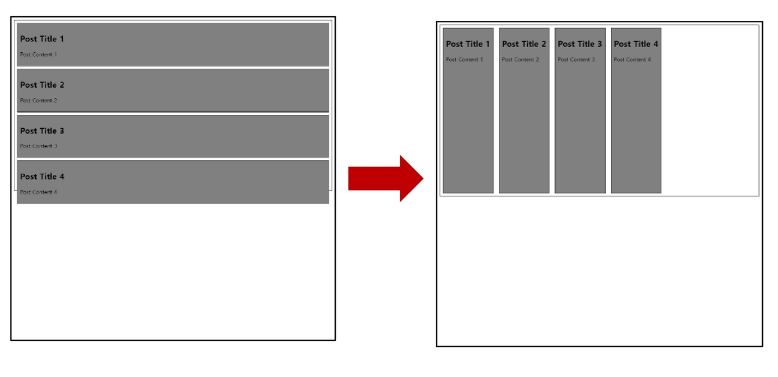

2. `Flex-direction`

- flex item이 나열되는 방향을 지정
- column으로 지정할 경우 주 축이 변경됨
- "-reverse"로 지정하면 flex item배치의 시작 선과 끝 선이 서로 바뀜

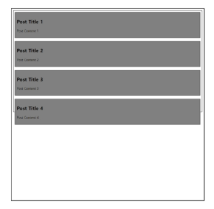


3. `Flex-wrap`

 - flex item 목록이 Flex cointainer의 한 행에 들어가지 않을 경우 다른 행에 배치할지 여부 설정

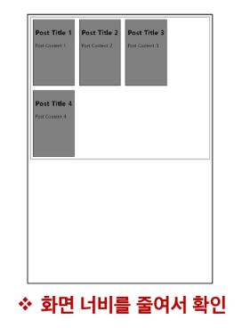

4. `justtify-content`

- 주 축을 따라 flex item과 주위에 공간을 분배

```CSS
    .container{
      /* justify-content: flex-start; */
      justify-content: center;  /*가운데 정렬*/
      /* justify-content: flex-end; */
    }
```

5. `align-content`

- 교차 축을 따라 felx item과 주위에 공간으 분배
    - *flex-wrap*이 *wrap*또는 *wrap-reverse*로 설정된 여러 행에만 적용됨
    - 한 줄 짜리 행에는 효과 없음(*flex-wrap*이 *nowrap*으로 설정된 경우)


6. `align-items`

- 교차 축을 따라 flex item 행을 정렬

7. `align-self`

- 교차 축을 따라 **개별 flex item을 정렬**

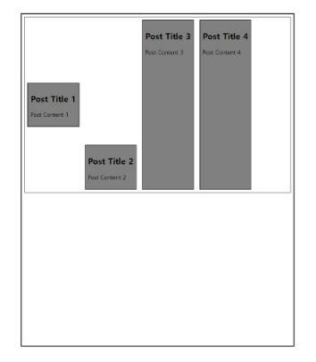

#### 목적에 따른 속성 분류

|배치|공간 분배|정렬|
|:--:|:-------:|:---:|
|flex-direction <br> flex-wrap | justify-content <br> align-content | align-items <br> align-self|

#### 속성명 Tip

|justify|align|
|:-----:|:---:|
|주 축 |교차 축|

8. `flex-grow`

- 남는 행 여백을 비율에 따라 각 flex item에 분배
    - 아이템이 컨테이너 내에서 확장하는 비율을 지정
        - *flex-grow*의 반대는 *flex-shrink*

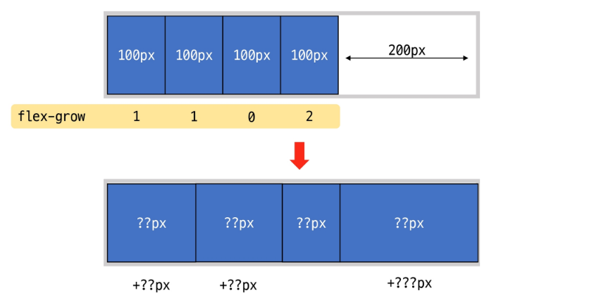

9. `flex-basis`

- flex item의 초기 크기 값을 지정
- **flex-basis**와 width 값을 동시에 적용한 경우 flex-bisis가 우선


---

### `flex-wrap 응용`

- 반응형 레이아웃 : 다양한 디바이스와 화면 크기에 자동으로 적응하여 콘텐츠를 죄적으로 표시하는 웹 레이아웃 방식

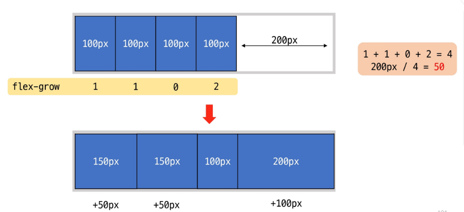


- justify-items 및 justify-self 속성이 없는 이유 : "필요 없기 때문"
    - *margin-auto*를 통해 정렬 및 배치가 가능


---
### 참고

#### 마진 상쇄

- 두 block타입 요소의 martin top과 bottom이 만나 더 큰 margin으로 결합되는 현상

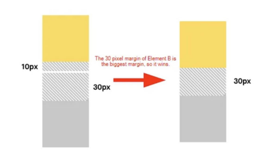

#### 마진 상쇄 이유

- 복잡한 레이아웃에서 요소 간 간격을 일관 되게 유지하기 위함
- 요소 간의 간격을 더 예측 가능하고 관리하기 쉽게 만듦
    - 일관성, 단순화

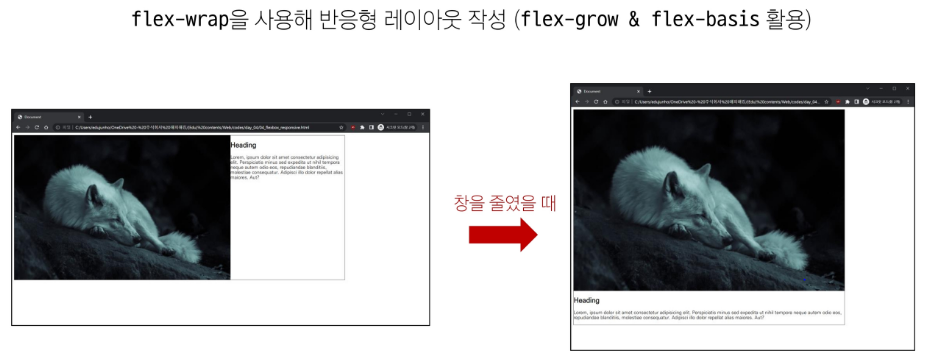


---

#### 박스 타입 별 수평 정렬

- margin : auto 사용
    - 블록 요소의 너비를 지정하고 좌우 마진을 auto로 설정

```CSS
.box{
    width: 100px;
    height: 100px;
    background-color: crimson;
    border: 1px solid black;

}

.margin-auto{
    margin: 0 auto;
}

<div class="margin-auto">
</div>
```

- text-align 사용
    - 부모 요소에 적용

```CSS
.text-center{
    text-align: center;
}

<div class="text-center">
    <span>inline 요소</span>
</div>
```
---


#### 실제 position 활용 예시

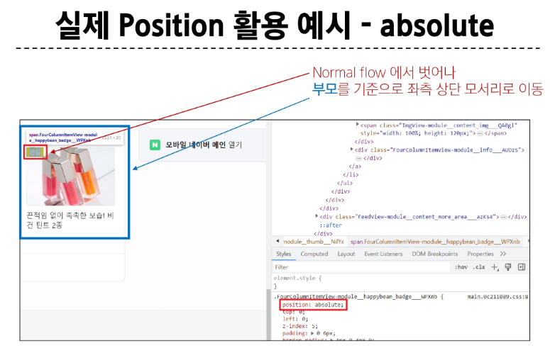

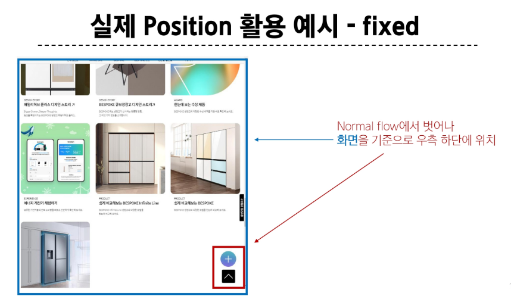

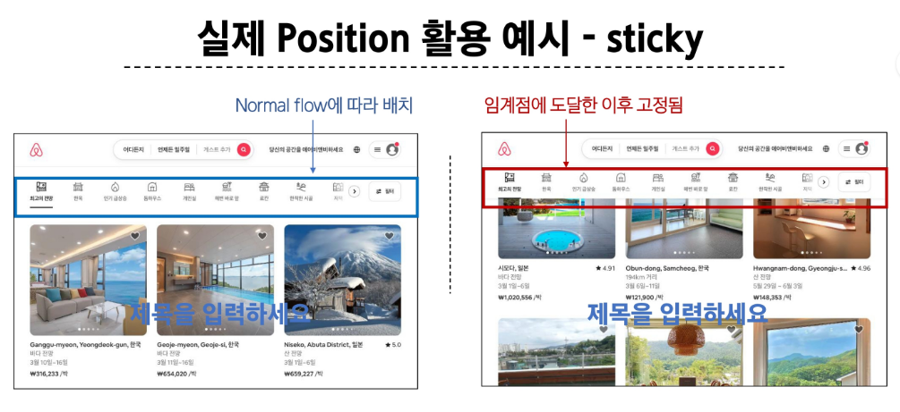

---

### Flexbox Shorthand 속성

``` CSS
.container{
    flex-flow: flex-direction flex-wrap;
}

```

---

### Flexbox 속성 정리

- flex-direction

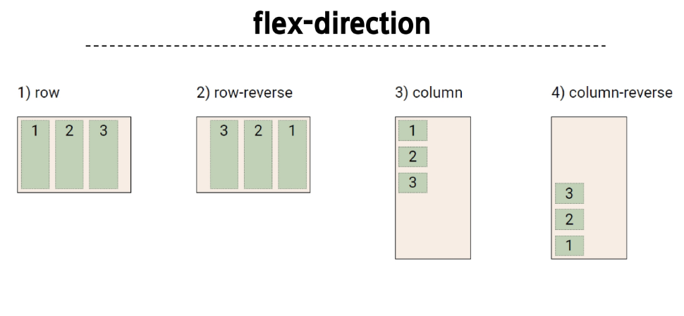

- flex-wrap


- justify-content


- align- content

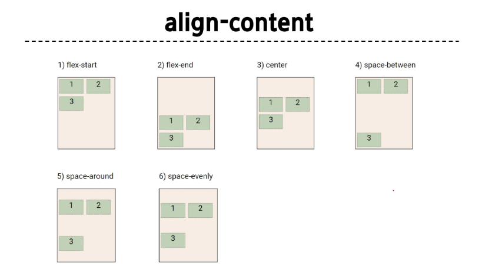

- align-items

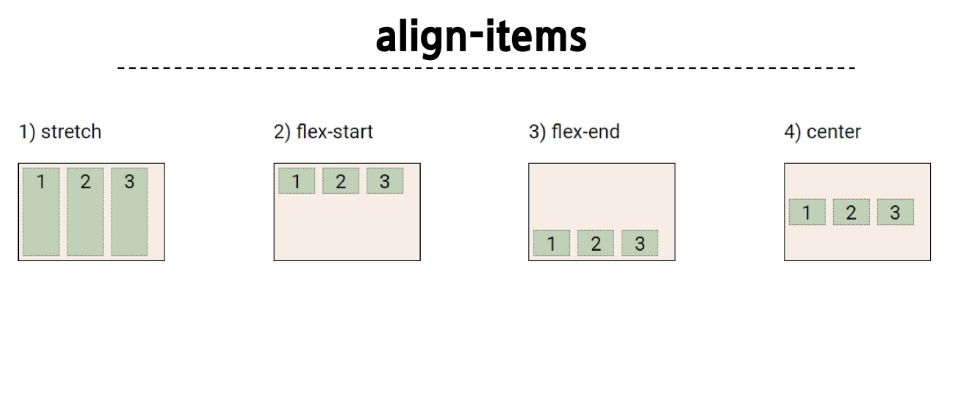

- align-self

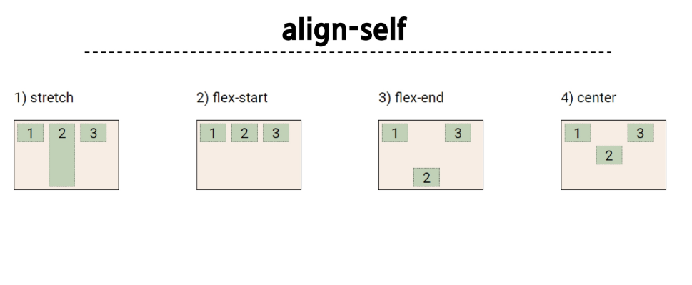

