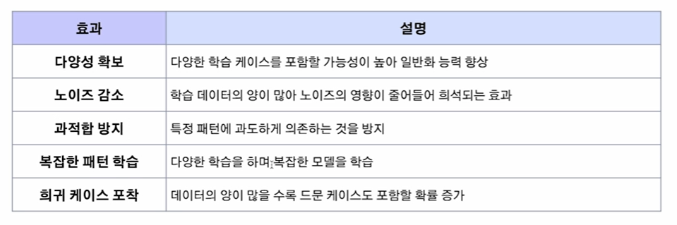
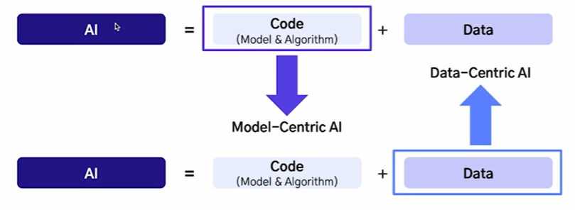

# 2024-12-02(월) AI코스 - Centric AI

### Index

1. 데이터와 AI 모델

    - 형식에 따른 데이터의 종류

    - 모델 훈련에 따른 데이터의 종류

    - 데이터가 AI 모델에 미치는 영향

2. Model-Centric AI, Data-Centric AI

    - Model-Centric AI
  
    - Data-Centric AI

---

### `01. 데이터와 AI 모델`

#### AI = Code + Data

- AI 시스템은 코드(모델 및 알고리즘)와 데이터로 구성

  

#### 형식에 따른 데이터

  

1) `정형 데이터`

    - **정의** : 고정된 형식과 구조를 갖는 데이터

    - **예시** : 엑셀, MySQL, 관계형 DB등

    🔅 활용 예시

    - 거래 금액, 시근 등으로 사기 거래 탐지

    - 환자의 나이, 혈압, 혈당, 콜레스테롤 수치 등으로 환자 진단 질병 예측

      

    2) `반정형 데이터`

      - **정의** : 고정된 형태는 없으나 특정한 구조를 갖춘 데이터

      - **예시** : JSON, XML, HTML 등

      🔅 활용 예시

      - 로그 데이터 이상 탐지 ( 서버 로그에서 이상 트래픽 탐지)

      - JSON 데이터의 텍스트 기반 정보를 추출하여 요약 작업 수행

      

    3) `비정형 데이터`

        - **정의** : 특정한 구조가 없는 데이터

        - **예시** : 텍스트, 이미지, 비디오 등

      🔅 활용 예시

      - 자율주행 차량의 차선 및 보행자 인식

      - 의료 분야에서 CT, MRI 데이터 분석

      

#### 모델 훈련에 따른 데이터의 종류

1) `지도학습 (Supervised Learning)`

- 입력 데이터와 이에 대응하는 **정답 레이블이 제공되는 데이터셋**을 사용하여 모델 학습

- 새로운 데이터가 주어졌을 때 정답을 예측할 수 있도록 함

🔅 대표 알고리즘

- **분류(Classfication)** : 데이터가 특정 범주에 속하는지 예측

- **회귀(Regression)** : 데이터의 연속적인 값을 예측

  

2) `비지도학습(Unsupervised Learning)`

- **정답 레이블이 없는 데이터셋**을 사용하여 데이터의 패턴이나 구조 학습

- 주로 데이터의 분포, 군집, 특징을 탐색

🔅 대표 알고리즘

- **군집화(Clustering)** : 데이터를 유사한 그룹으로 나눔

- **차원 축소(Demensionality Reduction)** : 데이터의 차원을 줄이면서 특성 유지

  

#### 데이터는 AI 모델의 연료

- 데이터가 AI 시스템에서 큰 비중을 차지하는 만큼, 데이터의 품질은 AI 성능에 직접적으로 연결됨

  

#### 데이터의 크기 - 중요성

  

  

#### 데이터의 크기 - 크기가 부족할 때 생기는 문제

- **과적합(Overfitting)**

  - 정의 : 모델이 **훈련 데이터의 특징들을 과도하게 반영**하여 새로운 데이터에 대한 **일반화 성능이 떨어지는 현상**

  - 원인 : **데이터가 부족하여** 훈련 데이터 내 포함된 노이즈 데이터를 정상적인 패턴으로 인식하고 학습

    

#### 데이터의 품질

- 데이터의 크기도 중요하지만, 품질이 낮은 채 크기만 크다면 좋은 데이터라 할 수 없음

- 데이터의 유형별로 **품질을 평가할 수 있는 여러 기준을 세우고** 이에 따라 관리하는 것이 중요

  

#### 데이터의 품질 - AI 모델에 미치는 영향

  

---

### `02. Model-Centric Ai, Data-Centric AI`

#### Model-Centric AI와 Data-Centric AI 차이점

  

#### Model-Centric AI

- 정의 : AI 시스템 개발에서 **모델을 중심으로 접근**하는 방법론

- 데이터를 일정 수준 고정 혹은 제한하고 **모델 자체의 설계와 최적화에 집중**

- 과거부터 지금까지 주로 사용되는 AI 시스템 개발의 주 접근 방식

- BERT, GPT, ResNet 등이 Model-Centric AI의 산물이라 볼 수 있음

  

#### Model-Centric AI - 주요 목적

  

#### Modelc-Centric AI - 한계 및 사례

  

#### 다른 방법론의 필요성

- 과거 연구의 트렌드 : Task에 맞는 데이터를 대량으로 집어 넣고 **노이즈를 잘 걸러내는 모델**을 만드는 것 (BERT 등)

- **최근 연구**의 트렌드 : 사전 학습 모델에 **소량의 고품질 데이터**를 확보하여 Fine-Tuning 하는 것

- AI 시스템에서 데이터가 차지하는 비율이 80%

  

#### Data-Centric AI

- AI 시스템 개발에서 **데이터를 중심으로 접근**하는 방법론

- 데이터가 AI 성능의 핵심이라는 인식에서 출발

- 모델의 구조를 고정 혹은 최소한의 조정 후 데이터 품질에 노력을 기울임

- 2020년대에 들어 주목받기 시작한 접근 방식

🔅 필요성

- 모델 성능을 종합적으로 평가할 수 있는 데이터셋이 필요

- 실전에서는 소량의 데이터가 반복적으로 생성되므로 좋은 데이터셋을 생성하는 알고리즘 필요

  

#### Data-Centric AI의 목표

1) **Training Data Development**

    - 훈련 데이터는 모델 학습의 기초로, 고품질의 데이터를 구성하는 것이 중요

🔅 종류

- **Data Collection** : 새로운 데이터 구축 또는 기존 데이터셋 통합

- **Data Labeling** : 수집한 데이터들에 라벨을 부여하여 학습 가능한 형태로 만듦

- **Data Preparation** : 데이터 정제, 특징 추출, 표준화 및 정규화를 통해 학습 준비

- **Data Reduction** : 특징 선택, 차원 축소 등을 통해 데이터의 크기와 복잡성 감소

- **Data Augmentation** : 데이터를 더 수집하지 않고 다양성을 높임

---

2) **Inference Data Development**

    - 추론 데이터는 모델의 성능 평가를 위한 테스트와 검증 데이터로 사용됨

🔅 종류

- In Distribution Evaluation : training 데이터와 **같은 분포를 가진 데이터셋**으로 모델 성능 평가

- Out of Distribution Evaluation : **다른 분포를 가진 데이터셋**으로 성능 평가

---

3) **Data Maintenance**

    - AI 시스템 운영 환경에서는 데이터가 지속적으로  변화하며, 데이터 유지 관리가 필수

🔅 종류

- Data Understanding : 데이터의 특성을 전반적으로 이해할 수 있는 알고리즘

- Data Quality Assurance : 데이터의 퀄리티를 평가할 수 있는 Metric을 개발

- Data Storage & Retrieval : 데이터를 효율적으로 저장하고 빠르게 검색할 수 있도록 관리

#### Model-Centric AI와 Data-Centric AI의 비교

  

#### Model-Centric AI와 Data-Centric AI는 상호 보완적

- AI 시스템 개발에서 데이터와 모델 모두 최적화 하는 것이 중요함

- 적은 양의 데이터를 활용할 수 있는 Model-Centric AI도 중요함

- Data-Centric AI의 중요도에 비해 연구가 부족한 상황

  

---

### Summary

1. 데이터와 AI 모델

- 형식에 따른 데이터 종류 - 정형, 반정형, 비정형 데이터

- 모델 훈련에 따른 데이터 종류 - 지도학습 : 라벨 있는 데이터, 비지도 학습 : 라벨 없는 데이터

- 데이터가 AI 모델에 미치는 영향 - 크기와 다양성이 부족하면 모델의 일반화 성능 감소

2. Model-Centric AI, Data-Centric AI

- Model-Centric AI - 데이터를 고정하고 모델 구조에 집중하는 AI 시스템 개발 방식

- Data-Centric AI - 모델을 고정하고 데이터에 집중하는 AI 시스템 개발 방식

---

### 좋은 데이터와 나쁜 데이터의 차이, 데이터 품질의 중요성

### Index

1. 데이터의 품질

    - 데이터 품질의 정의

    - 데이터 품질의 여러 가지 유형

2. 데이터의 품질 관리

    - 데이터 품질 관리의 중요성

    - 품질 측정 및 지수

    - 좋은 데이터의 사례

---

### 1. 데이터의 품질

#### 폭발적으로 증가하는 데이터

- 2000년대 초반 ~ 2023년까지 생산한 데이터의 양이 90ZB(제타 바이트)에 달함

- 이는 그 이전 5000년간 쌓은 데이터의 3000배가 넘는 수치

- 1인당 일주일에 1TB 용량의 데이터를 생성하는 것과 같은 상황

  

#### 데이터의 품질에 대한 정의

- 데이터 유형(정형, 비정형)에 따라 다르지만, 일반적인 데이터 품질 기준의 정의는 다음과 같음

- 쉽게 말하면, **AI 모델이 학습하기에 얼마나 완전하고 정확하게 구축되었는가?**

  

#### 1) 완전성

  

🔅 완전성이 지켜지지 않은 경우

- AI 모델이 학습할 수 있는 정보가 줄어들고 중요한 정보가 손실될 수 있음

#### 2) 유일성

  

🔅 유일성이 지켜지지 않은 경우

- 중복된 특정 패턴을 과대평가하여 불균형한 모델이 만들어짐

- 불필요한 학습 시간과 연산 자원 추가로 인한 낭비

#### 3) 유효성

  

🔅 유효성이 지켜지지 않은 경우

- 비현실적인 결과를 출력 ( 예 : 기대수명 330세)

#### 4) 일관성

  

🔅 일관성이 지켜지지 않은 경우

- 모델이 서로 상충되는 데이터를 학습하여 혼란이 가중될 수 있음

- 편향된 결과를 도출하거나 일반화 성능 저하

#### 5) 정확성

  

🔅 정확성이 지켜지지 않은 경우

- 모델이 잘못된 패턴을 학습하여 신뢰성이 떨어지는 결과를 출력

- 윤리적 혹은 법적 문제 발생

#### 6) 적시성

- 주식 예측 모델 등 경우에 따라 데이터의 최신 정보가 필요할 수 있음

- 만약 데이터가 오래되어 최신 정보를 반영하지 못하면, 현재에 맞지 않는 부정확한 결과를 출력할 수 있음

  

---

### 최소 품질의 기준

- 데이터의 양이 많을 경우 모든 품질 기준 항목을 완벽히 맞추기는 불가능에 가까움

- 비율을 정해 최소 품질 달성 기준을 설정하는 것도 좋은 방법

  

- 이러한 기준은 예시이며, 문제 해결의 목적에 따라 조정 가능

  

#### 비정형 데이터의 품질

- 이미지, 동영상, 오디오 등 정형화되지 않은 데이터

- 각 데이터 유형 별로 품질 기준을 정의하는 것이 모두 다름

  

#### 비정형 데이터의 품질 - 예시

#### 1) 이미지 데이터

  

#### 2) 오디오 데이터

  

#### 나쁜 데이터, 저품질 데이터

- 데이터 품질 정의 기준에 맞지 않는 데이터들

  

