# LLM과 실제 현업 적용 사례

### Index

- Large Language Models

- Industrial Applications of LLM

---

### `Large Language Models`

- History of (Large) Language Models

  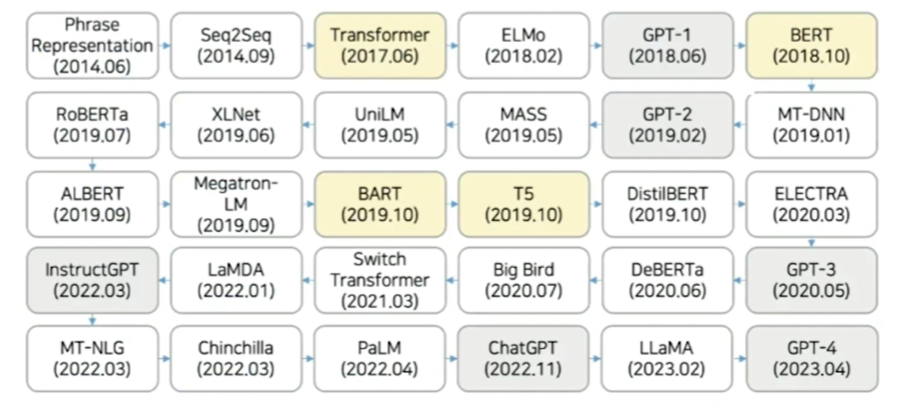

---

#### **Transfomer ( 2017.06 )**

- 내부에 인코더(ex. 문장이 들어왔을때 컴퓨터가 잘 이해할 수 있게 하는 역할) 파트와 디코더(ex. 사람들이 잘 이해할 수 있게 답변을 생성해주는 역할) 파트가 존재하며 이 둘 사이를 이어주는 연결고리가 존재

  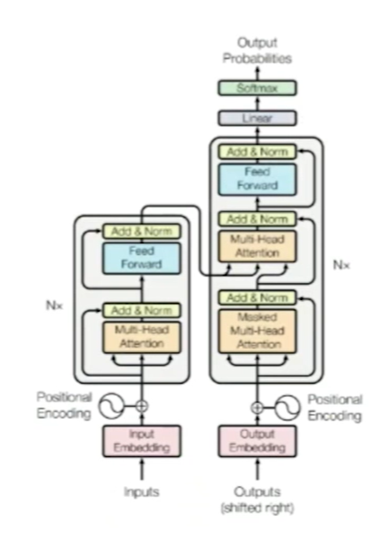

ps) 추가 논문 - Attention is all you need

#### Trnasformer의 개괄적 구조

- (오리지널 버전에서는 여섯개의 인코더와 여섯개의 디코더를 사용)

  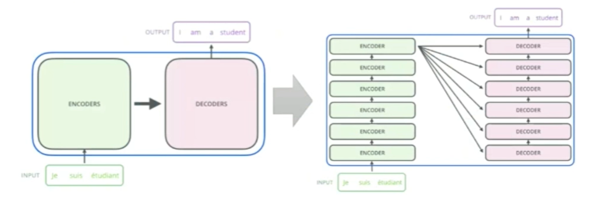

---

#### **B**idirectional **E**ncoder **R**epresentations from **T**ransformer(BERT) (2018.10)

- Transformer의 인코더 구조만 사용

- 번역 모델이 아닌 범용 모델이므로 대용량의 코퍼스를 사용하여 두 가지 과업을 학습

  - Masked language model(MLM) : bidirectional pre-training for language representations

  - Next sentence prediction (NSP)

    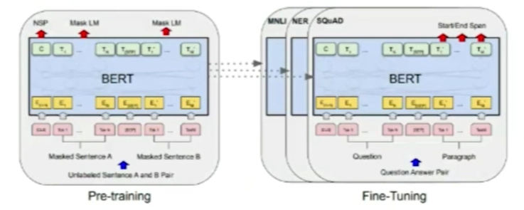

  - 사전 학습된 BERT는 이후 단순한 출력 레이어를 추가하는 것만으로도 다양한 자연어처리 과업에서 SOTA 성능을 달성

---

### **B**idirectional and **A**uto-**R**egressive **T**ransformer(BART) (2019.10)

- Original Transformer는 기계 번역을 위해 제안됨

  - Source-target의 paired dataset을 통한 superviesed learning 방식

- BART 아이디어 : Transformer 구조를 사용해서 self-supervised learning을 학습하는 방법

  - 입력 token을 단순 masking하는 것이 아니라 corruption 시켜서 사용하는 방법

  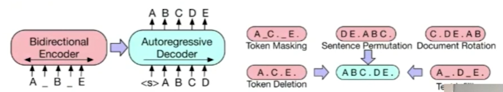

---

#### Exploring the Limits of **T**ransfer Learning with a Unified **T**ext-**t**o-**T**ext **T**ransformer(T5) (2019.10)

- 모든 언어 문제를 text-to-text format으로 변환하는 통합된 프레임워크 unified framework

- 기본적인 구조는 Original Transformer의 구조를 그대로 따름

  - 차이점 : Layer Normalization, Position Embedding

  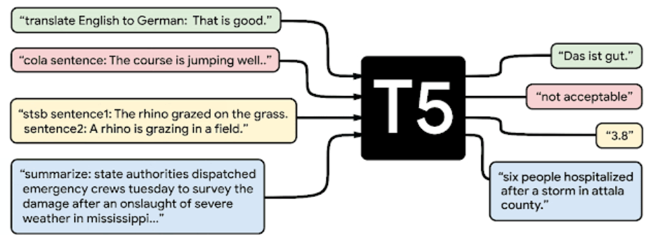

---

#### **G**enerative **P**re-**T**raining of a Language Model(GPT-1) (2018.06)

- 비지도 학습 기반의 사전 학습

- Transformer의 디코더 (12 Layers)만 사용한 언어 모델

- 사전 학습 objective : Language Modeling (Auto-Regressive)
  - 주어진 token sequence를 바탕으로 next token 예측

    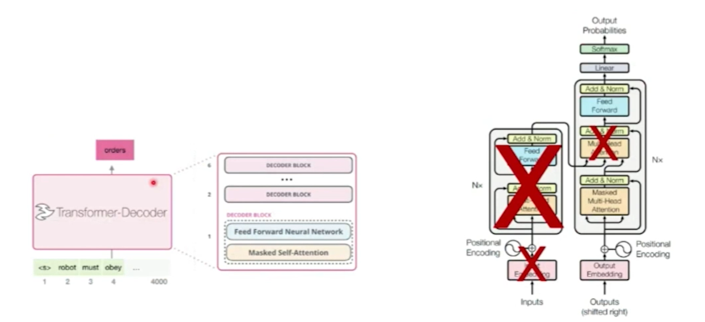

---

#### GPT-2(2019.02)

- Fine-tuning 없이 zero-shot으로 downstream task를 풀 수 있는 방법은 없을까?

  - 직접 구축한 대량의 데이터셋을 이용하여 더 많은 parameters로 구성된 무델을 설계

  - Zero-shot inference : 대용량 데이터로 모델을 사전 학습하면 downstream task에 관한 정보를 배우게 됨 (Input에 task에 대한 지시사항(prompt)를 추가하면 zero-shot으로 정답 생성 가능)

- GPT-1 과 GPT-2의 차이점?

  - GPT-1의 구조를 확장시켜 더 많은 데이터를 이용해 잘 학습시킨 모델

  - GPT-2의 토큰 개수 : 1024개(GPT-1은 512개)

    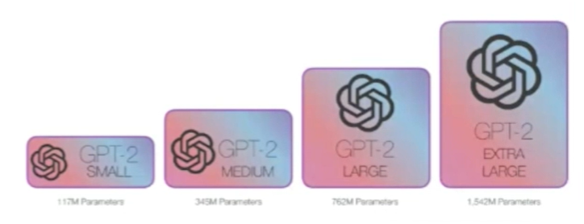

---

#### GPT-3 (2020.05) : Language Models are Few-Shot Learners

- 사전 학습된 언어 모델

  - 장점 : 과업 의존적 구조를 사용하지 않고도 미세 조정이 가능

  - 단점 : 구조는 과업에 의존적이지 않으나 task-agnostic, **미세조정을 위해서는 여전히 해당 과업의 데이터셋이 필요**
  
  - 이러한 문제점을 해결할 수 있다면 (1) 과업에 따른 충분한 Labeled 데이터를 확보하지 않아도 되며, (2) 모델의 표현력 증대와 제한적인 학습 데이터로 이냏 발생하는 spurious correlation의 위험을 감소시킬 수 있음

  - 실제로 사람은 언어를 배울 때 모든 Supervised Task 데이터셋을 필요로 하지 않음

- **메타 러닝(Meta-learning)** : 미세조정용 데에터셋을 사용하지 않아도 되는 대안

  - In-context learning : 학습 과정에서 다양한 형태의 문제를 풀어낼 수 있는 역량을 기르도록 설계

  - 모델이 task에 대한 정보를 참고해서 inference할 수 있도록 input에 예제(demonstarations) 추가

- 문제점

  - 사실을 지어내거나, 편향적이거나, 유해한 텍스트를 생성하거나, 사용자 지시를 따르지 않는 경우 발생

  - Language Modeling Objective ≠ 사용자의 지시를 안전하고 유용하게 따르기 (misaligned)

  - Alignment : 인간의 의도에 맞게 동작하도록 LM을 조정하는 것(Helpful, Honest, Harmless)

---

#### InstructGPT(2022.03) : Reinforcement Learning with Human Feedback, RLHF

- 인간의 피드백을 통한 강화학습으로 광범위한 지시사항을 따를 수 있도록 GPT-3를 fine-tuning

- 인간의 평가(선호도)를 Reward로 사용

- 사용자가 제공하는 prompts에 대해 적합한 모델의 결과를 human labeler가 제공하고, 모델의 다양한 결과물에 대해 ranking을 매긴 후 이를 GPT-3 fine-tuning에 사용

- 이러한 방식으로 학습된 InstructGPT는 GPT-3에 비해 사용자의 instruction을 훨씬 잘 수행함

- 심지어 human labeler들은 1.3B InstructGPT를 175B GPT-3보다 선호함(결과가 더 사람이 보기에 낫다는 의미)

- Safety가 강조된 버전

  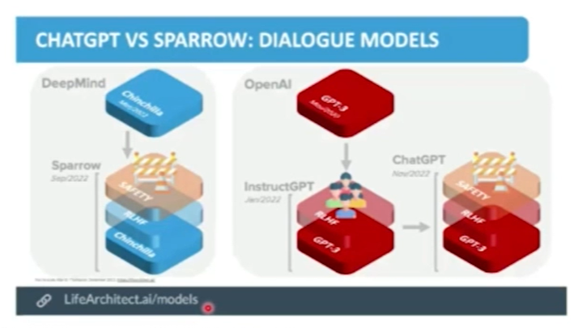

- 예제 데이터 수집 : 대화 형식에 focusing하여 데이터셋 구성

---

#### GPT-4(2023.03)

- 텍스트 뿐만 아니라 이미지도 인식할 수 있는 **멀티모달** 버전

- GPT-3.5 버전에 비해 크게 확장된 규모와 개선된 성능을 통해 다양한 테스트에서 훨씬 더 우수한 테스트 점수 획득

  - 더 정교한 언어 이해 및 생성 능력, 더 나은 문맥 파악. 훨씬 더 다양한 작업 수행 능력.

  - 복잡한 질문에 대한 답변, 논리적 추론, 창의적인 작문 등의 작업에서 상당히 향상된 결과를 보여줌.

  - 사용자와의 상호작용에서 보다 정확하고 자연스러운 대화를 제공

- 비전 정보를 포함함으로써 많은 Tasks에서 보다 향상된 성능을 나타내는 것을 확인

---

#### Retrieval-Augmented Generation (RAG)

- Query Encode : Dense Passage Retriever (DPR) Query Encoder 이용

- Passage Encoder : DPR Passage Encoder 이용

- Generator : BART Large

  - Query가 입력되면 Query Encoder를 통과하여 representation(q(x)) 생성

  - q(x)와 가장 가까운(Inner Product 기준) {5, 10}개의 Passage탐색

  - Passage를 기존 Query와 concat하여 Generator Input으로 사용하고 각 Passage 별 생성결과를 Marginalize하여 최종 결과물 도출

    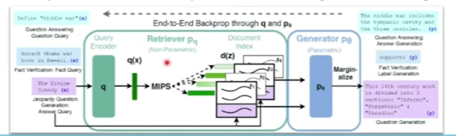

---

### `Industrial Applications of LLM`

#### 낚시성 기사 탐지

- 제목, 부제목, 본문, 이미지 캡션을 활용하여 제목과 본문의 불일치 문서 탐지

- Attention 기반의 모델(Attention-based Hierarchical Model)

- 비교 모델 중 가장 좋은 성능을 나타냄

- 부제목이 있는 상태로 낚시성 기사 탐지 성능이 훨씬 좋음

  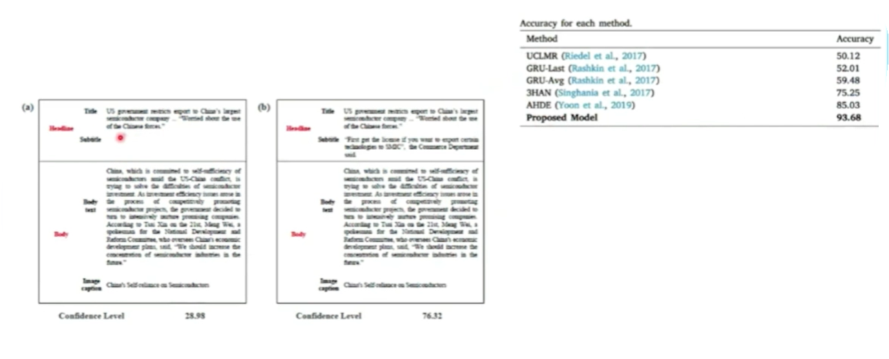

#### 뉴스 부제목 생성 모델

- 뉴스의 중요한 요소인 "제목"을 잘 반영한 부제목 생성 알고리즘

- 실제 제목 : "'코로나 19 극복 함께해요'... 대구.경북에 성금.물품 답지"

- 실제 부제목 : "착한 임대인 운동 공공기관에 확산..군부대는 방역 지원"

    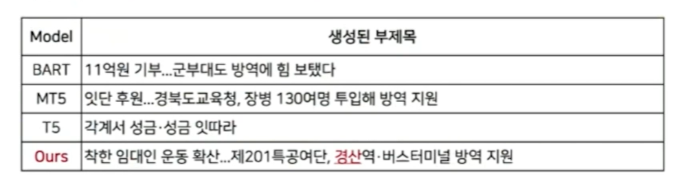

#### 금융 문서 감성 분석

- 미국의 8-k 공시문서 기반의 감성 분석 기반의 주식 가격 움직임 예측

  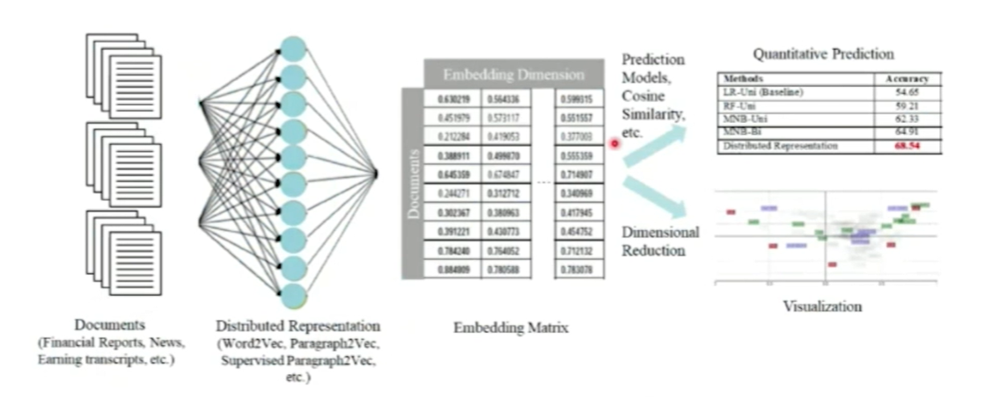

- 기업별 문서 감정과 주가 흐름 경향

  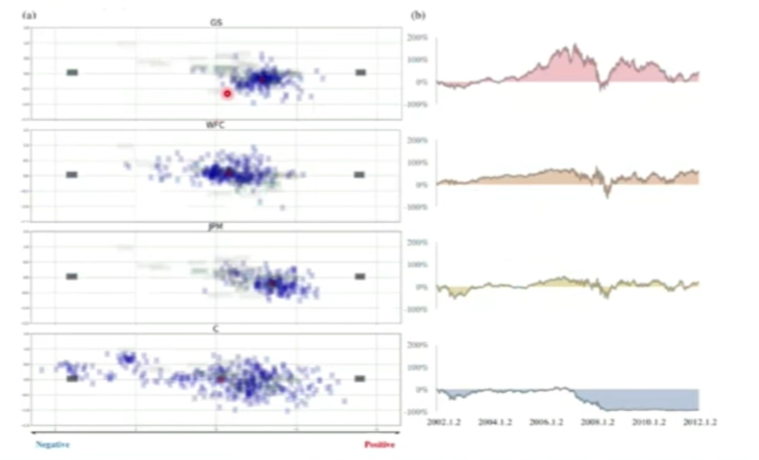

#### AutoESG : Automated ESG Scoring Framework(ongoing)

- Overall framework using Large Language Model(LLM)

  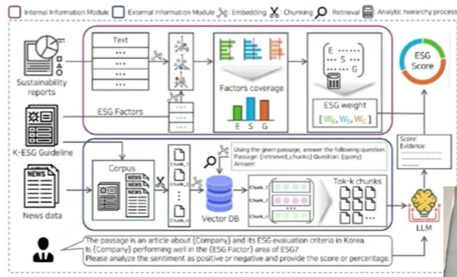