# 데이터 수집 시 고려해야 할 사항

### Index

1. 데이터 수집의 목적 정의

    - 문제 정의와 목표 설정의 중요성

    - 목적에 맞는 데이터 요구사항 분석

    - 다양하고 풍부한 데이터 확보

    - 데이터 수집의 범위와 한계 설정

    - 목적에 따른 목표 데이터 예시

2. 법적 / 윤리적 고려 사항

    - 개인정보 보호 및 프라이버시 문제의 심각성

    - 윤리적 데이터 수집과 책임

    - 법적 고려사항을 반영한 데이터 수집 계획

    - 데이터 편향과 공정성 문제

---

### `01. 데이터 수집의 목적 정의`

#### 문제 정의와 목표 설정의 중요성

1) 목표 설정이 중요한 이유

    - 데이터 수집 전에 목표를 명확히 정의하면 **필요한 데이터의 형태**와 특성을 파악할 수 있음

    - 불필요한 데이터 수집을 방지하고, **고품질의 데이터를 확보**할 수 있음

2) 목표를 잘못 설정한 경우

    - 데이터의 **품질 저하**로 AI모델의 성능이 떨어질 수 있음

    - **시간과 자원의 낭비**로 이어짐

---

#### 목적에 맞는 데이터 요구사항 분석

#### 사례

- 모델에 필요한 데이터 유형 : **텍스트**, **이미지**, **음성** 등

- 감정 분석 모델에는 **레이블된 텍스트 데이터**가 필요

- 이미지 분류 모델은 **이미지 정보와 정확한 카테고리 레이블**이 필요

  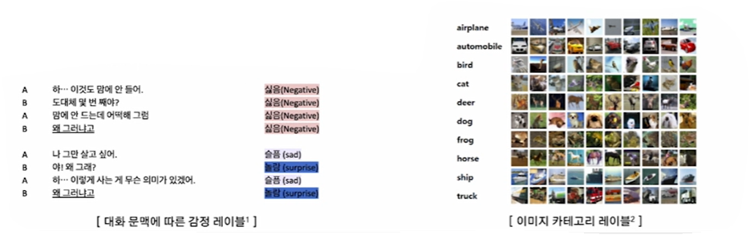

---

#### 다양하고 풍부한 데이터 확보

#### 1) 데이터의 다양성

  - 다양한 특성(연령, 성별, 지역 등)을 가진 데이터는 모델의 **일반화 성능**을 향상

|**예시**|**구체적인 데이터 예시**|**기대 효과**|
|:-----:|:---------------------:|:----------:|
|**음성 인식 모델**| - 여러 국가의 억양    - 시끄러운 거리 소음에서의 음성 | - 다양한 사용자 환경에서도 높은 인식률    - 억양과 배경 소음의 다양성이 높을수록 더 정확한 인식이 가능 |
|**챗봇 모델**| - 여러 언어의 대화    - 구어체와 문어체 혼합된 텍스트 | - 다국어 지원 및 문맥에 따른 정확한 답변    - 다양한 언어와 표현 방식에 대응할 수 있어야 다국적 사용자와 원활히 소통 가능 |

#### 2) 데이터의 풍부성

- 모델 학습에 사용되는 **데이터의 양**을 의미

- 충분한 양의 데이터는 모델이 **더 많은 패턴과 관계를 학습**할 수 있도록 도움

- 데이터 양이 적으면 **과적합(overfitting)** 될 가능성이 높아짐

- 충분한 데이터는 **모델의 신뢰성**을 높임

🔅 **과적합(overfitting)**

- 모델이 **학습 데이터에 너무 지나치게 적응**하여 새로운 데이터(테스트 데이터)에는 제대로 일반화되지 못하는 상황

- 학습 데이터에 대한 정확도는 높지만 **실제 상황에서의 예측 성능이 떨어짐**

  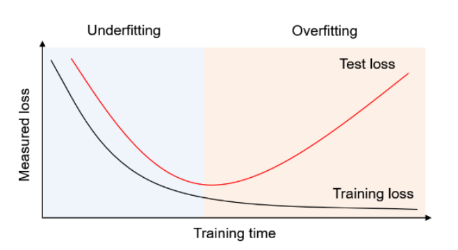

#### 3) 데이터의 정확성

- 데이터의 정확성은 수집된 데이터가 얼마나 정확하고 **신뢰**할 수 있는지를 나타냄

- 모델이 **정확한 정보**를 기반으로 학습해야 함

- 잘못된 데이터는 **모델 학습을 왜곡**

- **노이즈(noise)** 가 섞인 데이터는 모델의 신뢰성을 저하

🔅 **노이즈(noise)**

- 데이터에 포함된 **불필요**하거나 **잘못된 정보**

- 모델이 학습해야 할 **유용한 패턴을 방해**하여 성능 저하

- 예시 : 잘못된 레이블, 부정확한 측정값, 오타 등

  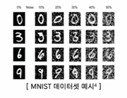

---

#### 데이터 수집의 범위와 한계 설정

#### 1) 범위 설정의 중요성

- 불필요한 데이터 수집을 줄여 효율성을 높임

- 데이터 범위를 설정하여 정확한 목표에 맞춘 수집 가능

#### 2) 한계 설정

- 법적, 윤리적 제한 사항을 고려하여 데이터 수집

- 예시 : 개인정보를 포함한 데이터 수집 시 법적 절차 준수 필요

---

#### 목적에 따른 목표 데이터 예시

#### 1) 목적 : 고객 리뷰의 감정(긍정, 부정 중립) 분류

|**예시**|**목표를 명확히 정의한 경우**|**목표를 명확히 정의하지 않은 경우**|
|:-----:|:------:|:------:|
|**감정 분석 AI 모델**|- 필요한 데이터 : 제품 리뷰, SNS 포스터 등의 **레이블링된 텍스트 데이터**    - 수집된 데이터는 감정(긍정, 부정, 중립)이 **명확하게 레이블링**되어 있어야 함    - 특정 언어, 문제, 그리고 **특정 제품 카테고리**에 대한 데이터로 집중하여 모델의 예측 정확도를 높임| - 관련 없는 주제의 리뷰는 SNS 데이터를 무작위로 수집하여 **정확도 저하**    - 불필요한 언어 및 중복된 데이터를 포함해 **처리 비용과 시간 증가**    - 감정 분석에 필요하지 않은 비정형 데이터가 포함되어 모델 성능이 저하됨|

#### 2) 목적 : 특정 질병(예:폐암)을 조기에 진단하기 위한 AI 모델 개발

|**예시**|**목표를 명확히 정의한 경우**|**목표를 명확히 정의하지 않은 경우**|
|:-----:|:------:|:------:|
|**의료 진단 AI 모델**|- 필요한 데이터 : 환자의 **CT 스캔 이미지** 및 해당 진단 결과 레이블    - 데이터의 **해상도와 포맷**을 사전에 설정하여, 일관성 있는 이미지 수집    - 특정 연령대, 성별, 지역을 고려해 **대표성 있는 데이터** 확보 | - 다양한 질병의 의료 이미지를 무작위로 수집하여 **분석 혼선 발생**    - 관련 없는 진단 정보를 포함해 모델 훈련 시 **오류 발생 가능성 증가**    - 환자 개인정보를 보호하지 않고 수집하여 **법적 문제 초래**|

#### 3) 목적 : 자율주행 차량이 도로 상황 인식 및 장애물 회피

|**예시**|**목표를 명확히 정의한 경우**|**목표를 명확히 정의하지 않은 경우**|
|:-----:|:------:|:------:|
|**자율주행 도로 인식 모델**|- 필요한 데이터 : **다양한 날씨**, **시간대**, **도로 조건**에서 촬영된 도로 이미지와 비디오    - 도로 표지판, 차선, 보행자 등 **특정 객체에 대한 레이블링**이 포함된 데이터 확보    - 도심, 고속도로, 주거 지역 등 다양한 **환경 데이터를 포함**하여 모델의 일반화 성능 향상 | - 단일 날씨 조건(맑은 날)이나 특정 지역에서만 데이터를 수집해 **다양한 상황에서 작동하지 않음**    - 보행자나 도로 표지판 등의 레이블이 누락된 데이터로 훈련 시 **안전 문제** 발생 가능    - 불필요한 객체가 포함된 데이터를 사용해 모델의 **혼란 가중**|

#### 4) 목적 : 고객 문의 자동 응답

|**예시**|**목표를 명확히 정의한 경우**|**목표를 명확히 정의하지 않은 경우**|
|:-----:|:------:|:------:|
|**챗봇 AI 모델**|- 필요한 데이터 : **FAQ(Frequently Asked Questions), 고객 문의 데이터**와 이에 대한 답변 사례    - 특정 산업 및 국가(한국의 은행 챗봇은 금융과 한국어에 집중된 데이터)에 맞춘 **특화된 데이터 수집**    - 문맥과 질문 의도에 따라 **정확한 레이블링**을 통해 챗봇의 응답 정확도 향상 | - 범용 대화 데이터만 수집하여 특정 도메인에서의 **응답 부정확**    - 여러 언어의 데이터를 섞어 수집해 **챗봇의 언어 처리 혼란** 초래    - 중복된 데이터나 불필요한 대화 내용으로 인해 **모델 학습 시간 증가**|

---

### `02. 법적 / 윤리적 고려 사항`

#### 개인정보 보호 및 프라이버시 문제의 심각성

#### 1) 개인정보 보호

- AI 모델 개발 시 개인의 데이터를 수집할 떄 **프라이버시 침해** 발생 가능

- 데이터를 안전하게 관리하지 않으면 신뢰도 저하와 법적 처벌로 이어질 수 있음

#### 2) 문제 예시

- 의료 데이터, 위치 정보, 대화 기록 등 **민감한 정보**의 무단 수집 및 유출

- 부정확한 개인정보 처리로 인한 **개인 피해** 및 **법적 분쟁** 발생

- 대표적인 예시로 구글의 '프로젝트명 : 나이팅게일'

#### 윤리적 데이터 수집과 책임

|**구분**|**최소 데이터 수집 원칙**|**목적 제한 원칙**|
|:-----:|:----------------------:|:--------------:|
|**설명**|- **필요한 데이터**만 수집하여 프라이버시 침해 최소화    - 예시 : 성별에 대한 분류 데이터를 수집할 떄, 주소나 위치 등의 개인정보를 제외한 성별만을 수집 | - 수집한 데이터는 **사전에 정의된 목적**에만 사용    - 예시 : 마케팅 목적의 데이터가 의료 연구에 사용되지 않도록 제한|

---

#### 법적 고려사항을 반영한 데이터 수집 계획

#### 1) PIA(Privacy Impact Assessment, 개인정보 영향 평가)

- 개인정보가 사용되는 프로젝트에서 **개인정보에 미칠 수 있는 잠재적 영향**을 평가하고 이를 완화할 수 있는 대책을 마련하는 절차

  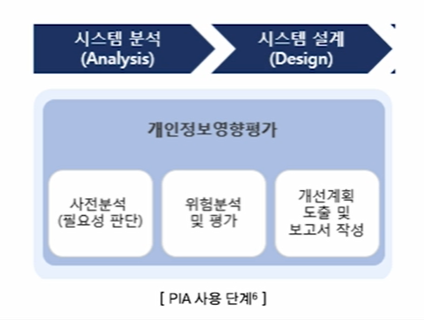

- 예시를 통한 PIA의 진행 절차

- 한 학교가 학생들의 출석을 자동으로 확인하기 위해 얼굴 인식 시스템을 도입하고자 함

|**단계**|**1)데이터 수집 목적**|**2) 데이터 흐름 분석**|**3) 프라이버시 위험 분석**|**4) 보호 대책 수립**|**5) 결과 보고 및 문서화**|
|:--:|:--:|:--:|:--:|:--:|:--:|
|**설명**|- 출석 체크의 효율성을 높이기 위해 학생 얼굴 데이터를 수집|- 학생, 교사만 접근 가능하도록 데이터 접근을 제한하고 외부 접근 차단| - 얼굴 인식 데이터가 유출될 경우 **학생 프라이버시 침해** 가능성|- 얼굴 인식 데이터 **암호화**, 접근 권한 제한, 시스템 접근 기록 모니터링|- **학부모 동의**를 받은 후 PIA 보고서를 작성하고 학교 이사회에 제출|

#### 2) GDPR(General Data Protection Regulation, 유럽연합 일반 개인정보 보호법)

- 실효성 있는 정보보호를 위해 유럽이 도입한 제도

- 개인의 **개인정보를 보호**하고, 데이터 처리와 관련된 **투명성과 신뢰성**을 강화하기 위해 제정

  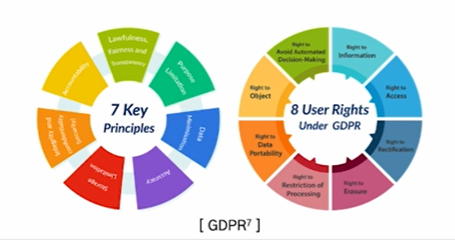

- GDPR에는 **원칙**과 **사용자 권리**가 존재

- GDPR위반시 최대 매출의 4% 또는 2천만 유로 중 더 높은 금액을 **벌금**으로 부과

- GDPR 준수를 위한 예시

- 모바일 앱에서 위치 정보 수집

|**구분**|**배경**|**GDPR 준수 방안**|
|:-----:|:------:|:----------------:|
|**설명**|위치 기반 서비스를 제공하는 앱이 사용자의 위치 데이터를 수집| - 사용자가 **명확한 동의**를 한 경우에만 위치 데이터를 수집    - 데이터 수집 시 사용자에게 **목적과 저장 기간**을 명확히 설명    - 언제든지 위치 데이터 수집을 **거부하거나 삭제할 수 있는 옵션** 제공|

#### 3) 마스킹(masking) 및 익명화(anonymization)

|**구분**|**마스킹(masking)**|**익명화(anonymization)**|
|:-----:|:------:|:----------------:|
|**정의**|데이터를 보호하기 위해 **특정 부분을 숨기는 기술**|데이터에서 **개인을 식별할 수 있는 모든 정보를 완전히 제거하거나 변환**하여, 특정 개인과 연결되지 않도록 만드는 기술|
|**설명**| - 원본 데이터는 유지하되, 특정 **민감한 정보를 부분적으로 가려**서 접근을 제한   - 신용카드 번호 마스킹 : 신용카드 번호 1234-5678-9876-5432 → \*\*\*\*-\*\*\*\*-\*\*\*\*-5432로 표시    - 일부만 숨기므로 **분석이나 운영에 필요한 데이터** 활용이 가능 | - 익명화된 데이터는 개인을 식별할 수 있는 정보가 없기 때문에, GDPR과 같은 **개인정보 보호 규정의 적용을 받지 않음**    - 의료 데이터 익명화 : 연구 목적을 위해 **환자의 이름**, **생년월일**, **주민번호** 등 식별 정보 제거   - 익명화된 데이터는 **연구**, **분석**, **통계 목적**으로 안전하게 활용 가능|

---

#### SUMMARY

#### 1. 데이터 수집 목적 정의

- 고품질 데이터 확보를 위해 목적에 맞는 데이터 요구 사항 분석

- 일반화 성능 향상 목적을 위해 데이터의 다양성과 풍부성 확보

#### 2. 법적 / 윤리적 고려 사항

- 윤리적 데이터 수집과 책임 : 최소 데이터 수집 원칙, 목적 제한 원칙

- 법적 고려사항을 반영 : PIA, GDPR

- 마스킹, 익명화 등을 고려

---

# 데이터의 Bias

### Index

#### 1. 데이터 편향의 이해와 유형

- 편향의 정의

- 다양한 유형의 편향과 발생 원인

- 편향과 분산 간의 Trade-off

#### 2. 데이터의 편향 완화 전략

- 데이터 수집 및 전처리 단계에서의 전략

- 모델에서 편향 완화하는 방법

---

### `01. 데이터의 편향의 이해와 유형`

#### 편향이란?

- 사전적 정의 : 한 쪽으로 치우침

  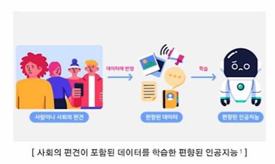

🔅 인공지능의 편향

- 편향된 데이터로 인해 편향된 결과를 출력

- 수많은 데이터를 학습함에 따라 사회에 내재된 편견을 흡수함

- 모델 알고리즘 자체에 문제가 있는 경우도 있음

#### 인공지능의 편향 사례

  

#### 편향의 발생 원인

- AI시스템의 **80%는 데이터로 구성**

- AI의 편향은 학습되는 데이터로부터 발생할 가능성이 큼

  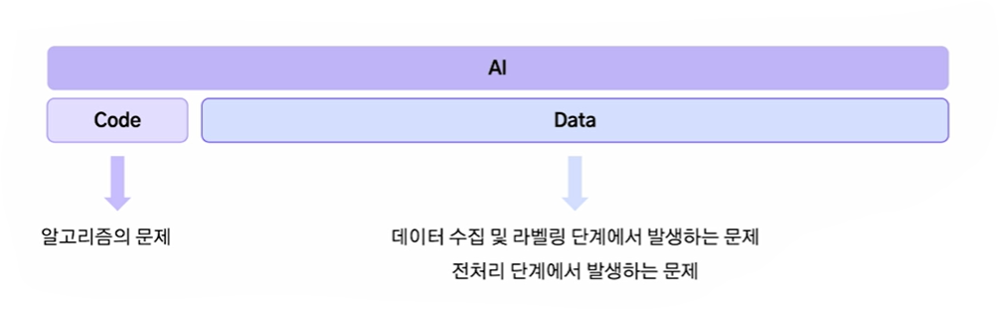

---

#### 편향의 유형

#### **1. 표본 편향(Sample Bias)**

- 선택 편향(Selection Bias)이라고도 불리며, 데이터가 전체 모집단을 적절히 대표하지 못하는 경우 발생

  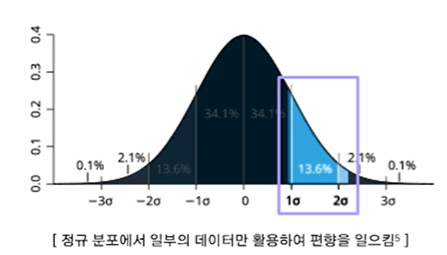

🔅원인

- 데이터 수집 과정에서 특정 그룹을 과대 또는 과소 대표

- 표본의 크기가 충분히 크지 않거나 무작위성을 확보하지 못함

🔅사례

- 2차 대전 당시 미군 전투기의 탄흔 숫자 분석

#### **2. 측정 편향(Measurement Bias)**

- 데이터를 측정하거나 기록하는 과정에서 오류 혹은 불일치 발생

  

🔅 원인

- 데이터 측정 도구의 부적확성

- 데이터를 라벨링하는 과정에서 발생하는 실수

🔅 사례

- 스마트폰 센서로 걸음 수를 측정할 떄 기기 문제로 과소 측정

- 법적 판결 데이터 학습 시 판사의 편견이 반영된 레이블

#### **3. 사회적 편향(Social Bias)**

- 데이터에 사회적 고정관념, 차별, 또는 불평등이 반영

  

🔅 원인

- 이미 사회에 많이 녹아 들어 있는 편향

- 데이터 수집 과정에서 특정 집단의 특성이 과잉 반영

🔅 사례

- 번역 모델이 Doctor를 남성으로 지칭하고 Nurse를 여성으로 지칭

- 특정 인종에 대한 의료 정확도가 낮음

#### **4. 확증 편향(Confirmation Bias)**

- 기존 가설을 강화하거나 뒷받침하는 데이터만 선택적으로 사용

  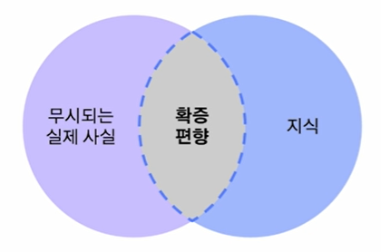

🔅 원인

- 연구자나 데이터 과학자가 원하는 결과를 지지하는 데이터만 사용

- 반대되는 데이터를 무시하거나 배제

🔅 사례

- 특정 약물이 효과적으로 실험 결과만 선택

- 긍정적인 리뷰만 수집

#### **5. 데이터 불균형(Imbalance Bias)**

- 특정 클래스가 다른 클래스에 비해 과대 또는 과소 대표하여 균형이 맞지 않음

  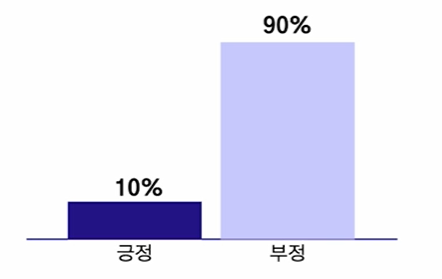

🔅 원인

- 데이터의 자연적 분포가 불균형

- 수집 과정에서 특정 클래스가 배제됨

🔅 사례

- 희귀한 질병 데이터가 적어 모델이 해당 질병을 제대로 탐지하지 못함

#### **6. 알고리즘 편향(Algorithmic Bias)**

- 데이터 편향 뿐만 아니라 알고리즘의 설계, 모델 학습 과정에서 발생하는 편향

🔅 원인

- 알고리즘이 최적화하려는 목적 함수가 공정성을 고려하지 않고 설계된 경우

- 출력 결과가 다시 데이터로 피드백이 되며 편향이 강화됨

🔅 사례

- 고객 대출 승인 모델이 대출 승인률 최대화를 목표로 설계된 경우, 소득이 낮은 그룹은 과소평가됨

- 추천 시스템이 인기 콘텐츠만 반복적으로 추천하여 다양성 감소

---

#### 데이터 편향이 모델에 미치는 영향

#### 1. 일반화 능력 부족

- 특정 그룹에 대해 과적합된 결과를 냄

- 실제 배포 환경 및 새로운 데이터에 대해서는 낮은 성능

#### 2. 공정성 문제

- 모델이 특정 그룹에 유리하거나 불리한 결과를 초래하여 윤리적 문제를 발생

---

#### Bias, Variance

#### 1. Bias(편향)

- 모델이 학습 데이터로부터 얻은 **추정값이 실제 정답(목표값)과 얼마나 다른지**를 나타냄

- 모델이 학습 데이터의 패턴을 **제대로 학습하지 못해**발생하는 오류

- 편향이 높은 모델은 데이터 내에 패턴을 통해 제대로 예측하지 못하기에 **보통 일관되게 정답을 벗어남**

#### 2. Vairance(분산)

- 모델이 학습 데이터의 **작은 변동에 얼마나 민감하게 반응하는지**를 나타냄

- 학습 데이터의 **세부적인 패턴을 과도하게 학습(overfitting)** 하여 **새로운 데이터에서 일반화가 어렵게 되는 경우** 발생

---

#### Bias-Variance Trade-off

- 정의 : 머신러닝 모델에서 **과소적합(Underfitting)** 과 **과적합(Overfitting)** 사이의 균형을 설명하는 개념

- 목표 : **Bias(편향)와 Variance(분산)를 적절히 조정**하여 최적의 일반화 성능을 얻는 것

  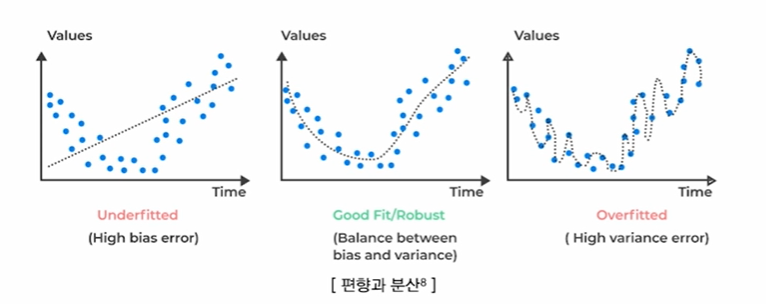

- 간단한 모델은 **패턴을 제대로 학습하지 못해서 Bias이 높고, 예측치의 가변성이 작으므로 Variance가 낮음**

- 복잡한 모델은 **패턴을 잘 해석하기에 Bias은 낮아** 내재된 패턴을 더 잘 포착할 수 있으며, **훈련 데이터에 "너무" 잘 맞기에 예측치의 가변성이 높아서 Variance이 높음**

- 따라서 **Bias와 Variance가 균형을 이루는 지점**을 찾아야 함

  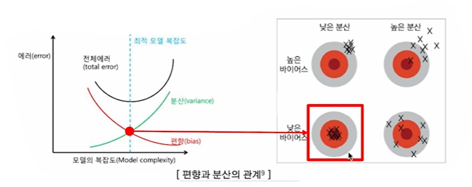

---

## `02. 데이터의 편향 완화 전략`

### 편향 완화 전략

#### 1. 데이터 수집 단계에서 편향 완화 전략

- 데이터 수집의 목적을 명확히 함

- 대표성이 있는 데이터를 수집하고, 수립 기준을 표준화

#### 2. 데이터 전처리

- 수집한 데이터의 균형이 맞지 않을 경우 전처리를 통해 이를 해결

#### 3. 모델에서 편향 완화

- 모델 알고리즘을 수정하여 편향 출력을 방지할 수 있음

- 모델 완성 후 모니터링을 통해 편향 감지

---

#### 데이터 수집 단계에서 편향 완화

#### 1. 대표성이 있는 데이터 수집

- AI 모델이 학습 데이터에서 **다양한 특성**과 **집단을 공정하게 학습**할 수 있도록 설계

  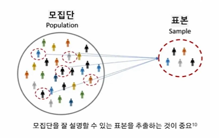

🔅 대표성이 중요한 이유

- **일반화 능력 향상** : 모델이 모집단 전반에 대해 잘 설명할 수 있음

- **공정성 확보** : 특정 집단에 치우치는 불공정한 결과 방지

 

**⑴ 데이터 수집 범위 확장**

  - 데이터 수집 과정에서 발생할 수 있는 **불일치와 편차를 최소화**

**⑵ 무작위 샘플링**

  - 모집단의 다양한 특성을 공정하게 반영하는 데이터 확보

**⑶ 층화 샘플링**

  - 모집단의 중요한 특성으로 나누고 각 그룹에서 균등하게 데이터를 수집

**⑷ 데이터 증강**

  - 현실적으로 수집이 어려운 데이터는 증강기법으로 보완

#### 2. 데이터 수집 기준 표준화

- 데이터 수집 과정에서 발생할 수 있는 **불일치와 편차를 최소화**

🔅표준화가 중요한 이유

- **데이터 품질 향상** : 일관된 기준으로 수집된 데이터로 정확성 향상

- **재현성 확보** : 동일 조건에서 수집한 데이터는 이후 실험과 분석의 재현성이 높아짐

**(1) 수집 도구 표준화**

- 카메라, 센서 등의 수집 장비의 사양을 동일하게 유지

**(2) 수집 프로세스 표준화**

- 수집 절차를 문서화하여 모든 수집자가 동일한 방법을 따르도록 함

**(3) 데이터 포맷 표준화**

- 데이터의 형식과 구조를 통일하여 데이터 처리의 일관성 확보

---

#### 데이터 균형화

- 데이터셋 내 클래스 간 불균형을 완화하여 편향되지 않도록 조정

  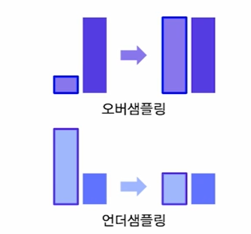

  🔅**오버 샘플링**

  - 소수 클래스의 데이터를 늘림

  - 방법 : SMOTE, ADASYN, ...

  - 단점 : 노이즈가 증폭될 가능성

  🔅**언더 샘플링**

  - 다수 클래스의 데이터를 줄임

  - 방법 : Tomek Links, CNN(Condensed Nearest Neighbor), ...
  
  - 단점 : 정보 손실 가능성

---

#### 데이터 균형화 : 오버샘플링

#### 1. SMOTE(Synthetic Minority Oversampling Technique)

- 소수 클래스의 데이터를 기반으로 새로운 데이터를 합성

- 이웃 데이터 포인트 사이에 임의의 값을 생성

  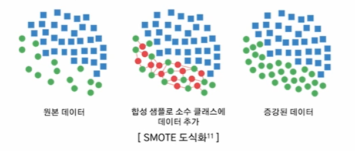

#### 2. ADASYN(Adaptive Synthetic Sampling Approach)

- 소수 클래스 데이터를 확대하되, **데이터 분포의 복잡성을 고려**하여 생성

- 학습하기 어려운 샘플(즉, 소수 클래스 데이터 주변에 다수 클래스 데이터가 많은 경우)에 더 많은 데이터 생성

  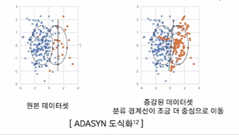

 

➰**SMOTE** 와 **ADASYN** 비교

- Python에서 Imbalanced-learn 라이브러리(imblearn)를 활용하여 SMOTE와 ADASYN를 간단히 구현할 수 있음

|**특징**|**SMOTE**|**ADASYN**|
|:--:|:---------:|:----:|
|**샘플링 방식**| 균일하게 샘플을 생성 | 모델 학습에 어려운 영역에 더 많은 샘플 생성|
|**데이터 밀도**| 데이터 분포의 불균형을 고려하지 않음 | 소수 클래스 데이터 분포의 불균형 반영 |
|**적용 영역**| 단순한 데이터 불균형 문제 해결에 적합 | 복잡한 경계 문제를 해결할 때 적합 |

---

#### 데이터 불균형 : 언더 샘플링

#### 1. Tomek Links

- Tomek Links는 가장 가까운 두 데이터를 묶었을 때 각 데이터가 서로 다른 클래스에 속하는 것을 의미(= 모호한 데이터들)

- 이들을 찾아 제거하여 **데이터의 경계를 명확히 하고** 모델이 경계에서 더 정확히 학습할 수 있도록 도움

  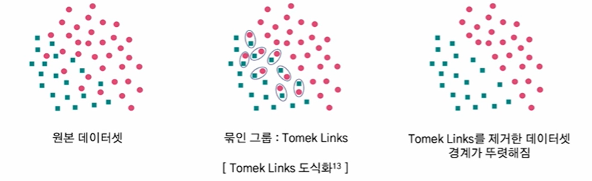

#### 2. CNN(Condense Nearest Neighbor)

- 다수 클래스에서 데이터 하나를 뽑고, 소수 클래스 전체를 합집한한 것을 S집합이라 둠

- 다수 클래스 데이터 중 하나를 뽑아 소수 클래스와 더 가까우면 해당 데이터를 S에 포함시킴

- 더 이상 선택되는 데이터가 없을 때까지 이를 반복( 1 - NN으로 분류되지 않는 데이터만 남기는 것)

  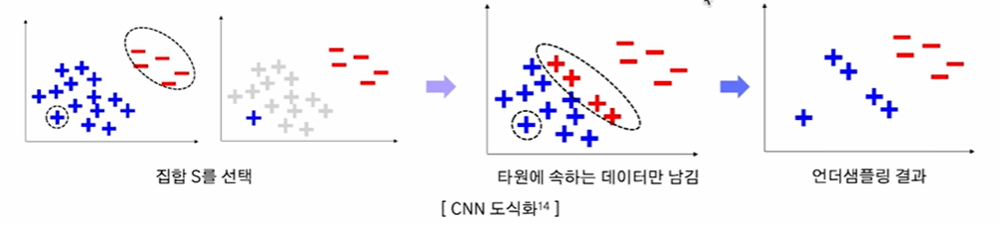

---

#### 데이터 균형화 : 복합샘플링

#### 1. SMOTE-Tomek

- SMOTE로 오버샘플링 수행하여 데이터를 증강

- 증강된 데이터에서 경계에 위치한 Tomek-Links를 찾아 제거

  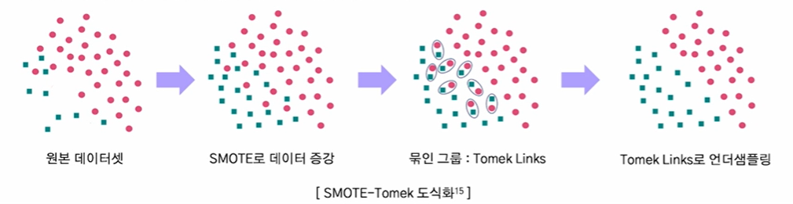

#### 2. OSS(One Side Selection)

- Tomek Links로 데이터셋의 경계를 확실히 만듦

- 이후 CNN을 적용하여 경계와 멀리 떨어진 데이터를 제거

  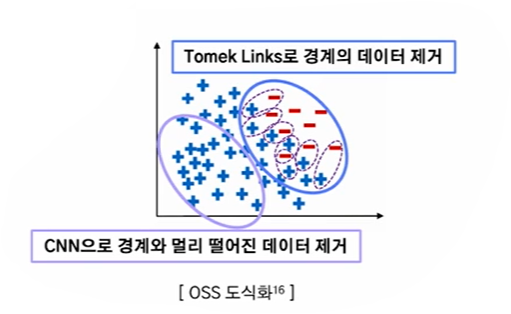

---

#### 모델 학습 단계에서 편향 완화

#### 1. 공정성 제약(Fairness Constraints)

- AI 모델 학습 과정에서 공정성을 목표로 하는 제약 조건을 추가하여 편향되지 않도록 조정

- 편향된 데이터가 입력되어도 어느 정도 보정 가능

🔅 공정성 제약을 모델에 포함하는 방법

  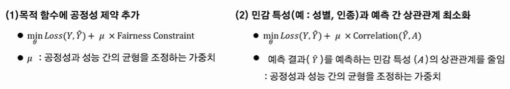

#### 2. Adversarial Debiasing

- 적대적 학습(Adversarial Training)을 활용하여 AI모델의 편향 완화

🔅 절차

  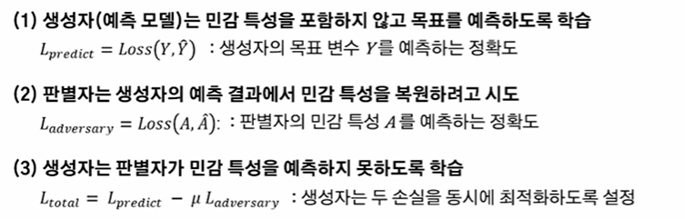

---

#### 모델 평가 단계에서 편향 완화

- 모델 완성 및 배포 이후에도 지속적으로 관리가 필요

#### 1. 공정성 평가 지표 이용

- 구축한 모델이 공정하게 작동하는지 평가

- 교차 검증으로 모델이 다양한 시나리오에서 일관되게 작동하는지 평가

#### 2. 모니터링

- 데이터 분포를 분석하며 새로운 편향이 발생하는지 감지

- 시간이 지남에 따라 데이터 분포의 변화를 반영

---

### SUMMARY

#### 1. 데이터 편향의 이해와 유형

- 편향의 정의와 유형 - 표본 편향, 측정 편향, 확증 편향, 알고리즘 편향, ...

- 편향 유형별 발생 원인

#### 2. 데이터의 편향 완화 전략

- 데이터 수집 단계에서 전략 - 대표성이 있는 데이터 수집, 수집 기준 표준화

- 데이터 전처리에서 전략 -  오버샘플링, 언더샘플링

- 모델에서 편향 완화 - 공정성 제약 추가, Adversarial Debiasing

---

### 데이터 수집 방법론

### Index

#### 1. 크롤링을 통한 데이터 수집

- 웹 크롤링

- 크롤링 라이브러리

- 데이터 포맷

- 크롤링 실습

#### 2. API를 통한 데이터 수집

- Open API(Application Programming Interface)

- 공공데이터 API

---

### `01. 크롤링을 통한 데이터 수집`

#### 웹 크롤링

#### 1) 정의

- 자동화된 스크립트(봇)을 이용해 웹 페이지를 **자동으로 탐색**하고 **데이터를 수집하고 저장**하는 과정

- 주로 **검색 엔진**에서 웹 페이지를 수집하여 **색인(Indexing)** 하거나, 데이터 분석 및 연구를 위해 **대량의 데이터를 수집**

  

#### 2) 원리

- **크롤러**가 특정 웹 페이지에 접근하여 **HTML 코드를 다운로드**한 후, 필요한 정보를 **자동 추출**

- 크롤러는 웹 페이지의 **링크를 따라가며 연속적으로 페이지를 탐색**하야 데이터 수집

- 수집한 데이터를 **정제 및 가공**하여 분석 가능한 형태로 저장

|**수집 단계**| **설 명**|
|:----------:|:-------:|
|**HTTP 요청**| 크롤러가 웹 페이지에 접근하기 위해 HTTP 요청 보냄|
|**HTML 응답**| 서버로투버 HTML 코드를 포함한 응답 수신 |
|**HTML 파싱**| BeautifulSoup과 같은 라이브러리를 사용하여 HTML 구조 분석 및 데이터 추출|
|**데이터 저장 및 분석**| 추출한 데이터를 CSV, JSON, XML 등으로 저장하여 분석에 활용|

#### 3) 관련 용어

|**용어**|**정의 및 설명**|
|:-----:|:--------------:|
|**웹 스크래핑(Web Scraping)**| 크롤링과 유사하지만, 주로 **특정한 정보**(예: 가격 정보, 리뷰 등)를 추출하여 **가공**하는 데 중점을 둠|
|**데이터 랭글링(Data Wrangling)**| 수집된 원자료(Raw Data)를 **변환 및 매핑**하는 과정|
|**파싱(Parsing)**| HTML, XML 등의 **문법적 구조를 해석**하여 필요한 데이터를 추출|
|**인덱싱(Indexing)**| 검색 속도를 높이기 위해 데이터베이스에 **색인**을 생성하는 작업|
|**슬라이싱(Slicing)**| 리스트와 같은 **순회 가능한 객체**의 특정 부분을 잘라내는 작업|

#### 4) 웹 페이지(HTML 문서)의 구조

- **HTML(Hyper Text Markup Language)** : 웹 문서를 작성하기 위해 사용하는 기본적인 웹 언어

- 월드와이드웹(WWW)을 통해 접근 가능한 문서를 만들 때 주로 사용

- 목적 : 문서의 **글자 크기**, **색상**, **모양**, **그래픽**, **하이퍼링크** 등을 정의하여 웹 페이지의 **구조의 스타일**을 설정

- 태그(tag) : HTML 명령어로, 꺽쇠괄호(<>)로 표기

  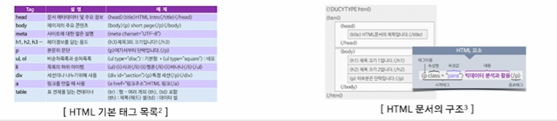

  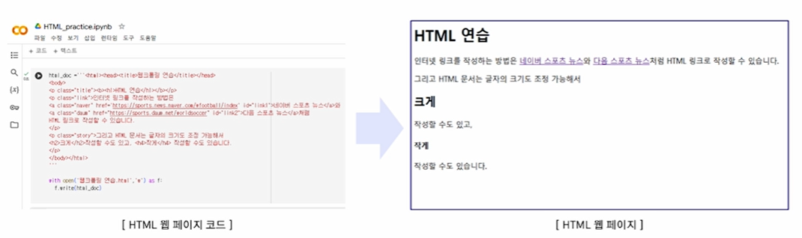

#### 5) 일반적인 웹 크롤링 순서
|||
|:---:|:---:|
|**1**| Robots.txt 기준을 확인하여 **크롤링 가능한 웹사이트인지** 확인|
|**2**| Urllib나 Request 라이브러리로 해당 사이트를 불러와서 BeautifulSoup으로 **HTML문서를 파싱**|
|**3**| **HTML의 구조**를 파악(Window : F12 / MacOS : Command + Option + i)하여 find문이나 select문을 이용하여 **추출하고자하는  부분을 찾아** 텍스트 문서로 추출|
|**4**| 정규표현식(re)이나 KoNLPy 라이브러리를 이용해 **텍스트를 정제**하여 필요한 정보를 정리|

#### 6) robots.txt

- 웹사이트에서 **크롤러의 접근을 제어**하기 위해 사용하는 텍스트 파일

- 웹사이트 소유자가 **크롤러가 접근 가능한 영역과 제한해야 할 영역**을 정의

- 권고 사항이며, 강제성은 없음

  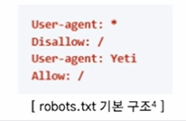

|**용어**| **설 명**|
|:-----:|:--------:|
|**User-agent**| 특정 크롤러를 지정하거나, *을 사용하여 모든 크롤러에 적용|
|**Disallow**| 크롤링을 **차단할 경로** 설정|
|**Allow**| 특정 경로는 **크롤링을 허용**|
|**Sitemap**| 크롤러에게 **사이트맵 위치**를 알려줌으로써 더 효율적으로 크롤링을 수행하도록 안내**|

#### 7) 크롤링 시 고려사항 - 1. 윤리적 문제

- 대령의 요청을 보내면 웹 서버어세 과부하를 유발할 수 있어 **서비스 장애** 유발

  - 크롤링 시 적절한 요청 간격을 두어 서버에 무리를 주지 않도록 해야 함

- 사용자의 동의 없이 이메일, 전화번호 등 **개인 정보**를 수집할 수 있음

  - GDPR과 같은 개인정보 보호법을 위반할 경우 **법적 처벌** 가능

  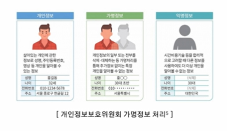

#### 8) 크롤링 시 고려사항 - 2. 법적 문제

- 일부 웹사이트는 **이용 약관**에 따라 크롤링을 금지하며, 이를 무시하고 데이터를 수집하면 법적 분쟁 발생 가능

- 특히, 유료 콘텐츠나 구독 기반 사이트에서 크롤링을 시도하는 것은 법적으로 문제 가능

- 웹 페이지의 콘텐츠를 무단으로 수집하여 **상업적 목적**으로 사용하는 경우 저작권법 위반에 해당

  - 예를 들어, 뉴스 사이트의 기사를 크롤링하여 자신의 블로그에 게시하면 저작권 침해로 고소 가능

🔅 예시 : 야놀자 vs 여기어때

- 4년 8개월 간 법정 다툼

- 크롤링 프로그램을 이용해 야놀자의 플랫폼에 게시된 숙밥업소 정보를 대량 수집해 여기어떄의 플랫폼 영업에 이용

- 야놀자에서 시간과 비용 등 노력을 들여서 정보로의 부가가치를 만든 것이라 주장하며 민사소송 제기

  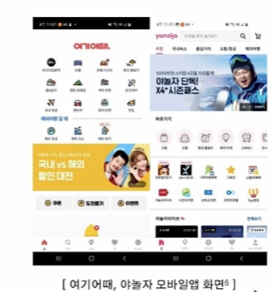

---

#### 크롤링 라이브러리

#### 1) 파이썬 라이브러리

|**라이브러리**| **설 명**|
|:-----------:|:--------:|
|**Requests**| - **정적 수집 도구**    - 단순한 형태의 문법, 인코딩 확인, 헤더 파악, 텍스트 전환이 용이하고, 딕셔너리 형태로 데이터 전송|
|**Urllib**| -**정적 수집 도구**    - 데이터를 바이너리 형태로 인코딩하여 데이터 전송|
|**Selenium**| - **동적 수집 도구**    - **웹 브라우저 드라이버** 설치 필요, 동적인 여러가지 상호작용으로 데이터 수집|
|**BeautifulSoup**| - 본문 **파싱**을 위한 도구    - HTML 문법으로 작성된 문서를 파싱하여 필요한 부분의 태그를 기준으로 **데이터 추출 및 정제**|

#### 2) BeautifulSoup : HTML 문서 파싱

- HTML 문서를 단순한 파이썬 객체처럼 다룰 수 있어 **직관적이고 사용이 간편**

- 파이썬 내장 파서(html.parser), lxml, html5lib 등 **다양한 HTML 파서 지원**하여 성능과 호환성 선택 가능

- CSS 선택자, 태그, 속성 등 다양한 방식으로 데이터를 선택할 수 있어 **복잡한 웹 페이지에서도 유용**

  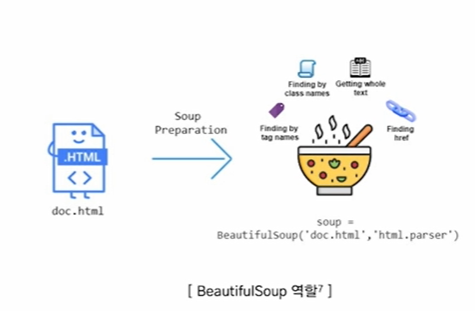

#### Requests, Urllib : 정적 수집 도구

|**특징**|**Requests**|**Urllib**|
|:-----:|:-----------:|:-------:|
|**라이브러리 종류**| 외부 라이브러리(설치 필요)| Python 표준 라이브러리 (추가 설치 불필요)|
|**데이터 전송 방식**| 자동 디코딩(텍스트 데이터)| 바이너리 형식으로 전송 및 수신(디코딩 필요)|
|**가독성 / 편의성**| 코드가 직관적이며 요청과 응답 처리가 간단하며 가독성이 높음 | Urlopen()을 포함한 다소 복잡한 접근 방식|
|**사용 용도**| 복잡한 웹 요청 및 데이터 추출 작업| 단순 HTTP 요청이나 가벼운 스크립트|

#### 4) Selenium : 동적 수집 도구

- 웹 애플리케이션의 테스트를 자동화할 수 있도록 설계된 오픈 소스 프레임워크

- 다양한 브라우저(Chrome, Firefox, Edge, Safari 등)를 지원하며, 여러 프로그래밍 언어(Python, Java, C#, Ruby 등)로 제어

- 웹사이트가 자바스크립트로 동적 콘텐츠를 로드하는 경우, Selenium을 통해 브라우저를 직접 제어하여 **동적 페이지의 콘텐츠**도 스크래핑 가능

  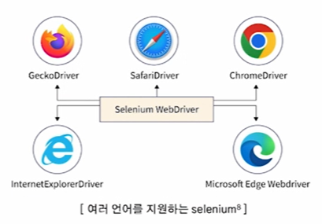

---

#### 데이터 포맷

#### 1) CSV

- 데이터를 쉼표(,)로 구분하여 저장한 텍스트 파일 형식

- 각 줄은 레코드(record), 쉼표로 구분된 값들은 필드(field)

- 프로그래밍 언어(Python, R, Java 등)에서 쉽게 읽고 쓰기 가능함

- 저장 공간을 적게 사용하고 처리 속도가 빠름

  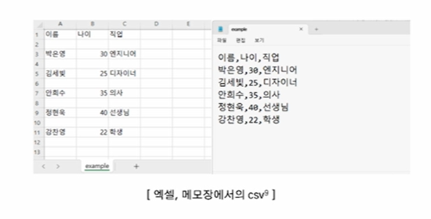

#### 2) JSON

- JavaScript에서 파생된 경량 데이터 교환 형식

- 사람이 읽기 쉽고 기계가 분석 및 생성하기 쉬운 구조

- **Key-Value 쌍**으로 이루어진 데이터 구조

  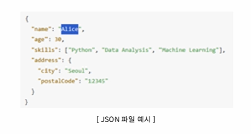

#### 3) XML(eXtensible Markup Language)

- 데이터의 구조와 의미를 설명하기 위해 태그를 사용하는 언어(유연한 마크업 언어)

- **사용자 정의 태그를 사용**하여 데이터를 표현

- 계층적 구조와 속성(attritube)를 사용하여 다양한 데이터 형태를 표현 가능

  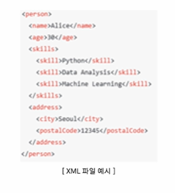

#### 4) 데이터 포맷의 비교

|**데이터 포맷**|**CSV**|**JSON**|**XML**|
|:------------:|:-----:|:------:|:------:|
|**장점**|- 단순한 구조로 처리 속도가 빠름   - 다양한 도구에서 지원   - 파일 크기가 작아 전송 효율성 높음 | - 데이터 **용량이 작고 속도가 빠름**   - **가독성**이 높음   - **웹 개발에 최적화**| - **복잡한 구조** 지원   - **사용자 정의 태그** 사용   - **다양한 플랫폼과 언어**에서 사용|
|**단점**| - 계층적 데이터 표현 불가능   - 메타데이터 부족으로 구조 정의 어려움 | - 데이터 구조가 대량일 경우, 사람이 읽기에 복잡할 수 있음   - 스키마 검증 필요 | - 파일의 크기 거대   - 파싱 속도가 느림|

---

#### 크롤링 실습(Colab)

#### 1) 필요한 기능들

  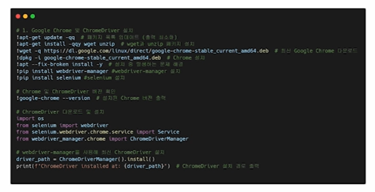

#### 2) Chrome 옵션 설정

  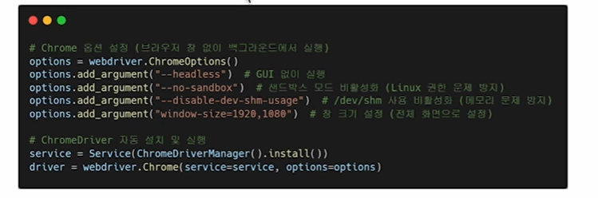

#### 3) robots.txt로 크롤링 허용 확인

  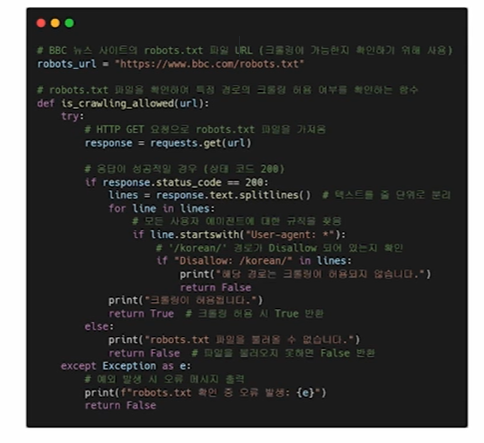

#### 4) 웹 페이지로부터 가져올 내용 분석

  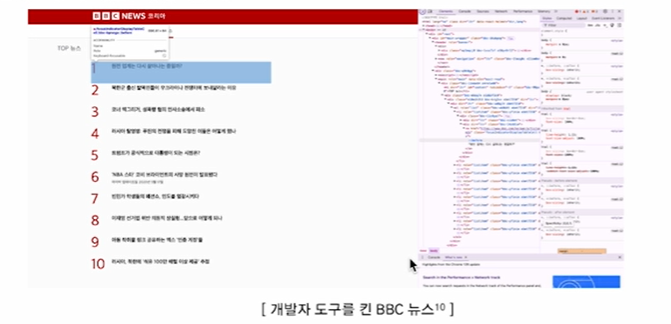

#### 5) 내용 가져오기

  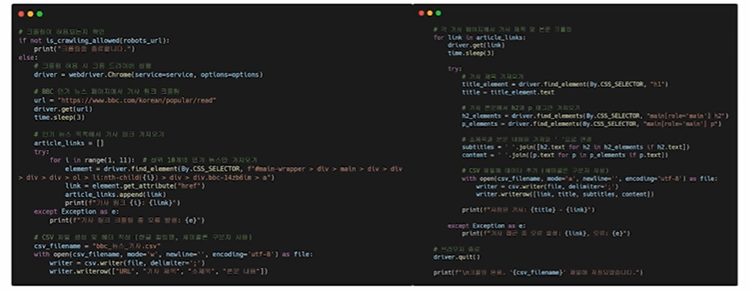

#### 6) 내용 csv화

  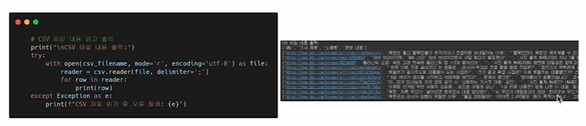

---

### `02. API를 통한 데이터 수집`

#### Open API(Application Programming Interface)

#### 1) 정의

- 웹 사이트에서 서비스를 제공하는 주체가 **자신이 가진 기능을 이용할 수 있도록** 공개한 프로그래밍 인터페이스

- 대표적인 API : 네이버 뉴스, 백과사전, 지도, 구글 맵 등

  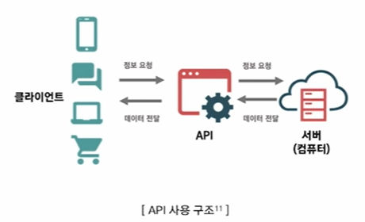

#### 2) API vs Open API

  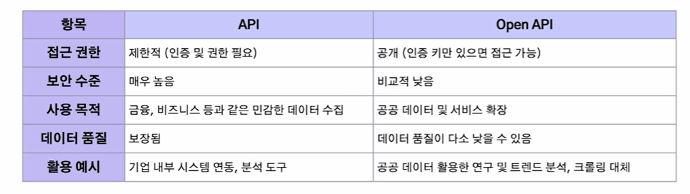

#### 3) 웹 크롤링 vs Open API

  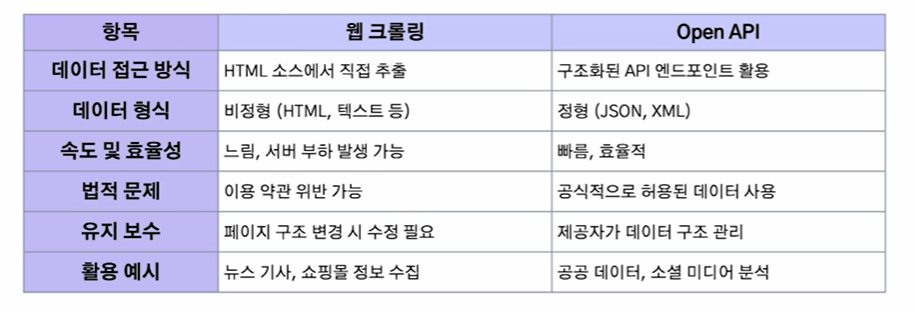

---

#### 공공데이터 API

#### 1) 공공데이터 포털

- 대한민국 정부가 주도하는 공공데이터 개방 플랫폼

- 다양한 정부 기관과 공공기관에서 보유한 데이터를 누구나 접근할 수 있도록 공개

- 다양한 주제의 데이터셋을 CSV, Excel, JSON, XML 등의 형식으로 무료로 다운로드 가능

- **기상청, 보건복지부, 교통 API 등** API 형태로 데이터를 제공하여, 실시간 데이터 접근 가능

  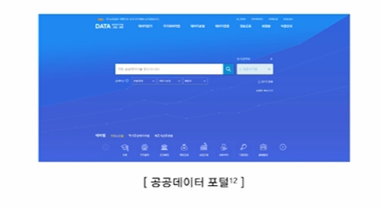

#### 2) API Key 발급

  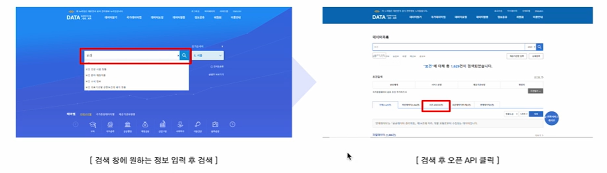

  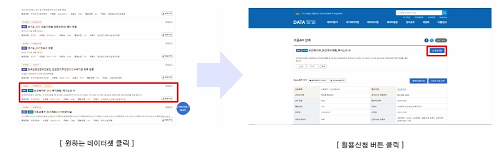

  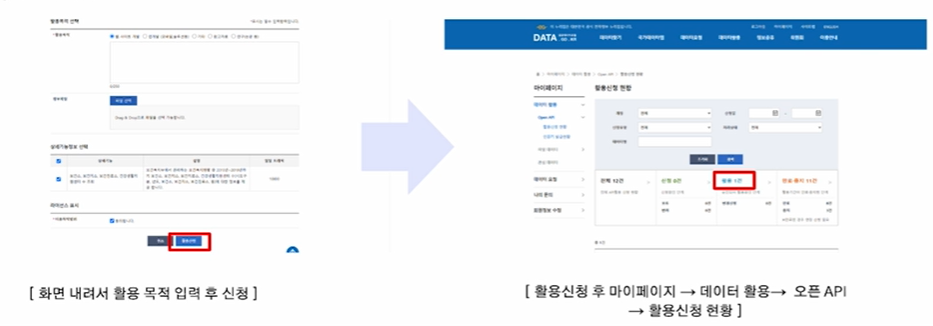

  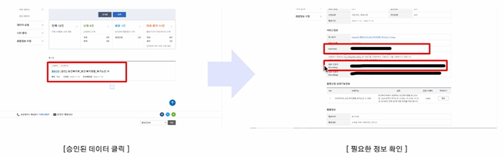

  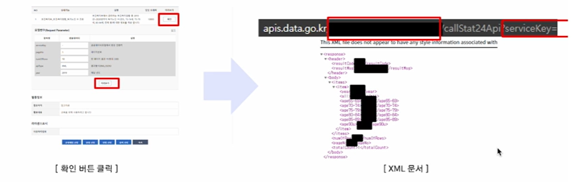

  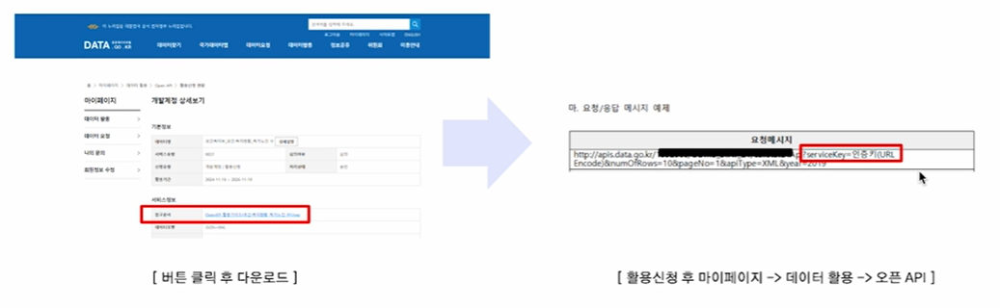

---

### SUMMARY

#### 1. 크롤링을 통한 데이터 수집

- 웹 크롤링의 방법과 고려사항

- 파이썬 라이브러리(BeautifulSoup, Requests, Selenium, Urllib)

- 데이터 포맷

#### 2. API를 통한 데이터 수집

- API와 OpenAPI의 비교

- 공공 데이터 포털에서 데이터 수집

----
