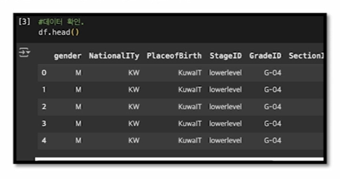
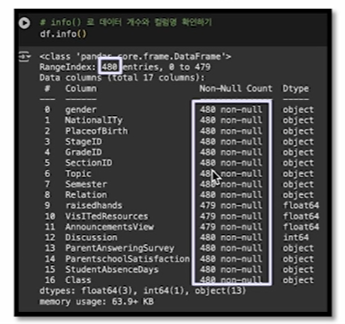
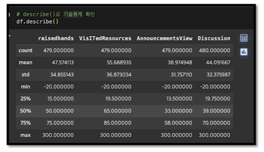
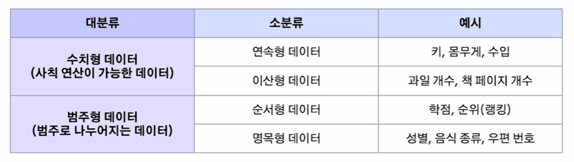
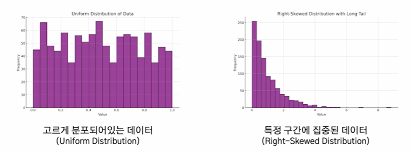
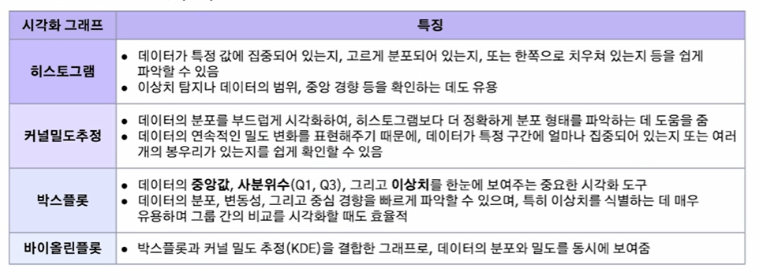
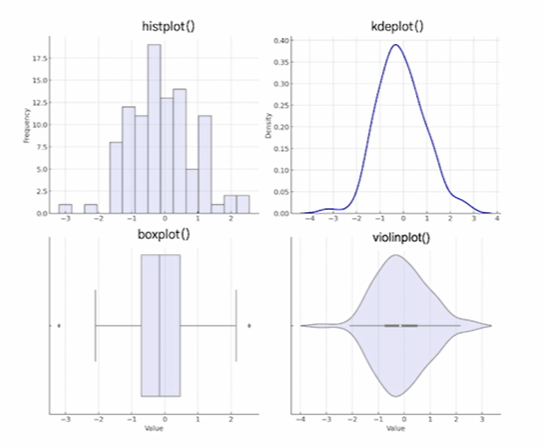
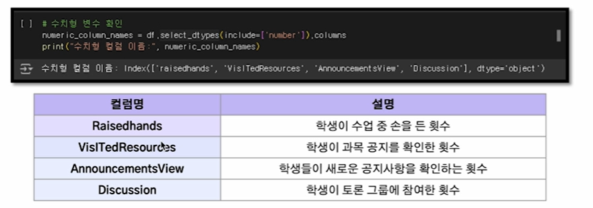
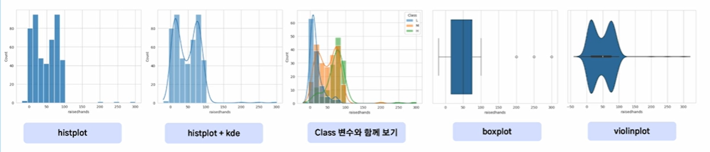
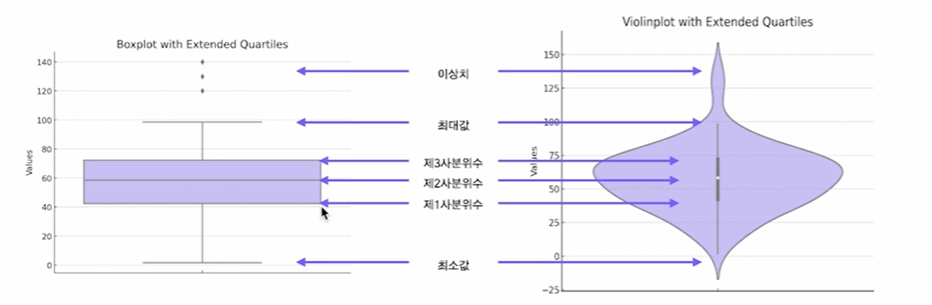

# 2024-12-04(수) AI코스 - 데이터 전처리 및 클렌징 02

### Index

1. 데이터 EDA(Exploratory Data Analysis)

    - 데이터 EDA란?

    - 데이터 EDA의 중요성

    - 정형 데이터 EDA

    - 비정형 데이터 EDA

2. 정형 데이터 전처리

    - 수치형 데이터 전처리 방법

    - 범주형 데이터 전처리 방법

3. 비정형 데이터 전처리

    - 텍스트 데이터 전처리 방법

---

### `01. 데이터 EDA(Exploratory Data Analysis)`

#### 데이터 EDA란?

- 데이터를 본격적으로 분석하기 전에 데이터를 탐색하고 이해하는 과정으로 **데이터의 분포, 특성, 이상치, 결측치 등 데이터 품질에 영향을 미치는 요인을 파악하는 데 핵심적인 단계**

#### 데이터 EDA의 중요성

- 데이터 EDA(Exploratory Data Analysis)는 여행을 떠나기 전 지도를 보고 목적지와 길을 파악하는 과정에 비유할 수 있음

  

#### 정형 데이터 EDA

- 정형 데이터 : Students' Academic Performance Dataset

  

1. 데이터 프레임의 각 컬럼과 값 확인하기

2. 결측치 확인

3. 기술 통계(평균, 중앙값, 최대값, 최소값, 분산, 표준편차, 사분위수)

4. 데이터 분포 확인(히스토그램, 커널밀도, 박스 플롯)

5. 상관관계 분석

6. 데이터의 스케일링 필요성 검토

7. 파생 변수 생성 가능성 탐색

---

### 1. 데이터프레임의 각 컬럼과 값 확인하기

- head(), tail() 메서드를 통해 데이터프레임 일부를 쉽게 확인 가능

- 예시 ) data.head(8) 처러 ㅁ괄호 안에 숫자를 넣어주면 입력한 숫자만큼의 데이터를 앞에서부터 확인 가능, default 값 5개

- 예시 ) data.tail(4)는 데이터를 뒤에서부터 4개만 확인 가능

  

#### 2. 결측치 확인

- **info()** 메서드를 통해 데이터의 총 개수와 각 컬럼별 결측치와 type을 확인 가능

  

#### 3. 기술통계(평균, 중앙값, 최대값, 최소값, 분산, 표준편차, 사분위수)

- 수치형 데이터만 **describe()** 메서드를 통해 기술통계값을 간단히 확인 가능

  

#### 4. 데이터 분포 확인

- 수치형 데이터와 범주형 데이터에 따라 데이터 분포 확인 방법이 다름

  

#### (1) 수치형

- 수치형 데이터는 **일정 범위 안에서 어떻게 분포하고 있는지 파악하는 것이 중요**

  

  

- histplot() : 히스토그램

- kdeplot() : 커널밀도추정 함수 그래프

- boxplot() : 박스플롯

- violinplot() : 바이올린플롯

  

- Students's Academic Performance Dataset의 수치형 데이터 컬럼

  

- Raisehands 변수 히스토그램의 다양한 시각화

  

- 박스플롯, 바이올린플롯 해석 방법

  