# 2024-12-04(수) AI코스 - 데이터 전처리 및 클렌징 02

### Index

1. 데이터 EDA(Exploratory Data Analysis)

    - 데이터 EDA란?

    - 데이터 EDA의 중요성

    - 정형 데이터 EDA

    - 비정형 데이터 EDA

2. 정형 데이터 전처리

    - 수치형 데이터 전처리 방법

    - 범주형 데이터 전처리 방법

3. 비정형 데이터 전처리

    - 텍스트 데이터 전처리 방법

---

### `01. 데이터 EDA(Exploratory Data Analysis)`

#### 데이터 EDA란?

- 데이터를 본격적으로 분석하기 전에 데이터를 탐색하고 이해하는 과정으로 **데이터의 분포, 특성, 이상치, 결측치 등 데이터 품질에 영향을 미치는 요인을 파악하는 데 핵심적인 단계**

#### 데이터 EDA의 중요성

- 데이터 EDA(Exploratory Data Analysis)는 여행을 떠나기 전 지도를 보고 목적지와 길을 파악하는 과정에 비유할 수 있음

  

#### 정형 데이터 EDA

- 정형 데이터 : Students' Academic Performance Dataset

  

1. 데이터 프레임의 각 컬럼과 값 확인하기

2. 결측치 확인

3. 기술 통계(평균, 중앙값, 최대값, 최소값, 분산, 표준편차, 사분위수)

4. 데이터 분포 확인(히스토그램, 커널밀도, 박스 플롯)

5. 상관관계 분석

6. 데이터의 스케일링 필요성 검토

7. 파생 변수 생성 가능성 탐색

---

### 1. 데이터프레임의 각 컬럼과 값 확인하기

- head(), tail() 메서드를 통해 데이터프레임 일부를 쉽게 확인 가능

- 예시 ) data.head(8) 처러 ㅁ괄호 안에 숫자를 넣어주면 입력한 숫자만큼의 데이터를 앞에서부터 확인 가능, default 값 5개

- 예시 ) data.tail(4)는 데이터를 뒤에서부터 4개만 확인 가능

  

#### 2. 결측치 확인

- **info()** 메서드를 통해 데이터의 총 개수와 각 컬럼별 결측치와 type을 확인 가능

  

#### 3. 기술통계(평균, 중앙값, 최대값, 최소값, 분산, 표준편차, 사분위수)

- 수치형 데이터만 **describe()** 메서드를 통해 기술통계값을 간단히 확인 가능

  

#### 4. 데이터 분포 확인

- 수치형 데이터와 범주형 데이터에 따라 데이터 분포 확인 방법이 다름

  

#### (1) 수치형

- 수치형 데이터는 **일정 범위 안에서 어떻게 분포하고 있는지 파악하는 것이 중요**

  

  

- histplot() : 히스토그램

- kdeplot() : 커널밀도추정 함수 그래프

- boxplot() : 박스플롯

- violinplot() : 바이올린플롯

  

- Students's Academic Performance Dataset의 수치형 데이터 컬럼

  

- Raisehands 변수 히스토그램의 다양한 시각화

  

- 박스플롯, 바이올린플롯 해석 방법

  

#### (2) 범주형

- Students's Academic Performance Dataset의 범주형 데이터 컬럼

  

- countplot : 범주형 데이터의 개수를 확인할 떄 사용

- pie chart : 원그래프로 범주형 데이터의 개수를 확인할 때 사용

  

- 예시 ) Gender 변수의 pie chart, countplot() 시각화

  

#### (3) 수치형 & 범주형 데이터

- 수치형 데이터와 범주형 데이터 시각화 : raisehands, class 변수 함께 시각화하기

  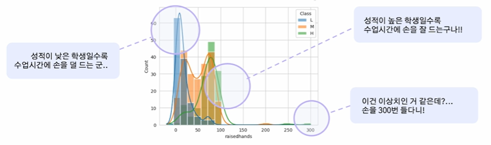

- 수치형 데이터와 범주형 데이터 함께 시각화하기 : Topic, raisehands

  

#### 5. 상관관계 분석

- **상관관계 분석**은 변수들 간의 관계를 파악하기 위해 중요하고, 수치형 데이터만 계산 가능함

- 상관관계 분석을 통해 변수들 사이의 연관성을 확인할 수 있으며, 특히 예측 모델에서 중요 변수를 식별하는 데 유용함

- 다중공선성 문제(변수들 간의 높은 상관성으로 인해 모델이 불안정해지는 문제)를 조기에 발견하여, 불필요하거나 중복된 변수를 제거 가능

- 피어슨 상관계수 등을 이용하여 각 변수 쌍의 선형성을 값으로 반환하며, 상관계수의 값의 범위는 -1에서 1로 계산

  

- 간단히 pandas 라이브러리에서 제공하는 메서드인 corr()으로 상관계수를 계산할 수 있음

  

#### 6. 데이터의 스케일링 필요성 검토

- **스케일링(Scaling)** : 서로 다른 변수의 값 범위를 일정한 수준으로 맞추는 작업을 의미함

- 스케일링은 모델링 및 데이터 분석 과정에서 **변수 간 크기 차이가 중요한 영향을 미칠 때** 필요

- **describe()** 메서드를 통해 변수 간 범위 차이를 확인하거나, 데이터 시각화를 통해 분포를 확인하며 스케일링의 필요성을 검토해볼 수 있음

  

- 스케일링 예시 ) 키 및 몸무게 데이터

  

#### 7. 파생 변수 생성 가능성 탐색

- 파생 변수는 원본 데이터에서 새로운 의미를 가지도록 가공하거나 결합하여 만든 변수

- 원본 데이터의 정보를 재구성하여 새로운 관점에서 분석할 수 있음

  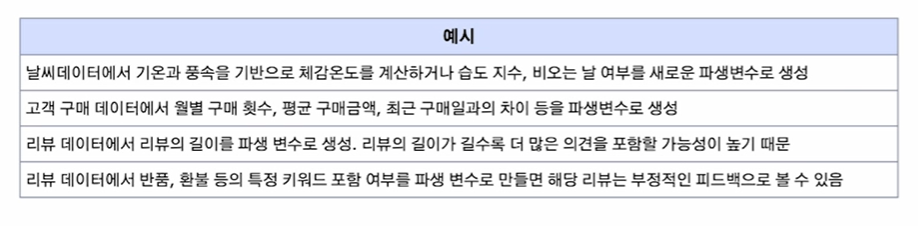

---

### 비정형 데이터 EDA

- 비정형 데이터 : 네이버 영화 리뷰 데이터

  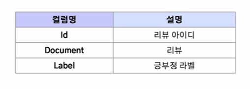

1. 데이터프레임의 각 컬럼과 값 확인하기

2. 결측치 확인

3. 데이터 분포 확인(히스토그램, 커널밀도, 박스플롯 등)

4. 데이터 중복값 확인

#### 1. 데이터프레임의 각 컬럼과 값 확인하기

- head(), tail() 메서드를 통해 데이터 프레임 일부를 쉽게 확인 가능

  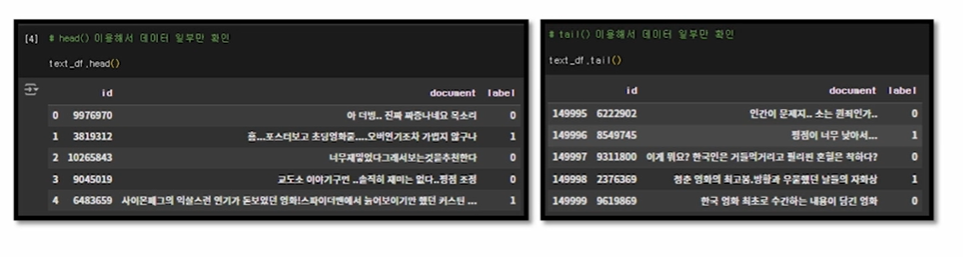

#### 2. 결측치 확인

- info() 메서드를 통해 쉽게 확인 가능

  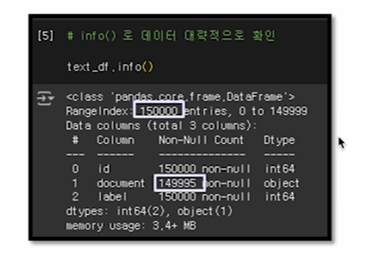

#### 3. 데이터 분포 확인

- 문장의 길이 및 평균 길이 확인

  - 텍스트 데이터의 구조를 이해하는 데 유용함

  - 데이터의 특성을 파악하거나 모델 입력 값을 조정할 때 도움을 줌

- 데이터 중복값 확인

  - 중복된 텍스트는 분석 결과의 왜곡을 초래할 수 있으므로 제거하거나 처리하는 것이 중요함

  - 텍스트 데이터 품질을 높이고, 모델 성능에 긍정적인 영향을 미침

- 문장의 길이 및 평균 길이 확인 예시)

  - len() 메서드를 이용해 문장의 길이를 측정해 새로운 컬럼에 저장해주고, 평균값 계산 및 히스토그램을 통해 평균길이와 분포 확인 가능

  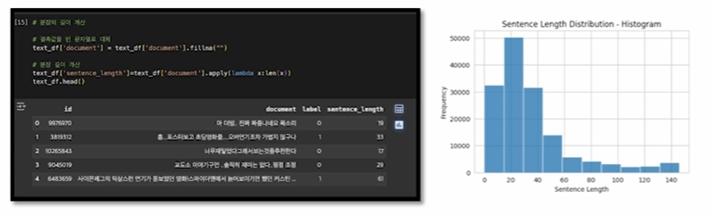

- 중복 값 확인 예시)

  - duplicated() 메서드를 사용하면 중복값을 확인할 수 있음

  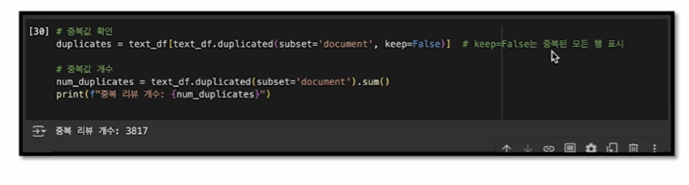

---

### `02. 정형 데이터 전처리`

#### 수치형 데이터 전처리 방법

1. 결측치 처리

2. 이상치 탐지 및 처리

3. 스케일링 및 정규화

4. 데이터 타입 변환

#### 수치형 데이터 전처리 방법

#### 1. 결측치 처리

- 간단히 pandas 라이브러리에서 제공하는 메서드인 dropna()를 통해 결측치에 해당하는 행을 삭제 할 수 있음

  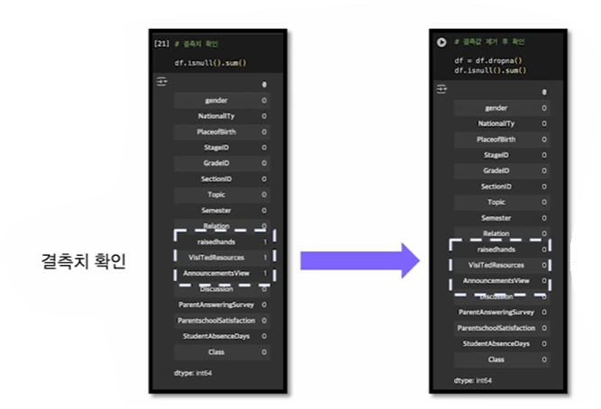

#### 2. 이상치 탐지 및 처리

- EDA 과정에서 데이터 분포도를 통해 이상치 발견 가능

  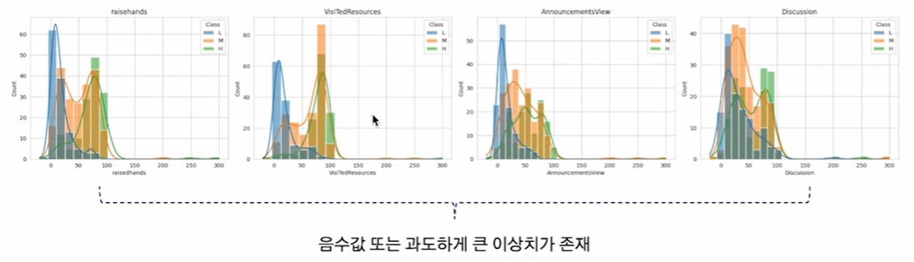

- IQR 방식으로 처리

  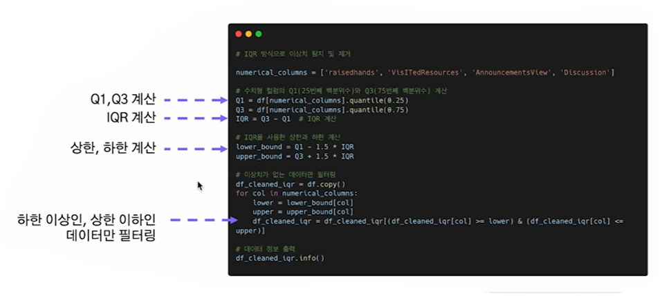

  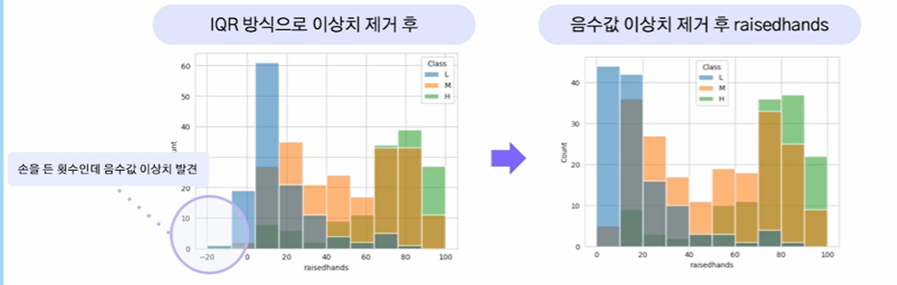

#### 3. 스케일링 및 정규화

- 사이킷런에서 제공하는 스케일링 함수

  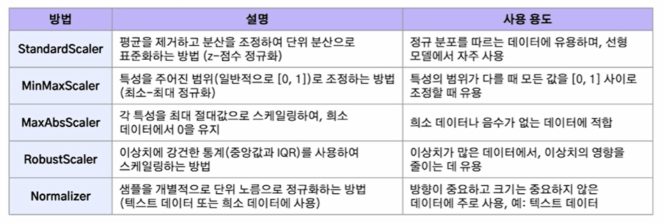

- MinMaxScaler로 정규화 예시)

  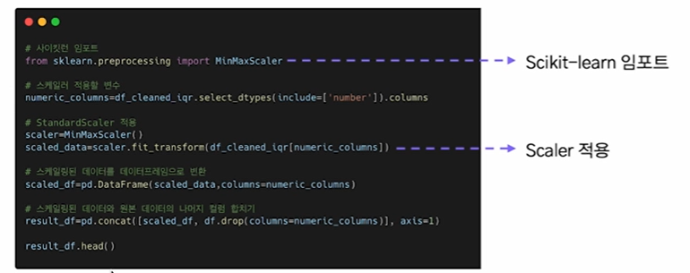

- MinMaxSclaer로 정규화하기

  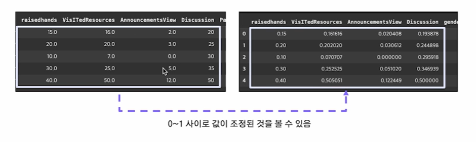

---

#### 범주형 데이터 전처리 방법

#### 데이터 타입 변환

- 대부분의 머신러닝 알고리즘(예: 선형 회귀, 로지스틱 회귀, 결정 트리, 신경망)은 수치 데이터를 입력으로 사용. 머신러닝 알고리즘은 수학적 연산(거리 계산, 벡터 내적 등)을 기반으로 작동하므로, 범주형 데이터를 그대로 사용하면 작동하지 않거나 부정확한 결과를 초래할 수 있음

  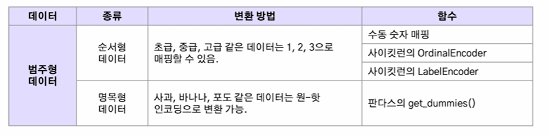

#### (1) 명목형 데이터

🔅 원-핫 인코딩(one-hot encoding)이란?

- 각 범주를 새로운 컬럼으로 생성하고, 해당 범주에 해당하면 1, 그렇지 않으면 0으로 나타내는 방법

  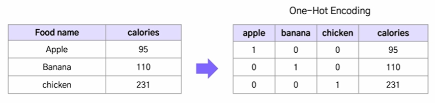

- 원-핫 인코딩 예시) pandas의 get_dummies() 메서드를 이용해 쉽게 원-핫 인코딩 가능

  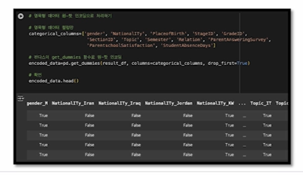