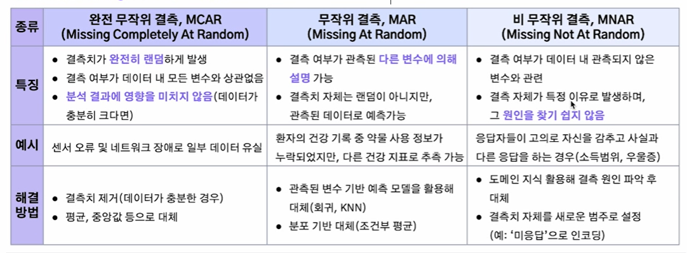
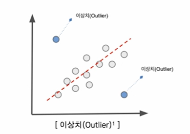

# 2024-12-04(수) AI코스 - 데이터 전처리 및 클렌징

### Index

1. 데이터 품질 문제 유형

    - 결측치 및 이상치

    - 불균형 데이터

    - 데이터 크기, 단위, 분포 차이

2. 자연어 데이터의 고유 문제

    - 자연어 데이터의 고유 문제

    - 자연어 데이터 문제 해결 방법

3. 윤리 및 법적 문제

    - 개인정보 및 민감정보

    - 데이터 편향 및 차별

    - 데이터 왜곡 및 조작

    - 저작권 및 데이터 소유권

    - 허위정보 유포 및 범죄 악용

---

### `01. 데이터 품질 문제 유형`

#### 결측치(Missing Value)

- **정의** : 수집된 데이터셋 중 **관측되지 않거나 누락된** 데이터

- **값의 특성** : Null

- 발생 시 잘못된 분석 결과를 낳거나 분석 시 에러가 발생할 수 있음

[결측치 예시]

|ID|Type|Vaue|
|:-:|:--:|:--:|
|100|A|1535|
|101|B||
|102|C|2561|

🔅 결측치 발생 사유

- 센서 오작동, 네트워크 문제 등으로 인한 이유

- 설문조사에서 응답자가 특정 질문에 답하지 않은 경우

- 데이터를 입력하는 과정에서 값이 누락되거나 잘못 기록된 경우

- 데이터베이스 손상, 저장 프로세스의 오류로 인한 경우

#### 결측치(Missing Value) - 종류

  

#### 이상치(Outlier)

- **정의** : 관측된 데이터의 범위에서 **많이 벗어난 아주 작은 값이나 큰 값**을 말함

- **예시** : 평균 키가 170cm인 집단에서 250cm 키가 측정된 경우

- 데이터 분석 혹은 모델링할 경우, 이;러한 이상치가 의사결정에 큰 영향을 미칠 수 있기 때문에 **이상치 처리는 필수**적임

🔅 이상치 발생 이유

- 잘못된 데이터 입력 및 장비 오류

- 데이터 분포 내에서 극단적인 값이 발생

- 데이터 수집하면서 샘플링 과정에서 발생한 오류

