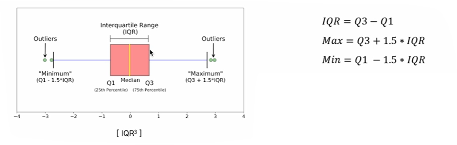

# 2024-12-04(수) AI코스 - 데이터 전처리 및 클렌징

### Index

1. 데이터 품질 문제 유형

    - 결측치 및 이상치

    - 불균형 데이터

    - 데이터 크기, 단위, 분포 차이

2. 자연어 데이터의 고유 문제

    - 자연어 데이터의 고유 문제

    - 자연어 데이터 문제 해결 방법

3. 윤리 및 법적 문제

    - 개인정보 및 민감정보

    - 데이터 편향 및 차별

    - 데이터 왜곡 및 조작

    - 저작권 및 데이터 소유권

    - 허위정보 유포 및 범죄 악용

---

### `01. 데이터 품질 문제 유형`

#### 결측치(Missing Value)

- **정의** : 수집된 데이터셋 중 **관측되지 않거나 누락된** 데이터

- **값의 특성** : Null

- 발생 시 잘못된 분석 결과를 낳거나 분석 시 에러가 발생할 수 있음

[결측치 예시]

|ID|Type|Vaue|
|:-:|:--:|:--:|
|100|A|1535|
|101|B||
|102|C|2561|

🔅 결측치 발생 사유

- 센서 오작동, 네트워크 문제 등으로 인한 이유

- 설문조사에서 응답자가 특정 질문에 답하지 않은 경우

- 데이터를 입력하는 과정에서 값이 누락되거나 잘못 기록된 경우

- 데이터베이스 손상, 저장 프로세스의 오류로 인한 경우

#### 결측치(Missing Value) - 종류

  

#### 이상치(Outlier)

- **정의** : 관측된 데이터의 범위에서 **많이 벗어난 아주 작은 값이나 큰 값**을 말함

- **예시** : 평균 키가 170cm인 집단에서 250cm 키가 측정된 경우

- 데이터 분석 혹은 모델링할 경우, 이;러한 이상치가 의사결정에 큰 영향을 미칠 수 있기 때문에 **이상치 처리는 필수**적임

🔅 이상치 발생 이유

- 잘못된 데이터 입력 및 장비 오류

- 데이터 분포 내에서 극단적인 값이 발생

- 데이터 수집하면서 샘플링 과정에서 발생한 오류

#### 이상치(Outlier) - 탐지 방법

#### 1) Z-Score

- 데이터의 분포가 **정규 분포**를 이룰 때, 데이터의 **표준 편차**를 이용해 이상치를 탐지하는 방법

  

- Z-Score는 해당 데이터가 평균적으로부터 얼마나 표준편차 만큼 벗어나 있는지를 의미함

- 주로 Z-Score에서 3보다 크고 -3보다 작은 값을 이상치로 판별함

#### 2) IQR(Interquartile Range) with Box plots

- 데이터의 분포가 **정규 분포를 이루지 않거나 한쪽으로 치우친 경우**, 데이터의 IQR 값을 사용해 이상치 탐지하는 방법

  

- 박스 플롯을 통해 최소값, 최대값, 중앙값, Q1, Q3 값을 알 수 있으며, 이상치를 확인할 수 있음

- Q1 - 1.5*IQR 미만, Q3 + 1.5*IQR 초과를 이상치로 간주함

#### 3) Isolation Forest

- 결정 트리(decision tree) 계열의 **비지도 학습 알고리즘**으로 **고차원 데이터셋**에서 이상치 탐지할 때 효과적임

- 이 알고리즘은 데이터의 **"고립"**을 기반으로 작동하며 이상치는 정상 데이터보다 고립되기 쉽다는 점을 활용함

  

🔅 작동 원리

1. 데이터를 랜덤한 방식으로 나무 구조로 분할함

2. 이상치는 적은 횟수의 분할만으로도 고립되기 때문에, 고립되는 데 필요한 경로 길이가 짦음

3. 여러 나무의 결과를 평균 내어 이상치 점수를 계산함

#### 4) DBScan(Density Based Spatial Clustring of Applications with Noise)

- 밀도 기반 클러스터링 알고리즘으로, 밀도 기준으로 군집을 정의하고 **밀도가 낮은 데이터**를 이상치로 탐지

- 밀집된 지역에서 데이터를 군집화한 후, 밀도가 낮아 **어느 군집에도 속하지 못하는 점**들을 이상치로 간주함

  

🔅 주요 매개변수

- **Eps** : 데이터 포인트가 이웃이라고 간주되는 거리의 반경으로, 데이터 분포에 따라 결정함

- **MinPts** : 한 군집을 이루는 최소 데이터 포인트 개수로, 데이터 차원(D)에 따라 일반적으로  D+1 이상의 갑승로 설정함

---

#### 불균형 데이터(Imbalanced Data)

- **정의** : 범주형 데이터 중, 클래스 간 샘플 수의 비율이 크게 차이 나는 데이터

- **예시** : 이진 분류에서 긍정 클래스가 10%이고, 부정 클래스가 90%인 경우

  

🔅 불균형 데이터의 문제점

- 다수의 클래스에 맞춰 예측하는 경향이 생김

- 정확도가 높더라도 소수 클래스 예측 성능은 낮을 수 있음

- 소수 클래스의 정보를 손실하여 정확한 예측이 어려움

#### 불균형 데이터(Imbalanced Data) - 데이터 접근 해결 방법

  

#### 불균형 데이터(Imbalanced Data) -  알고리즘 접근 해결 방법

  

#### 데이터 크기, 단위, 분포 차이 - 데이터 스케일링

- **데이터의 크기, 단위, 분포 차이**를 조정하여 머신러닝 모델의 성능을 향상시키기 위한 과정

- 많은 알고리즘은 **변수의 크기에 영향을 받기 때문에** 값이 큰 데이터가 더 큰 영향을 미치지 않도록 조정 필요

- **단위나 범위가 크게 다른 경우**, 특정 특징이 다른 특징을 압도하는 문제를 방지(예: 나이 vs 수입)

  

---

### `02. 자연어 데이터의 고유 문제`

#### 자연어 데이터 - 고유 문제

- **비정형 데이터** : 틀이 잡혀 있지 않고 사전 정의가 없는 데이터

- **희소성** : 높은 차원에 비해 특정 단어가 드물게 나타나, 문장 간 유사도를 파악하기 어려움

- **모호성과 중의성** : 단어의 다의성과 문맥 의존성(예 : "Apple" : 과일 vs 회사)

- **다양성** : 동일한 의미를 가진 다양한 표현(예: 좋아요 -> 좋아, 굿, nice)

- **비표준 표현** : 대/소문자, 띄어쓰기, 맞춤법, 오탈자, 문법 오류

- **불필요한 단어** : 길이가 짧은 단어, 등장빈도가 적은 단어, 특수기호

- **비구조화** : 컴퓨터가 자연어 데이터를 인식 및 처리할 수 없음

  

#### 자연어 데이터 - 문제 해결 방법

1) 텍스트 정제(Text Cleaning)

- 텍스트 데이터에서 의미가 없는 기호, 숫자, 불용어 등을 제거

- 불용어란, "the", "is", "것", "들" 와 같은 의미가 없는 단어를 뜻함

- 예시 : URL, HTML 태그 제거

2) 텍스트 정규화(Text Normalization)

- 데이터를 일관된 형식으로 변환하여 모델이 학습하기 쉽도록 만듦

- 구어체, 약어, 이모티콘 등 다양한 표현을 문법적, 의미적 표준형태로 통일함

- 예시 : 소문자 변환, 철자 교정

  

🔅 텍스트 정제 및 정규화 - 파이썬 예시

  