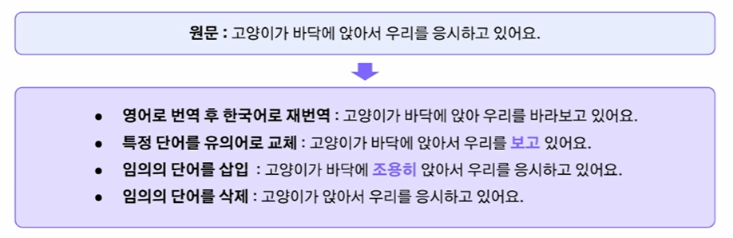
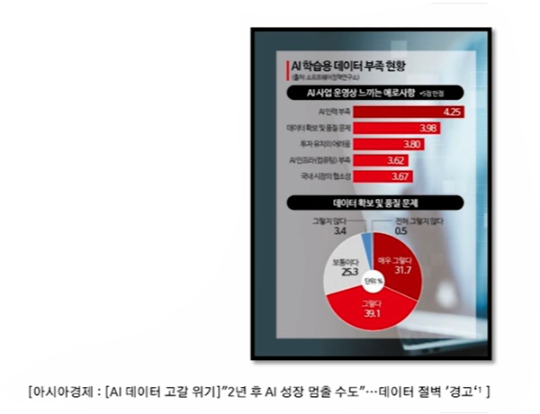

# 2024-12-05(목) AI코스 - 데이터 증강의 개념과 필요성

### Index

1. 데이터 증강의 개념

    - 데이터 증강(Data Augmentation)

2. 데이터 증강의 필요성

    - 불균형 데이터

    - 모델 과적합 방지

    - 데이터 증강 사례

3. 데이터 증강 기법 소개

    - 이미지, 텍스트, 시계열 데이터의 증강 기법 소개

---

### `01. 데이터 증강의 개념`

#### 데이터 증강(Data Augmentation)

- 기존 데이터를 변형하거나 가공하여 새로운 데이터를 생성하는 기법

- 데이터의 양과 다양성을 증가시켜 모델 성능을 향상 시킴

- 이미지 증강 예시

  

  

---

### `02. 데이터 증강의 필요성`

#### 데이터 증강이 왜 필요할까?

- 데이터 증강은 **머신러닝과 딥러닝 모델의 성능을 향상시키기 위해 필수적인 기술**

- 머신러닝과 딥러닝 모델은 대량의 데이터를 기반으로 학습하기 때문에 **데이터의 양이 충분하지 않으면 모델은 일반화 능력을 상실하고 훈련 데이터에 과도하게 의존하는 과적합(overfitting) 문제가 발생**

- 데이터가 충분하지 않으면 AI 모델이 학습할 패턴이 제한되어 새로운 데이터에서 낮은 정확도를 보일 수 있음

#### AI 학습을 위한 데이터 부족

- 국내 AI 기업 중 **70.8%가 데이터 확보 및 품질 문제로 어려움**을 겪고 있음

- 국내 대기업들도 데이터가 부족해 해외 데이터를 구매하거나 합성데이터를 이용

- AI 모델의 학습 속도가 빨라지면서 데이터 증가 속도르 따라가고 있음

- 현재 인터넷 상에 존재하는 데이터로는 2년 내 AI 모델 성능을 높이는 데 한계가 생길 것이라는 예측

- 인터넷의 방대한 데이터 중 AI 모델 학습에 사용하기 좋은 고품질의 데이터는 부족

  