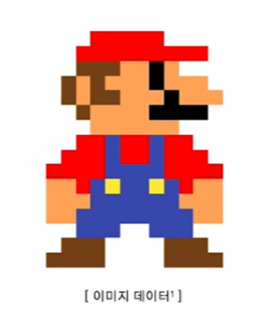
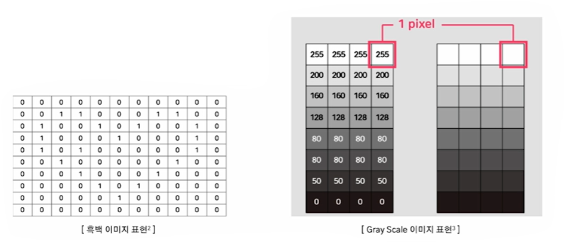
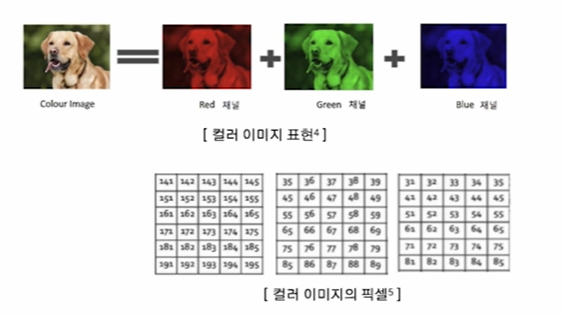
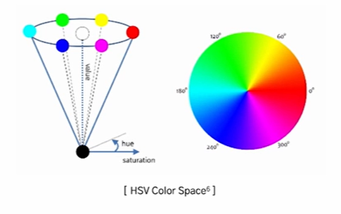
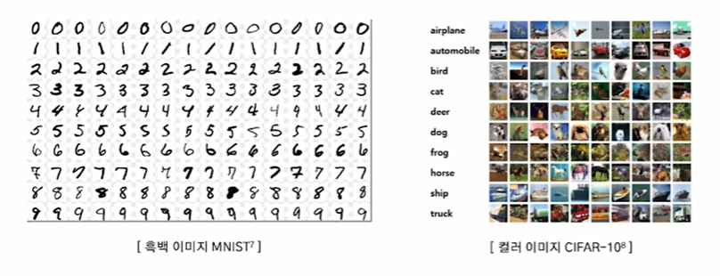
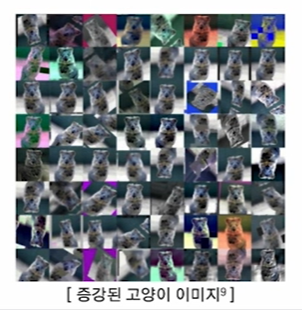

# 2024-12-05(목) AI코스 - 이미지 데이터 증강 기법

### Index

1. 이미지 데이터

    - 픽셀

    - 이미지 데이터 종류

2. 이미지 데이터 기본 증강 기법

    - 이미지 데이터 증강

    - Image Manipulation

    - Image Erasing

    - Image Mix

3. 이미지 데이터 고급 증강 기법

    - Auto Augment

    - Feature Augmentation

    - Deep Generative Models

---

### `01. 이미지 데이터`

#### 픽셀 (pixel)

- 컴퓨터는 숫자로 데이터를 표현 및 저장

- 이미지를 **픽셀(pixel)** 형태로 만들어 처리

- 픽셀 : 그림의 **작은 사각형 한 개**

- 한 개의 이미지에 픽셀이 많을수록 고화질

- 한 이미지의 표현(해상도) : **세로 픽셀 수(높이) x 가로 픽셀 수(너비)**

  

#### 흑백 이미지(Gray Scale)

- 픽셀이 **0(흰색)** 혹은 **1(검은색)** 로 저장 및 표현

- 0과 1로만 표현을 하게 되면 이미지의 명암 표현 불가능

- **0~255**까지의 숫자로 **명암**을 표현하여 픽셀에 저장 및 표현

  

#### 컬러 이미지(RGB)

- **빨강(Red), 녹색(Green), 파랑(Blue)**의 조합으로 **RGB**로 표현

- RGB는 빨강, 녹색, 파랑 **3개의 채널(깊이)**로 구성

- 각 색깔은 **0~255** 까지의 숫자로 표현 및 저장

- 이미지의 크기 : **6(높이) X 5(너비) X 3(채널)**

  

#### HSV

- 색상 정보와 밝기 정보를 분리하여 RGB보다 뛰어난 성능

- **색상(Hue)** : 가시광선 스펙트럼을 주파수 별로 고리 모양으로 배치했을 때의 각도

- **채도(Saturation)** : 특정한 색상의 진함의 정도

- **명도(Value)** : 밝은 정도

  

#### 이미지 데이터셋

  

---

### `02. 이미지 데이터 기본 증강 기법`

#### 이미지 데이터 증강

- 다른 데이터 증강과 마찬가지로, **과적합을 피하기** 위해 **생성**을 통해 **증강**이 목표

- 하나의 이미지를 이용하여 다양한 이미지를 생성할 수 있음

  