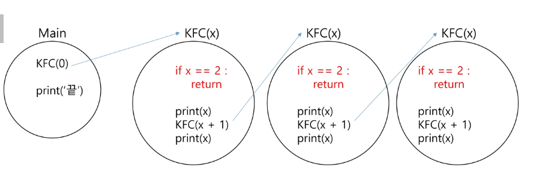
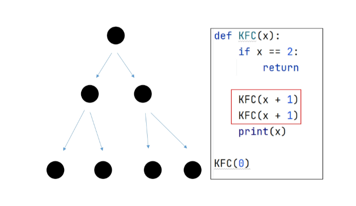

# 2024-09-02(월) APS(Algorithm Problem Sloving) 응용

- 반복(Iteration)과 재귀(Recursion)
- 순열
- 완전 탐색

---

<학습목표>

- 재귀적 알고리즘의 특성을 이해하고 이를 구현하기 위한 **재귀 호출**에 대해 학습한다.

- **완전 탐색**의 개념을 이해하고 완전 탐색을 통한 문제 해결 방법에 대해 학습한다.

---

### `반복과 재귀`

#### 반복(Iteration)과 재귀(Recursion)

- 반복과 재귀는 유사한 작업을 수행할 수 있다.

- 반복은 수행하는 작업이 완료될 때 까지 계속 반복

    - 루프(for, while 구조)
    - **반복문은 코드를 n번 반복시킬 수 있다.**

- 재귀는 주어진 문제의 해를 구하기 위해 동일하면서 더 작은 문제의 해를 이용하는 방법

    - 하나의 큰 문제를 해결할 수 있는(해갈하기 쉬운) 더 작은 문제로 쪼개고 결과들을 결합한다.
    - **재귀호출은 n 중 반복문을 만들어낼 수 있다.**


- 반복문으로는 n번 반복을 구현할 수 있고, 재귀호출로 n 중 for문을 구현할 수 있다.

    - N 입력 후 1 1 1 ... ~ 3 3 3 ... 출력하는 문제는 for문으로 구현이 어렵다.

    - 아래처럼 재귀호출로 구현할 수 있다.


    

#### `재귀를 연습하기 전, 알아야할 함수의 특징 1`

- KFC 함수 호출할 때, int 타입 객체를 전달하면 **값만 복사**가 된다.

- 아래 예시에서, main함수의 x와, KFC 함수의 x는 서로 다른 객체이다. ( 마치 한국 사는 KIM과, 미국 사는 KIM이 이름만 같고, 서로 다른 사람인 것 처럼)


#### `재귀를 연습하기 전, 알아야할 함수의 특징 2`

- 함수가 끝나면, Main으로 되돌아 오는 것이 아니라, **해당 함수를 호출했던 곳으로 돌아온다.**

- 아래 코드의 실행 결과는? ( 8 14 9 3)


#### [도전]무한재귀호출


```python
def KFC(x):
    KFC(x+1)

KFC(0)  # ​​RecursionError: maximum recursion depth exceeded
```


#### 재귀호출 공부의 시작은, 무한 재귀호출을 막는 것 부터 시작한다.

- 출력결과는 `0 1 1 0` 이다.

- 아래 if문을 **"기저조건(base case)"**이라고 한다.




#### [도전] 0 1 2 3 4 5 5 4 3 2 1 0 을 재귀호출을 이용하여 구현한다.

```python
def func(x):

    # 1. 기저조건(종료조건)
    if x == 6:
        return

    # 2. 다음 재귀 호출 전
    print(x, end = ' ')

    # 3. 재귀 호출 (현재 값에 무슨 수식을 적용해서 넘겨줄까?)
    func(x + 1)  # 다음 재귀 호출에서는 현재보다 x 값이 1이 커야한다.

    # 4. 호출하고 돌아왔을 때
    print(x, end = ' ')

start = 0
func(start)

```

- 재귀호출 코드가 1개

    - KFC 함수 내부에 KFC(x + 1) 재귀 호출 코드가 하나인 경우 예시 그림
    - 출력결과는 **10**이다.


#### 재귀호출 코드가 2개, 간략화 하여 그리기 1

- KFC 함수 내부에 KFC(x + 1) 재귀 호출 코드가 두개


#### 재귀호출 코드가 2개, 간략화 하여 그리기 2

- 아래 그림만 보고, 우측 코드를 구현할 수 있어야 한다.



- 깊이를 Level이라고 부를 수 있다.

    - Level은 3, Branch (나뭇가지)는 4인 형태인 코드를 오른쪽과 같이 For문으로도 표현 가능하다.

    