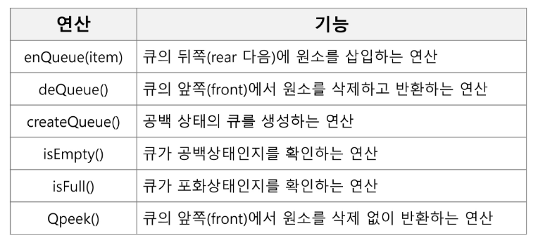
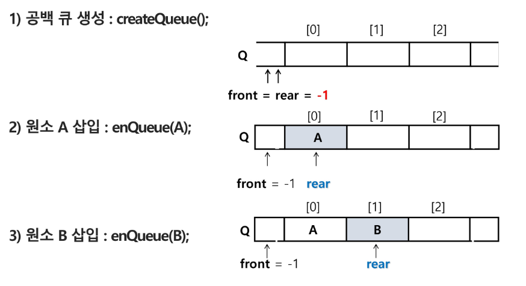
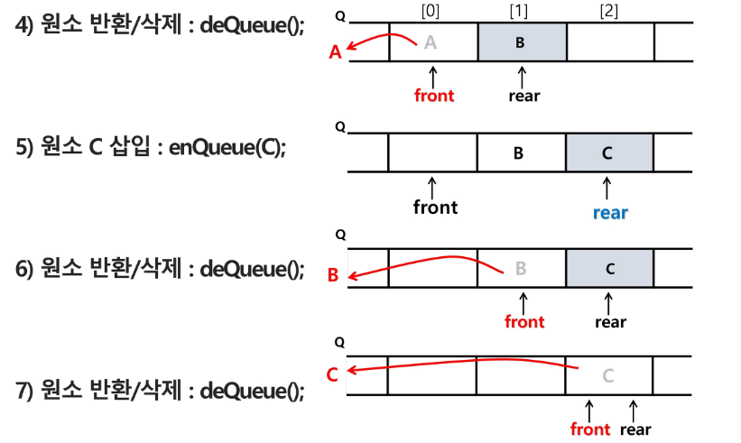

# 2024-08-13(화) Queue 01

- 선형큐
- 원형큐
- 연결큐
- 우선순위 큐
- 큐의 활용 : 버퍼


---

#### 큐(Queue)의 특성

- 스택과 마찬가지로 삽입과 삭제의 위치가 제한적인 자료구조
    - 큐의 뒤에서는 삽입만 하고, 큐의 앞에서는 삭제만 이루어지는 구조

- **선입선출구조(FIFO : First In First Out)
    - 큐에 삽입한 순서대로 원소가 저장되어, 가장 먼저 삽입(First In)된 원소는 가장 먼저 삭제(First Out)된다.

#### 큐의 선입선출 구조


- 큐의 기본 연산
    - 삽입 : enQueue
    - 삭제 : deQueue


#### 큐의 사용을 위해 필요한 주요 연산은 다음과 같음






1) createQueue(); : 크기가 정해진 큐




---

### `선형큐`

- 1차원 배열을 이용한 큐
    - 큐의 크기 = 배열의 크기
    - front = 저장된 첫 번째 원소의 인덱스
    - rear : 저장된 마지막 원소의 인덱스

- 상태 표현 
    - 초기 상태 : front = rear = -1
    - 공백 상태 : front == rear
    - 포화 상태 : rear == n-1 (n: 배열의 크기, n-1 : 배열의 마지막 인덱스)

#### `삽입 : enQueue(item)`

- 마지막 원소 뒤에 새로운 원소를 삽입하기 위해

① rear 값을 하나 증가시켜 새로운 원소를 삽입할 자리를 마련

② 그 인덱스에 해당하는 배열원소 Q[rear]에 item을 저장

```python
def enQueue(item):
    global rear

    if isFull(): 
        print("Queue_Full")
    else:
        rear += 1
        Q[rear] = item

```

#### `삭제 : deQueue()`

- 가장 앞에 있는 원소를 삭제하기 위해

① front 값을 하나 증가시켜 큐에 남아있는 첫 번째 원소 이동

② 새로운 첫 번째 원소를 리턴 함으로써 삭제와 동일한 기능함


#### `검색 : Qpeek()`

- 가장 앞에 있는 원소를 검색하여 반환하는 연산
- 현재 front의 한자리 뒤(front + 1)에 있는 원소, 즉 큐의 첫 번째에 있는 원소를 반환

```python
def Qpeek():
    if isEmpty():
        print('Queue_Empty")
    else:
        return Q[front+1]
```

#### 연습문제

- 세 개의 데이터 1, 2, 3을 차례로 큐에 삽입하고
- 큐에서 세 개의 데이터를 차례로 꺼내서 출력한다.

```python
N = 10
q = [0] * N
front = -1
rear = -1

rear += 1   # enqueue(1)
q[rear] = 1
rear += 1
q[rear] = 2  # enqueue(2)
rear += 1     # enqueue(3)
q[rear] = 3


front += 1   # dequeue()
print(q[front])
front += 1   # dequeue()
print(q[front])
```

---

#### `원형 큐`

##### 선형 큐 이용시의 문제점

- 잘못된 포화상태 인식

    - 선형 큐를 이용하여 원소의 삽입과 삭제를 계속할 경우, 배열의 앞부분에 활용할 수 있는 공간이 있음에도 불구하고, rear = n - 1인 상태 즉, 포화상태로 인식하여 더 이상의 삽입을 수행하지 않게 됨.


- 해결방법 1
    - 매 연산이 이루어질 때마다 저장된 원소들을 배열의 앞부분으로 모두 이동시킴
    - 원소 이동에 많은 시간이 소요되어 큐의 효율성이 급격히 떨어짐


- 해결방법 2

    - 1차원 배열을 사용하되, 논리적으로는 배열의 처음과 끝이 연결되어 원형 형태의 큐를 이룬다고 가정하고 사용
    - 원형 큐의 논리적 구조

#### 원형 큐의 구조

- 초기 공백 상태
    - front = rear = 0

- index의 순환

    - front와 rear의 위치가 배열의 마지막 인덱스인 n-1를 가리킨 후, 그 다음에는 논리적 순환을 이루어 배열의 처음 인덱스인 0으로 이동해야함
    - 이를 위해 나머지 연산자 mod를 사용함


- front 변수
    - 공백 상태와 포화 상태 구분을 쉽게 하기 위해 front가 있는 자리는 사용하지 않고 항상 빈자리로 둠

- 삽입 위치 및 삭제 위치


|       |삽입 위치|삭제 위치|
|:-----:|:------:|:------:|
|선형 큐|rear = rear + 1|front = front + 1|
|원형 큐|rear = (rear + 1) mod n | front = (front + 1) mod n|


---

#### `연결 큐`

- 단순 연결 리스트(Linked List)를 이용한 큐
    - 큐의 원소 : 단순 연결 리스트의 노드
    - 큐의 원소 순서 : 노드의 연결 순서. 링크로 연결되어 있음
    - front : 첫 번째 노드를 가리키는 링크
    - rear : 마지막 노드를 가리키는 링크

- 상태 표현
    - 초기 상태 : front = rear = null
    - 공백 상태 : front = rear = null


---

#### `우선순위 큐`

- 우선순위 큐의 특성

    - 우선순위를 가진 항목들을 저장하는 큐
    - FIFO 순서가 아니라 우선순위가 높은 순서대로 먼저 나가게 된다.

- 우선순위 큐의 적용 분야
    - 시뮬레이션 시스템
    - 네트워크 트래픽 제어
    - 운영체제의 테스크 스케줄링

- 우선순위 큐의 구현
    - 배열을 이용한 우선순위 큐
    - 리스트를 이용한 우선순위 큐

- 우선순위 큐의 기본 연산
    - 삽입 : enQueue
    - 삭제 : deQUeue

- 배열을 이용하여 우선순위 큐 구현
    - 배열을 이용하여 자료 저장
    - 원소를 삽입하는 과정에서 우선순위를 비교하여 적절한 위치에 삽입하는 구조
    - 가장 앞에 최고 우선순위의 원소가 위치하게 됨

- 문제점 
    - 배열을 사용하므로, 삽입이나 삭제 연산이 일어날 때 원소의 재배치가 발생함
    - 이에 소요되는 시간이나 메모리 낭비가 큼

---

#### `버퍼(Buffer)`

- 데이터를 한 곳에서 다른 한 곳으로 전송하는 동안 일시적으로 그 데이터를 보관하는 메모리의 영역
- 버퍼링 : 버퍼를 활용하는 방식 또는 버퍼를 채우는 동작을 의미

##### 버퍼의 자료 구조

- 버퍼는 일반적으로 입출력 및 네트워크와 관련된 기능에서 이용된다.
- 순서대로 입력/출력/전달되어야 하므로 FIFO 방식의 자료구조인 큐가 활용된다.


