# 2024-08-27(화) Tree

- 트리
- 이진 트리
- 이진 트리의 표현
- [참고] 이진 트리의 저장
- 연습 문제
- 이진탐색 트리
- 힙
  
---

### `트리`

#### 트리의 개념

-  비선형 구조
-  원소들 간에 1:n 관계를 가지는 자료 구조
-  원소들 간에 계층관계를 가지는 계층형 자료구조
-  상위 원소에서 하위 원소로 내려가면서 확장되는 트리(나무)모양의 구조
  
#### 트리의 정의

- 한개 이상의 노드로 이루어진 유한 집합이며 다음 조건을 만족한다.
  - 노드 중 최상위 노드를 루트(root)라 한다.
  - 나머지 노드들은 n(>=0)개의 분리 집합 T1, ..., TN으로 분리될 수 있다.
- 이들 T1, ..., TN은 각각 하나의 트리가 되며(재귀적 정의) 루트의 부 트리(subtree)라 한다.

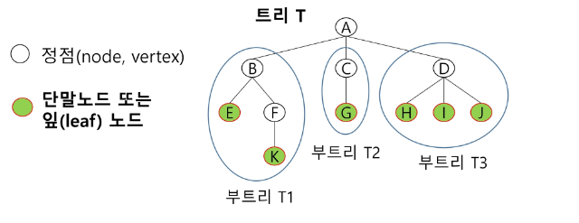

#### 트리 - 용어정리

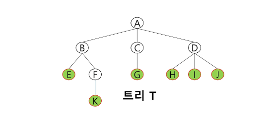

- `노드(node)` - 트리의 원소
  - 트리 T의 노드 - A, B, C, D, E, F, G, H, I, J, K

- `간선(edge)` - 노드를 연결하는 선. 부모 노드와 자식 노드를 연결

-  `루트 노드(root node)` - 트리의 시작 노드
   -  트리 T의 루트노드 - A

- `형제 노드(sibling node)` - 같은 부모 노드의 자식 노드들
  - B, C, D는 형제 노드

- `조상 노드` - 간선을 따라 루트 노드까지 이르는 경로에 있는 모든 노드들
  - K의 조상 노드 : F, B, A

- `조상 노드` - 간선을 따라 루트 노드까지 이르는 경로에 있는 모든 노드들
  - K의 조상 노드 : F, B, A

- `서브 트리(subtree)` - 부모 노드와 연결된 간선을 끊었을 때 생성되는 트리

- `자손 노드` - 서브 트리에 있는 하위 레벨의 노드들
    - B의 자손 노드 - E, F, K

- `차수(degree)`
    - 노드의 차수 : 노드에 연결된 자식 노드의 수.
    - B의 차수 = 2, C의 차수 = 1
- 트리의 차수 :트리에 있는 노드의 차수 중에서 가장 큰 값
  - 트리 T의 차수 = 3
- 단말 노드(리프 노드) : 차수가 0인 노드. 자식 노드가 없는 노드

- `높이`
  - 노드의 높이 : 루트에서 노드에 이르는 간선의 수. 노드의 레벨
  - B의 높이 = 1, F의 높이 = 2
- 트리의 높이 : 트리에 있는 노드의 높이 중에서 가장 큰 값. 최대 레벨
  - 트리 T의 높이 = 3

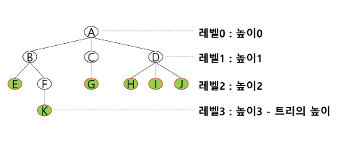

---

### 이진 트리

- 모든 노드들이 2개의 서브트리를 갖는 트리
  
- 각 노드가 자식 노드를 최대한 2개까지만 가질 수 있는 트리
  - 왼쪽 자식 노드(left child node)
  - 오른쪽 자식 노드(right child node)
  
- 이진 트리의 예

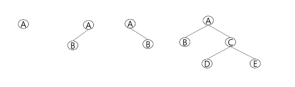

#### 이진 트리의 특성

- 레벨 i 에서의 노드의 최대 개수는 2^i

- 높이가 h인 이진 트리가 가질 수 있는 노드의 최소 개수는 `(h+1)`개가 되며, 최대 개수는 `(2^(h+1)-1)`개가 된다.

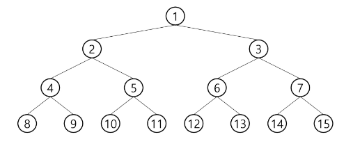

#### 이진 트리 종류

- `포화 이진 트리(Full Binary Tree)`

  - 모든 레벨에 노드가 포화상태로 차 있는 이진 트리
  - 높이가 h일 때, 최대의 노드 개수인(2^(h+1)-1)의 노드를 가진 이진 트리
    - 높이 3일 때 2^(3+1)-1 = 15개의 노드
  - 루트를 1번으로 하여 2^(h+1)-1까지 정해진 위치에 대한 노드 번호를 가짐

    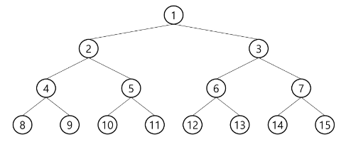


- `완전 이진 트리(Complete Binary Tree)`

    - 높이가 h이고 노드 수가 n개일 때(단, 포화 이진 트리의 노드 번호 1번부터 n번까지 `빈 자리가 없는` 이진 트리
    - 예) 노드가 10개인 완전 이진 트리

    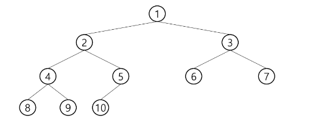

- `편향 이진 트리(Skewed Binary Tree)`

    - 높이 h에 대한 최소 개수의 노드를 가지면서 한쪽 방향의 자식 노드만을 가진 이진 트리
      - 왼쪽 편향 이진 트리
      - 오른쪽 편향 이진 트리

    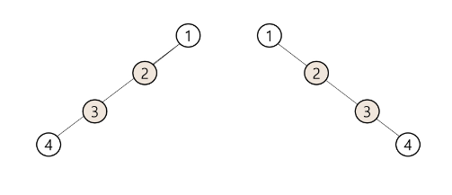


---

### `순회(traversal)`

- `순회(traversal)`란 트리의 각 노드를 중복되지 않게 전부 방문(visit) 하는 것을 말하는데 트리는 비 선형 구조이기 때문에 선형구조에서와 같이 선후 연결 관계를 알 수 없다.

- 따라서 특별한 방법이 필요하다.

#### 이진트리 - 순회(traversal)

- `순회(traversal)` : 트리의 노드들을 체계적으로 방문하는 것

- 3가지의 기본적인 순회방법
    - 전위순회(preorder traversal) : `VLR`
      - 부모노드 방문 후, 자식노드를 좌, 우 순서로 방문한다.
    - 중위순회(inorder traversal) : `LVR`
        - 왼쪽 자식노드, 부모노드, 오른쪽 자식노드 순으로 방문한다.
    - 후위순회(postoder traversal) : `LRV`
      - 자식노드를 좌우 순서로 방문한 후, 부모노드로 방문한다.

        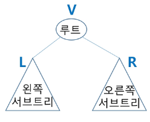


#### `전위 순회(preorder traversal)`

- 수행 방법
  
   ① 현재 노드 n을 방문하여 처리한다. -> V

   ② 현재 노드 n의 왼쪽 서브트리로 이동한다. -> L

   ③ 현재 노드 n의 오른쪽 서브트리로 이동한다. -> R

- 전위 순회 알고리즘

```python
def preorder_traverse(T): # 전위순회
    if T:          # T is not None
        visit(T)   # print(T.item)
        preorder_traverse(T.left)
        preorder_traverse(T.right)
```

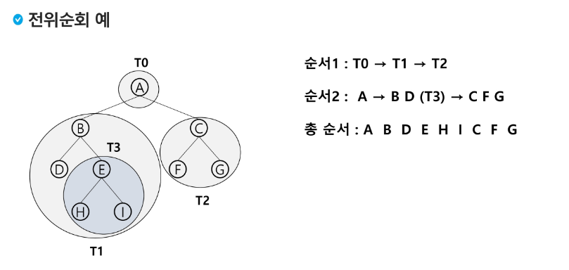

#### `중위 순회(inorder traversal)`

- 수행 방법

    ① 현재 노드 n의 왼쪽 서브트리로 이동한다. -> L

    ②  현재 노드 n을 방문하여 처리한다. -> V

    ③ 현재 노드 n의 오른쪽 서브트리로 이동한다. -> R

- 중위 순회 알고리즘

```python
def inorder_traverse(T):     # 중위순회
    if T:                    # T is not None
        inorder_traverse(T.left)
        visit(T)
        inorder_traverse(T.right)   # print(T.item)
```

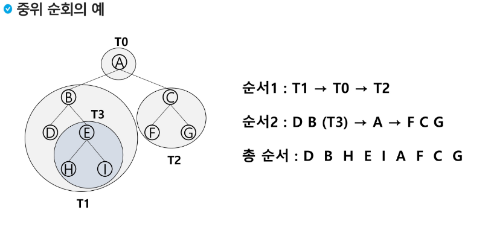


#### `후위 순회(posotorder traversal)`

- 수행 방법

    ① 현재 노드 n의 왼쪽 서브트리로 이동한다. -> L

    ② 현재 노드 n의 오른쪽 서브트리로 이동한다. -> R

    ③ 현재 노드 n을 방문하여 처리한다. -> V


- 후위 순회 알고리즘

```python
def postorder_traverse(T):   # 후위순회
    if T:                    # T is not None
        postorder_traverse(T.left)
        postorder_traverse(T.right)
        visit(T)  # print(T.item)
```

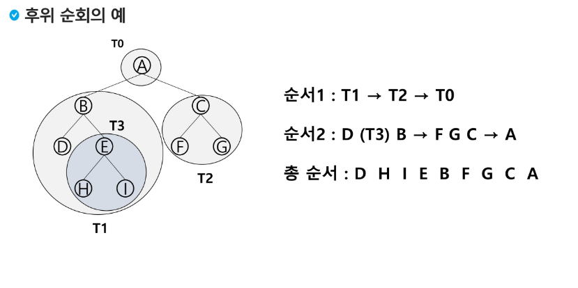

---

### 이진 트리 표현 1

#### 배열을 이용한 이진 트리의 표현

- 이진 트리에 각 노드 번호를 다음과 같이 부여
  
- 루트의 번호를 1로 함

- 레벨 n에 있는 노드에 대하여 왼쪽부터 오른쪽으로 2ⁿ부터 2^(n+1)까지 번호를 부여


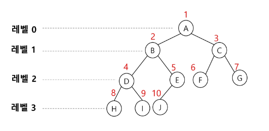


- 노드 번호의 성질
    - 노드 번호가 i인 노드의 부모 노드 번호?   i/2
    - 노드 번호가 i인 노드의 왼쪽 자식 노드 번호?   2*i
    - 노드 번호가 i인 노드의 오른쪽자식 노드 번호?   2*i + 1
    - 레벨 n의 노드 번호 시작 번호는?  2ⁿ


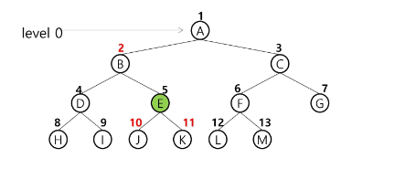

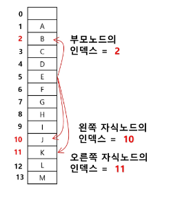


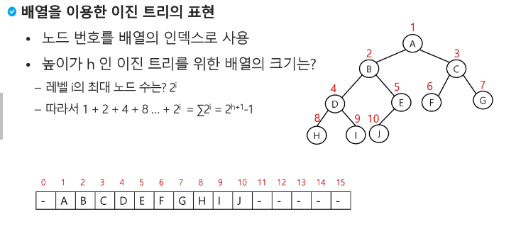

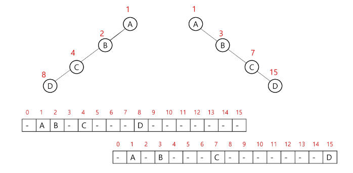

---

### 이진 트리 표현 2

#### 부모 번호를 인덱스로 자식 번호를 저장

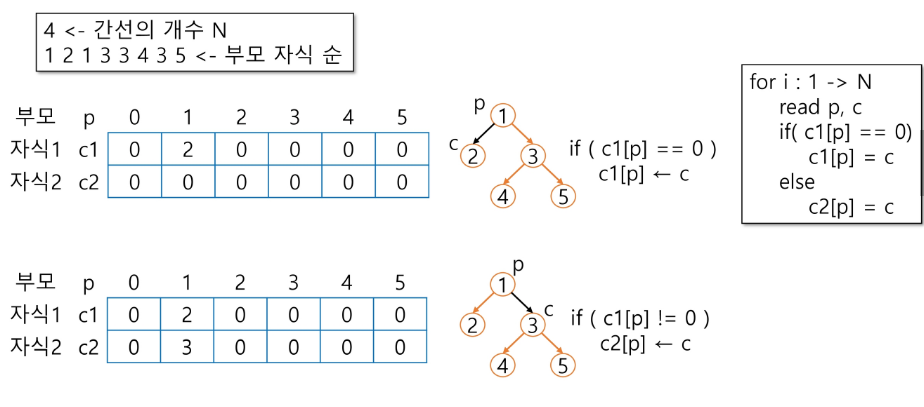

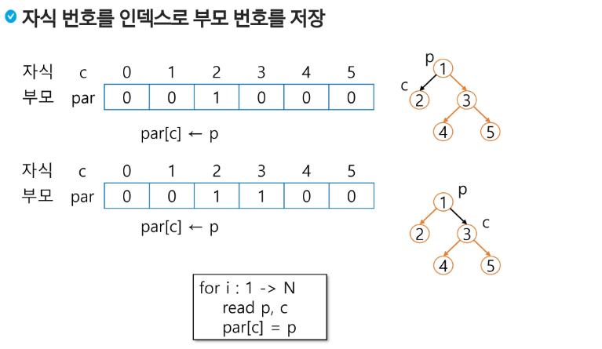

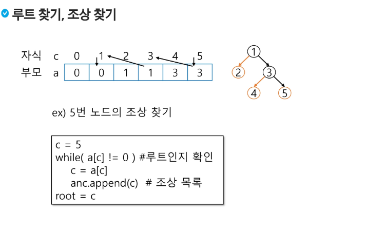

- 배열을 이용한 이진 트리의 표현의 단점
    - 편향 이진 트리의 경우에 사용하지 않은 배열 원소에 대한 메모리 공간 낭비 발생
    - 트리의 중간에 새로운 노드를 삽입하거나 기존의 노드를 삭제할 경우 배열의 크기 변경 어려워 비효율적

#### `연결 리스트`

- 배열을 이용한 이진 트리의 표현의 단점을 보완하기 위해 연결리스트를 이용하여 트리를 표현할 수 있다.

- 연결 자료 구조를 이용한 이진트리의 표현
    - 이진 트리의 모든 노드는 최대 2개의 자식 노드를 가지므로 일정한 구조의 단순 연결 리스트 노드를 사용하여 구현

    


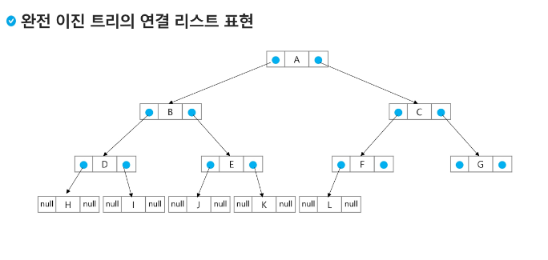