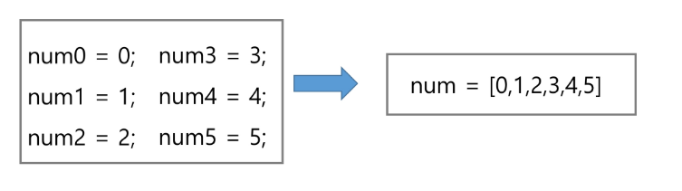
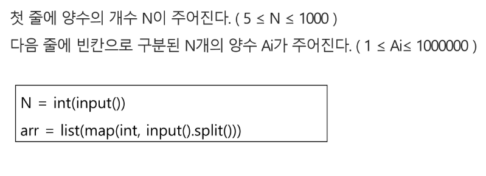
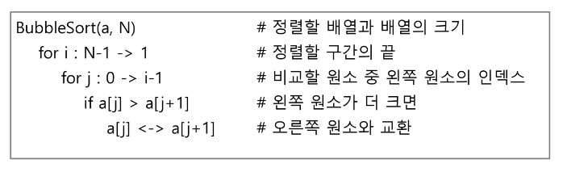

# 2024-07-29(월)  알고리즘 List01_1

- 알고리즘
- 배열
- 버블정렬(Bubble Sort)
- 카운팅 정렬(Counting Sort)
- 완전검색
- 그리디(Greedy Algorithm)

#### 알고리즘이란?

- 유한한 단계를 통해 **문제를 해결하기 위한 절차나 방법**
- 주로 컴퓨터용어로 쓰이며, 컴퓨터가 어떤 일일 수행하기 위한 단계적 방법.
- 어떠한 문제를 해결하기 위한 절차

##### 무엇이 좋은 알고리즘인가?

1. 정확성 : 얼마나 정확하게 동작하는가
2. 작업량 : 얼마나 적은 연산으로 원하는 결과를 얻어내는가
3. 메모리 사용량 : 얼마나 적은 메모리를 사용하는가
4. 단순성 : 얼마나 단순한가
5. 최적성 : 더 이상 개선할 여지없이 최적화되었는가

##### 알고리즘의 작업량을 표현할 때 시간복잡도로 표현한다.

##### `시간 복잡도(Time Complexity)`

- 실제 걸리는 시간을 측정
- 실행되는 명령문의 개수를 계산

###### 시간 복잡도 ≒ 빅-오(O) 표기법

- 빅-오 표기법(Big-O Notation)
- 시간 복잡도 함수 중에서 가장 큰 영향력을 주는 n에 대한 항만을 표시
- 계수(Coefficient)는 생략하여 표시


- n개의 데이터를 입력받아 저장한 후 각 데이터에 1씩 증가시킨 후 각 데이터를 화면에 출력하는 알고리즘의 시간복잡도는?    *O(n)*

---

#### `배열`

##### 배열이란 무엇인가?

- 일정한 자료형의 변수들을 하나의 이름으로 열거하여 사용하는 자료구조
- 6개의 변수를 사용해야 하는 경우, 이를 배열로 바꾸어 사용하는 예.



###### 배열의 필요성

- 프로그램 내에서 여러 개의 변수가 필요할 때, 일일이 다른 변수명을 이용하여 자료에 접근하는 것은 매우 비효율적일 수 있다.
- 배열을 사용하면 하나의 선언을 통해서 둘 이상의 변수를 선언할 수 있다.
- 단순히 다수의 변수 선언은 의미하는 것이 아니라, 다수의 변수로는하기 힘든 작업을 배열을 활용해 쉽게 할 수 있다.

##### 1차원 배열의 선언
- 별도의 선언 방법이 없으면 변수에 처음 값을 할당할 때 생성
- 이름 : 프로그램에서 사용할 배열의 이름

```python
Arr = list()
Arr = []
Arr = [1, 2, 3]
Arr = [0] * 10
```

##### 1차원 배열의 접근

- Arr[0] = 10  # '배열 Arr의 0번 원소에 10을 저장하라'
- Arr[idx] = 20 # '배열 Arr의 idx번 원소에 20을 저장하라'

##### 입력받은 정수를 1차원 배열에 저장하는 방법




---

#### 연습문제1

```
N개의 양의 정수에서 가장 큰 수와 가장 작은 수의 차이를 출력하라.

[입력]
첫 줄에 테스트 케이스의 수 T가 주어진다. (1 ≤ T ≤ 50)
각 케이스의 첫 줄에 양수의 개수 N이 주어진다. (5 ≤ N ≤ 1000)
다음 줄에 N개의 양수 ai가 주어진다. ( 1 ≤ ai ≤ 1000000)

[출력]

각 줄마다 "#T" (T는 테스트 케이스 번호)를 출력한 뒤, 답을 출력한다.
```

```python
T = int(input())  # 테스트 케이스 개수

for tc in range(1, T+1):
    N = int(input())
    arr = list(map(int, input().split()))

    min_num = arr[0]
    for i in range(N):
        if min_num > arr[i]:
            min_num = arr[i]

    max_num = arr[0]
    for i in range(N):
        if max_num < arr[i]:
            max_num = arr[i]

    print(f'#{tc} {max_num-min_num }')
```

#### 연습문제 2

```
- 상자들이 쌓여있는 방이 있다. 방이 오른쪽으로 90도 회전하여 상자들이 중력의 영향을 받아 낙하한다고 할 때, 낙차가 가장 큰 상자를 구하여 그 낙차를 리턴하는 프로그램을 작성하시오.
- 중력은 회전이 완료된 후 적용된다.
- 상자들은 모두 한쪽 벽면에 붙여진 상태로 쌓여 2차원의 형태를 이루며 벽에서 떨어져서 쌓인 상자는 없다.
- 상자의 가로, 세로 길이는 각각 1이다.
- 방의 가로길이는 100이며, 세로 길이도 항상 100이다.
- 즉, 상자는 최소 0, 최대 100 높이로 쌓을 수 있다.
- 상자가 놓인 가로 칸의 수 N, 다음 줄에 각 칸의 상자 높이가 주어진다.
```
---

##### `버블정렬`

- 2개 이상의 자료를 특정 기준에 의해 작은 값부터 큰 값(오름차순 : ascending), 혹은 그 반대의 순서대로(내림차순 : descending) 재배열하는 것

###### 대표적인 정렬 방식의 종류

- 버블 정렬(Bubble Sort)
- 카운팅 정렬(Counting Sort)
- 선택 정렬(Selection Sort)
- 퀵 정렬(Quick Sort)
- 삽입 정렬(Insertion Sort)
- 병합 정렬(Merge Sort)

#### 버블정렬 : 인접한 두개의 원소를 비교하며 자리를 계속 교환하는 방식

[정렬과정]
- 첫 번째 원소부터 인접한 원소끼리 계속 자리를 교환하면서 맨 마지막 자리까지 이동한다.
- 한 단계가 끝나면 가장 큰 원소가 마지막 자리로 정렬된다.
- 교환하며 자리를 이동하는 모습이 물 위에 올라오는 거품 모양과 같다고 하여 버블 정렬이라고 한다.

[시간 복잡도]
- O(n²)




