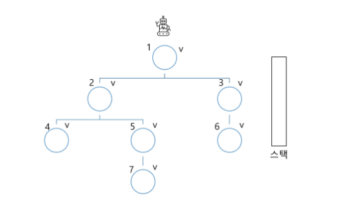

# 2024-08-07(수)  Stack 1 - 02

- Memoization
- DP
- DFS

---

#### `Memoization`

- Stack 1 예에서 피보나치 수를 구하는 함수를 재귀함수로 구현한 알고리즘은 문제점이 있다.

- "엄청난 중복 호출이 존재한다"는 것이다.


- `메모이제이션(Memoization)`은 컴퓨터 프로그램을 실행할 때 이전에 계산한 값을 메모리에 저장해서 매번 다시 계산하지 않도록 하여 전체적인 실행속도를 빠르게 하는 기술이다. 동적 계획법의 핵심이 되는 기술이다.

- 'memoization'은 글자 그대로 해석하면 '메모리에 넣기(to put in memory)' 라는 의미이며 '기억되어야 할 것'이라는 뜻의 라틴어 memorandum에서 파생되었다. 흔히 '기억하기','암기하기' 라는 뜻의 memorization과 혼동하지만, 정확한 단어는 memoization이다.

- 앞의 예에서 피보나치 수를 구하는 알고리즘에서 fibo(n)의 값을 계산하자마자 저장하면(memoize), 실행시간을 O(n)으로 줄일 수 있다.
<br>

---
<br>

#### `DP(Dynamic Programming)`


- 동적 계획(Dynamic Programming)알고리즘은 그리디 알고리즘과 같이 최적화 문제를 해결하는 알고리즘이다.


- 동적 계획 알고리즘은 먼저 입력 크기가 작은 부분 문제들을 모두 해결한 후에 그 해들을 이용하여 보다 큰 크기의 부분 문제들을 해결하여, 최종적으로 원래 주어진 입력의 문제를 해결하는 알고리즘이다.

- 피보나치 수 DP 적용
    - 피보나치 수는 부분 문제의 답으로부터 본 문제의 답을 얻을 수 있으므로 최적 부분 구조로 이루어져 있다.

<br>

⑴ 문제를 부분 문제로 분할한다.\
    - Fibonacci(n) 함수는 Fibonacci(n-1)과 Fibonacci(n-2)의 합\
    - Fibonacci(n-1)은 Fobonacci(n-2)와 Fibonacci(n-3)의 합\
    - Fibonacci(2)는 Fibonacci(1)과 Fibonacci(0)의 합\
    - Fibonacci(n)은 Fibonacci(n-1), Fibonacci(n02),...Fibonacci(2), Fibonacci(1), Fibonacci(0)의 부분집합으로 나뉜다.

⑵ 부분 문제로 나누는 일을 끝냈으면 가장 작은 부분 문제부터 해를 구한다.

⑶ 그 결과는 테이블에 저장하고, 테이블에 저장된 부분 문제의 해를 이용하여 상위 문제의 해를 구한다.

#### 피보나치 수 DP 적용 알고리즘

```python
def fibo2(n):
    f = [0] * (n+1)
    f[0] = 0
    f[1] = 1
    for i in range(2, n+1):
        f[i] = f[i-1] + f[i-2]

    return f[n]
```

---

#### `DFS(깊이우선탐색)`

- 비선형구조인 그래프 구조는 그래프로 표현된 모든 자료를 빠짐없이 검색하는 것이 중요함.

- 두 가지 방법
    - 깊이 우선 탐색(Depth First Search, DFS)
    - 너비 우선 탐색(Breadth First Search, BFS)


- 시작 정점의 한 방향으로 갈 수 있는 경로가 있는 곳까지 깊이 탐색해 가다가 더 이상 갈 곳이 없게 되면, 가장 마지막에 만났던 갈림길 간선이 있는 정점으로 되돌아와서 다른 방향의 정점으로 탐색을 계속 반복하여 결국 모든 정점을 방문하는 순회 방법

- 가장 마지막에 만났던 갈림길의 정점으로 되돌아가서 다시 깊이 우선 탐색을 반복해야 하므로 후입선출 구조의 스택 사용




1) 시작 정점 v를 결정하여 방문한다.
2) 정점 v에 인접한 정점 중에서\
    (1) 방문하지 않은 정점 w가 있으면, 정점 v를 스택에 push하고 정점 w를 방문한다. 그리고 w를 v로 하여 다시 (2)를 반복한다.
    (2) 방문하지 않은 정점이 없으면, 탐색의 방향을 바꾸기 위해서 스택을 pop하여 받은 가장 마지막 방문 정점을 v로 하여 다시 (2)를 반복한다.

3) 스택이 공백이 될 때까지 (2)를 반복한다.


