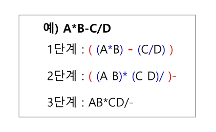
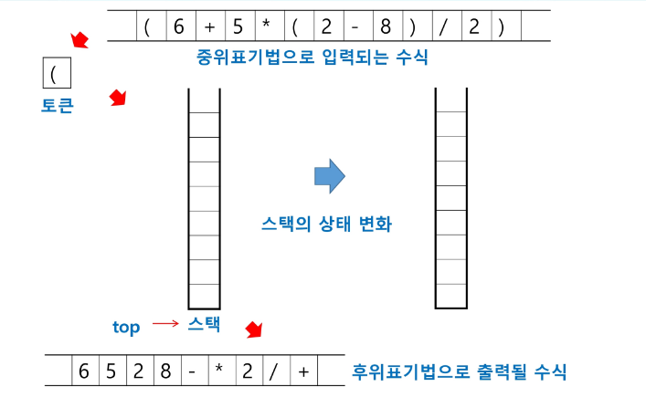
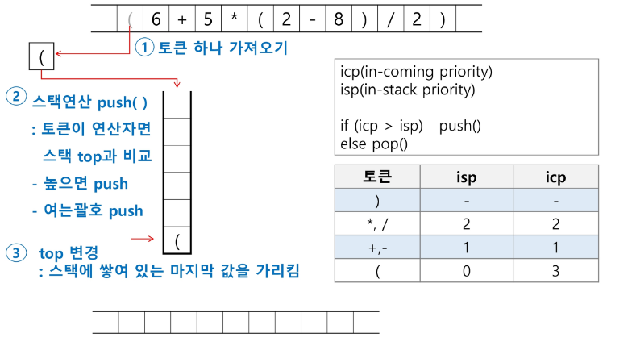
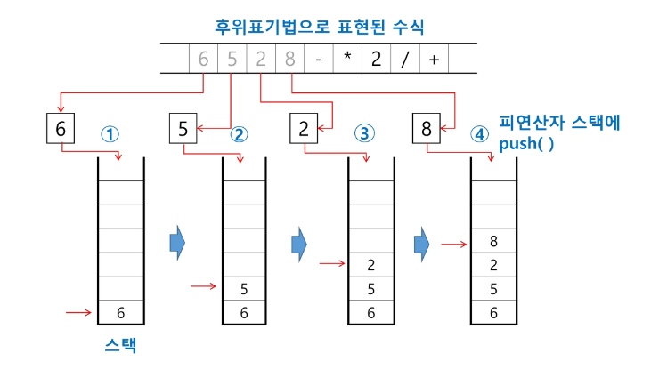
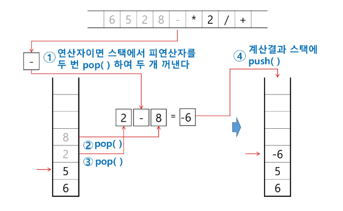

# 2024-08-08(목) Stack2 - 01

- 계산기 1
- 계산기 2
- 백트래킹
- [참고]가지치기
- 분할정복

---

### `계산기1`

- 문자열로 된 계산식이 주어질 때, 스택을 이용하여 이 계산식의 값을 계산할 수 있다.

- 문자열 수식 계산의 일반적 방법
    - step1. 중위 표기법의 수식을 후위 표기법으로 변경한다. ( 스택 이용)

        - 중위표기법(infix notation)
            - 연산자를 피연산자의 가운데 표기하는 방법
               예) A + B

        - 후위표기법(postfix notation)
            - 연산자를 피연산자 뒤에 표기하는 방법\
                예) A B +

    - step2. 후위 표기법의 수식을 스택을 이용하여 계산한다.

##### step1. 중위표기식의 후위표기식 변환 방법1

- 수식의 각 연산자에 대해서 우선순위에 따라 괄호를 사용하여 다시 표현한다.
- 각 연산자를 그에 대응하는 오른쪽괄호의 뒤로 이동시킨다.
- 괄호를 제거한다.

① 입력 받은 중위 표기식에서 토큰을 읽는다.

② 토큰이 피연산자이면 토큰을 출력한다.

③ 토큰이 연산자(괄호포함)일 때, 이 토큰이 스택의 top에 저장되어 있는 연산자보다 우선순위가 높으면 스택에 push하고, 그렇지 않다면 스택 top의 연산자의 우선순위가 큰의 우선순위보다 작을 때까지 스택에서 pop 한 후 토큰의 연산자를 push한다. 만약 top에 연산자가 없으면 push한다.

④ 토큰이 오른쪽 괄호 ')'이면 스택 top에 왼쪽 괄호 '('가 올 떄까지 스택에 pop 연산을 수행하고 pop 한 연산자를 출력한다. 왼쪽 괄호를 만나면 pop하고 출력하지는 않는다.

⑤ 중위 표기식에 더 읽을 것이 없다면 중지하고, 더 읽을 것이 있다면 1부터 다시 반복한다.

⑥ 스택에 남아 있는 연산자를 모두 pop하여 출력한다.

    - 스택 밖의 왼쪽 괄호는 우선 순위가 가장 높으며, 스택 안의 왼쪽 괄호는 우선순위가 가장 낮다.

---

### `계산기2`

##### step2. 후위 표기법의 수식을 스택을 이용하여 계산

① 피연산자를 만나면 스택에 push한다.

② 연산자를 만나면  필요한  만큼의 피연산자를 스택에서 pop하여 연산하고, 연산결과를 다시 스택에 push한다. **(피연산자 pop 순서 신경쓰기! 특히 마이너스나 나눗셈일때 중요함!)**

③ 수식이 끝나면, 마지막으로 스택을 pop하여 출력한다.

---

### `백트랙킹`

