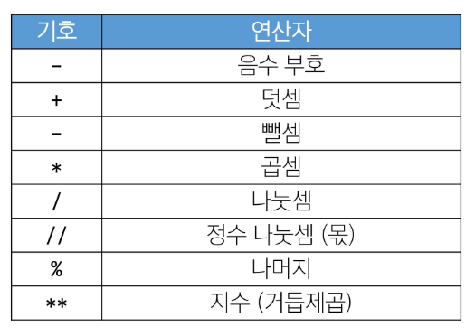
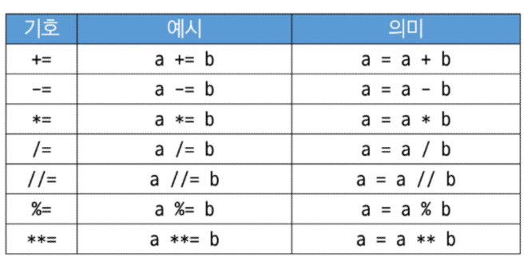
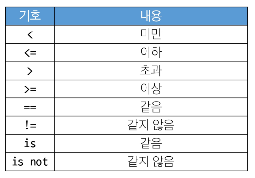
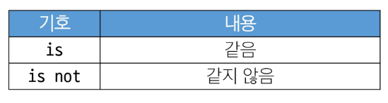
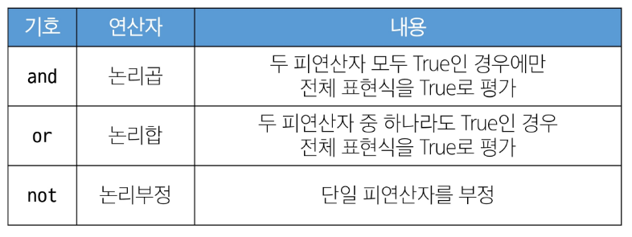
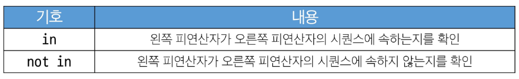
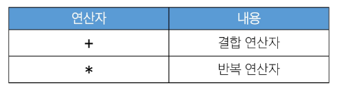
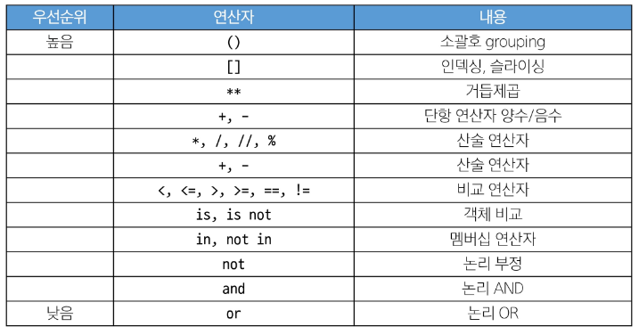

## 2024-07-16(화) 파이썬 기초

### Python (02) Basic Syntax 2

- 자료구조 
    - string
    - list(제일 중요)
    - range
    - dict

- 연산자
    - 논리연산자
    - 멤버십 연산자
    - 단축평가 - 직접 코드로 실행해보고, 예측해보기 
    - 연산자 우선순위(비교-논리)


<br>

---
#### **`list(리스트)`**

- 여러 개의 값을 순서대로 저장하는 **변경 가능한** 시퀀스 자료형
- 현실의 내용을 컴퓨터로 가져오기 쉽게 하기 때문
    1. 여러가지 데이터 Type을 항목(item)으로 가질 수 있다.
    2. 중첩 구조를 사용하여 1차원, 2차원, .., n차원의 배열 구조를 구현할 수 있다.
<br>

##### 리스트 표현

- 0개 이상의 객체를 포함하며 데이터 목록을 저장
- 대괄호([])로 표기
- 데이터는 어떤 자료형도 저장할수 있음

```python
my_list_1 = []

my_list_2 = [1, 'a', 3, 'b', 5]

my_list_3 = [1, 2, 3, 'Python', ['hello', 'world', '!!!']]
```

##### 리스트의 시퀀스 특징

```python
my_list = [1, 'a', 3, 'b', 5]

# 인덱싱
print(my_list[1]) # a

# 슬라이싱
print(my_list[2:4]) # [3, 'b']
print(my_list[:3]) # [1, 'a', 3]
print(my_list[3:]) # ['b', 5]
print(my_list[0:5:2]) # [1, 3, 5]
print(my_list[::-1]) # [5, 'b', 3, 'a', 1]

# 길이
print(len(my_list)) # 5
```

---

##### 중첩된 리스트 접근

```python
my_list = [1, 2, 3, 'Python', ['hello', 'world', '!!!']]

print(len(my_list)) # 5
print(my_listp[4][-1]) # !!!
print(my_list[-1][1][0]) # w
```

---

##### 리스트는 가변(**변경 가능**)

```python
my_list = [1, 2, 3]
my_list[0] = 100

print(my_list) # [100, 2, 3]
```

---
<br>

#### `tuple(튜플)`

- 여러 개의 값을 순서대로 저장하는 변경 불가능한 시퀀스 자료형

##### 튜플 표현

- 0개 이상의 객체를 포함하며 데이터 목록을 저장
- 소괄호(())로 표기
- 데이터는 어떤 자료형도 저장할 수 있음

```python
my_tuple_1 = ()

my_tuple_2 = (1,) # 튜플 요소 1개일 때 표현 방식 그냥 쓰면 int로 인식

my_tuple_3 = (1, 'a', 3, 'b', 5)
```

##### 튜플은 어디에 쓰일까?

- 튜플의 불변 특성을 사용한 안전하게 여러 개의 값을 전달, 그룹화, 다중 할당 등
    - 개발자가 직접 사용하기 보다 '파이썬 내부 동작'에서 주로 사용됨

```python
x, y = (10, 20)

print(x) # 10
print(y) # 20

# 파이썬은 쉼표를 튜플 생성자로 사용하니 괄호는 생략 가능
x, y = 10, 20
```

---

#### **`range`**

- 연속된 정수 시퀀스를 차례로 생성하는 변경 불가능한 자료형
    1. 정해진 범위, 정수를 차례로 생성
    2. 정해진 횟수만큼 프로그램 반복할 때 자주 사용(숫자 1개만 쓴 경우)

##### range 표현

- range(시작 값, 끝 값, 증가 값)
- range(n)
    - 0부터 n-1까지의 숫자 시퀀스
- range(n, m)
    - n부터 m-1까지의 숫자 시퀀스

##### range 특징

- 증가 값이 없으면 1씩 증가
- 증가 값이 음수이면 감소/ 증가 없이 양수이면 증가
- 증가 값이 0이면 에러
- 증가 값이 음수이면 시작 값이 끝 값보다 커야 함
- 증가 값이 양수이면 시작 값이 끝 값보다 작아야함
- 주로 반복문과 함께 사용 예정

```python
my_range_1 = range(5)
my_range_2 = range(1, 100)

print(my_range_1) # range(0,5)
print(my_range_2) # range(1,10)

# 리스트로 형 변환 시 데이터 확인 가능
print(list(my_range_1)) # [0, 1, 2, 3, 4]
print(list(my_range_2)) # [1, 2, 3, 4, 5, 6, 7, 8, 9]

# 반복문과 함께 활용
for i in range(1, 10):
    print(i)  # 1 2 3 4 5 6 7 8 9

for i in range(1, 10, 2):
    print(i)  # 1 3 5 7 9

```

---

#### `Non-Sequnece Types`

##### dict

- key - value 쌍으로 이루어진 **순서와 중복이 없는 변경 가능**한 자료형

##### 딕셔너리 표현

- key는 변경 불가능(중복X)한 자료형만 사용 가능 (str, int, float, tuple, range ...)
- value는 모든 자료형 사용 가능
- 중괄호({})로 표기

```python
my_dict_1 = {}
my_dict_2 = {'key': 'value'}
my_dict_3 = {'apple': 12, 'list': [1, 2, 3]}

print(my_dict_1)  # {}
print(my_dict_2)  # {'key': 'value'}
print(my_dict_3)  # {'apple': 12, 'list': [1, 2, 3]}

# 딕셔너리는 키에 접근해 값을 얻어냄
print(my_dict['apple']) # 12 


# 추가
my_dict['banana'] = 50
print(my_dict) # {'apple' : 12, 'list' : [1, 2, 3], 'banana' : 50}

# 변경
my_dict['apple'] = 100
print(my_dict) # {'apple' : 100, 'list' : [1, 2, 3], 'banana' : 50}

```

---

#### `set(세트)`

- **순서와 중복이 없는 변경 가능**한 자료형

##### 세트 표현

- 수학에서의 집합과 동일한 연산 처리 가능
- 중괄호({})로 표기

```python
my_set_1 = set()  # {} 입력시 dict로 구분
my_set_2 = {1, 2, 3}
my_set_3 = {1, 1, 1}

print(my_set_1)  # set()
print(my_set_2)  # 1, 2, 3
print(my_set_3)  # 1
```


##### 세트의 집합 연산

```python
my_set_1 = {1, 2, 3}
my_set_2 = {3, 6, 9}

# 합집합
print(my_set_1 | my_set_2) # {1, 2, 3, 6, 9}

# 차집합
print(my_set_1 - my_set2) # {1, 2}

# 교집합
print(my_set_1 & my_set2) # {3}

```
---

#### `Other Types`

##### None

- 파이썬에서 '값이 없음'을 표현하는 자료형

##### None 표현

```python
variable = None

print(variable)  # None
```
<br>

##### Boolean

- 참(True)과 거짓(False)을 표현하는 자료형
- True : 1 / False : 0

##### 불리언 표현

- 비교/논리 연산의 평가 결과로 사용됨
- 주로 조건/반복문과 함께 사용

```python
bool_1 = True
bool_2 = False

print(bool_1)  # True
print(bool_2)  # False
print(3 > 1) # True
print('3' != 3)  # True
```

---
<br>

#### `Collection`

- 여러 개의 항목 또는 요소를 담는 자료 구조(str, list, tuple, set, dict)

##### 컬렉션 정리

|컬렉션|변경 가능 여부|순서 여부|
|:---:|:-----------:|:-------:|
|str|X|O|
|list|O|O|
|tuple|X|O|
|dict|O|X|
|set|O|X|


---
<br>

#### `Type Conversion`

- 한 데이터 타입을 다른 데이터 타입으로 변환하는 과정

    - 암시적 형변환 / 명시적 형변환

#### `암시적 형변환(Implicit Type conversation)`

- 파이썬이 자동으로 수행하는 형변환

##### 암시적 형변환 예시

- 정수와 실수의 연산에서 정수가 실수로 변환됨
- Boolean과 Numeric Type에서만 가능

```python
print(3 + 5.0) # 8.0

print(True + 3) # 4

print(True + False) # 1 
```

---

#### `명시적 형변환(Explicit Type conversation)`

- 프로그래머가 직접 지정하는 형변환 암시적 형변환이 아닌 경우를 모두 포함

##### 명시적 형변환 예시

- str -> int : 형식에 맞는 숫자만 가능

```python
print(int('1'))  # 1

# ValueError : invaild literal for int() with base 10: '3.5'
print(int('3.5'))

print(int(3.5))  # 3 반올림 x 버림

print(float('3.5')) # 3.5
```

- int -> str  : 모두 가능

```python
print(str(1) + '등') #  1등
```

---
<br>

#### `연산자`

##### 산술연산자



---

##### 복합연산자

- 연산과 할당이 함께 이뤄짐



```python
y = 10
y -= 4
print(y)   # 6

z =7
z *= 2
print(z)  # 14

w = 15
w /= 4
print(w) # 3.75

q = 20
q //= 3
print(q) # 6
```

---

##### 비교연산자




##### is 비교 연산자

- 메모리 내에서 같은 객체를 참조하는지 확인
- ==는 동등성(equality), **is**는 식별성(Identity)
- 값을 비교하는 ==와 다름



```python
print(3 > 6)  # False
print(2.0 == 2) # True
print(2 != 2) # False
print('HI' == 'hi') # False
print(1 == True)  # True

# SyntaxWarning : "is" with a literal. Did you mean "=="?
# ==은 값(데이터)을 비교하는 것이지만 is는 레퍼런스(주소)를 비교하기 때문
# 아래 조건은 항상 False이기 때문에 is 대신 ==를 사용해야 한다는 것을 알림

print(1 is True)  # False
print(2 is 2.0)  # False
```


##### 논리연산자

- 양 쪽 Boolean만 온다.




```python
print(True and False) # False

print(True or False)  # True

print(not True)  # False

print(not 0)  # True
```

- 비교 연산자와 함께 사용 가능

```python
num = 15
result = (num > 10) and (num % 2 == 0)
print(result)  # False

name = 'Alice'
age = 25
result = (name == 'Alice') or (age == 30)
print(result)  # True
```

---
<br>

#### `단축평가`

- 논리 연산에서 두 번째 피연산자를 평가하지 않고 결과를 결정하는 동작
- 사용하는 이유 ? 코드 실행을 최적화하고, 불필요한 연산을 피할 수 있도록 함

```python
vowels = 'aeiou'

print(('a' and 'b') in vowels)  # False
print(('b' and 'a') in vowels)  # True

print(3 and 5)  # 5
print(3 and 0)  # 0
print(0 and 3)  # 0
print(0 and 0)  # 0 -> 앞의 0에서 판단

print(5 or 3)  # 5
print(3 or 0)  # 3
print(0 or 3)  # 3
print(0 or 0)  # 0 -> 뒤의 0에서 판단
```
- and
    - 첫 번째 피연산자가 False인 경우, 전체 표현식은 False로 결정.
      두 번째 피연사자는 평가되지 않고 그 값이 무시
    - 첫 번째 피연산자가 True인 경우, 전체 표현식의 결과는 두 번째 피연산자에 의해 결정.
      두 번째 피연산자가 평가되고 그 결과가 전체 표현식의 결과로 반환

- or
    - 첫 번째 피연산자가 True인 경우, 전체 표현식 True로 결정. 
      두 번째 피연산자는 평가되지 않고 그 값이 무시
    - 첫 번째 피연산자가 False인 경우, 전체 표현식의 결과는 두 번째 피연산자에 의해 결정.
      두 번째 피연산자가 평가되고 그 결과가 전체 표현식의 결과로 반환


---
<br>

#### `멤버십 연산자`

- 특정 값이 시퀀스나 다른 컬렉션에 속하는지 여부를 확인



```python
word = 'hello'
numbers = [1, 2, 3, 4, 5]

print('h' in word)   # True
print('z' in word)   # False

print(4 not in numbers)  # False
print(6 not in numbers) # True
```
---
<br>

#### `시퀀스형 연산자`

- +와 *는 시퀀스 간 연산에서 산술 연산자일때와 다른 역할을 가짐



```python
# Gildong Hong
print('Gildong' + 'Hong')

# hihihihihi
print('hi' * 5)

# [1, 2, 'a', 'b']
print([1, 2] + ['a', 'b'])

# [1, 2, 1, 2]
print([1, 2] * 2)
```

---
<br>

#### `연산자 우선순위 정리`



---