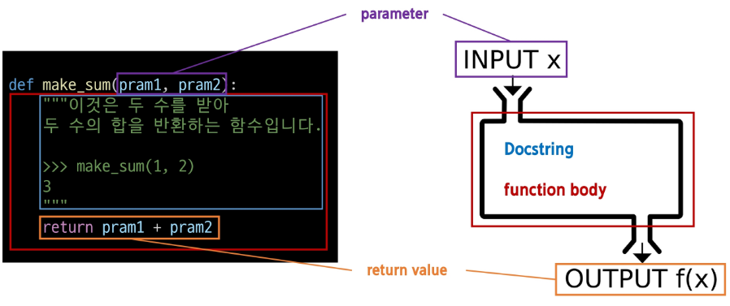
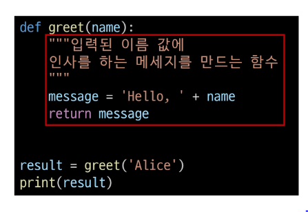
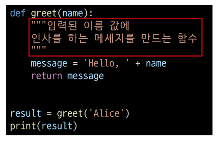
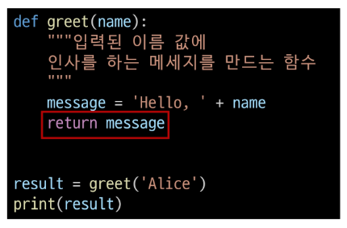

## 2024-07-17(수) 파이썬 함수와 제어문1

### Python 03 Functions

- 함수 정의와 호출
    - 매개 변수와 인자
    - 함수와 스코프
    - 글로벌
    - map(), zip()


---
<br>

#### `함수(Functions)`

- 특정 작업을 수행하기 위한 재사용 가능한 코드 묶음

###### 함수를 사용하는 이유

- 두 수의 합을 구하는 함수를 정의하고 사용함으로써 코드의 중복을 방지
- **재사용성**이 높아지고, 코드의 **가독성과 유지보수성** 향상

```python
# 두 수의 합을 구하는 코드
num1 = 5
num2 = 3
sum_result = num1 + num2
print(sum_result)

# 두 수의 합ㅇ르 구하는 함수
def get_sum(num1, num2):
    return num1 + num2

# 함수 사용하여 결과 출력
num1 = 5
num2 = 3
sum_resilt =get_sum(num1, num2)
print(sum_result)
```
<br>

```함수구조```



```함수의 정의와 호출```

- 함수 정의(정의)
    - 함수 정의는 def 키워드로 시작
    - def 키워드 이후 함수 이름 작성
    - 괄호 안에 매개변수를 정의할 수 있음
    - 매개변수(parameter)는 함수에 전달되는 값을 나타냄

```python
def greet(name):
    """입력된 이름 값에
    인사를 하는 메세지를 만드는 함수
    """
    message = 'Hello,' + name
    return message

result = greet('Alice')
print(result)    
```
- 함수 body
    - 콜론(:) 다음에 들여쓰기 된 코드 블록
    - 함수가 실행 될 때 수행되는 코드를 정의



- Docstring
    - 함수 body 앞에 선택적으로 작성 가능한 함수 설명서



- 함수 반환 값(return 과 출력의 개념은 다름)
    - 함수는 필요한 경우 결과를 반환할 수 있음
    - return 키워드 이후에 반환할 값을 명시
    - return 문은 함수의 실행을 종료하고, 결과를 호출 부분으로 반환
    - return 정의하지 않으면 **None**값 반환

```python
def make_sum(pram1, pram2):
  return pram1 + pram2

result = make_sum(100, 30)
return_value = print(result)
print(return_value)


def my_func():
  print('hello, World')

result = my_func()
print(result)
```



- 함수 호출
    - 함수를 사용하기 위해서는 호출이 필요
    - 함수의 이름과 소괄호를 활용해 호출
    - 필요한 경우 인자(argument)를 전달해야 함
    - 호출 부분에서 전달된 인자는 함수 정의 시 작성한 매겨변수에 대입됨

##### 함수호출(function call)
- 함수를 실행하기 위해 함수의 이름을 사용하여 해당 함수의 코드 블록을 실행하는 것

---

#### `매개변수와 인자`

- 매개변수(parameter) : 함수를 **정의**할 때, 함수가 받을 값을 나타내는 변수
- 인자(argument) : 함수를 **호출**할 때, 실제로 전달되는 값

##### 매개변수와 인자 예시

```python
def add_numbers(x,y): # x와 y는 매개변수(parameter)
    result = x + y
    return result

a = 2
b = 3
sum_result = add_numbers(a, b) # a, b는 인자(argument)
print(sum_result)
```
---
<br>

#### `다양한 인자 종류`

1. 위치 인자
2. 기본 인자 값
3. 키워드 인자
4. 임의의 인자 목록
5. 임의의 키워드 인자 목록


##### 위치인자(Positional Arguments)

- 함수 호출 시 인자의 위치에 따라 전달되는 인자
- **위치인자는 함수 호출 시 반드시 값을 전달해야 함**
- 위치인자는 순서를 중요하게 생각함!

```python 
def greet(name, age):
    print(f'안녕하세요. {name}님! {age}살이시군요.')

greet('Alice', 20) # 안녕하세요, Alice님! 25살이시군요.

greet(20, 'Alice') # 안녕하세요, 20님! Alice살이시군요.

greet(20, ) # TypeError: greet() missing 1 required positional argument: 'age'
```

##### 기본 인자 값(Default Argument Values)

- 함수 정의에서 매개변수에 기본 값을 할당하는 것
- 함수 호출 시 인자를 전달하지 않으면, 기본값이 매개변수에 할당됨

```python
def greet(name, age=30):
    print(f'안녕하세요, {name}님! {age}살이시군요.')

greet('Bob') # 안녕하세요, Bob님! 30살이시군요.
greet('Charlie', 40) # 안녕하세요, Charile님! 40살이시군요.
```

##### 키워드 인자(Keyword Arguments)

- 함수 호출 시 인자의 이름과 함께 값을 전달하는 인자
- 매개변수와 인자를 일치시키지 않고, 특정 매개변수에 값을 할당 할 수 있음
- 인자의 순서는 중요하지 않으며, 인자의 이름을 명시하여 전달
- **단, 호출 시 키워드 인자는 위치 인자 뒤에 위치해야 함**

```python
def greet(name, age=30):
    print(f'안녕하세요, {name}님! {age}살이시군요.')

greet(name = 'Dave', age =35)  # 안녕하세요, Dave님! 35살이시군요.

greet(age = 35, 'Dave') # positional argument follows keyword argument

greet(age = 35, name = 'Alice') # 안녕하세요, Alice님! 35살이시군요.

```

##### 임의의 인자 목록(Arbitary Argument Lists)

- 정해지지 않은 개수의 인자를 처리하는 인자
- 함수 정의 시 매개변수 앞에 **'*'**를 붙여 사용하며, 여러 개의 인자를 tuple(파이썬이 내부적으로 동작할 때 사용하기 때문)로 처리

```python
def calculate_sum(*args):
    print(args)
    total = sum(args)
    print(f'합계: {total}')

"""
(1, 2, 3)
합계 : 6
"""

calculate_sum(1, 2, 3)
```

##### 임의의 키워드 인자 목록(Arbitary Keyword Argument Lists)

- 정해지지 않은 개수의 키워드 인자를 처리하는 인자
- 함수 정의 시 매개변수 앞에 '**'를 붙여 사용하며, 여러 개의 인자를 **dictionary**로 묶어 처리

```python
def print_info(**kwargs):
    print(kwargs)

print_info(name='Eve', age = 30) # {'name' : 'Eve', 'age' : 30}
```

---

##### 함수 인자 권장 작성순서

- 위치 => 기본 => 가변 => 가변 키워드
- 호출 시 인자를 전달하는 과정에서 혼란을 줄일 수 있도록 함
- 단, 모든 상황에 적용되는 절대적인 규칙은 아니며, 상황에 따라 유연하게 조정될 수 있음

```python
def func(pos1, pos2, defaule_arg='default', *args, **kwargs):
  print('pos1:', pos1)
  print('pos2:', pos2)
  print('default_arg:', default_arg)
  print('args:', args)
  print('kwargs:', kwargs)

func(1, 2, 3, 4, 5, 6, key1 = 'value1', key2 = 'value2')

"""
pos1 : 1
pos2 : 2
default_arg : 3
args : (4, 5, 6)
kwargs : {'key1' : 'value1', 'key2' : 'value2'}
"""

```

---
<br>

#### `재귀함수`

