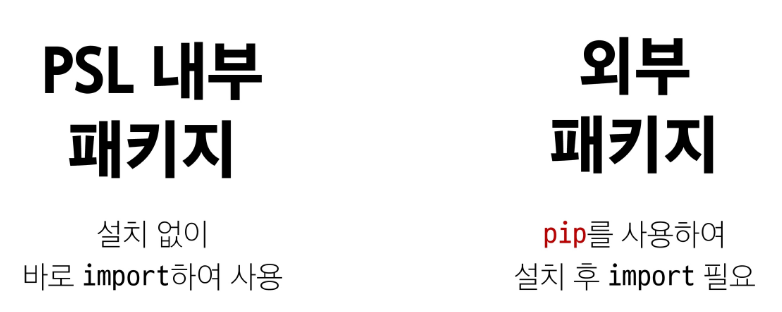
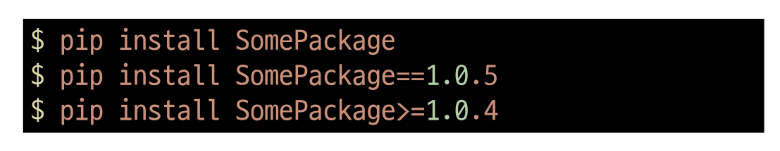
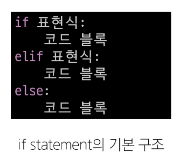
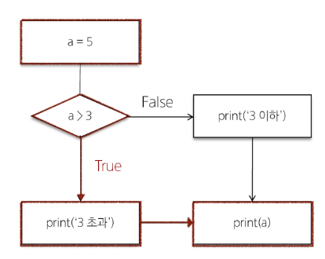
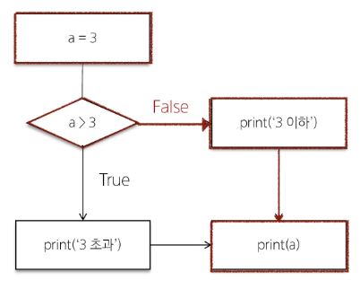
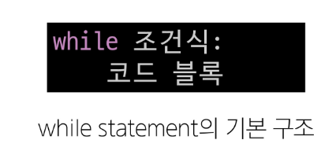
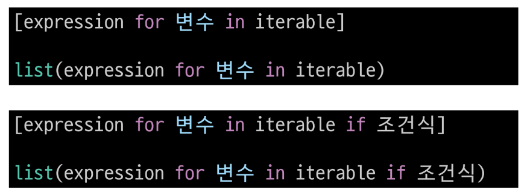
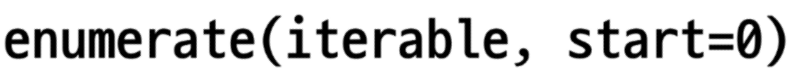
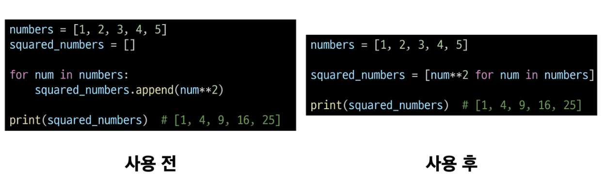

## 2024-07-18(목) 파이썬 함수와 제어문2

### Python 04 Modules & Control of flow

- 모듈
    - 모듈 활용
    - 사용자 정의 모듈

- 파이썬 표준 라이브러리
    - 패키지

- 제어문

- 조건문   

- 반복문

---

#### `모듈(Module)`

- 한 파일로 묶인 변수와 함수의 모음 특정한 기능을 하는 코드가 작성된 파이썬 파일(.py)

##### 모듈 예시

- math 내장 모듈
    - 파이썬이 미리 작성해 둔 수학 관련 변수와 함수가 작성된 모듈

```python
import math

print(math.pi) # 3.141592653589793

print(math.sqrt(4))  # 2.0
```

##### 모듈 활용

- import문 사용(명시적으론 import문이 유용)

```python
import math

print(math.sqrt(4))
```

- from 절 사용
```python
from math import sqrt

print(sqrt(4))
```

##### 모듈 사용하기

- '. (dot)' 연산자
- "점이 왼쪽 객체에서 점의 오른쪽 이름을 찾아라"라는 의미

```python
# 모듈명.변수명
print(math.pi)

# 모듈명.함수명
print(math.sqrt(4))
```

##### 모듈 주의사항

- 서로 다른 모듈이 같은 이름의 함수를 제공할 경우 문제 발생
- 마지막에 import된 이름으로 대체됨

```python
from math import pi, sqrt
from my_math import sqrt

# 그래서 모듈 내 모든 요소를 한번에 import 하는 * 표기는 권장하지 않음

from math import *
```

##### 'as' 키워드

- as 키워드를 사용하여 별칭(alias)를 부여
    - 두 개 이상의 모듈에서 동일한 이름의 변수, 함수 클래스 등을 가져올 때 발생하는 이름 충돌 해결

```python
from math import sqrt
from my_math import sqrt as my_sqrt

sqrt(4)
my_sqrt(4)
```

---

#### `사용자 정의 모듈`


#### 파이썬 표준 라이브러리(Python Standard Library)

- 파이썬 언어와 함께 제공되는 다양한 모듈과 패키지의 모음

##### `패키지(Package)`

- 연관된 모듈들을 하나의 디렉토리에 모아 놓는 것
- 라이브러리 -> 패키지 -> 모듈




##### [pip]('https://pypi.org/)

- 외부 패키지들을 설치하도록 도와주는 파이썬의 패키지 관리 시스템

##### 패키지 설치

- 최신 버전/ 특정 버전/ 최소 버전을 명시하여 설치 할 수 있음



##### requests 외부 패키지 설치 및 사용 예시


> $ pip install requests  
    # 외부로 요청을 보내는 패키지 (중요)!!!
    # 파이썬 전역설치하게 됨.

```python
import requests

url = 'https://random-data-api.com/api/v2/users' # 랜덤 데이터 주소
response = requests.get(url).json()

print(response)
```
    - url 조회 시 chrome 웹 스토어 -> json formatter 확장 프로그램 추가


##### 패키지 사용 목적

- 모듈들의 이름공간을 구분하여 충돌을 방지
- 모듈들을 효율적으로 관리하고 재사용할 수 있도록 돕는 역할

---

#### `제어문(Control Statement)`

- 코드의 실행 흐름을 제어하는 데 사용되는 구문
- **조건**에 따라 코드 블록을 실행하거나 **반복**적으로 코드를 실행

##### 제어문 종류

- 조건문
    - if, elif, else

- 반복문
    - for, while

- 반복문 제어   
    - break, continue, pass

##### 조건문

- 주어진 조건식을 평가하여 해당 조건이 참(True)인 경우에만 코드 블록을 실행하거나 건너뜀



- 반드시 3개가 있어야할 필요 없고 단독으로 사용가능. But elif 단독 사용 불가능


#### 조건문 예시

```python
a = 5

if a > 3:
    print('3 초과')
else:
    print('3 이하')

print(a)  # 3 초과
```



```python
a = 3

if a > 3:
    print('3 초과')
else:
    print('3 이하')

print(a)
```


##### 복수 조건문

- 조건식을 동시에 검사하는 것이 아니라 '순차적'으로 비교

```python
dust = 35

if dust > 150:
    print('매우 나쁨')
elif dust > 80:
    print('나쁨')
elif dust > 30:
    print('보통')   # 보통
else:
    print('좋음')

```

##### 중첩 조건문

```python
dust = 480

if dust > 150:
    print('매우 나쁨')
    if dust > 300:
        print('위험해요! 나가지 마세요!')
elif dust >  80:
    print('나쁨')
elif dust > 30:
    print('보통')
else:
    print('좋음')
```

---
<br>

#### `반복문(Loop Statement)`

- 주어진 코드 블록을 여러 번 반복해서 실행하는 구문


##### `for문`

- 임의의 시퀀스의 항목들을 그 시퀀스에 들어있는 순서대로 반복
- 변수 : 숫자 이외의 다양한 형식의 데이터도 가능(문자열, .. 등)


- 반복 가능한 객체(iterable) : 반복문에서 순회할 수 있는 객체(시퀀스 객체 뿐만 아니라 dict, set 등도 포함)

##### for문 작동원리

- 리스트 내 첫 항목이 반복 변수에 할당되고 코드블록이 실행
- 다음으로 반복 변수에 리스트의 2번째 항목이 할당되고 코드블록이 다시 실행
- ...마지막으로 반복 변수에 리스트의 마지막 요소가 할당되고 코드블록이 실행

```python
items = ['apple', 'banana', 'coconut']

for item in items:
    print(item)

"""
apple
banana
coconut
"""
```

##### 문자열(시퀀스) 순회

```python
country = 'Korea'

for char in country:
    print(char)

"""
K
o
r
e
a
"""
```

##### range(자체가 시퀀스) 순회

```python
for i in ragne(5):
    print(i)

"""
0
1
2
3
4
"""
```

##### 딕셔너리 순회(중요!!)

- 딕셔너리만 순회하면 키값 반환


```python
my_dict = {
    'x' : 10,
    'y' : 20,
    'z' : 30,
}

for key in my_dict:
    print(key)
    print(my_dict[key])
"""
x
10
y
20
z
30
"""
for key, value in my_dict.items():
    print(key, vlaue)

# x 10
# y 20
# z 30

```

##### 인덱스로 리스트 순회

- 리스트의 요소가 아닌 인덱스로 접근하여 해당 요소들을 변경하기

```python
numbers = [4, 6, 10, -8, 5]

for i in range(len(numbers)):
    numbers[i] = numbers[i] * 2

print(numbers)  # [8, 12, 20, -16, 10]
```

##### 중첩된 반복문

- 중첩된 반복문에서의 출력 예상해보기

```python
outhers = ['A', 'B']
inners = ['c', 'd']

for outer in outers:
    for inner in inners:
        print(outer, inner)

"""
A c
A d
B c
B d
"""

```


---
<br>

#### `While`

- 주어진 조건식이 참(Treu)인 동안 코드를 반복해서 실행
- == 조건식이 거짓(False)가 될 때 까지 반복



##### While문 예시

```python
a = 0

while a < 3:
    print(a)
    a += 1

print('끝') 

# 0
# 1
# 2
# 끝
```

##### 사용자 입력에 따른 반복

- while문을 사용한 특정 입력 값에 대한 종료 조건 활용하기

```python
number = int(input('양의 정수를 입력해주세요 : '))

while number <= 0:
    if number < 0:
        print('음수를 입력했습니다.')
    else:
        print('0은 양의 정수가 아닙니다.')
    
    number = int(input('양의 정수를 입력해주세요.: '))

print('잘했습니다!')
```

**while 문은 반드시 종료조건이 필요**


- while : 거짓이 될때까지!

##### 적절한 반복문 활용하기

- for
    - 반복 횟수가 명확하게 정해져 있는 경우에 유용
    - 예를 들어 리스트, 튜플, 문자열 등과 같은 시퀀스 형식의 데이터를 처리할 때

- while
    - 반복 횟수가 불명확하거나 조건에 따라 반복을 종료해야 할 때 유용
    - 예를 들어 사용자의 입력을 받아서 특정 조건이 충족될 때까지 반복하는 경우

#### `반복 제어`

- for문과 while은 매 반복마다 본문 내 모든 코드를 실행하지만 때때로 일부만 실행하는 것이 필요할 때가 있음


##### 반복문 제어 키워드

- break
    - 반복을 즉시 중지

```python
# break

for i in range(10):
    if i == 5:
        break
    print(i)  # 0 1 2 3 4
```
```python
number = int(input('양의 정수를 입력해주세요.: '))

while number <=0:
    if number == -9999:
        print('프로그램을 종료합니다.')
        break
    
    if number < 0:
        print('음수를 입력하였습니다.')
    else:
        print('0은 양의 정수가 아닙니다.')
    
    number = int(input('양의 정수를 입력해주세요.: '))

print('잘했습니다!')

```
```python
numbers = [1, 3, 5, 7, 9, 10, 11]
found_even = False

for num in numbers:
    if num % 2 == 0:
        print('첫 번째 짝수를 찾았습니다: ', num)
        found_even = True
        break

if not found_even:
    print('짝수를 찾이 못했습니다')  # 첫 번째 짝수를 찾았습니다: 6

```

<br>

- continue
    - 다음 반복으로 건너뜀

```python
# continue

for i in range(10):
    if i % 2 == 0:
        continue
    print(i) # 1 3 5 7 9
```
```python
numbers = [1, 2, 3, 4, 5, 6, 7, 8, 9, 10]

for num in numbers:
    if num % 2 == 0:
        continue
    print(num)

"""
1
3
5
7
9
"""

```

<br>

- pass
    - 아무런 동작도 수행하지 않고 넘어감
<br>

```python
# pass

for i in range(10):
    pass  # 아무 작업도 안함

```
1. 코드 작성 중 미완성 부분
    - 구현해야 할 부분이 나중에 추가될 수 있고, 코드를 컴파일하는 동안 오류가 발생하지 않음

2. 조건문에서 아무런 동작을 수행하지 않아야 할 때

3. 무한 루프에서 조건이 충족되지 않을 때 pass를 사용하여 루프를 계속 진행하는 방법

---

#### `List Comprehension` : 목적은 리스트 생성

- 간결하고 효율적인 리스트 생성 방법



##### List Comprehension 사용 전/후 비교




_ : 임시변수 딱히 쓸일 없을때 언더바로 표현

- But Comprehension을 남용하지 말자!

---
<br>

#### `참고`

##### 모듈 내부 살펴보기

- 내장 함수 help를 사용해 모듈에 무엇이 들어있는지 확인 가능

---

#### `enumerate`



- iterable 객체의 각 요소에 대해 인덱스와 함께 반환하는 내장함수

```python
fruits = ['apple', 'banana', 'cherry']

for index, fruit in enumerate(fruits):
    print(f'인덱스 {index}: {fruit}')

"""
인덱스 0: apple
인덱스 1: banana
인덱스 2: cherry
"""
```

#### 참고사항

```python

# 리스트를 생성하는 방법 비교

# 1. loop
result1 = []
for i in range(10):
    result1.append(i)

# 2. list comprehension
result2 = [i for i in range(10)]
# result2 = list(i for i in range(10))

# 3. map
result3 = list(map(lambda i: i, range(10)))

print(result1)
print(result2)
print(result3)


"""
성능 비교

1. list comprehension
    - 대부분의 경우 가장 빠르고 파이썬스러운(Pythonic) 방법
2. map
    - 특정 상황(예: 기존 함수를 사용할 때)에서 리스트 컴프리헨션과 비슷하거나 약간 더 빠를 수 있음
3. loop
    - 일반적으로 가장 느리다고 알려져 있지만,
      python 버전이 올라가면서 다른 방식과 비슷하거나 때로는 더 나은 결과를 보이기도 함
    - 복잡한 로직이 필요한 경우에는 여전히 유용하게 사용될 수 있음

결론
- 성능 차이는 대부분의 경우 미미하므로, 
  코드의 가독성과 유지보수성을 고려하여 상황에 맞는 적절한 방법을 선택하는 것을 권장
"""

```
---

