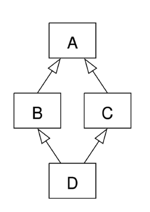
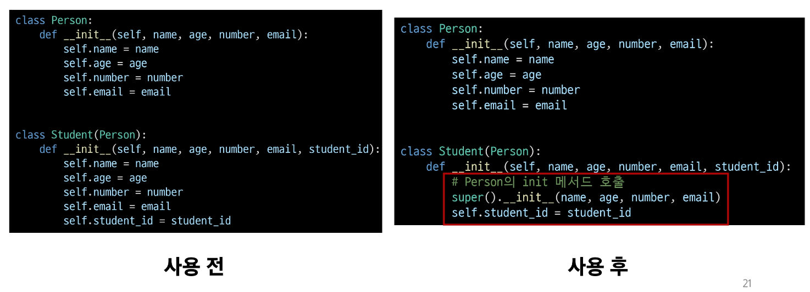
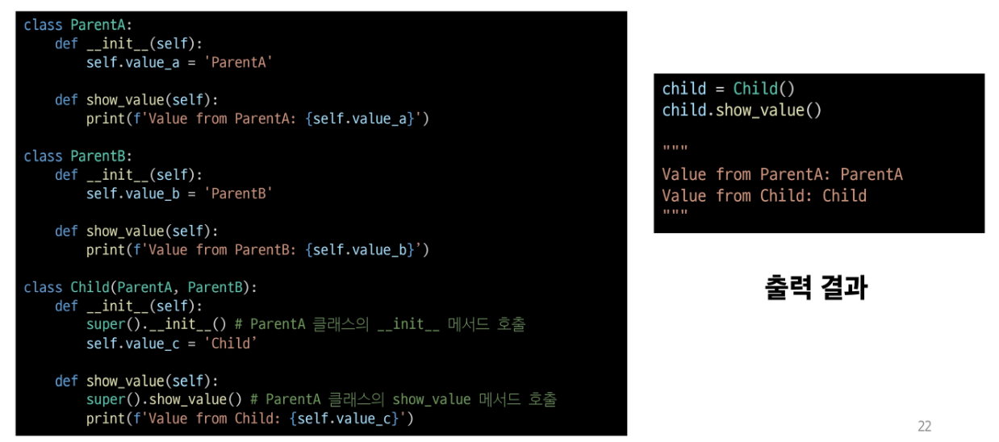
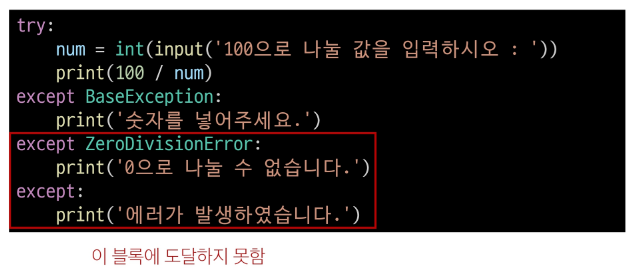
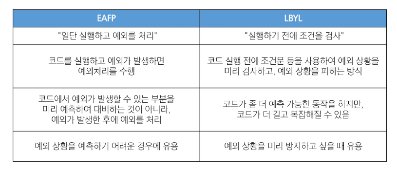

# 2024-07-25(목) 파이썬 OOP 2

### Python 08 OOP 2 & Exception

- 상속
    - 클래스 상속
    - 다중 상속

- 에러와 예외
    - 디버깅
    - 에러
    - 예외

- 예외 처리
    - try & except
    - 복수 예외 처리 
    - else & finally

- 참고
    - 예외 처리 주의사항
    - 예외 객체 다루기
    - EAFP & LBYL


---

#### `상속(Inheritance)`

- 기존 클래스의 속성과 메서드를 물려받아 새로운 하위 클래스를 생성하는 것

##### 상속이 필요한 이유

1. 코드 재사용
- 상속을 통해 기존 클래스의 속성과 메서드를 재사용할 수 있음
- 새로운 클래스를 작성할 때 기존 클래스의 기능을 그대로 활용할 수 있는 중복된 코드를 줄일 수 있음

2. 계층 구조
- 상속을 통해 클래스들 간의 계층 구조를 형성할 수 있음
- 부모 클래스와 자식 클래스 간의 관계를 표현하고, 더 구체적인 클래스를 만들 수 있음

3. 유지 보수의 용이성
- 상속을 통해 기존 클래스의 수정이 필요한 경우, 해당 클래스만 수정하면 되므로 유지 보수가 용이해짐
- 코드의 일관성을 유지하고, 수정이 필요한 범위를 최소화할 수 있음

---

#### `클래스 상속`

##### 상속 없이 구현하는 경우

- 학생/교수 정보를 별로도 표현하기 어려움

```python
class Person:
    def __init__(self,name, age):
        self.name = name
        self.age = age
    
    def talk(self):
        print(f'반갑습니다. {self.name}입니다.')

s1 = Person('김학생', 23)
s1.talk()  # 반갑습니다. 김학생입니다.

p1 = Person('박교수', 59)
p1.talk()  # 반갑습니다. 박교수입니다.
```
- 교수/학생 클래스로 분리 했지만 메서드가 중복으로 정의될 수 있음

##### 상속을 사용한 계층 구조 변경

```python
class Person:
    def __init__(self, name, age):
        self.name = name
        self.age = age

    def talk(self):  # 메서드 재사용
        print(f'반갑습니다. {self.name}입니다.')


```

#### `다중 상속`

- 둘 이상의 상위 클래스로부터 여러 행동이나 특징을 상속받을 수 있는 것
- 상속받은 모든 클래스의 요소를 활용 가능함
- 중복된 속성이나 메서드가 있는경우 **상속 순서에 의해 결정**됨

##### 다중상속 예시

```python
class Person:
    def __init__(self, name):
        self.name = name
    
    def greeting(self):
        return f'안녕, {self.name}'

class Mom(Person):
    gene = 'XX'

    def swim(self):
        return '엄마가 수영'

class Dad(Person):
    gene = 'XY'

    def walk(self):
        return '아빠가 걷기'

class FirstChild(Dad, Mom):  # 상속 순서 우선시
    def swim(self):
        return '첫째가 수영'

    def cry(self):
        return  '첫째가 응애'

```

##### 다이아몬드 문제(The diamond problem)

- 두 클래스 B와 C가 A에서 상속되고 클래스 D가 B와 C 모두에서 상속될 떄 발생하는 모호함
- B와 C가 재정의한 메서드가 A에 있고 D가 이를 재정의하지 않은 경우라면
    - D는 B의 메서드 중 어떤 버전을 상속하는가? 아니면 C의 메서드 버전을 상속하는가?

    

#####  파이썬에서의 해결책

- MRO(Method Resolution Order) 알고리즘을 사용하여 클래스 목록을 생성
- 부모 클래스로부터 상속된 속성들의 검색을 깊이 우선으로 , 왼쪽에서 오른쪽으로, 계층 구조에서 겹치는 같은 클래스를 두 번 검색하지 않음
- 그래서, 속성이 D에서 발견되지 않으면, B에서 찾고, 거기에서도 발견되지 않으면 C에서 찾고, 이런식으로 진행됨

#### `MRO(Method Resolution Order)`

- 메서드 결정 순서

##### `super()`

- 부모 클래스 객체를 반환하는 내장 함수

- 다중 상속 시 MRO를 기반으로 현재 클래스가 상속하는 모든 부모 클래스 중 다음에 호출될 메서드를 결정하여 자동으로 호출

##### super() 사용 예시(단일 상속)



##### super() 사용 예시(다중 상속)



- 만약 ParentB의 메서드를 사용하려면 ParentB 클래스의 show_value 메서드 호출
> ParentB.show_vlaue()

##### mro() 메서드

- 해당 인스턴스의 클래스가 어떤 부모 클래스를 가지는지 확인하는 메서드
- 기존의 인스턴스 -> 클래스 순으로 이름 공간을 탐색하는 과정에서 상속 관계에 있으면 인스턴스 -> 자식 클래스 -> 부모 클래스로 확장

```python
class A:
    def __init__(self):
        print('A Constructor')

class B(A):
    def __init__(self):
        super().__init()
        print('B Constructor')

class C(A):
    def __init__(self):
        super().__init__
        print('C Constructor')

class D(B, C):
    def __init__(self):
        super().__init__()
        print('D Constructor')

print(D.mro())

# [<class '__main__.D'>, <class '__main__.B'>, <class '__main__.C'>, <class '__main__.A'>, <class 'object'>]
```


##### MRO가 필요한 이유
- 부모 클래스들이 여러 번 액세스 되지 않도록, 각 클래스에서 지정된 왼쪽에서 오른쪽으로 가는 순서를 보존하고, 각 부모를 오직 한 번만 호출하고, 부모들의 우선순위에 영향을 주지 않으면서 서브 클래스르 만드는 단조적인 구조 형성

- 프로그래밍 언어의 신뢰성 있고 확장성 있는 클래스를 설계할 수 있도록 도움
- 클래스 간의 메서드 호출 순서가 예측 가능하게 유지되며, 코드의 재사용성과 유지보수성이 향상

##### super의 2가지 사용 사례

1. 단일 상속 구조
- 명시적으로 이름을 지정하지 않고 부모 클래스를 참조할 수 있으므로, 코드를 더 유지 관리하기 쉽게 만들 수 있음
- 클래스 이름이 변경되거나 부모 클래스가 교체되어도 super()를 사용하면 코드 수정이 더 적게 필요

2. 다중 상속 구조
- MOR를 따른 메서드 호출
- 복잡한 다중 상속 구조에서 발생할 수 있는 문제를 방지

---

#### `에러와 예외`

##### 디버깅(Debugging)

- 소프트웨어에서 발생하는 버그를 찾아내고 수정하는 과정
- 프로그램의 오작동 원인을 식별하여 수정하는 작업

##### `버그(bug)`

- 소프트웨어에서 발생하는 오류 또는 결함
- 프로그램의 예상된 동작과 실제 동작 사이의 불일치

##### 디버깅 방법

1. print 함수 활용
    - 특정 함수 결과, 반복/조건 결과 등 나눠서 생각, 코드를 bisection으로 나눠서 생각

2. 개발 환경(text editor, IDE) 등에서 제공하는 기능 활용
    - breakpoint, 변수 조회 등

3. Python tutor 활용(단순 파이썬 코드인 경우)

4. 뇌 컴파일, 눈 디버깅 등

---

#### `에러(Error)`

- 프로그램 실행 중에 발생하는 예외 상황

#### 파이썬의 에러 유형


##### 문법 에러 예시

- Invalid syntax(문법 오류)

```python
while # SyntaxError : invalid syntax
```

- assign to literal (잘못된 할당)

```python
5 = 3 # SyntaxError : cannot assign to literal
```

- EOL (End of Line)

```python
print('hello  
# SyntaxError : EO: while sanning string literal
```

- EOF (End of File)

```python
print(
# SyntaxError : unexepted EOF while parsing
```

---

#### `예외(Exception)`

- 프로그램 실행 중에 감지되는 에러

##### 내장 예외(Built-in Exceptions)

- 예외 상황을 나타내는 예외 클래스들

- 파이썬에서 이미 정의되어 있으며, 특정 예외 상황에 대한 처리를 위해 사용

[참고](https://docs.python.org/ko/3/library/exceptions.html#ValueError)


#### 내장 예외

##### `ZeroDivisionError`

- 나누기 또는 모듈로 연산의 두번째 인자가 0일 때
```python
10/0 # ZerorDivisionError : division by zero
```

##### `NameError`

- 지역 또는 전역 이름을 찾을 수 없을 때 발생
```python
print(name_error)
# nameError : name 'name_error' is not defined
```

##### `TypeError`

- 타입 불일치
```python
'2' + 2 # TypeError : can only concatenate str (not "int") to str
```

- 인자 누락
```python
sum()  # TypeError : sum() takes at least 1 positional argument (0 given)
```

- TypeError

    - 인자 초과

```python
sum(1, 2, 3) # TypeError : sum() takes at most 2 arguments (3 given)
```
 - 인자 타입 불일치

```python
import random
random.sample(1, 2)
# TypeError : Population must be a sequence. For dicts or sets, use sorted(d).
```

- ValueError
    - 연산이나 함수에 문제가 없지만 부적절한 값을 가진 인자를 받았고, 상황이 IndexError처럼 더 구체적인 예외로 설명되지 않는 경우 발생

```python
int('1.5') # ValueError : invalid literal for int() with base 10: '3.5'

range(3).index(6) # valueError : 6 is not in range
```
- IndexError

    - 시퀀스 인덱스가 범위를 벗어날 때 발생

```python
empty_list = []
empty_list[2]
# IndexError : list index out of range
```
- KeyError
    - 딕셔너리에 해당 키가 존재하지 않는 경우
```python
person = {'name': 'Alice'}
person['age'] # KeyErro: 'age'
```
- ModuleNotFoundError
    - 모듈을 찾을 수 없을 때 발생

```python
import hahaha # ModuleNotFoundError : No module named 'hahaha'
```
- ImportError
    - import 하려는 이름을 찾을 수 없을 때 발생

```python
from random import hahaha

# ImportError : cannat import name 'hahaha' from 'random'
```


---

#### 예외 처리(Exception Handling)

- 예외가 발생했을 떄 프로그램이 비정상적으로 종료되지 않고 적절하게 처리할 수 있도록 하는 방법

##### 예외처리 사용 구분

- try
    - 예외가 발생할 수 있는 코드 작성

- except
    - 예외가 발생했을 때 실행할 코드 작성

- else
    - 예외가 발생하지 않았을 때 실행할 코드 작성

- finally
    - 예외 발생 여부와 상관없이 항상 실행할 코드 작성

```python
try:
    x = int(input('숫자를 입력하세요.: '))
    y = 10 / x
except ZeroDivisionError:
    print('0으로 나눌 수 없습니다.')
except ValueError:
    print('유효한 숫자가 아닙니다.')
else:
    print(f'결과: {y}')
finally:
    print('프르그램이 종료되었습니다.')

```

#### try&except

##### try - except 구조

- try 블록 안에는 예외가 발생할 수 있는 코드를 작성
- except 블록 안에는 예외가 발생했을 때 처리할 코드를 작성
- 예외가 발생하면 프로그램 흐름은 try 블록을 빠져나와 해당 예외에 대응하는 except 블록으로 이동

```python
try:
    # 예외가 발생할 수 있는 코드

except 예외:
    # 예외 처리 코드
```

#### 복수 예외 처리

##### 복수 예외 처리 연습

- 100을 사용자가 입력한 값으로 나누고 출력하는 코드를 작성하시오.
    - 먼저, 발생 가능한 에러가 무엇인지 예상해보기

```python
try: 
    num = int(input('100으로 나눌 값을 입력하시오 : '))
    print(100 / num)
except (ValueError, ZeroDivisionError):
    print('제대로 입력해주세요.')
```
```python
try: 
    num = int(input('100으로 나눌 값을 입력하시오 : '))
    print(100 / num)
except ValueError:
    print('숫자를 넣어주세요.')

except ZeroDivisionError:
    print('0으로 나눌 수 없습니다.')

except:
    print('알 수 없는 에러가 발생하였습니다')
```

#### else & finally

- else 블록은 예외가 발생하지 않았을 때 추가 작업을 진행
- finally 블록은 예외 발생 여부와 상관없이 항상 실행할 코드를 작성

```python
try:
    x = int(input('숫자를 입력하세요: '))
    y = 10 / x
except ZeroDivisionError:
    print('0으로 나눌 수 없습니다.')
except ValueError:
    print('유효한 숫자가 아닙니다.')
else:
    print(f'결과: {y}')
finally:
    print('프로그램이 종료되었습니다.')

```

---
#### 참고

##### 예외 처리 주의사항

##### 내장 예외의 상속 계층구조 주의
- 아래와 같이 예외를 작성하면 코드는 2번째 except 절에 이후로 도달하지 못함



- 내장 예외 클래스는 상속 계층 구조를 가지기 때문에
except 절로 분기 시 **반드시 하위 클래스를 먼저 확인 할 수 있도록 작성**

- [참고](https://docs.python.org/ko/3/library/exceptions.html#exception~hierarchy)


---

##### 예외 객체 다루기

##### as 키워드

- 예외 객체
    - 예외가 발생했을 때 예외에 대한 정보를 담고 있는 객체
- except블록에서 예외 객체를 받아 상세한 예외 정보를 활용 가능

```python
my_list = []

try:
    number = my_list[1]
except IndexError as error:
    print(f'{error}가 발생했습니다.')

# list index out of range가 발생했습니다.
```

---
#### EAFP & LBYL

##### `EAFP`

- "Easier to Ask for Forgiveness than Permission"

- 예외처리를 중심으로 코드를 작성하는 접근 방식(try-except)

##### `LBYL`

- "Look Before You Leap"

- 값 검사를 중심으로 코드를 작성하는 접근 방식(if - else)

##### 접근 방식 비교


